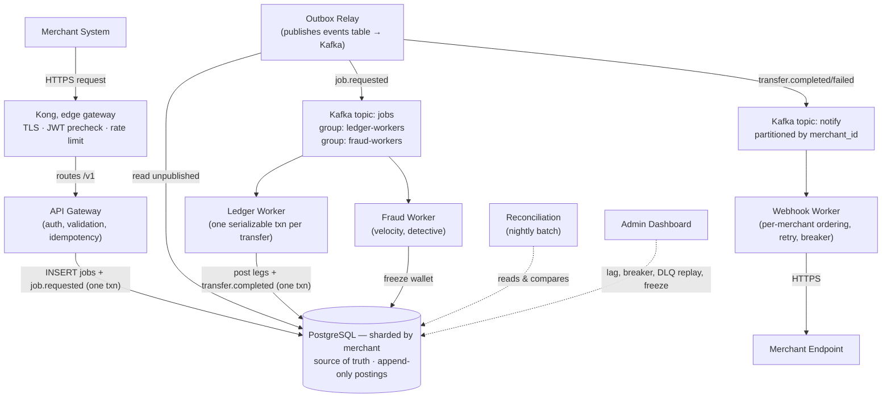
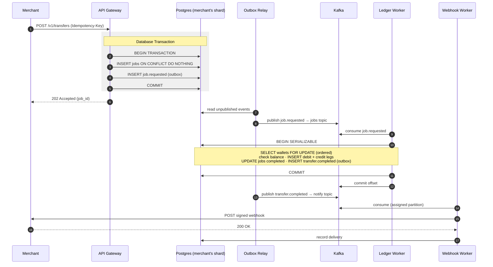

# RRQ — A Payment Processing Core

<!-- [](https://github.com/Joel-Ajayi/river-rust-queue/actions/workflows/app-ci.yml) -->

[](https://github.com/Joel-Ajayi/river-rust-queue/tree/main/go-services)
[](https://opensource.org/licenses/MIT)

RRQ moves value between wallets and stays correct while doing it: through worker crashes, network partitions, and duplicate retries. It is the part of a payment platform that silently loses money when it's built wrong — built here as a **closed-loop, double-entry ledger** on **Postgres sharded by merchant**, where the common transfer is a **single serializable transaction**, messaging rides a **transactional outbox into Kafka**, and a nightly **reconciliation** job proves the books balance.

It is built as a suite of highly-concurrent Go microservices. _(Note: despite the historical repository name, this is a pure Go architecture)._

> **Status — Architectural foundation complete.**
> The system infrastructure, event-driven topology, and database sharding patterns are fully established via Kustomize and GitOps. The microservices are currently scaffolded as minimal boilerplates, ready for domain logic implementation.

---

## Why it exists

Every payment system has a story: a retry path that double-charges, a worker that debits one wallet and dies before crediting the other, a reconciliation gap that surfaces weeks later. These are not exotic — they are the _default_ behavior of a distributed system built without specific countermeasures.

RRQ is built _with_ the countermeasures, and nothing else. The decisive design choice is scoping it as a **closed-loop ledger**: with no external bank leg, the common transfer moves between two wallets on one merchant's shard, so it is _one transaction_, which deletes a whole category of machinery (sagas, compensations, distributed leases, in-flight recovery state) for everything but the cross-shard path. Every component earns its place by handling a named failure mode:

| Failure mode                     | Mechanism                                                                                           |
| -------------------------------- | --------------------------------------------------------------------------------------------------- |
| Partial completion mid-operation | **One serializable transaction** — both debit and credit legs commit together or not at all         |
| Duplicate retries                | **Durable idempotency key** — Postgres `UNIQUE (merchant_id, idempotency_key)`, no cache to lose it |
| Concurrent access to a wallet    | **In-transaction row lock** — `SELECT … FOR UPDATE`, released at commit; no distributed lease       |
| Silent integrity drift           | **Event-sourced ledger** + nightly **reconciliation**                                               |
| Unhealthy downstreams            | **Circuit breakers**, jittered backoff, **DLQ**                                                     |

---

## What it guarantees

Nine invariants, each stated precisely enough to be tested and adversarially validated:

1. **Conservation of value** — every transfer is exactly one debit and one credit of equal magnitude, written atomically.
2. **No negative balances** on active wallets.
3. **At-most-once execution per idempotency key** — retry a million times, the operation happens once.
4. **Per-wallet entry ordering** — a wallet's history is reconstructable by replay.
5. **Per-merchant webhook ordering** — notifications arrive in the order events occurred.
6. **Immutable history** — postings and events are never mutated; corrections are new rows.
7. **Job termination** — every job reaches a terminal state in bounded time, or is observably stuck.
8. **Recoverable DLQ** — messages that exhaust retries are persisted with full context, never dropped.
9. **Tenant isolation** — cross-tenant access is rejected at the gateway before any work is enqueued.

---

## Architecture

> **For a deep dive into the design decisions driving this architecture, read [`docs/00-OVERVIEW.md`](docs/00-OVERVIEW.md).**



### The Happy Path



The system relies on six core Go microservices and one outbox relay, running behind a Kong edge gateway. **The single durable write on the request path is one Postgres transaction**; everything past it is asynchronous and crash-recoverable. **Every correctness guarantee is enforced in Postgres** (via transactions, row locks, and unique constraints).

The stateful backend relies heavily on Kubernetes operators (CloudNativePG, Strimzi, KEDA) which are decoupled and managed externally by our GitOps repository.

---

## Repository Layout

This repository contains **only application source code**. Infrastructure and deployments are strictly decoupled into the [`rrq-gitops`](https://github.com/Joel-Ajayi/rrq-gitops) repository.

| Path                 | Purpose                                                                                           |
| -------------------- | ------------------------------------------------------------------------------------------------- |
| `go-services/`       | Go implementation of the six services + outbox relay.                                             |
| `api/proto/`         | Protobuf event and gRPC contracts — the language-agnostic source of truth.                        |
| `docs/`              | System design: [`00-OVERVIEW`](docs/00-OVERVIEW.md) and [`01-INVARIANTS`](docs/01-INVARIANTS.md). |
| `skaffold.yaml`      | The local development loop engine (builds images & delegates to GitOps kustomize).                |
| `Makefile`           | Developer entry point — `make help`; delegates to `go-services/`.                                 |
| `.github/workflows/` | CI pipelines that build images and automatically update the `rrq-gitops` repository.              |

---

## Local Development Loop

RRQ embraces a true Cloud Native local developer experience powered by **Skaffold** and **Kustomize**, requiring zero Git commits to test changes locally.

**Prerequisites**: You must first bootstrap your local cluster's stateful operators from the `rrq-gitops` repository by running `make bootstrap-dev` in that repo.

Once the platform is running:

```bash
# In river-rust-queue/
make dev
```

1. Skaffold will build all 6 Go microservices locally using Docker.
2. It will apply database migrations using the `rrq-migrate` Job.
3. It will dynamically inject the newly built image tags into your local Kubernetes cluster.
4. If you modify any `.go` file or SQL migration, Skaffold will instantly detect the change, rebuild the specific image, and hot-swap the pod in the cluster in seconds.

## Production Setup

**Prerequisites:** You must have a production cluster provisioned, and your active `kubectl` context must be pointing to it.

1. **Bootstrap Production Infrastructure (Run Once):**
   ```bash
   # Clone the infrastructure repository
   git clone https://github.com/Joel-Ajayi/rrq-gitops.git
   cd rrq-gitops
   make bootstrap-prod
   ```
   _This installs Argo CD into your cluster and immediately syncs the production configuration from the Git repository. You never run `kubectl apply` directly for production deployments._

## Production CI/CD

When code is merged to `main`, GitHub Actions (`app-ci.yml`):

1. Builds both Go and Rust Docker variants and pushes them to GitHub Container Registry (GHCR).
2. Updates the selected image tags in `rrq-gitops/rrq/overlays/prod/kustomization.yaml`.
3. Automatically commits those overlay tag updates to the `rrq-gitops` repository.
4. **Argo CD** detects the GitOps update and synchronizes the live production cluster.

## License

[MIT](LICENSE).
