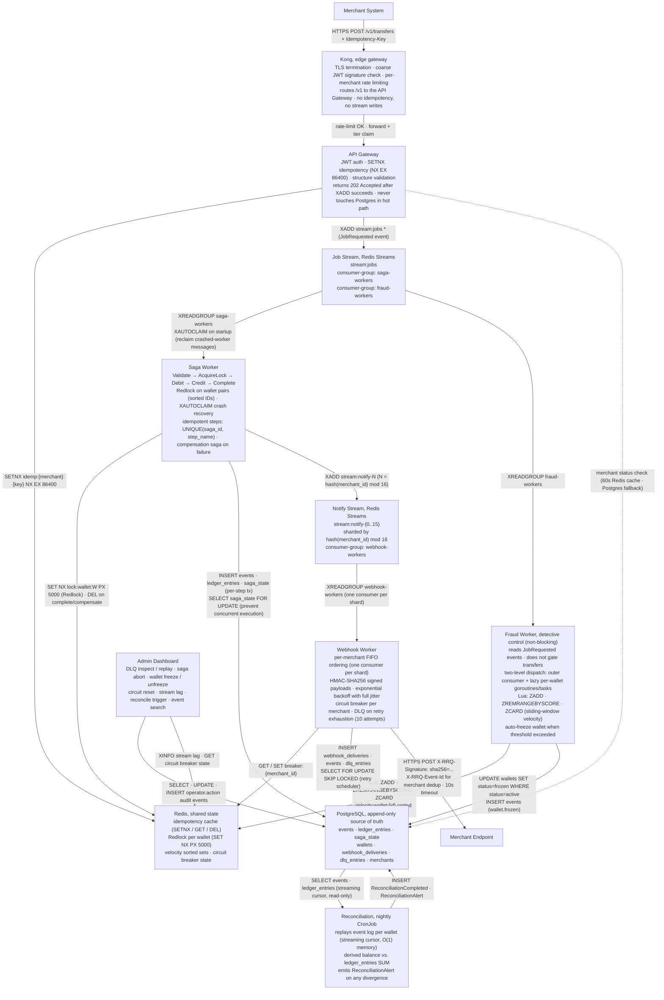

# RRQ: A Payment Processing Core

A correctness-critical payment engine that moves value between wallets while
surviving worker crashes, network partitions, and duplicate retries. Built in
Go first, with a Rust comparison implementation as a language study, to
show what each language gives you when you take distributed-systems
correctness seriously.

> **Project status: design complete, implementation not yet started.**
> A full system design exists in [`docs/`](docs/), with nine named
> correctness invariants, an explicit failure-mode analysis, and a simulation
> harness that exercises the whole pipeline without real merchants. The
> repository tree is laid out (proto, migrations, service, and tooling
> directories), but those directories are placeholders: the schemas, migrations,
> Kubernetes manifests, and CI are not written yet. Implementation begins in Go. See
> [`STATUS.md`](STATUS.md) for the precise state.

---

## The problem this exists to solve

In 2012, Knight Capital Group lost $440 million in 45 minutes because a
deployment left old code on one of eight servers, and that one server
interpreted incoming orders using stale logic. By the time the team understood
what was happening, the firm was insolvent.

The Knight Capital incident is vivid but not unusual. Every payment company
has its own version: a retry path that double-charges customers, a
reconciliation gap that takes weeks to surface, a worker that crashes after
debiting a wallet but before crediting the recipient, leaving money in
nobody's hands. These are not exotic failure modes. They are the _expected_
behavior of distributed systems built without specific countermeasures.

RRQ is the kind of system you build _with_ the countermeasures. Every
component exists because removing it would unhandle a specific named failure
mode. The patterns are not decoration: orchestrated sagas handle partial
completion, idempotency keys handle duplicate retries, distributed locks
handle concurrent access, event sourcing handles silent integrity drift,
circuit breakers handle external dependency failures, and a reconciliation
job verifies that the ledger and the event log have not diverged.

For the full problem statement and the failure-modes-to-mechanisms mapping,
read [`docs/01-PROBLEM.md`](docs/01-PROBLEM.md).

---

## What RRQ guarantees

Nine invariants, stated precisely enough to be tested:

1. **Conservation of value.** Every debit is paired with either a corresponding
   credit or a corresponding reversal. No floating debits or credits.
2. **No negative balances on active wallets.**
3. **At-most-once execution per idempotency key.** A merchant can retry a
   request a million times with the same key; the underlying operation
   happens once.
4. **Per-wallet event ordering.** Events for a wallet are causally ordered;
   the wallet's history can always be reconstructed by replay.
5. **Per-merchant webhook ordering.** A merchant sees their notifications in
   the order things happened.
6. **Immutable history.** Events are never updated or deleted. Corrections
   are new events.
7. **Saga termination.** Every saga reaches a terminal state in bounded time,
   or is observable as stuck by operational tooling.
8. **DLQ entries are recoverable.** Messages exhausting automatic retry are
   persisted with full context for operator replay, never silently dropped.
9. **Tenant isolation.** A merchant can never observe or affect another
   merchant's wallets, jobs, or data; cross-tenant requests are rejected at
   the gateway before any work is enqueued.

For the testable form of each invariant, including how they're enforced and
how they're validated, see [`docs/02-INVARIANTS.md`](docs/02-INVARIANTS.md).

---

## Architecture



Six services, three stateful backends, and Kong at the edge. Every arrow is
intentional; every component handles at least one named failure mode. Kong
fronts the API Gateway for TLS, a coarse JWT check, and rate limiting, while the
custom gateway keeps the idempotency claim and the durable write to Redis. For
the full system in one read, including the sequence diagrams for the success,
failure, and retry paths, see [`docs/00-OVERVIEW.md`](docs/00-OVERVIEW.md).

In production this system has no real merchant on either side of it. The
simulated outside world that drives traffic into the gateway and receives the
webhooks, including the synthetic end-user population, lives in `merchant-sim`
and is described in
[`docs/services/17-SIMULATION-HARNESS.md`](docs/services/17-SIMULATION-HARNESS.md).

---

## Why two implementations (Go first)

Building the same system in Go and Rust is not gratuitous. It is the
methodology by which the project's claims about each language are
_demonstrated_, not asserted. The sequence matters, though: RRQ ships in Go and
is driven to a deployed, tested, demonstrable state first. The Rust
implementation follows as a comparison study, with the working Go system
as its reference. Building both before either runs once is the surest way to
ship neither.

The Go implementation is the reference. It uses the patterns Go-shop
engineering teams will recognize: chi for routing, an interface-based saga
step machine with runtime-enforced state transitions, `sync.RWMutex` and
`map[K]chan T` for per-key dispatch, `sony/gobreaker` for circuit breaking.

The Rust implementation, when it comes, explores what Rust's type system buys
you for correctness-critical code. The saga state machine is encoded with the
**type-state pattern**: `Saga<Debited>` is a distinct type from
`Saga<Credited>`, and calling `credit()` on a `Saga<Init>` is a compile error,
not a runtime panic. The circuit breaker is a Tower middleware layer composed
into the HTTP client stack. Deterministic distributed-systems testing uses
**turmoil**, which simulates network failures, host crashes, and message
drops inside a single-threaded test runner, a category of test Go does not
have a direct equivalent for.

Both implementations target identical infrastructure, uphold identical
invariants, and pass an identical integration test suite. Where the languages
genuinely differ, in saga state encoding, concurrency patterns, and the
ecosystem of testing tools, the differences are documented as observations,
not preferences. The benchmark suite measures them honestly: same hardware,
same warm-up, median of three runs, no GC tuning, no cherry-picking.

The Go-vs-Rust comparison is most informative for the **reconciliation
batch**, which is CPU-bound and parallelizable, the place where the two
runtimes actually differ. HTTP throughput benchmarks tend to saturate the
network long before the runtime matters; reconciliation does not.

Because `merchant-sim` talks to RRQ only over HTTP, the same simulator and the
same end-to-end scenarios run unchanged against either implementation, which
is itself part of the comparison.

---

## What's in the repo

| Path                                       | Purpose                                                                                                     |
| ------------------------------------------ | ----------------------------------------------------------------------------------------------------------- |
| [`docs/`](docs/)                           | Full system design: overview, problem, invariants, service docs, deep-dives, appendices                     |
| [`proto/`](proto/)                         | Protobuf schemas: every event type, every internal gRPC contract (placeholder; not yet written)             |
| [`migrations/`](migrations/)               | PostgreSQL schema: the tables, indexes, and constraints that uphold the invariants (placeholder; not yet written) |
| [`v-go/`](v-go/)                           | Go reference implementation, six services + shared package (placeholder; not yet built)                     |
| [`v-rust/`](v-rust/)                       | Rust comparison implementation, a language study built against the Go reference (Cargo workspace scaffolded) |
| [`tools/merchant-sim/`](tools/merchant-sim/) | Simulated merchant: traffic driver, webhook receiver, end-user population, scenario engine (placeholders)  |
| [`k8s/`](k8s/)                             | Kubernetes manifests, the deployment target (placeholder; not yet written)                                  |
| [`scripts/`](scripts/)                     | k6 benchmark scripts, seed scripts, Prometheus config (placeholder; not yet written)                        |
| [`benchmarks/`](benchmarks/)               | Benchmark results (populated when the suite runs)                                                           |
| [`Makefile`](Makefile)                     | The developer entry point (`make help` lists targets)                                                       |
| [`STATUS.md`](STATUS.md)                   | Honest, up-to-date project state                                                                            |

---

## Quick start, Yet Pending

Bring up the local infrastructure and run migrations:

```bash
make dev       # Start Postgres, Redis, Jaeger, Prometheus, Grafana
make migrate   # Apply schema migrations to local Postgres
```

Once the Go services are implemented, build, test, and drive the system with:

```bash
make build     # Build the Go implementation
make test      # Run the Go test suite with -race, including the scenario suite
make lint      # Vet, gofmt, buf lint
make sim       # Run merchant-sim in steady mode against the local stack
```

For the local infrastructure consoles:

- Jaeger UI: <http://localhost:16686>
- Prometheus: <http://localhost:9090>
- Grafana: <http://localhost:3000>

With `merchant-sim` running, the Admin Dashboard shows merchants, moving
wallet balances, completing sagas, and arriving webhooks, so the local stack
behaves like a live system rather than an idle one.

---

## Reading order

If you have 15 minutes: read [`docs/00-OVERVIEW.md`](docs/00-OVERVIEW.md).
That's the whole system.

If you have an hour: read `00-OVERVIEW.md`, then `01-PROBLEM.md`, then
`02-INVARIANTS.md`. After that you understand what RRQ is, why it exists, and
what it promises.

If you're reviewing the project for a role and want to assess engineering
depth: skim the three foundation docs, then pick a service doc from
[`docs/services/`](docs/services/) and a deep-dive from
[`docs/deep-dives/`](docs/deep-dives/) and read those in full. Add
[`docs/services/17-SIMULATION-HARNESS.md`](docs/services/17-SIMULATION-HARNESS.md)
to see how the system is exercised without real integrators. That is roughly
90 minutes and tells you what you need to know.

---

## Non-goals

Being explicit about scope matters more than being aspirational about it.

**RRQ is not a complete payment platform.** No card network integration, no
bank rails, no KYC/AML, no FX pricing, no PCI-DSS compliance, no multi-region
replication. RRQ is the correctness-critical _core_ of a payment platform,
the part that, if implemented wrong, silently loses money.

**RRQ is not optimized for global scale.** RRQ targets 1,000 transfers/second
on a single machine. Real payment companies handle tens of thousands; the
techniques (database sharding, partitioned Redis, multi-region) are
well-understood and not the focus.

**RRQ is not a research artifact.** Every pattern in here is a working
engineer's tool drawn from existing literature: sagas (Garcia-Molina & Salem,
1987), idempotency at Stripe scale, Redlock (Antirez, 2014), event sourcing
(Fowler, Vernon). The contribution, if any, is the rigor with which they're
composed and demonstrated.

---

## Why I'm building this

I'm a computer engineering student going deep on distributed systems because
the kind of engineering I want to do, payment infrastructure, ledger systems,
the boring correctness-critical guts of money movement, is judged on exactly
this kind of work. The project is small enough for one person to build
correctly and rigorous enough to demonstrate the craft.

The design docs are public, the implementation will be public, the benchmarks
will report whatever numbers come out, and the failure modes are demonstrated
with tests, not assertions.

By [Ayotunde Ajayi](https://github.com/Joel-Ajayi) · [LinkedIn](https://linkedin.com/in/yotstack)

---

## License

[MIT](LICENSE).
