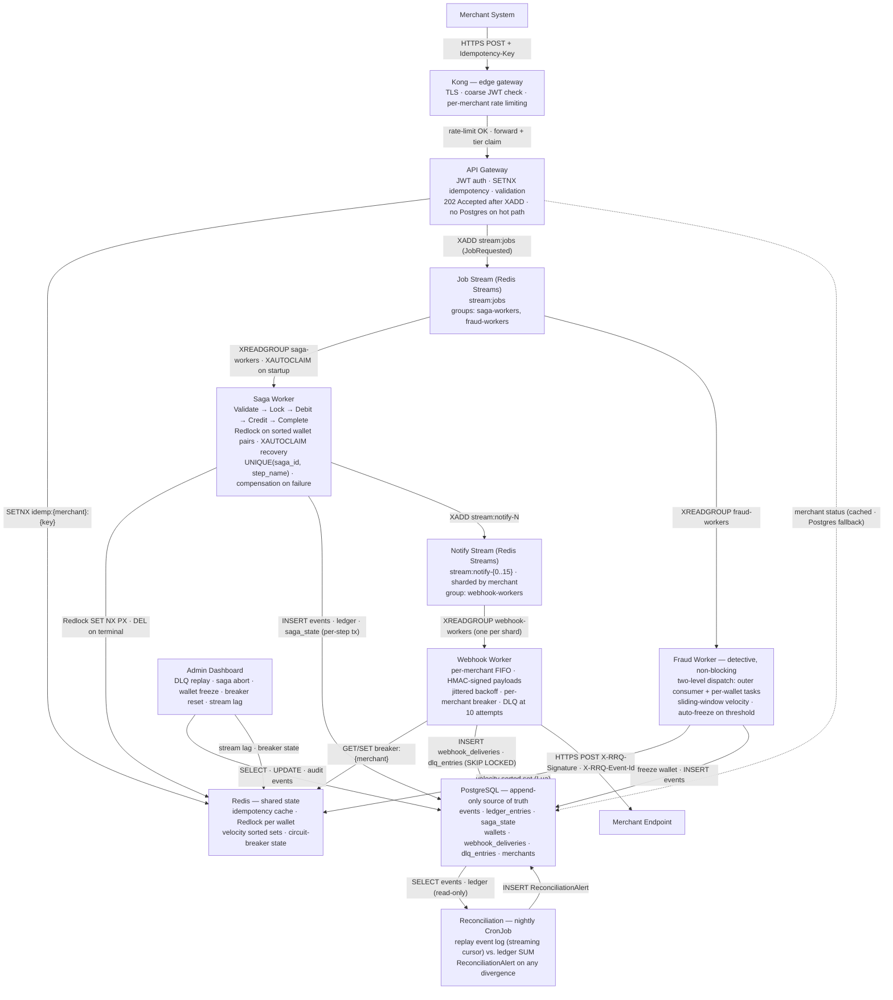

# RRQ — A Payment Processing Core

RRQ moves value between wallets and stays correct while doing it: through worker
crashes, network partitions, and duplicate retries. It is the part of a payment
platform that silently loses money when it's built wrong — sagas, idempotency,
distributed locks, an event-sourced ledger, and a reconciliation job that proves
the books balance.

It is built in **Go first**, with a **Rust** port as a controlled language
study: same infrastructure, same invariants, same test suite, so the only
variable is the language.

> **Status — design complete, implementation not started.**
> The full system is specified in [`docs/`](docs/): six services, nine named
> correctness invariants, an explicit failure-mode analysis, and a simulation
> harness that exercises the whole pipeline without real merchants. The
> repository tree (`proto/`, `migrations/`, `v-go/`, `k8s/`, …) is laid out but
> the schemas, migrations, manifests, and CI are not written yet. See
> [`STATUS.md`](STATUS.md) for the exact, per-component state — it does not
> round up.

---

## Why it exists

Every payment system has a story: a retry path that double-charges, a worker
that debits one wallet and dies before crediting the other, a reconciliation gap
that surfaces weeks later. These are not exotic — they are the *default*
behavior of a distributed system built without specific countermeasures.

RRQ is built *with* the countermeasures, and nothing else. Every component earns
its place by handling a named failure mode:

| Failure mode | Mechanism |
| --- | --- |
| Partial completion mid-operation | Orchestrated **sagas** with compensations |
| Duplicate retries | **Idempotency keys** (atomic `SETNX`, per-merchant scope) |
| Concurrent access to a wallet | **Distributed locks** (Redlock over a Redis quorum) |
| Silent integrity drift | **Event sourcing** + nightly **reconciliation** |
| Unhealthy downstreams | **Circuit breakers**, jittered backoff, **DLQ** |

The full problem statement and the failure-to-mechanism mapping are in
[`docs/01-PROBLEM.md`](docs/01-PROBLEM.md).

---

## What it guarantees

Nine invariants, each stated precisely enough to be tested and adversarially
validated:

1. **Conservation of value** — every debit pairs with a credit or a reversal.
2. **No negative balances** on active wallets.
3. **At-most-once execution per idempotency key** — retry a million times, the
   operation happens once.
4. **Per-wallet event ordering** — a wallet's history is reconstructable by replay.
5. **Per-merchant webhook ordering** — notifications arrive in the order events occurred.
6. **Immutable history** — events are never mutated; corrections are new events.
7. **Saga termination** — every saga reaches a terminal state in bounded time, or
   is observably stuck.
8. **Recoverable DLQ** — messages that exhaust retries are persisted with full
   context, never dropped.
9. **Tenant isolation** — cross-tenant access is rejected at the gateway before
   any work is enqueued.

How each is enforced and validated: [`docs/02-INVARIANTS.md`](docs/02-INVARIANTS.md).

---

## Architecture



Six services, three stateful backends, Kong at the edge. Kong owns generic edge
work (TLS, a coarse JWT check, rate limiting); the custom gateway owns the part
no off-the-shelf component does — the idempotency claim and the durable write to
the stream. The single durable write on the request path is the `XADD` to Redis
Streams; everything past it is asynchronous and crash-recoverable.

Full system in one read, with success/failure/retry sequence diagrams:
[`docs/00-OVERVIEW.md`](docs/00-OVERVIEW.md). Per-service designs live in
[`docs/services/`](docs/services/).

In production there is no real merchant on either side. The simulated outside
world that drives traffic in and receives webhooks — including a synthetic
end-user population — is `merchant-sim`, specified in
[`docs/services/17-SIMULATION-HARNESS.md`](docs/services/17-SIMULATION-HARNESS.md).

---

## Two implementations, Go first

Building the same system twice is the method, not an indulgence: it turns claims
about each language into demonstrations. The sequence is deliberate — **Go ships
first**, driven to a deployed, tested, demonstrable state. Rust follows as a
comparison study with the working Go system as its reference. Building both
before either runs is the surest way to ship neither.

- **Go** is the reference: chi for routing, an interface-based saga step machine
  with runtime-checked transitions, `map[K]chan T` + `sync.RWMutex` for per-key
  dispatch, `sony/gobreaker` for circuit breaking.
- **Rust** explores what the type system buys for correctness-critical code: the
  saga encoded with the **type-state pattern** (`Saga<Debited>` and
  `Saga<Init>` are distinct types, so an out-of-order call is a *compile* error),
  a Tower-layer circuit breaker, and deterministic failure-injection testing with
  **turmoil**.

Both target identical infrastructure, uphold identical invariants, and pass an
identical end-to-end suite. Because `merchant-sim` talks to RRQ only over HTTP,
the same scenarios run unchanged against either binary — itself part of the
comparison. The benchmark that actually separates the runtimes is the
**reconciliation batch** (CPU-bound, parallelizable); HTTP throughput saturates
the network long before the language matters.

---

## Repository layout

| Path | Purpose |
| --- | --- |
| [`docs/`](docs/) | System design: overview, problem, the nine invariants, per-service docs |
| [`proto/`](proto/) | Protobuf event and gRPC contracts *(placeholder)* |
| [`migrations/`](migrations/) | PostgreSQL schema — tables, indexes, constraints that uphold the invariants *(placeholder)* |
| [`v-go/`](v-go/) | Go reference implementation — six services + shared package *(placeholder)* |
| [`v-rust/`](v-rust/) | Rust comparison study *(Cargo workspace scaffolded)* |
| [`tools/merchant-sim/`](tools/merchant-sim/) | Simulated merchant: traffic driver, webhook receiver, end-user population, scenario engine *(placeholder)* |
| [`k8s/`](k8s/) | Kubernetes manifests — the deployment target *(placeholder)* |
| [`scripts/`](scripts/) | k6 benchmarks, seed and Prometheus config *(placeholder)* |
| [`benchmarks/`](benchmarks/) | Results, populated when the suite runs |
| [`Makefile`](Makefile) | Developer entry point — `make help` lists targets |
| [`STATUS.md`](STATUS.md) | Honest, per-component project state |

---

## Quick start

> Targets are wired to the design but not yet functional — the services don't
> exist. `make help` lists everything; today most targets report what they will
> do once their component is built.

```bash
make dev       # local kind cluster (dev overlay)
make migrate   # apply schema migrations
make build     # build the Go services
make test      # Go test suite with -race, including the scenario suite
make sim       # run merchant-sim in steady mode against the local stack
```

Local observability consoles (Jaeger `:16686`, Prometheus `:9090`, Grafana
`:3000`) come up with the dev stack. With `merchant-sim` running in steady mode,
the Admin Dashboard shows live merchants, moving balances, completing sagas, and
arriving webhooks — the stack behaves like a running system, not an idle one.

---

## Non-goals

Scope discipline matters more than ambition.

- **Not a complete payment platform** — no card networks, bank rails, KYC/AML, FX
  pricing, PCI-DSS, or multi-region. RRQ is the correctness-critical *core*.
- **Not built for global scale** — it targets 1,000 transfers/sec on a single
  machine. Sharding, partitioned Redis, and multi-region are well-understood and
  out of scope.
- **Not a research artifact** — every pattern is drawn from existing literature
  (Garcia-Molina & Salem on sagas, Redlock, event sourcing). The contribution is
  the rigor with which they're composed and demonstrated.

---

## License

[MIT](LICENSE).
