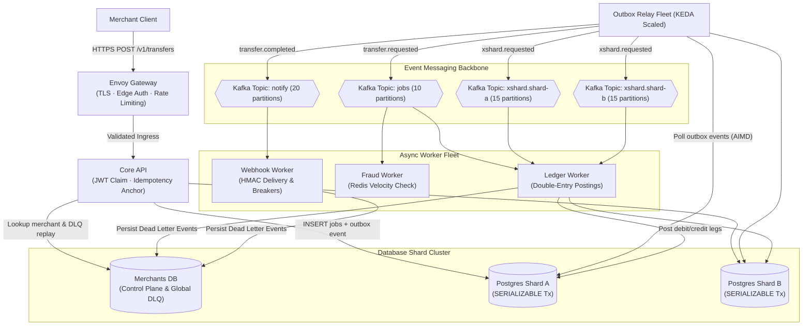

# RRQ — River Rust Queue Payment Processing Core

[](https://github.com/Joel-Ajayi/river-rust-queue/actions/workflows/app-ci.yml)
[](https://github.com/Joel-Ajayi/river-rust-queue/tree/main/services/go-services)
[](https://opensource.org/licenses/MIT)

A high-performance, fault-tolerant payment processing engine built using **Go** and **Rust**.

RRQ is designed as a **closed-loop ledger core**: money moves exclusively between wallets inside the system. By scoping transfers to a closed loop, intra-shard transfers execute in **one serializable PostgreSQL transaction**, eliminating distributed sagas and locks for common payments while utilizing a 2-phase clearing account saga for cross-shard transfers.

---

## Documentation Quick Links

- [System Architecture Specification](docs/ARCHITECTURE.md) — Comprehensive component-by-component architectural reference.
- [System Correctness Invariants (I1–I9)](docs/INVARIANTS.md) — Formal guarantees enforced in code and database constraints.
- [Testing Strategy & Architecture](docs/TESTING.md) — Multi-tier test suite breakdown, API mock integration, and execution commands.
- [Operational Runbooks & Incident Response](docs/RUNBOOKS.md) — Step-by-step procedures for on-call SREs, DLQ replay, and administrators.
- [GitOps & Infrastructure Repository](https://github.com/Joel-Ajayi/rrq-gitops) — Declarative Kubernetes manifests, operators, capacity engine, and 5-tier Grafana dashboards.

---

## Architecture Overview

<style>
  .diagram-container svg { min-width: 1000px !important; }
</style>
<div class="diagram-container" style="overflow: auto; max-height: 80vh;">


```mermaid
%%{init: {"flowchart": {"useMaxWidth": true, "nodeSpacing": 30, "rankSpacing": 40}}}%%
graph TD
  merchant["Merchant Client"]
  kong["Envoy Gateway<br/>(TLS · Edge Auth · Rate Limiting)"]
  gateway["Core API<br/>(JWT Claim · Idempotency Anchor)"]

  merchant -->|HTTPS POST /v1/transfers| kong
  kong -->|Validated Ingress| gateway

  subgraph Database Shard Cluster
    merchantsDB[("Merchants DB<br/>(Control Plane & Global DLQ)")]
    shardA[("Postgres Shard A<br/>(SERIALIZABLE Tx)")]
    shardB[("Postgres Shard B<br/>(SERIALIZABLE Tx)")]
  end

  gateway -->|"Lookup merchant & DLQ replay"| merchantsDB
  gateway -->|"INSERT jobs + outbox event"| shardA
  gateway --> shardB

  relay["Outbox Relay Fleet (KEDA Scaled)"]
  relay -->|"Poll outbox events (AIMD)"| shardA
  relay --> shardB

  subgraph Event Messaging Backbone
    jobsTopic{{"Kafka Topic: jobs (10 partitions)"}}
    notifyTopic{{"Kafka Topic: notify (20 partitions)"}}
    xshardATopic{{"Kafka Topic: xshard.shard-a (15 partitions)"}}
    xshardBTopic{{"Kafka Topic: xshard.shard-b (15 partitions)"}}
  end

  relay -->|transfer.requested| jobsTopic
  relay -->|transfer.completed| notifyTopic
  relay -->|xshard.requested| xshardATopic
  relay -->|xshard.requested| xshardBTopic

  subgraph Async Worker Fleet
    ledgerWorker["Ledger Worker<br/>(Double-Entry Postings)"]
    fraudWorker["Fraud Worker<br/>(Redis Velocity Check)"]
    webhookWorker["Webhook Worker<br/>(HMAC Delivery & Breakers)"]
  end

  jobsTopic --> ledgerWorker
  jobsTopic --> fraudWorker
  notifyTopic --> webhookWorker
  xshardATopic --> ledgerWorker
  xshardBTopic --> ledgerWorker

  ledgerWorker -->|"Post debit/credit legs"| shardA
  ledgerWorker --> shardB
  ledgerWorker -->|"Persist Dead Letter Events"| merchantsDB
  webhookWorker -->|"Persist Dead Letter Events"| merchantsDB
```

</div>

---

## Key Performance Benchmarks & Empirical Metrics

The platform was empirically benchmarked in live Kubernetes environments across nominal steady-state, peak stress bursts, and sudden traffic spikes:

| Metric Category | Measured Value | Target / SLO | Verification Method |
| :--- | :---: | :---: | :--- |
| **Peak Throughput** | **$3,000\text{ requests/sec}$** | $3,000\text{ RPS}$ | `stress.ts` Ramping Arrival Rate |
| **Nominal Throughput** | **$1,000\text{ requests/sec}$** | $1,000\text{ RPS}$ | `full_workload.ts` Multi-Endpoint |
| **Outbox Relay Streaming** | **$\approx 1,000\text{ events/sec}$** | $1,000\text{ RPS}$ | AIMD Producer with $< 8\%$ Kafka Buffer Fill |
| **Transfer Ingress Latency (P50)** | **$38.7\text{ ms}$** | $< 2,000\text{ ms}$ | Measured via OpenTelemetry Traces |
| **Transfer Ingress Latency (P95)** | **$45.0\text{ ms}$** | $< 2,000\text{ ms}$ | Measured via OpenTelemetry Traces |
| **Ledger Double-Entry Time** | **$10.8\text{ ms}$** | $< 100\text{ ms}$ | Double-Entry Posting Tx on PostgreSQL 17 |
| **Fraud Velocity Check Time** | **$6.4\text{ ms}$** | $< 50\text{ ms}$ | Sliding-Window Multi-Key Redis Pipeline |
| **Circuit Breaker Shedding** | **$< 0.01\text{ ms}$** | $< 1.0\text{ ms}$ | Fast `503` shedding during DB saturation |
| **DLQ Message Recovery** | **$100\%$ ($43/43$)** | $100\%$ | Batch DLQ Replay (`replay-dlq.mts`) |
| **Autoscaling Elasticity** | **$3 \rightarrow 4\text{ Pods}$** | Max 4 | KEDA Kafka lag + HPA CPU triggers |

---

## Observability & SRE Dashboards

RRQ features a **Persona-Driven 5-Tier Observability Architecture** provisioned via Prometheus, OpenTelemetry, Elasticsearch, and Grafana:

1. **Tier 1: Business Transactions & Volume** (`/executive`) — GTV, transfer volume, success rates, fraud decline causes, dispute rates, and merchant balance movements.
2. **Tier 2: User Journeys & Critical Paths** (`/journeys`) — Cross-shard saga lifecycle, Dead-Letter Queue (DLQ) ingestion and replay churn, idempotency conflicts, webhook bulkheads, and worker retry backoff.
3. **Tier 3: Service Health & RED Metrics** (`/services`) — Request Rate, Errors, and Duration quantiles (P50/P90/P99), live Circuit Breaker state machines (`closed`, `half-open`, `open`), panic recovery, and DB connection pool starvation.
4. **Tier 4: Middleware & Data Layer USE** (`/middleware`) — PostgreSQL buffer cache hit ratio, dead tuple bloat, SQL query latencies, Outbox Relay AIMD buffer fill, and Kafka consumer group partition lag.
5. **Tier 5: Compute & Infrastructure USE** (`/infrastructure`) — Kubernetes node pressures, container CPU throttling, memory working set vs limits, and compute saturation curves.

---

## Deployment & Development

### 1. Production Kubernetes Deployment (GitOps)

RRQ uses a pull-based declarative GitOps pipeline managed by **Argo CD** via the [`rrq-gitops`](https://github.com/Joel-Ajayi/rrq-gitops) repository.

#### Step 1: Apply Root App Manifest
Apply the root Argo CD ApplicationSet to your Kubernetes cluster:
```bash
kubectl apply -f https://raw.githubusercontent.com/Joel-Ajayi/rrq-gitops/main/bootstrap/root-app.yaml
```

#### Step 2: Configure Your Production Domain & Ingress Hostnames
1. Retrieve the external IP address of the provisioned Envoy Gateway LoadBalancer:
   ```bash
   kubectl get svc -n envoy-gateway-system
   ```
2. Point your DNS wildcard A record (`*.<your-domain.com>`) to the LoadBalancer IP address. Production endpoints will automatically be routed and secured via Let's Encrypt TLS:
   - **API Core Gateway**: `https://api.<your-domain.com>/v1/transfers`
   - **Portainer Cluster UI**: `https://cluster.<your-domain.com>`
   - **Business Transactions Dashboard**: `https://metrics.<your-domain.com>/executive`
   - **User Journeys Dashboard**: `https://metrics.<your-domain.com>/journeys`
   - **Service Health RED Dashboard**: `https://metrics.<your-domain.com>/services`
   - **Middleware USE Dashboard**: `https://metrics.<your-domain.com>/middleware`
   - **Infrastructure USE Dashboard**: `https://metrics.<your-domain.com>/infrastructure`

---

### 2. Local Development Quickstart

#### Prerequisites
- **Docker Engine**
- **Kind** (`v0.31.0+`)
- **Skaffold** & **Go 1.26+**

#### Step 1: Bootstrap Platform Infrastructure
Clone the GitOps sibling repository to `../rrq-gitops` and provision the local infrastructure:
```bash
git clone https://github.com/Joel-Ajayi/rrq-gitops.git ../rrq-gitops
cd ../rrq-gitops
make cluster-dev
make bootstrap ENV=dev
```

#### Local Ingress & Hostnames
In local Kind development, Envoy Gateway routes traffic on local host ports `8080` (HTTP) and `8443` (HTTPS):
- **API Ingress**: `https://api.127.0.0.1.nip.io:8443/v1/transfers`
- **Portainer UI**: `http://cluster.127.0.0.1.nip.io:8080`
- **Grafana Dashboards**: `http://grafana.127.0.0.1.nip.io:8080`

#### Step 2: Launch Live Hot-Reloading Loop
Return to this repository and launch Skaffold:
```bash
cd ../river-rust-queue
make dev
```

#### Step 3: Run Automated Test Suite
Execute unit tests:
```bash
make -C services/go-services test-unit
```

---

## Tech Stack

- **Languages:** Go 1.26+ (`pgx/v5`, `kafka-go`, OpenTelemetry), Rust.
- **Contracts:** Protocol Buffers (Protobuf).
- **Databases:** PostgreSQL 17 (Sharded via CloudNativePG operator with 3-instance HA).
- **Messaging:** Kafka (Managed by Strimzi, driving Transactional Outbox pattern).
- **Caching & Rate Limiting:** Redis.
- **Edge Proxy:** Envoy Gateway.
- **Observability:** Prometheus, Alertmanager, OpenTelemetry, Elasticsearch, Kibana, Grafana.
- **Capacity Engineering:** M/M/c & Kingman Queuing Theory Engine.
- **GitOps & Deployment:** Argo CD, Kustomize, KEDA, Skaffold.

---

## License

[MIT](LICENSE).
