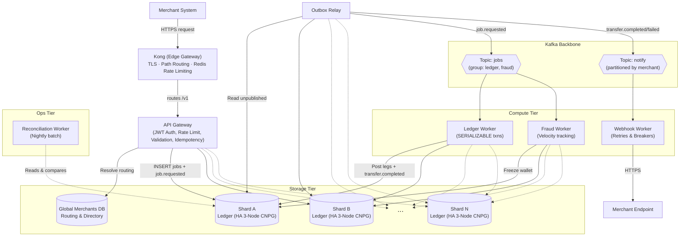
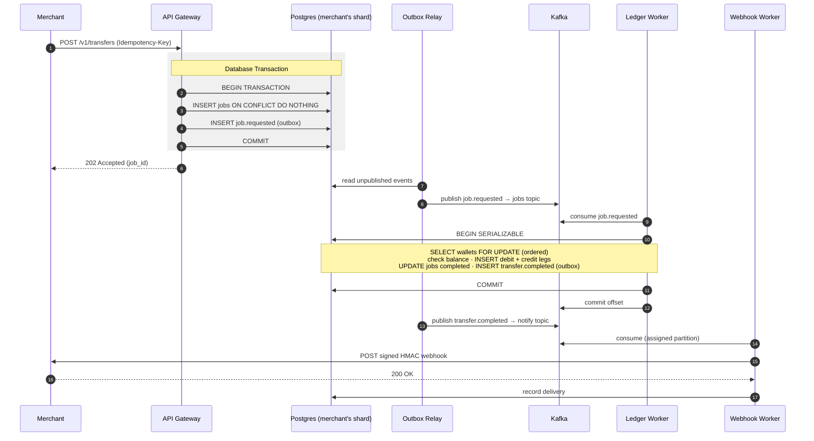

# RRQ — A Payment Processing Core

[](https://github.com/Joel-Ajayi/river-rust-queue/actions/workflows/app-ci.yml)
[](https://github.com/Joel-Ajayi/river-rust-queue/tree/main/services/go-services)
[](https://opensource.org/licenses/MIT)

A high-performance, fault-tolerant payment processing engine built using **Go** and **Rust**.

> **Status — Production Ready & Audit Verified.**
> The system infrastructure, event-driven topology, database sharding, transaction processing, fraud engine, webhook delivery pipeline, and reconciliation worker are **100% implemented**, fully covered by automated unit & integration test suites, and audited against strict security and operational benchmarks.

---

## Why it exists

Every payment system has a story: a retry path that double-charges, a worker that debits one wallet and dies before crediting the other, a reconciliation gap that surfaces weeks later. These are not exotic — they are the _default_ behavior of a distributed system built without specific countermeasures.

RRQ is built _with_ the countermeasures, and nothing else. The decisive design choice is scoping it as a **closed-loop ledger**: with no external bank leg, the common transfer moves between two wallets on one merchant's shard in **one serializable transaction**, which deletes a whole category of machinery (sagas, compensations, distributed leases, in-flight recovery state) for intra-shard transfers while utilizing a 2-phase clearing account Saga for cross-shard transfers.

Every component earns its place by handling a named failure mode:

| Failure mode                     | Mechanism                                                                                           |
| -------------------------------- | --------------------------------------------------------------------------------------------------- |
| Partial completion mid-operation | **One serializable transaction** — both debit and credit legs commit together or not at all         |
| Cross-shard inconsistencies      | **2-Phase Clearing Account Saga** — isolated clearing account holds intermediate funds              |
| Duplicate retries                | **Durable idempotency key** — Postgres `UNIQUE (merchant_id, idempotency_key)`, no cache to lose it |
| Concurrent access to a wallet    | **In-transaction row lock** — `SELECT … FOR UPDATE`, released at commit; no distributed lease       |
| Velocity attack / fraud spike    | **Redis sliding window velocity tracking** + automated wallet freeze                               |
| Webhook delivery failures        | **Transactional outbox** + **BreakerRegistry circuit breaker** + **DLQ replay**                     |
| Silent integrity drift           | **Event-sourced ledger** + **Automated Reconciliation Worker**                                      |
| Unhealthy downstreams            | **BreakerRegistry circuit breakers**, jittered backoff, **DLQ**                                     |

---

## Guaranteed Invariants

The system strictly enforces nine core engineering invariants in code and configuration:

1. **Conservation of value** — every transfer is exactly one debit and one credit of equal magnitude, written atomically.
2. **No negative balances** on active wallets.
3. **At-most-once execution per idempotency key** — retry a million times, the operation happens once.
4. **Per-wallet entry ordering** — a wallet's history is reconstructable by replay.
5. **Per-merchant webhook ordering** — notifications arrive in the order events occurred.
6. **Immutable history** — postings and events are never mutated; corrections are new rows.
7. **Job termination** — every job reaches a terminal state in bounded time, or is observably stuck.
8. **Recoverable DLQ** — messages that exhaust retries are persisted with full context and can be safely replayed.
9. **Tenant isolation** — cross-tenant access is rejected at the gateway before any work is enqueued.

---

## Architecture

> **For a deep dive into the design decisions driving this architecture, read [`docs/00-OVERVIEW.md`](docs/00-OVERVIEW.md).**


```mermaid
graph TD
  %% External Entities
  merchant["Merchant System"]
  merchantEndpoint["Merchant Endpoint"]

  %% API Edge
  kong["Kong (Edge Gateway)<br/>TLS · Path Routing · Redis Rate Limiting"]
  gateway["API Gateway<br/>(JWT Auth, Rate Limit, Validation, Idempotency)"]

  merchant -->|HTTPS request| kong
  kong -->|routes /v1| gateway

  %% Databases
  subgraph Storage Tier
    merchantDb[("Global Merchants DB<br/>Routing & Directory")]
    shardA[("Shard A<br/>Ledger (HA 3-Node CNPG)")]
    shardB[("Shard B<br/>Ledger (HA 3-Node CNPG)")]
    shardDots["..."]
    shardN[("Shard N<br/>Ledger (HA 3-Node CNPG)")]
  end
  style shardDots fill:none,stroke:none,font-size:24px;

  gateway -->|"Resolve routing"| merchantDb
  gateway -->|"INSERT jobs + job.requested"| shardA
  gateway --> shardB
  gateway -.-> shardDots
  gateway -.-> shardN

  %% Messaging
  relay["Outbox Relay"]
  relay -->|Read unpublished| shardA
  relay --> shardB
  relay -.-> shardDots
  relay -.-> shardN

  subgraph Kafka Backbone
    jobsTopic{{"Topic: jobs<br/>(group: ledger, fraud)"}}
    notifyTopic{{"Topic: notify<br/>(partitioned by merchant)"}}
  end

  relay -->|job.requested| jobsTopic
  relay -->|transfer.completed/failed| notifyTopic

  %% Workers
  subgraph Compute Tier
    ledgerWorker["Ledger Worker<br/>(SERIALIZABLE txns)"]
    fraudWorker["Fraud Worker<br/>(Velocity tracking)"]
    webhookWorker["Webhook Worker<br/>(Retries & Breakers)"]
  end

  jobsTopic --> ledgerWorker
  jobsTopic --> fraudWorker
  notifyTopic --> webhookWorker

  ledgerWorker -->|"Post legs + transfer.completed"| shardA
  ledgerWorker --> shardB
  ledgerWorker -.-> shardDots
  ledgerWorker -.-> shardN

  fraudWorker -->|"Freeze wallet"| shardA
  fraudWorker --> shardB
  fraudWorker -.-> shardDots
  fraudWorker -.-> shardN

  webhookWorker -->|HTTPS| merchantEndpoint

  %% Operations
  subgraph Ops Tier
    reconciliation["Reconciliation Worker<br/>(Nightly batch)"]
  end
  
  reconciliation -.->|Reads & compares| shardA
```

### The Transaction Flow


```mermaid
sequenceDiagram
    autonumber
    participant M as Merchant
    participant API as API Gateway
    participant DB as Postgres (merchant's shard)
    participant RL as Outbox Relay
    participant K as Kafka
    participant LW as Ledger Worker
    participant WW as Webhook Worker

    M->>API: POST /v1/transfers (Idempotency-Key)
    rect rgb(240, 240, 240)
        note over API,DB: Database Transaction
        API->>DB: BEGIN TRANSACTION
        API->>DB: INSERT jobs ON CONFLICT DO NOTHING
        API->>DB: INSERT job.requested (outbox)
        API->>DB: COMMIT
    end
    API-->>M: 202 Accepted (job_id)

    RL->>DB: read unpublished events
    RL->>K: publish job.requested → jobs topic

    LW->>K: consume job.requested
    LW->>DB: BEGIN SERIALIZABLE
    Note over LW,DB: SELECT wallets FOR UPDATE (ordered)<br/>check balance · INSERT debit + credit legs<br/>UPDATE jobs completed · INSERT transfer.completed (outbox)
    LW->>DB: COMMIT
    LW->>K: commit offset

    RL->>K: publish transfer.completed → notify topic
    WW->>K: consume (assigned partition)
    WW->>M: POST signed HMAC webhook
    M-->>WW: 200 OK
    WW->>DB: record delivery
```

---

## Tech Stack

- **Core Languages:** **Go 1.26+** (Leveraging `pgx/v5`, `kafka-go`, and OpenTelemetry).
- **Contracts:** **Protocol Buffers** (Protobuf) for cross-language event and API schemas.
- **Database:** **PostgreSQL 17** (Sharded via CloudNativePG operator with 3-instance HA and Barman ObjectStore S3 backups).
- **Messaging & Events:** **Kafka** (Managed by Strimzi, driving the Transactional Outbox pattern).
- **Caching & Velocity:** **Redis** (Sliding-window velocity rules).
- **Edge Proxy:** **Kong Gateway** (TLS termination, JWT pre-validation, global Redis rate limiting).
- **Infrastructure & Delivery:** **Kubernetes** with GitOps via **Argo CD**.
- **Kubernetes Operators:** **CloudNativePG** (DB), **Strimzi** (Kafka), **KEDA** (Event-driven autoscaling).
- **Local Development:** **Skaffold** and **Kustomize** (Live hot-reloading).

---

## Getting Started

### Prerequisites

> [!IMPORTANT]
> **GitOps Sibling Repository Required:** To run this project locally using Skaffold, you must have the `rrq-gitops` repository cloned as a sibling directory (`../rrq-gitops`). Run `git clone https://github.com/Joel-Ajayi/rrq-gitops ../rrq-gitops` if you have not already.

Before you begin, ensure you have the following installed:
- **Docker** (for building container images)
- **Kubernetes Cluster** (e.g., `kind`, `minikube`, or Docker Desktop)
- **Skaffold** (for the local development loop)
- **Go 1.26+**

### Running Locally

1. **Bootstrap local infrastructure:** 
   The stateful backend (Postgres, Kafka, Redis) is managed via our GitOps repository.
   ```bash
   git clone https://github.com/Joel-Ajayi/rrq-gitops.git
   cd rrq-gitops
   make bootstrap-dev
   ```

2. **Start the application:**
   Return to this repository and launch the Skaffold dev loop:
   ```bash
   cd ../river-rust-queue
   make dev
   ```

### Running Verification Tests

To execute the unit and integration tests locally:
```bash
cd services/go-services
go test ./...
```

---

## License

[MIT](LICENSE).
