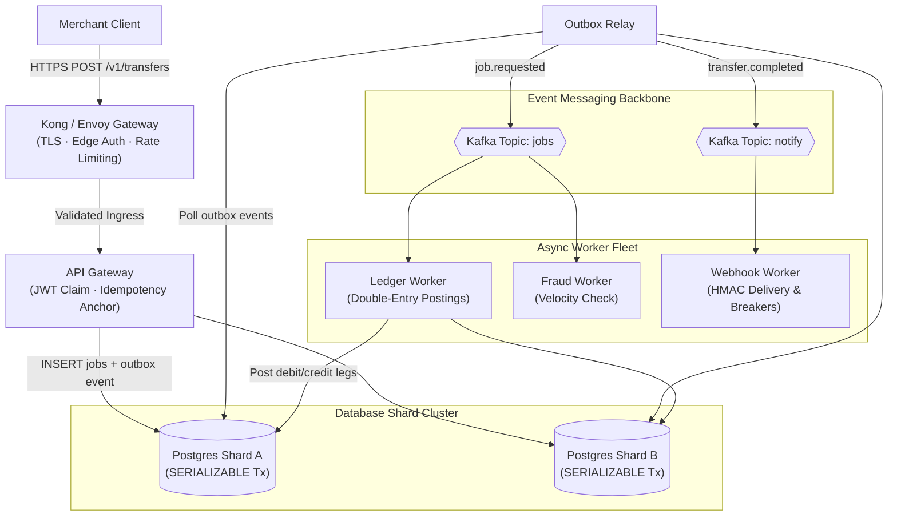

# RRQ — River Rust Queue Payment Processing Core

[](https://github.com/Joel-Ajayi/river-rust-queue/actions/workflows/app-ci.yml)
[](https://github.com/Joel-Ajayi/river-rust-queue/tree/main/services/go-services)
[](https://opensource.org/licenses/MIT)

A high-performance, fault-tolerant payment processing engine built using **Go** and **Rust**.

RRQ is designed as a **closed-loop ledger core**: money moves exclusively between wallets inside the system. By scoping transfers to a closed loop, intra-shard transfers execute in **one serializable PostgreSQL transaction**, eliminating distributed sagas and locks for common payments while utilizing a 2-phase clearing account saga for cross-shard transfers.

---

## Documentation Quick Links

- [System Architecture Specification](docs/ARCHITECTURE.md) — Comprehensive component-by-component architectural reference.
- [System Correctness Invariants (I1–I9)](docs/INVARIANTS.md) — Formal guarantees enforced in code and database constraints.
- [Operational Runbooks & Incident Response](docs/RUNBOOKS.md) — Step-by-step procedures for on-call SREs and administrators.
- [GitOps & Infrastructure Repository](https://github.com/Joel-Ajayi/rrq-gitops) — Declarative Kubernetes manifests, operators, and capacity engine.

---

## Architecture Overview

<style>
  .diagram-container svg { min-width: 1000px !important; }
</style>
<div class="diagram-container" style="overflow: auto; max-height: 80vh;">


```mermaid
%%{init: {"flowchart": {"useMaxWidth": true, "nodeSpacing": 30, "rankSpacing": 40}}}%%
graph TD
  merchant["Merchant Client"]
  kong["Kong / Envoy Gateway<br/>(TLS · Edge Auth · Rate Limiting)"]
  gateway["API Gateway<br/>(JWT Claim · Idempotency Anchor)"]

  merchant -->|HTTPS POST /v1/transfers| kong
  kong -->|Validated Ingress| gateway

  subgraph Database Shard Cluster
    shardA[("Postgres Shard A<br/>(SERIALIZABLE Tx)")]
    shardB[("Postgres Shard B<br/>(SERIALIZABLE Tx)")]
  end

  gateway -->|"INSERT jobs + outbox event"| shardA
  gateway --> shardB

  relay["Outbox Relay"]
  relay -->|"Poll outbox events"| shardA
  relay --> shardB

  subgraph Event Messaging Backbone
    jobsTopic{{"Kafka Topic: jobs"}}
    notifyTopic{{"Kafka Topic: notify"}}
  end

  relay -->|job.requested| jobsTopic
  relay -->|transfer.completed| notifyTopic

  subgraph Async Worker Fleet
    ledgerWorker["Ledger Worker<br/>(Double-Entry Postings)"]
    fraudWorker["Fraud Worker<br/>(Velocity Check)"]
    webhookWorker["Webhook Worker<br/>(HMAC Delivery & Breakers)"]
  end

  jobsTopic --> ledgerWorker
  jobsTopic --> fraudWorker
  notifyTopic --> webhookWorker

  ledgerWorker -->|"Post debit/credit legs"| shardA
  ledgerWorker --> shardB
```

</div>
---

## Deployment & Development

### 1. Production Kubernetes Deployment (GitOps)

RRQ uses a pull-based declarative GitOps pipeline managed by **Argo CD** via the [`rrq-gitops`](https://github.com/Joel-Ajayi/rrq-gitops) repository.

#### Step 1: Apply Root App-of-Apps Manifest
Apply the root Argo CD Application to your production Kubernetes cluster:
```bash
kubectl apply -f https://raw.githubusercontent.com/Joel-Ajayi/rrq-gitops/main/apps/root-app.yaml
```

#### Step 2: Configure Your Production Domain & Ingress Hostnames
1. Update your domain hostnames in `rrq-gitops/rrq/overlays/prod/services/gateway.yaml` replacing `<your-domain.com>` with your actual registered domain.
2. Retrieve the external IP address of the provisioned Envoy Gateway LoadBalancer:
   ```bash
   kubectl get svc -n envoy-gateway-system
   ```
3. Point your DNS wildcard A record (`*.<your-domain.com>`) to the LoadBalancer IP address. Production endpoints will automatically be routed and secured via Let's Encrypt TLS:
   - **API Core Gateway**: `https://api.<your-domain.com>/v1/transfers`
   - **Portainer Cluster UI**: `https://cluster.<your-domain.com>`
   - **Service Health RED Dashboard**: `https://metrics.<your-domain.com>`
   - **Middleware USE Dashboard**: `https://logs.<your-domain.com>`
   - **Infrastructure USE Dashboard**: `https://traces.<your-domain.com>`
   - **Prometheus UI**: `https://prometheus.<your-domain.com>`

#### Step 3: Automated Continuous Deployment (CD Pipeline)
- Pushing commits to `main` on this repository triggers **App CI** to lint code, run tests, and build Docker images tagged with the Git commit SHA.
- The `gitops-promote` job automatically updates `rrq/overlays/prod/kustomization.yaml` in `rrq-gitops` with the new commit SHA tags.
- Argo CD detects the repository change and executes a zero-downtime rolling update on live cluster deployments.

---

### 2. Local Development Quickstart

For local development and testing, run the local cluster stack using Kind and Skaffold:

#### Prerequisites
- **Docker Engine**
- **Kind** (`v0.31.0+`)
- **Skaffold** & **Go 1.26+**

#### Step 1: Bootstrap Platform Infrastructure
Clone the GitOps sibling repository to `../rrq-gitops` and provision the local infrastructure:
```bash
git clone https://github.com/Joel-Ajayi/rrq-gitops.git ../rrq-gitops
cd ../rrq-gitops
make cluster-up
make argocd
make bootstrap-dev
```

#### Local Ingress & Hostnames
In local Kind development, Envoy Gateway routes traffic on local host ports `8080` (HTTP) and `8443` (HTTPS):
- **API Core Ingress**: `http://localhost:8080/v1/transfers`
- **Portainer Cluster Management**: `http://cluster.127.0.0.1.nip.io:8080`
- **Ops Redirect Routes**: `http://localhost:8080/executive`, `/journeys`, `/services`, `/middleware`, `/infrastructure`
- *(Optional)* Add `127.0.0.1 api.rrq.dev` to `/etc/hosts` for local domain resolution testing.

#### Step 2: Launch Live Hot-Reloading Loop
Return to this repository and launch Skaffold:
```bash
cd ../river-rust-queue
make dev
```

#### Step 3: Run Automated Test Suite
Execute unit and integration tests:
```bash
cd services/go-services
go test ./...
```

---

## Tech Stack

- **Languages:** Go 1.26+ (`pgx/v5`, `kafka-go`, OpenTelemetry), Rust.
- **Contracts:** Protocol Buffers (Protobuf).
- **Databases:** PostgreSQL 17 (Sharded via CloudNativePG operator with 3-instance HA).
- **Messaging:** Kafka (Managed by Strimzi, driving Transactional Outbox pattern).
- **Caching & Rate Limiting:** Redis.
- **Edge Proxy:** Kong Gateway & Envoy Gateway.
- **GitOps & Deployment:** Argo CD, Kustomize, KEDA, Skaffold.

---

## License

[MIT](LICENSE).
