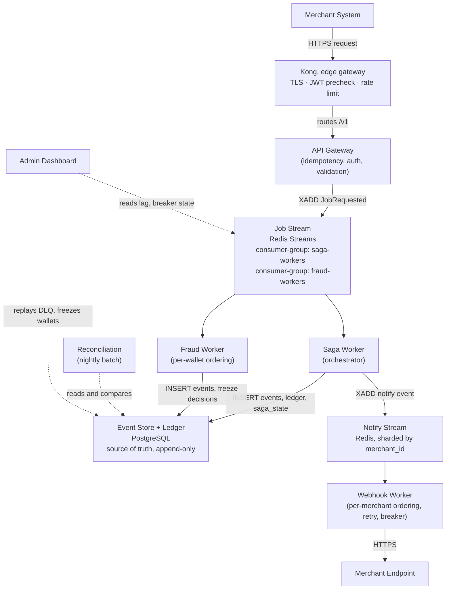
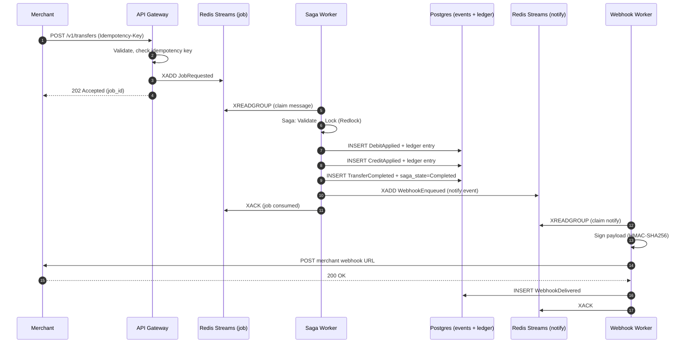
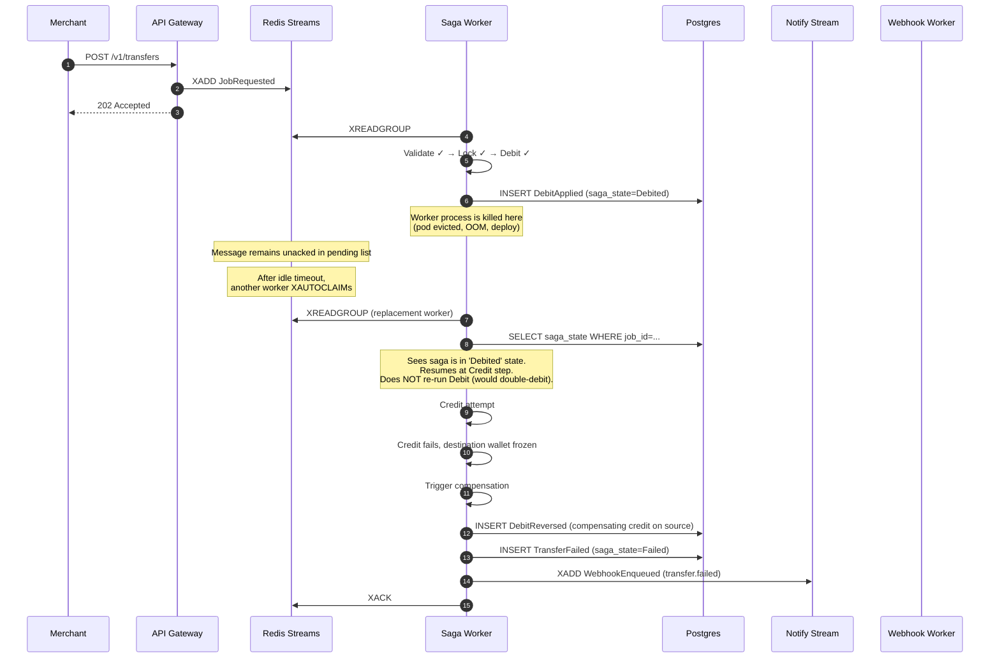
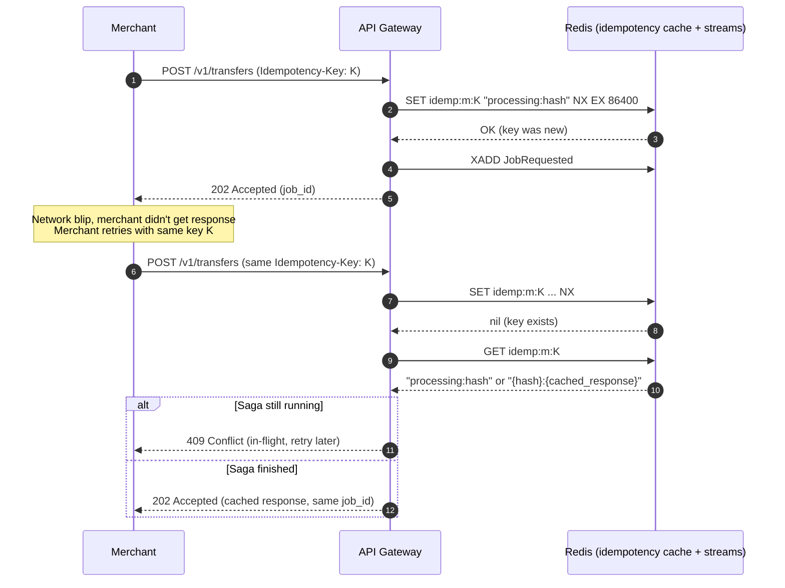

# 00: Overview

> **What this is.** The whole system in one read. If you read only one document in this set, read this one.
>
> **Reading time.** ~15 minutes.
>
> **Audience.** Anyone, engineer, reviewer, future-you. No prior context assumed except a working knowledge of distributed systems vocabulary (events, sagas, idempotency, consumer groups). If those words are unfamiliar, read [`01-PROBLEM.md`](01-PROBLEM.md) first.

---

## What RRQ is

RRQ is a payment processing core. Merchants hand it instructions like "move 5,000 NGN from wallet A to wallet B" and it executes them, durably, with the kind of correctness guarantees that make it safe to use with real money.

The interesting word in that sentence is **durably**. On a single machine, executing a transfer is a database transaction, three lines of code, ACID-protected, you're done. RRQ is harder than that because it accepts that the world it lives in is hostile: workers crash mid-operation, networks partition mid-request, the same instruction arrives twice because the merchant retried, two workers race to process the same message because the message broker redelivered it. The system has to handle every one of those without losing money or paying twice. That's what makes it a distributed-systems project rather than a CRUD app.

## What it is _not_

RRQ does not hold custody of real funds. It does not connect to card networks, banks, or mobile money providers. It does not perform KYC, AML, or sanctions screening. It does not price foreign exchange. It is the **correctness-critical core** of a payment system, the part that, if implemented wrong, silently loses money, without the regulatory and integration surface area that would take a real payment company years to build.

Concretely, RRQ is a **closed-loop ledger**. Value enters only when an operator funds a wallet ([→ `16-MERCHANT-WALLET-LIFECYCLE.md`](services/16-MERCHANT-WALLET-LIFECYCLE.md)), and it never leaves to the outside world: there is no bank or card off-ramp. Every transfer moves existing value between two wallets *inside* the system. Getting money into and out of the real world is precisely the integration surface this project scopes out, which is what lets the design concentrate on the part where correctness is hard.

This scoping is deliberate. The core is the part where distributed-systems craft matters. The integrations are mostly glue.

## The merchant's view

A merchant interacts with RRQ through a small HTTP API. Two endpoints carry essentially all the traffic:

```
POST /v1/transfers        ── move value between two wallets
POST /v1/payouts          ── execute many transfers as one batch (bulk payout)
```

A transfer request looks like this:

```http
POST /v1/transfers HTTP/1.1
Host: api.rrq.example
Authorization: Bearer <merchant_jwt>
Idempotency-Key: 8e3f1c4a-9b2d-4f81-a7c5-d3b6e9f2a1c0
Content-Type: application/json

{
  "from_wallet": "wal_01HQX2...",
  "to_wallet":   "wal_01HQX3...",
  "amount":      500000,
  "currency":    "NGN",
  "reference":   "merchant-internal-id-9182"
}
```

The merchant gets back, almost immediately:

```http
HTTP/1.1 202 Accepted
Content-Type: application/json

{
  "job_id":  "job_01HQX4...",
  "status":  "pending",
  "_links":  { "self": "/v1/jobs/job_01HQX4..." }
}
```

Two things matter about this response. First, it's `202 Accepted`, not `200 OK`. The transfer hasn't happened yet, it's been _durably accepted for processing_. Second, the response comes back in tens of milliseconds even though the underlying transfer might take a second or more, because the API gateway's job is to accept and persist work, not to wait for it.

The merchant learns the outcome through a webhook some time later (typically under a second under normal load):

```http
POST /merchant-webhook-url HTTP/1.1
Content-Type: application/json
X-RRQ-Signature: sha256=abc123...

{
  "event":   "transfer.completed",
  "job_id":  "job_01HQX4...",
  "data":    { ... }
}
```

The merchant can also poll `GET /v1/jobs/<job_id>` for synchronous queries. Webhooks are the primary channel; polling is the fallback.

That is the entire merchant-facing surface. Two endpoints to submit work, one webhook to learn outcomes, one endpoint for polling. Everything else in this design exists _behind_ that interface to make it correct under failure.

## The seven big ideas

Before the architecture, the seven concepts everything else is built from. If you understand these, the rest of the docs are filling in details.

**1. The unknown outcome.** When you call a service across a network, you can get three answers: success, failure, or _no answer at all_. The third case, request lost, response lost, you can't tell which, is the source of most distributed-systems complexity. RRQ assumes it constantly.

**2. Idempotency.** If a merchant retries a request because they didn't get a response, the system must not execute the underlying operation twice. Achieved by tagging every request with a key the merchant generates; the system processes the operation at most once per key.

**3. Sagas.** A multi-step operation that crosses transaction boundaries. Each step has a corresponding _compensation_ (undo). If step 4 of 6 fails, the system runs the compensations for steps 1–3 in reverse, leaving the world in a consistent state. RRQ uses **orchestrated** sagas, a central coordinator drives the steps, rather than choreographed ones.

**4. Event sourcing.** The source of truth is an append-only log of events ("debit applied," "credit applied," "transfer completed"). Current state, like a wallet's balance, is _derived_ from replaying events, not stored as a mutable column you update. This makes the system's history reconstructible, auditable, and verifiable by reconciliation.

**5. CQRS.** Reads and writes are separated. The write path appends to the event log. The read path queries pre-computed projections, flat tables built asynchronously from events, optimized for query patterns the dashboard needs. The dashboard never reads from the event log directly.

**6. At-least-once delivery with idempotent handlers.** The message broker (Redis Streams) guarantees every message reaches at least one consumer; it doesn't guarantee exactly one. RRQ achieves _effective_ exactly-once by making every handler idempotent, processing a message twice produces the same final state as processing it once.

**7. Distributed locking.** When two operations could touch the same wallet concurrently, one of them holds a lock and the other waits. The lock lives in Redis (Redlock algorithm) because the operations cross transaction boundaries, a database row lock only protects within a single transaction.

These seven ideas, composed, are RRQ. Everything else is a working-out of the consequences.

## Architecture at a glance



Kong sits at the edge as the API gateway in front of the custom **API Gateway**. Kong does the generic edge work (TLS termination, a coarse JWT signature check, per-merchant rate limiting); the custom gateway does the part no off-the-shelf gateway can: the idempotency claim and the durable hand-off to Redis Streams.

The arrows that matter:

- **Synchronous (in the merchant's request path):** Merchant → Kong → API Gateway → Redis (one XADD) → 202 response. That's it. Anything else happening in the request path would couple merchant latency to internal service health, and we refuse to do that.
- **Asynchronous (everything else):** events flow through streams, workers consume, state lands in Postgres, notifications go out via webhook. None of this blocks the merchant's API call.

## What happens when a transfer succeeds

Walk through the happy path. This is the spine of the system.



A few things to notice:

- **The API responds at step 4, before any saga work happens.** The merchant doesn't wait.
- **Step 3's `XADD` is the durability boundary.** Once the event is in the stream, the system owns the work, even if the API gateway dies right after sending 202, the saga worker will pick it up. If `XADD` fails, the API returns 5xx and the merchant retries.
- **Steps 6–10 happen in the saga worker.** Each is durable on its own, every event is persisted to Postgres. If the saga worker crashes mid-saga, a replacement worker reads `saga_state` and resumes from the right step.
- **Step 11's `XACK` is the consumption boundary.** Until the worker ACKs, Redis considers the message in-flight. If the worker crashed before step 11, another worker will eventually claim the message via `XAUTOCLAIM` and resume.
- **The webhook (steps 13–17) is its own durability domain.** Saga completion does not depend on the webhook delivering. Webhooks retry independently with their own failure handling.

## What happens when a transfer fails

The other path, which is more interesting.



The key invariant: **after this sequence, source wallet's balance is unchanged from before the transfer.** The DebitApplied and DebitReversed cancel out. The destination wallet was never credited. The event log records what happened, debit, then reversal, for audit. The merchant gets a `transfer.failed` webhook with the reason.

This is what "either fully completes or fully compensates" means in practice.

## What happens when the merchant retries

The third spine path, duplicate-detection.



The merchant sees identical responses for identical retries. The system performs the underlying transfer **at most once**, no matter how many retries. The full mechanism is in [`20-IDEMPOTENCY.md`](deep-dives/20-IDEMPOTENCY.md).

## The services, in one paragraph each

Detailed docs in `services/`. One paragraph each here for orientation.

**API Gateway.** Terminates HTTPS from merchants. Authenticates with JWT. Validates request structure. Enforces idempotency by atomic SETNX on the key. Writes one `JobRequested` event to the job stream. Returns 202. Never blocks on saga work. Only synchronous component in the merchant's request path. ([→ `10-API-GATEWAY.md`](services/10-API-GATEWAY.md))

**Saga Worker.** The orchestrator. Consumes `JobRequested` events. Runs Transfer and Bulk Payout sagas as explicit state machines, persisting state to Postgres after every step transition. Acquires Redlock on involved wallets. Writes ledger entries and lifecycle events. On failure, runs compensations in reverse. Crash-resilient: a replacement worker reads `saga_state` and resumes from the last completed step. ([→ `11-SAGA-WORKER.md`](services/11-SAGA-WORKER.md))

**Webhook Worker.** Delivers signed notifications to merchants. Consumes a stream that is _partitioned by merchant_id_ so per-merchant ordering is preserved while different merchants run in parallel. Implements exponential backoff with full jitter. Has a per-merchant circuit breaker so one offline merchant doesn't waste resources on doomed retries. Routes terminally failed deliveries to the DLQ. ([→ `12-WEBHOOK-WORKER.md`](services/12-WEBHOOK-WORKER.md))

**Fraud Worker.** Detective control: watches `JobRequested` events from the job stream (via the independent `fraud-workers` consumer group) for velocity anomalies (N transfer attempts from wallet W in window T) and freezes suspect wallets. Does not gate transfers. Per-wallet event ordering is required for correctness, achieved by a two-level dispatch: one outer consumer per worker, lazily-spawned per-wallet tasks for the inner serial processing. ([→ `13-FRAUD-WORKER.md`](services/13-FRAUD-WORKER.md))

**Reconciliation.** Scheduled nightly batch. Replays the event log for the previous day, computes derived balances, compares to the ledger. Any discrepancy is a `ReconciliationAlert` event, the system never silently corrects, because divergence between events and ledger is by definition a bug. CPU-bound and parallelizable; the headline benchmark for the Go-vs-Rust comparison. ([→ `14-RECONCILIATION.md`](services/14-RECONCILIATION.md))

**Admin Dashboard.** Operator interface. Lists DLQ entries, replays them, shows consumer lag per group, shows circuit breaker state per merchant, freezes/unfreezes wallets manually. Not in the request path; a web application the operator uses, backed by the same Postgres and Redis as the rest of the system. ([→ `15-ADMIN-DASHBOARD.md`](services/15-ADMIN-DASHBOARD.md))

## The data backends

**Postgres** holds the event store, the ledger, the saga state table, the webhook delivery records, the DLQ. It is the source of truth. If Postgres loses data, the system has lost data. Treated with corresponding care: synchronous replication in production, AOF-style durability settings, indexed for the specific query patterns the system needs.

**Redis** holds five different things, and confusing them is a source of bugs:

- _Streams._ The job stream (`stream:jobs`) and the partitioned notify stream (`stream:notify-{0..15}`), used as a transport for events between services. Persisted with AOF (`appendfsync everysec`) so a crash loses at most ~1 second of in-flight messages. Anything that absolutely must not be lost goes to Postgres first; Redis is the conveyor belt, not the storage room.
- _Idempotency cache._ `idemp:{merchant_id}:{key}` keys with 24-hour TTL. Hot path; latency-critical.
- _Distributed locks._ Redlock keys with millisecond TTLs, held only for the duration of a saga's wallet-mutating section.
- _Velocity sorted sets._ `velocity:wallet:{id}` sorted sets used by the Fraud Worker to compute sliding-window transfer counts. Rebuilt periodically from `saga_state`.
- _Circuit breaker state._ `breaker:{merchant_id}` keys tracking per-merchant webhook delivery health (closed / open / half-open).

## What "correct" means here

When this document says "the system is correct," it means a specific list of invariants hold at all times. Not slogans, testable statements:

1. **Conservation.** Every `DebitApplied(W, X)` is paired with exactly one `CreditApplied(W', X)` (different wallet, same amount) or one `DebitReversed(W, X)` (same wallet, undo). No floating debits or credits.
2. **No negative balances.** Active wallets never have a derived balance below zero.
3. **At-most-once execution per idempotency key.** Per `(merchant_id, idempotency_key)`, the underlying operation runs at most once.
4. **Per-wallet event ordering.** Events for a wallet appear in the log in causal order. A `CreditApplied` cannot precede the `DebitApplied` it pairs with.
5. **Per-merchant webhook ordering.** Webhooks for a merchant arrive in the order events occurred.
6. **Immutable history.** No event is ever updated or deleted. Corrections are new events.

These are spelled out, with the mechanisms that enforce each one, in [`02-INVARIANTS.md`](02-INVARIANTS.md). They are also the success criteria for the test suite, every invariant has tests that try to violate it under adversarial conditions.

## What's hard about this and what isn't

The boring parts (HTTP routing, JWT validation, JSON serialization, Postgres connection pooling) are not interesting and the docs don't dwell on them. They get implemented because they have to exist; they're not where engineering judgment lives.

The interesting parts, and where the docs go deep:

- **Saga state machine + crash-resumability.** Getting "resume from the right step after a crash" right requires careful thought about what state is durable, what's in-flight, and what's the boundary between the two. ([→ `21-SAGAS.md`](deep-dives/21-SAGAS.md))
- **Idempotency under concurrency.** Two requests with the same key arriving at the same instant, what wins, what waits, what the second one sees. ([→ `20-IDEMPOTENCY.md`](deep-dives/20-IDEMPOTENCY.md))
- **The three different ordering problems** (per-saga atomicity, per-merchant webhooks, per-wallet fraud), each solved by a different mechanism. ([→ `22-ORDERING.md`](deep-dives/22-ORDERING.md))
- **Distributed locks that actually work**, Redlock, why it's not just "SET NX," what fencing tokens are for. ([→ `23-LOCKING.md`](deep-dives/23-LOCKING.md))
- **The event store as a substrate**, append-only design, idempotency via unique constraints on (saga_id, step), how reconciliation uses this. ([→ `25-EVENT-STORE.md`](deep-dives/25-EVENT-STORE.md))
- **Resilience patterns**, circuit breakers, jitter, DLQs, not as buzzwords but as concrete mechanisms that turn predictable failures into automatic recoveries. ([→ `24-RESILIENCE.md`](deep-dives/24-RESILIENCE.md))

If this document has done its job, you can already sketch how each of these works. The deep-dives sharpen the sketches.

## Where to read next

- New to the problem space? → [`01-PROBLEM.md`](01-PROBLEM.md)
- Want the testable correctness statements? → [`02-INVARIANTS.md`](02-INVARIANTS.md)
- How the system is driven without real merchants? → [`17-SIMULATION-HARNESS.md`](services/17-SIMULATION-HARNESS.md)
- Implementing a service? → start with its file under `services/`, then read the deep-dives it links to
- Reviewing the project? → read this doc, then `01-PROBLEM.md`, then skim the service docs and pick one deep-dive that interests you. That gives you 80% of the system in 90 minutes.

---

_Pass 1 of the architecture series. Last updated pre-implementation._
