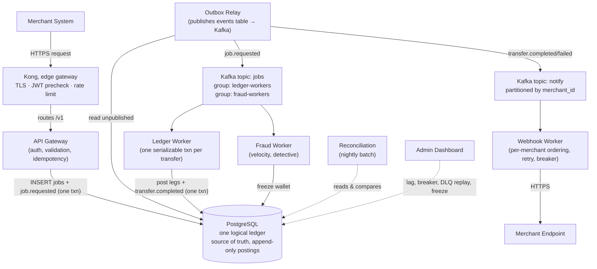
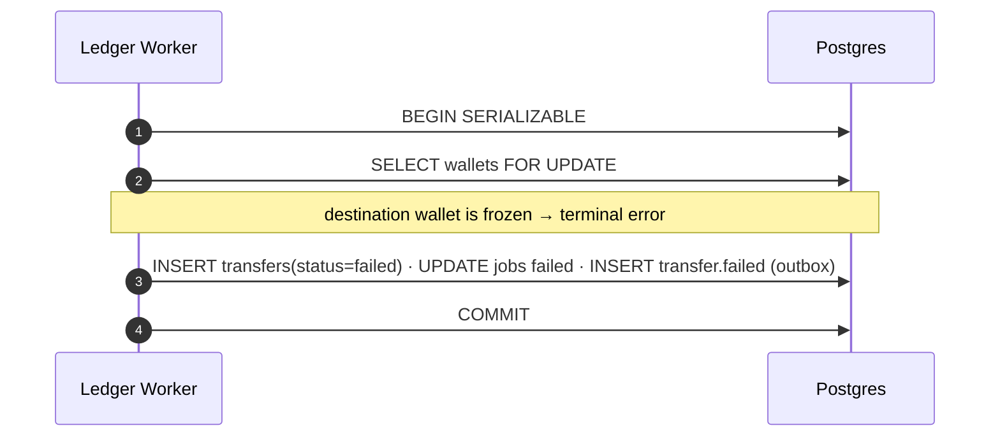

# 00: Overview

> **What this is.** The whole system in one read. If you read only one document in this set, read this one.
>
> **Reading time.** ~15 minutes.
>
> **Audience.** Anyone — engineer, reviewer, future-you. No prior context assumed except a working knowledge of distributed-systems vocabulary (events, transactions, idempotency, consumer groups). If those words are unfamiliar, read [`01-PROBLEM.md`](01-PROBLEM.md) first.

---

## What RRQ is

RRQ is a payment processing core. Merchants hand it instructions like "move 5,000 NGN from wallet A to wallet B" and it executes them, durably, with the kind of correctness guarantees that make it safe to use with real money.

The interesting word in that sentence is **durably**. On a single machine, executing a transfer is a database transaction — three lines of code, ACID-protected, you're done. RRQ is harder than that because it accepts that the world it lives in is hostile: workers crash mid-operation, networks partition mid-request, the same instruction arrives twice because the merchant retried, two workers race to process the same message because the broker redelivered it. The system has to handle every one of those without losing money or paying twice. That's what makes it a distributed-systems project rather than a CRUD app.

## What it is _not_

RRQ does not hold custody of real funds. It does not connect to card networks, banks, or mobile-money providers. It does not perform KYC, AML, or sanctions screening. It does not price foreign exchange. It is the **correctness-critical core** of a payment system — the part that, if implemented wrong, silently loses money — without the regulatory and integration surface that would take a real payment company years to build.

Concretely, RRQ is a **closed-loop ledger**. Value enters only when an operator funds a wallet ([→ `16-MERCHANT-WALLET-LIFECYCLE.md`](services/16-MERCHANT-WALLET-LIFECYCLE.md)), and it never leaves to the outside world: there is no bank or card off-ramp. Every transfer moves existing value between two wallets *inside* the system. That scoping is the deliberate, load-bearing decision of the whole design: because both wallets always live in the same ledger, **a transfer is one database transaction**, not a multi-system dance. The integration surface that would break that property — external banks, cross-region settlement — is exactly what RRQ scopes out, which is what lets the design concentrate on the part where correctness is hard.

## The merchant's view

A merchant interacts with RRQ through a small HTTP API. Two endpoints carry essentially all the traffic:

```
POST /v1/transfers        ── move value between two wallets
POST /v1/payouts          ── execute many transfers as one batch (bulk payout)
```

A transfer request looks like this:

```http
POST /v1/transfers HTTP/1.1
Host: api.rrq.example
Authorization: Bearer <merchant_jwt>
Idempotency-Key: 8e3f1c4a-9b2d-4f81-a7c5-d3b6e9f2a1c0
Content-Type: application/json

{
  "from_wallet": "wal_01HQX2...",
  "to_wallet":   "wal_01HQX3...",
  "amount":      500000,
  "currency":    "NGN",
  "reference":   "merchant-internal-id-9182"
}
```

The merchant gets back, almost immediately:

```http
HTTP/1.1 202 Accepted
Content-Type: application/json

{
  "job_id":  "job_01HQX4...",
  "status":  "pending",
  "_links":  { "self": "/v1/jobs/job_01HQX4..." }
}
```

Two things matter. First, it's `202 Accepted`, not `200 OK`: the transfer hasn't happened yet — it's been _durably accepted for processing_. Second, the response comes back in tens of milliseconds even though the posting happens a moment later, because the gateway's job is to accept and persist work, not to wait for it.

The merchant learns the outcome through a webhook some time later (typically under a second under normal load):

```http
POST /merchant-webhook-url HTTP/1.1
Content-Type: application/json
X-RRQ-Signature: sha256=abc123...

{
  "event":   "transfer.completed",
  "job_id":  "job_01HQX4...",
  "data":    { ... }
}
```

The merchant can also poll `GET /v1/jobs/<job_id>` for a synchronous, strongly-consistent answer. That is the entire merchant-facing surface: two endpoints to submit work, one webhook to learn outcomes, one endpoint to poll. Everything else exists _behind_ that interface to make it correct under failure.

## The seven big ideas

Before the architecture, the seven concepts everything else is built from. Understand these and the rest is detail.

**1. The unknown outcome.** When you call a service across a network, you can get three answers: success, failure, or _no answer at all_. The third case — request lost, response lost, you can't tell which — is the source of most distributed-systems complexity. RRQ assumes it constantly.

**2. Idempotency.** If a merchant retries because they didn't get a response, the underlying operation must not run twice. RRQ tags every request with a merchant-supplied key and records it as a `UNIQUE` row in Postgres, so the operation runs **at most once per key** — durably, with no cache to lose the claim.

**3. Atomic double-entry posting.** A transfer is two halves — a debit on one wallet, a credit on another. RRQ writes **both halves in a single serializable transaction**, so they commit together or not at all. There is never a moment where money has left one wallet but not arrived at the other. This is the one idea that replaces a whole category of machinery (sagas, compensations, distributed locks): you don't recover a half-done transfer because a half-done transfer cannot exist.

**4. The immutable ledger.** The financial source of truth is the append-only log of double-entry postings (`ledger_entries`). A wallet's balance is _derived_ by summing its postings, not stored as a mutable column you overwrite. History is reconstructible, auditable, and verifiable by reconciliation.

**5. CQRS.** Reads and writes are separated. The write path appends postings. The read path queries pre-computed projections (e.g., a cached balance per wallet) built asynchronously, optimized for the dashboard's queries. The dashboard never sums the ledger live.

**6. At-least-once delivery with idempotent handlers.** The message broker (Kafka) guarantees every message reaches a consumer at least once, never exactly once (that's impossible in general). RRQ achieves _effective_ exactly-once by making every handler idempotent — a `UNIQUE` constraint turns a duplicate into a no-op.

**7. The transactional outbox.** A service must never "write to the database, then publish to Kafka" as two steps — a crash between them loses the message. Instead, the message is written to the `events` table _in the same transaction_ as the state change, and a relay publishes it to Kafka afterward. This is the **only** way a message leaves a service, so a fact and its notification are exactly as durable as each other.

These seven, composed, are RRQ. Everything else is a working-out of the consequences.

## Architecture at a glance



Kong sits at the edge (TLS termination, coarse JWT check, per-merchant rate limiting). The custom **API Gateway** does the part no off-the-shelf gateway can: the durable idempotency claim and the hand-off into the ledger. Note that **every box is a fleet of ≥2 instances** — see below.

The arrows that matter:

- **Synchronous (in the merchant's request path):** Merchant → Kong → API Gateway → one Postgres transaction (insert the `jobs` row + the `job.requested` outbox event) → `202`. That commit is the durability boundary. Nothing else is in the request path.
- **Asynchronous (everything else):** the relay publishes the outbox to Kafka; workers consume; the Ledger Worker posts in one transaction; notifications go out via webhook. None of this blocks the merchant's call.

### A fleet, not a process

Every box in that diagram is **at least two live instances** — there is no "the ledger worker," only the ledger workers, and the same for the gateway, the relay, the webhook and fraud workers, the dashboard, and the Postgres/Redis backends (primary + standby with automatic failover). RRQ is horizontally scalable and highly available: you add throughput by adding worker replicas, and you survive the loss of any pod, node, or backend primary because a peer or standby takes over within seconds. Where multiple replicas could otherwise race, the database serializes them (a wallet's row lock, a unique constraint, a Kafka partition assignment) — not anything in process memory. The full story is [`03-SCALING-AND-AVAILABILITY.md`](03-SCALING-AND-AVAILABILITY.md).

## What happens when a transfer succeeds

The spine of the system.

```mermaid
sequenceDiagram
    autonumber
    participant M as Merchant
    participant API as API Gateway
    participant DB as Postgres (one logical ledger)
    participant RL as Outbox Relay
    participant K as Kafka
    participant LW as Ledger Worker
    participant WW as Webhook Worker

    M->>API: POST /v1/transfers (Idempotency-Key)
    API->>DB: BEGIN; INSERT jobs ON CONFLICT DO NOTHING; INSERT job.requested (outbox); COMMIT
    API-->>M: 202 Accepted (job_id)

    RL->>DB: read unpublished events
    RL->>K: publish job.requested → jobs topic

    LW->>K: consume job.requested
    LW->>DB: BEGIN SERIALIZABLE
    Note over LW,DB: SELECT wallets FOR UPDATE (ordered)<br/>check balance · INSERT debit + credit legs<br/>UPDATE jobs completed · INSERT transfer.completed (outbox)
    LW->>DB: COMMIT
    LW->>K: commit offset

    RL->>K: publish transfer.completed → notify topic
    WW->>K: consume (assigned partition)
    WW->>M: POST signed webhook
    M-->>WW: 200 OK
    WW->>DB: record delivery
```

A few things to notice:

- **The API responds at step 3, before any posting happens.** The merchant doesn't wait. The Postgres commit at step 2 is the durability boundary — once the `jobs` row exists, the system owns the work.
- **The posting (the Ledger Worker's transaction) is one atomic step.** Both legs, the job's terminal status, and the outbox notification all commit together. If the worker dies mid-transaction, Postgres rolls it back and the job is redelivered — there is no partial state to repair.
- **The webhook is its own durability domain.** Posting does not depend on the webhook delivering. Webhooks retry independently.

## What happens when a transfer fails

A transfer can fail for a business reason — insufficient balance, a frozen destination, a currency mismatch. This is _not_ a crash to recover; it's a normal terminal outcome, and it's still one transaction:



The key invariant: **because no `ledger_entries` were written, no money moved.** There is nothing to undo. Conservation (I1) holds trivially. The merchant gets a `transfer.failed` webhook with the reason. Contrast this with a saga design, where a failure after a debit would require a *compensating* reversal — RRQ has no such window, because the debit and credit are never separated in the first place.

## What happens when the merchant retries

Duplicate-detection. The gateway inserts the `jobs` row with `INSERT … ON CONFLICT (merchant_id, idempotency_key) DO NOTHING`. The first request with a key wins; every retry conflicts, reads back the existing `job_id`, and returns the same response. The underlying transfer happens **at most once**, durably, no matter how many retries arrive. For the exact sequence and edge cases (concurrent duplicates, same-key-different-body), see [API Gateway](services/10-API-GATEWAY.md).

## The services, in one paragraph each

Detailed docs in `services/`. One paragraph each here for orientation.

**API Gateway.** Terminates HTTPS from merchants (behind Kong). Authenticates with JWT, authorizes wallet ownership (I9), validates request structure. In one Postgres transaction it inserts the `jobs` row (the durable idempotency claim) and the `job.requested` outbox event, then returns `202`. The only synchronous component in the request path. ([→ `10-API-GATEWAY.md`](services/10-API-GATEWAY.md))

**Outbox Relay.** Reads unpublished rows from the `events` table in id order and publishes them to the right Kafka topic (`jobs` or `notify`), stamping `published_at`. It is the single bridge from Postgres to Kafka — no service produces to Kafka directly. ([→ `25-EVENT-STORE-AND-PROJECTIONS.md`](deep-dives/25-EVENT-STORE-AND-PROJECTIONS.md))

**Ledger Worker.** The money mover. Consumes `job.requested` and posts each transfer as **one serializable transaction**: lock both wallets, check balance, write the debit and credit legs, terminate the job, enqueue the notification — atomically. Crash-safe by construction (rollback + redelivery), idempotent via `UNIQUE(transfer_id, leg)`. Bulk payout is a loop of independent such transactions. ([→ `11-LEDGER-WORKER.md`](services/11-LEDGER-WORKER.md))

**Webhook Worker.** Delivers signed notifications to merchants. Consumes the Kafka `notify` topic _partitioned by merchant_id_, where Kafka assigns each partition to exactly one live worker so per-merchant ordering holds across replicas while different merchants run in parallel. Exponential backoff with full jitter, a per-merchant circuit breaker, DLQ on terminal failure. ([→ `12-WEBHOOK-WORKER.md`](services/12-WEBHOOK-WORKER.md))

**Fraud Worker.** Detective control: watches `job.requested` events from the Kafka `jobs` topic for velocity anomalies (N transfers from wallet W in window T) and freezes suspect wallets. Does not gate transfers. The count is order-insensitive (a shared atomic Redis structure), so it load-balances freely across replicas. ([→ `13-FRAUD-WORKER.md`](services/13-FRAUD-WORKER.md))

**Reconciliation.** Scheduled nightly batch. Replays `ledger_entries`, derives balances from scratch, and verifies them against the balance cache and the conservation invariant. Any discrepancy is a `reconciliation.alert` — the system never silently corrects, because divergence is by definition a bug. ([→ `14-RECONCILIATION.md`](services/14-RECONCILIATION.md))

**Admin Dashboard.** Operator interface. Lists and replays DLQ entries, shows consumer lag and circuit-breaker state, freezes/unfreezes wallets, surfaces stuck jobs. Not in the request path. ([→ `15-ADMIN-DASHBOARD.md`](services/15-ADMIN-DASHBOARD.md))

## The data backends

**Postgres** is one logical, strongly-consistent ledger (HA primary + standby). It holds the postings (`ledger_entries`, the financial source of truth), the `jobs` and `transfers` records, the `events` log/outbox, the webhook delivery records, and the DLQ. If Postgres loses committed data, the system has lost data — so it runs synchronous replication with automatic failover. **Every correctness guarantee in RRQ is enforced here**, by transactions, row locks, and unique constraints.

**Kafka** is the message broker, with two topics, both fed exclusively by the outbox relay:
- _`jobs`_ — `job.requested` events, consumed by the Ledger Worker and (independently) the Fraud Worker.
- _`notify`_ — `transfer.completed`/`failed` events, partitioned by `merchant_id` so per-merchant webhook order holds across replicas.

**Redis** holds two _ephemeral, non-correctness-critical_ pieces of state: the Fraud Worker's velocity sorted sets and the Webhook Worker's per-merchant circuit-breaker state. **No invariant depends on Redis** — losing it degrades fraud sensitivity and breaker memory briefly, nothing more. Idempotency and locking live in Postgres, not here.

## What "correct" means here

When this document says "the system is correct," it means a specific list of invariants holds at all times — testable statements, not slogans:

1. **Conservation.** Every transfer is exactly one debit leg and one credit leg of equal magnitude, written atomically. No floating debits or credits.
2. **No negative balances.** Active wallets never derive a balance below zero.
3. **At-most-once execution per idempotency key.** Per `(merchant_id, idempotency_key)`, the operation runs at most once.
4. **Per-wallet entry ordering.** A wallet's postings are totally ordered and causal.
5. **Per-merchant webhook ordering.** Webhooks for a merchant are attempted in the order events occurred.
6. **Immutable history.** No posting or event is ever updated or deleted. Corrections are new rows.

These are spelled out, with the mechanism that enforces each, in [`02-INVARIANTS.md`](02-INVARIANTS.md), and each has tests that try to violate it under adversarial conditions.

## What's hard about this and what isn't

The boring parts (HTTP routing, JWT validation, JSON serialization, connection pooling) get implemented because they must exist; they're not where judgment lives.

The interesting parts, and where the docs go deep:

- **The single posting transaction** — getting the lock order, the under-lock balance check, the outbox write, and the idempotency constraint exactly right, so the transfer is atomic, deadlock-free, and safe to redeliver.
- **Idempotency under concurrency** — two requests with the same key arriving at the same instant: what wins, what the second one sees, all resolved by one `ON CONFLICT`.
- **The ordering problems** — per-merchant webhook order via Kafka partitions, and the one that *looks* like an ordering problem but isn't (per-wallet fraud velocity, which a shared atomic structure makes order-insensitive).
- **The event log as substrate** — append-only postings, the transactional outbox, and how reconciliation uses replay to catch bugs.
- **Resilience patterns** — circuit breakers, jitter, DLQs — as concrete mechanisms that turn predictable failures into automatic recoveries.

## Where to read next

- New to the problem space? → [`01-PROBLEM.md`](01-PROBLEM.md)
- Want the testable correctness statements? → [`02-INVARIANTS.md`](02-INVARIANTS.md)
- How it scales out and stays up (HA, replicas)? → [`03-SCALING-AND-AVAILABILITY.md`](03-SCALING-AND-AVAILABILITY.md)
- Implementing a service? → start with its file under `services/`, then read the deep-dives it links to.
- Reviewing the project? → this doc, then `01-PROBLEM.md`, then skim the service docs and pick one deep-dive. That's 80% of the system in 90 minutes.

---

_Pass 1 of the architecture series. Last updated pre-implementation._
