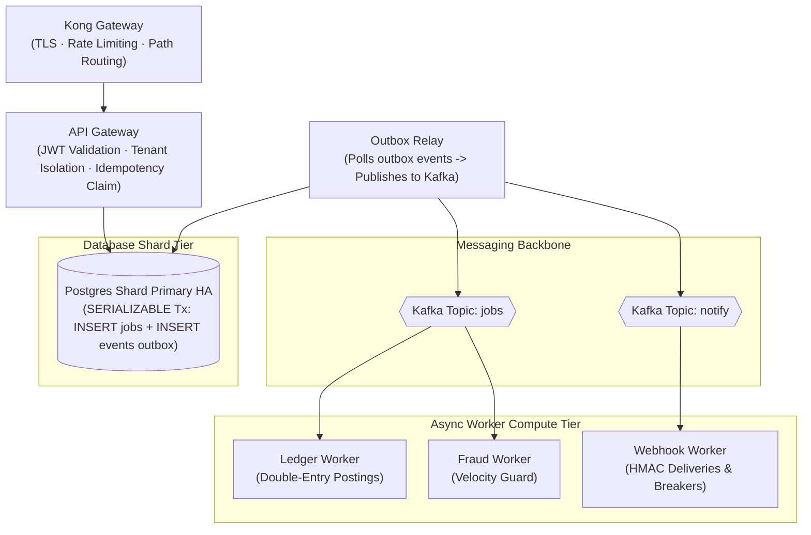

# System Architecture

This document provides the canonical architectural specification for **River Rust Queue (RRQ)**, a high-performance, fault-tolerant payment processing core built in Go and Rust.

---

## 1. System Overview

RRQ is a closed-loop ledger engine designed for high-throughput transfer processing ($5,000$ to $10,000$ TPS target). In a closed-loop model, value enters when an operator funds a wallet and moves exclusively between wallets inside the system. By eliminating external bank settlement legs from the core path, RRQ executes transfers as single, serializable database transactions rather than complex distributed sagas.

---

## 2. Service Architecture

### 2.1 API Gateway (`core-api`)
* **Role**: Synchronous HTTP ingress gatekeeper.
* **Responsibilities**:
  1. Validates JWT Bearer tokens and verifies tenant wallet ownership (`from_wallet.merchant_id == jwt.sub`).
  2. Enforces at-most-once execution via `UNIQUE(merchant_id, idempotency_key)` on the `jobs` table.
  3. Writes the `jobs` row and `job.requested` outbox event in **one atomic transaction** on the merchant's home database shard.
  4. Responds immediately with `HTTP 202 Accepted` and a `job_id`.
* **Resilience Configuration**:
  - `ServerReadTimeout`: `2.0s`
  - `ServerWriteTimeout`: `2.0s`
  - `PostgresQueryTimeout`: `500ms`
  - `BulkheadLimit`: `500` concurrent requests
  - `CircuitBreaker`: 50% error threshold over 2,500 requests (10s window)

---

### 2.2 Outbox Relay (`outbox-relay`)
* **Role**: Asynchronous transactional outbox bridge between PostgreSQL and Kafka.
* **Responsibilities**:
  1. Polls unpublished outbox rows (`events`) using `SELECT ... FOR UPDATE SKIP LOCKED` ordered by `id`.
  2. Produces events to Kafka topics (`jobs` or `notify`) using event attributes (e.g., `merchant_id` as partition key).
  3. Stamps `published_at` on outbox rows upon successful Kafka delivery confirmation.
* **Resilience Configuration**:
  - `RelayPoolInterval`: `500ms`
  - `PublishTimeout`: `3.0s`
  - `BatchProcessTimeout`: `5.0s`
  - `CircuitBreaker`: 40% error threshold over 10s window

---

### 2.3 Ledger Worker (`ledger-worker`)
* **Role**: Asynchronous money movement engine.
* **Responsibilities**:
  1. Consumes `job.requested` messages from the Kafka `jobs` topic.
  2. Executed double-entry postings in a `SERIALIZABLE` transaction:
     - Locks source and target wallet rows (`SELECT ... FOR UPDATE` ordered by ID).
     - Verifies source wallet balance sufficiency ($ balance \ge 0 $).
     - Inserts debit and credit rows into `ledger_entries`.
     - Marks `jobs` status as `completed`.
     - Inserts `transfer.completed` event into the outbox.
  3. Handles cross-shard transfers via a 2-phase clearing account protocol:
     - **Phase 1 (Source Shard)**: Debits source wallet, credits local clearing account, emits `xshard.transfer.requested`.
     - **Phase 2 (Destination Shard)**: Debits destination clearing account, credits target wallet, emits `xshard.transfer.confirmed`.
* **Resilience Configuration**:
  - `ProcessTimeout`: `3.0s`
  - `MaxDLQRetries`: `3`
  - `RetryBackoff`: `100ms` base, `5.0s` max with Exponential Backoff + Full Jitter
  - `RetryBudget`: Dynamically sized token bucket budget derived by capacity engine

---

### 2.4 Webhook Worker (`webhook-worker`)
* **Role**: Asynchronous signed event delivery to merchant HTTP endpoints.
* **Responsibilities**:
  1. Consumes events from Kafka's `notify` topic (partitioned by `merchant_id`).
  2. Signs payloads using HMAC-SHA256 merchant secret.
  3. Delivers HTTP POST notifications to merchant webhooks.
  4. Employs per-merchant circuit breakers to isolate failing merchant endpoints.
  5. Schedules retries over a 24-hour exponential backoff schedule before routing to `dlq_entries`.
* **Resilience Configuration**:
  - `HTTPClientTimeout`: `5.0s`
  - `MaxRetries`: `10` over 24 hours
  - `Isolation`: Per-merchant circuit breaker (trips on 5 consecutive failures)

---

### 2.5 Fraud Worker (`fraud-worker`)
* **Role**: Real-time velocity tracking and anomaly detection.
* **Responsibilities**:
  1. Consumes `job.requested` events from Kafka.
  2. Updates sliding-window counter keys in Redis (`merchant_id:velocity`).
  3. Automatically freezes wallets if velocity thresholds are violated.
  4. Order-insensitive execution (does not block ledger processing).

---

---

## 3. Platform & Resilience Architecture

All Go microservices incorporate standard resilience primitives via `failsafe-go` and custom platform wrappers (`internal/platform/`):

1. **Deadline Propagation**: Upstream contexts pass remaining deadlines downstream to terminate zombie transactions.
2. **Exponential Backoff + Full Jitter**: Randomizes retry delays uniformly between $0$ and $\min(T_{\text{max}}, T_{\text{base}} \cdot 2^{n-1})$ to prevent thundering herd retry storms.
3. **Token Bucket Retry Budget**: Dynamically limits total retries to a percentage of overall throughput, shedding retries fast to DLQ during systemic outages.
4. **Bulkhead Isolation**: Bounds concurrent execution using counting semaphores.

---

## 4. Data Topology & Storage

* **PostgreSQL 17 (CloudNativePG)**:
  - **Global DB (`merchants-db`)**: Merchant directory & routing table.
  - **Ledger Shards (`shard-a`, `shard-b`, ...)**: Core financial tables (`jobs`, `transfers`, `ledger_entries`, `wallets`, `events`, `dlq_entries`).
* **Kafka (Strimzi)**:
  - `jobs` topic (partitioned for parallel consumer worker scaling).
  - `notify` topic (partitioned by `merchant_id` for strict ordering).
* **Redis**:
  - Ephemeral sliding-window velocity counters.
