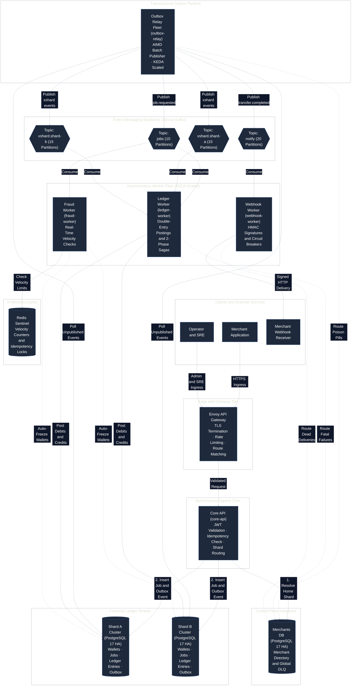

# System Architecture

This document provides the canonical architectural specification for **River Rust Queue (RRQ)**, a high-performance, fault-tolerant payment processing core built in Go and Rust.

---

## 1. System Overview

RRQ is a closed-loop ledger engine designed for high-throughput transfer processing ($5,000$ to $10,000$ TPS target). In a closed-loop model, value enters when an operator funds a wallet and moves exclusively between wallets inside the system. By eliminating external bank settlement legs from the core path, RRQ executes transfers as single, serializable database transactions rather than complex distributed sagas.

## 2. Service Architecture

### 2.1 API Gateway (`core-api`)

- **Role**: Synchronous HTTP ingress gatekeeper.
- **Responsibilities**:
  1. Validates JWT Bearer tokens and verifies tenant wallet ownership (`from_wallet.merchant_id == jwt.sub`).
  2. Enforces at-most-once execution via `UNIQUE(merchant_id, idempotency_key)` on the `jobs` table.
  3. Writes the `jobs` row and `job.requested` outbox event in **one atomic transaction** on the merchant's home database shard.
  4. Responds immediately with `HTTP 202 Accepted` and a `job_id`.
- **Resilience Configuration**: Dynamically auto-sized via the GitOps Capacity Engine (`tools/capacity-engine/`), including precise `ServerTimeoutMs`, database query timeouts, circuit breaker thresholds, and token bucket retry budgets derived from SLOs.

---

### 2.2 Outbox Relay (`outbox-relay`)

- **Role**: Asynchronous transactional outbox bridge between PostgreSQL and Kafka.
- **Responsibilities**:
  1. Polls unpublished outbox rows (`events`) using `SELECT ... FOR UPDATE SKIP LOCKED` ordered by `id`.
  2. Produces events to Kafka topics (`jobs` or `notify`) using event attributes (e.g., `merchant_id` as partition key).
  3. Stamps `published_at` on outbox rows upon successful Kafka delivery confirmation.
- **Resilience Configuration**: Managed dynamically by the GitOps Capacity Engine (`tools/capacity-engine/`), which calculates optimal batch processing timeouts, Kafka producer deadlines, AIMD loop rates, and circuit breaker constraints.

---

### 2.3 Ledger Worker (`ledger-worker`)

- **Role**: Asynchronous money movement engine.
- **Responsibilities**:
  1. Consumes `job.requested` messages from the Kafka `jobs` topic.
  2. Executed double-entry postings in a `SERIALIZABLE` transaction:
     - Locks source and target wallet rows (`SELECT ... FOR UPDATE` ordered by ID).
     - Verifies source wallet balance sufficiency ($ balance \ge 0 $).
     - Inserts debit and credit rows into `ledger_entries`.
     - Marks `jobs` status as `completed`.
     - Inserts `transfer.completed` event into the outbox.
  3. Handles cross-shard transfers via a 2-phase clearing account protocol:
     - **Phase 1 (Source Shard)**: Debits source wallet, credits local clearing account, emits `xshard.transfer.requested`.
     - **Phase 2 (Destination Shard)**: Debits destination clearing account, credits target wallet, emits `xshard.transfer.confirmed`.
- **Resilience Configuration**: Defined dynamically via the GitOps Capacity Engine. This generates precise `ProcessTimeoutMs`, exponential backoff parameters, DLQ thresholds, and distributed Token Bucket retry budgets derived directly from traffic SLAs.

---

### 2.4 Webhook Worker (`webhook-worker`)

- **Role**: Asynchronous signed event delivery to merchant HTTP endpoints.
- **Responsibilities**:
  1. Consumes events from Kafka's `notify` topic (partitioned by `merchant_id`).
  2. Signs payloads using HMAC-SHA256 merchant secret.
  3. Delivers HTTP POST notifications to merchant webhooks.
  4. Employs per-merchant circuit breakers to isolate failing merchant endpoints.
  5. Schedules retries over a 24-hour exponential backoff schedule before routing to `dlq_entries`.
- **Resilience Configuration**: Auto-provisioned by the GitOps Capacity Engine, establishing mathematically rigorous per-merchant `HTTPClientTimeout` bounds, 24-hour staggered retry schedules, and per-merchant circuit breaker thresholds to prevent downstream exhaustion.

---

### 2.5 Fraud Worker (`fraud-worker`)

- **Role**: Real-time velocity tracking and anomaly detection.
- **Responsibilities**:
  1. Consumes `job.requested` events from Kafka.
  2. Updates sliding-window counter keys in Redis (`merchant_id:velocity`).
  3. Automatically freezes wallets if velocity thresholds are violated.
  4. Order-insensitive execution (does not block ledger processing).

---

---

## 3. Platform & Resilience Architecture

All Go microservices incorporate standard resilience primitives via `failsafe-go` and custom platform wrappers (`internal/platform/`):

1. **Deadline Propagation**: Upstream contexts pass remaining deadlines downstream to terminate zombie transactions.
2. **Exponential Backoff + Full Jitter**: Randomizes retry delays uniformly between $0$ and $\min(T_{\text{max}}, T_{\text{base}} \cdot 2^{n-1})$ to prevent thundering herd retry storms.
3. **Token Bucket Retry Budget**: Dynamically limits total retries to a percentage of overall throughput, shedding retries fast to DLQ during systemic outages.
4. **Bulkhead Isolation**: Bounds concurrent execution using counting semaphores.

---

---

## 4. Data Topology & Storage

- **PostgreSQL 17 (CloudNativePG)**:
  - **Global Control Plane DB (`merchants-db`)**: Merchant directory, routing table, and **Global DLQ (`dlq_entries`)**.
  - **Ledger Shards (`shard-a`, `shard-b`, ...)**: Core financial tables (`jobs`, `transfers`, `ledger_entries`, `wallets`, `events`).
  - Sized for **239 max connections** ceiling per cluster with per-pod RW connection caps (`CORE_API_PG_SHARD_*_RW_MAX_CONNS: 5`).
- **Kafka (Strimzi)**:
  - `jobs` topic: **10 partitions** (sizes for $3,000\text{ RPS}$ peak with consumer floor of 6 pods).
  - `notify` topic: **20 partitions** (sizes for $3,000\text{ RPS}$ peak with consumer floor of 5 pods).
  - `xshard.shard-a` topic: **15 partitions** (sizes for $1,500\text{ RPS}$ cross-shard clearing).
  - `xshard.shard-b` topic: **15 partitions** (sizes for $1,500\text{ RPS}$ cross-shard clearing).
- **Redis**:
  - Ephemeral sliding-window velocity counters.

---

## 5. Measured Performance & Empirical Benchmarks

The system was extensively benchmarked using the k6 load testing suite across all operating regimes:

| Benchmark / Workload         |               Operating Conditions               |                    Measured Result                    |             System Behavior & Invariants              |
| :--------------------------- | :----------------------------------------------: | :---------------------------------------------------: | :---------------------------------------------------: |
| **Peak Ingress Throughput**  | $300 \rightarrow 3,000\text{ RPS}$ ramping burst |           **$3,000\text{ RPS}$ sustained**            |            0 datastore crashes, 0 pod OOMs            |
| **Outbox Relay Throughput**  |              Continuous DB polling               |         **$\approx 1,000\text{ events/sec}$**         |  Kafka buffer fill $< 8\%$, zero publisher stalling   |
| **Nominal Ingress Latency**  |         $1,000\text{ RPS}$ steady-state          | **$38.7\text{ ms}$ (P50)** / **$45\text{ ms}$ (P95)** |    Strict compliance with $< 2,000\text{ ms}$ SLO     |
| **Worker Processing Time**   |           `ledger-worker` double-entry           |               **$10.8\text{ ms}$ avg**                |   $100\%$ balance conservation ($\sum \Delta = 0$)    |
| **Fraud Velocity Latency**   |       `fraud-worker` Redis sliding window        |                **$6.4\text{ ms}$ avg**                |            Non-blocking parallel execution            |
| **Webhook Delivery Latency** |           `webhook-worker` signed HTTP           |               **$52.0\text{ ms}$ avg**                |        Per-merchant circuit breaker protection        |
| **Circuit Breaker Shedding** |      Over-saturation ($> 2,500\text{ RPS}$)      |     **$< 0.01\text{ ms}$ fast rejection (`503`)**     |       Database connection starvation prevented        |
| **DLQ Data Recovery**        |         Batch replay (`replay-dlq.mts`)          |     **$100\%$ recovery rate** ($0$ lost messages)     | $43/43$ dead-lettered events successfully reprocessed |
| **Autoscaling Response**     |            KEDA / HPA event triggers             |     **$3\text{ pods} \rightarrow 4\text{ pods}$**     |             Dynamic partition rebalancing             |
