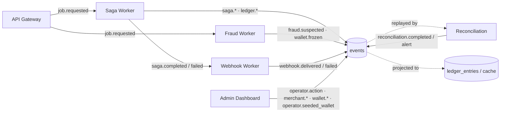

# 41: Event Catalog

> **What this is.** Reference for every event type in RRQ. Schema, emitters, consumers, when emitted.
>
> **Format.** One section per event type. Look up the event you need.

---

## Schema convention

Every event is written to `events` with:

- `event_type`, the dotted name like `transfer.completed`.
- `aggregate_type` and `aggregate_id`, what the event is about.
- `correlation_id`, saga_id linking related events.
- `causation_id`, predecessor event_id.
- `payload`, JSONB conforming to a specific Protobuf message (defined in `proto/events/events.proto`).
- `occurred_at`, when the event happened (application time).

This appendix describes the *meaningful* payload contents per event type. The full Protobuf definitions are the source of truth.

---

## Event flow at a glance

Who emits what, and who reads it:



Every box writes to the single append-only `events` table. The arrows into `events` are the system's whole write story; everything else is a projection or a read.

---

## Job lifecycle

### `job.requested`

The merchant submitted a job and the API gateway accepted it.

**Aggregate:** `saga` / `saga_id`
**Correlation:** new (this event starts the correlation)
**Emitted by:** API Gateway
**Consumed by:** Saga Worker, Fraud Worker (separate groups)

**Payload:**
```json
{
  "job_id": "job_...",
  "merchant_id": "m_...",
  "idempotency_key": "8e3f...",
  "job_type": "transfer" | "bulk_payout",
  "data": { ... }  // shape depends on job_type
}
```

For transfer:
```json
"data": {
  "from_wallet": "wal_...",
  "to_wallet": "wal_...",
  "amount": 500000,
  "currency": "NGN",
  "reference": "merchant-ref-..."
}
```

For bulk_payout:
```json
"data": {
  "from_wallet": "wal_...",
  "recipients": [
    { "to_wallet": "wal_...", "amount": 1000, "reference": "..." },
    ...
  ]
}
```

---

## Saga lifecycle

### `saga.validated`

The Validate step completed; preconditions are met.

**Aggregate:** `saga` / `saga_id`
**Emitted by:** Saga Worker (Validate step)
**Consumed by:** none (purely an audit / progress marker)

**Payload:** small; usually empty or with summary data (the validated amount, the wallets confirmed to exist).

### `saga.locked`

The AcquireLock step completed; Redlocks held.

**Emitted by:** Saga Worker (AcquireLock step)
**Payload:** typically empty; locks are internal mechanism, not user-facing data.

### `saga.completed`

The saga reached terminal success.

**Emitted by:** Saga Worker (Complete step)
**Consumed by:** Webhook Worker (indirectly, via the notify stream)

### `saga.failed`

The saga reached terminal failure after compensation.

**Emitted by:** Saga Worker (after Compensating completes)
**Consumed by:** Webhook Worker

### `saga.dead_lettered`

The saga reached unrecoverable state (compensation itself failed).

**Emitted by:** Saga Worker
**Consumed by:** none; surfaced in the Admin Dashboard

---

## Ledger events

The fine-grained "money moved" events. These are the events reconciliation primarily verifies.

### `ledger.debit_applied`

A wallet was debited.

**Aggregate:** `wallet` / `wallet_id`
**Correlation:** `saga_id`
**Emitted by:** Saga Worker (Debit step)
**Consumed by:** Reconciliation, balance projection

**Payload:**
```json
{
  "wallet_id": "wal_...",
  "amount": 500000,
  "saga_id": "sg_...",
  "step_name": "debit",
  "balance_after": 500000
}
```

`balance_after` is the snapshot at the moment the entry was applied. Useful for reconstruction and audit; reconciliation does not depend on it (it derives balance from the sum).

### `ledger.credit_applied`

A wallet was credited.

**Aggregate:** `wallet` / `wallet_id`
**Emitted by:** Saga Worker (Credit step)
**Consumed by:** Reconciliation, balance projection

**Payload:** same shape as `debit_applied` with positive `amount`.

### `ledger.debit_reversed`

A compensating credit was applied to undo a prior debit.

**Aggregate:** `wallet` / `wallet_id`
**Emitted by:** Saga Worker (CompensationDebit step)
**Consumed by:** Reconciliation, balance projection

**Payload:**
```json
{
  "wallet_id": "wal_...",
  "amount": 500000,                  // positive, restoring funds
  "saga_id": "sg_...",
  "step_name": "compensation_credit", // same name as the ledger entry's step
  "reason": "credit_failed_destination_frozen"
}
```

The `reason` field documents *why* the compensation happened. Useful for ops investigations.

---

## Merchant events

### `merchant.created`

A merchant was onboarded by an operator. The raw API key is never recorded here (see [`../services/16-MERCHANT-WALLET-LIFECYCLE.md`](../services/16-MERCHANT-WALLET-LIFECYCLE.md)).

**Aggregate:** `merchant` / `merchant_id`
**Emitted by:** Admin Dashboard
**Consumed by:** none directly; audit log

**Payload:**
```json
{
  "merchant_id": "m_...",
  "name": "...",
  "tier": "standard",
  "created_by": "operator_<id>"
}
```

### `merchant.api_key_rotated`

A merchant's API key was rotated by an operator. The key itself is never recorded.

**Aggregate:** `merchant` / `merchant_id`
**Emitted by:** Admin Dashboard
**Consumed by:** none directly; audit log

**Payload:**
```json
{
  "merchant_id": "m_...",
  "rotated_by": "operator_<id>"
}
```

---

## Wallet events

### `wallet.frozen`

A wallet's status changed to frozen.

**Aggregate:** `wallet` / `wallet_id`
**Correlation:** may be empty (operator-initiated) or saga_id (fraud-worker-initiated)
**Emitted by:** Fraud Worker (auto-freeze on velocity threshold) or Admin Dashboard (operator action)
**Consumed by:** none directly; Saga Worker reads `wallets.status` as part of Validate.

**Payload:**
```json
{
  "wallet_id": "wal_...",
  "reason": "velocity_threshold_exceeded" | "manual_freeze" | ...,
  "frozen_by": "system" | "operator_<id>"
}
```

### `wallet.unfrozen`

The inverse. Operator-initiated.

**Emitted by:** Admin Dashboard
**Payload:**
```json
{
  "wallet_id": "wal_...",
  "reason": "...",
  "unfrozen_by": "operator_<id>"
}
```

### `wallet.created`

A new wallet was provisioned for a merchant.

**Aggregate:** `wallet` / `wallet_id`
**Emitted by:** Admin Dashboard, on wallet provisioning (see [`../services/16-MERCHANT-WALLET-LIFECYCLE.md`](../services/16-MERCHANT-WALLET-LIFECYCLE.md)).

**Payload:**
```json
{
  "wallet_id": "wal_...",
  "merchant_id": "m_...",
  "wallet_type": "merchant_operational" | "customer" | "escrow",
  "currency": "NGN",
  "external_ref": "..."             // present only for customer wallets; opaque to RRQ
}
```

---

## Fraud events

### `fraud.suspected`

A velocity threshold was exceeded; the system has flagged the wallet for review (or auto-frozen, generating a `wallet.frozen` event as well).

**Aggregate:** `wallet` / `wallet_id`
**Emitted by:** Fraud Worker
**Consumed by:** none directly (alerting subscribes externally)

**Payload:**
```json
{
  "wallet_id": "wal_...",
  "rule": "velocity_50_per_60s",
  "observed_count": 52,
  "threshold": 50,
  "action_taken": "wallet_frozen"
}
```

---

## Webhook events

### `webhook.delivered`

A webhook was successfully delivered to a merchant.

**Aggregate:** `webhook` / `delivery_id`
**Emitted by:** Webhook Worker
**Consumed by:** none (audit only)

**Payload:**
```json
{
  "delivery_id": "wd_...",
  "merchant_id": "m_...",
  "source_event_id": "ev_...",
  "status_code": 200,
  "attempt_count": 1,
  "delivered_at": "2026-05-12T14:23:45Z"
}
```

### `webhook.failed`

A webhook delivery exhausted its retry budget and moved to DLQ.

**Aggregate:** `webhook` / `delivery_id`
**Emitted by:** Webhook Worker
**Consumed by:** none (audit + DLQ created in same transaction)

**Payload:**
```json
{
  "delivery_id": "wd_...",
  "merchant_id": "m_...",
  "source_event_id": "ev_...",
  "attempt_count": 10,
  "last_error": "HTTP 500"
}
```

---

## Reconciliation events

### `reconciliation.completed`

A reconciliation run finished.

**Aggregate:** `reconciliation` / `run_id`
**Emitted by:** Reconciliation worker
**Consumed by:** none directly

**Payload:**
```json
{
  "run_id": "rec_...",
  "window_start": "2026-05-11T00:00:00Z",
  "window_end":   "2026-05-12T00:00:00Z",
  "wallets_checked": 1247,
  "discrepancies_found": 0,
  "duration_seconds": 12.4
}
```

### `reconciliation.alert`

A discrepancy was found.

**Emitted by:** Reconciliation worker
**Consumed by:** Alerting (via metric); operator (via the Admin Dashboard)

**Payload:**
```json
{
  "run_id": "rec_...",
  "wallet_id": "wal_...",
  "derived_balance": 1500000,
  "ledger_balance": 1500050,
  "delta": 50
}
```

The `delta` is signed: positive means the ledger has more than events explain.

---

## Operator events (audit)

### `operator.action`

Any mutating action taken by an operator via the Admin Dashboard.

**Aggregate:** the entity affected (DLQ entry, saga, wallet)
**Emitted by:** Admin Dashboard
**Consumed by:** none directly; comprehensive audit log

**Payload:** (same shape as the example in [`../services/15-ADMIN-DASHBOARD.md`](../services/15-ADMIN-DASHBOARD.md))
```json
{
  "operator_id": "ops_<id>",
  "action": "dlq.replay" | "wallet.freeze" | "saga.abort" | ...,
  "target_type": "dlq_entry" | "wallet" | "saga",
  "target_id": "...",
  "params": { ... },                // arguments to the action
  "outcome": "success" | "failure",
  "before_state": { ... },          // entity state before the action
  "after_state": { ... }            // entity state after
}
```

These events are what makes operator actions auditable. Every freeze, every replay, every override is recorded.

### `operator.seeded_wallet`

An operator credited a wallet with starting funds (dev/staging only). See [`../services/16-MERCHANT-WALLET-LIFECYCLE.md`](../services/16-MERCHANT-WALLET-LIFECYCLE.md) (Funding). The matching ledger entry uses `saga_id = 'SEED_<run_id>'`.

**Aggregate:** `wallet` / `wallet_id`
**Emitted by:** Admin Dashboard (only when `ALLOW_WALLET_SEEDING` is true)
**Consumed by:** Reconciliation (recognizes the `SEED_*` prefix); audit log

**Payload:**
```json
{
  "wallet_id": "wal_...",
  "amount": 10000000,
  "reason": "demo setup",
  "seeded_by": "operator_<id>",
  "environment": "dev" | "staging"
}
```

---

## Chargeback events (designed, not yet built)

### `dispute.initiated`, `dispute.escrow_funded`, `dispute.escalated`, `dispute.response_received`, `dispute.resolved`

Chargeback / dispute saga events. See [`../services/18-CHARGEBACKS.md`](../services/18-CHARGEBACKS.md).

---

## Adding new event types

Backward-compatible changes (adding fields, adding new types) are always safe. Old consumers ignore unknown fields and types.

Breaking changes (removing fields, changing meanings) require versioning: emit `event_type.v2` going forward; keep readers compatible with v1 for historical replay.

The protobuf definitions in `proto/events/events.proto` are the source of truth. Changes there propagate to Go via codegen, and to the Rust comparison implementation in the Rust comparison once it is built.

---

*Pass 4 of the architecture series. Last updated pre-implementation.*
