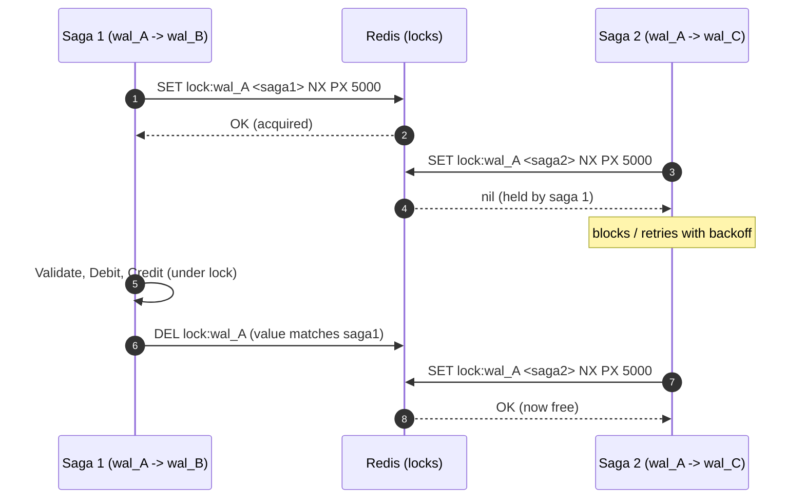
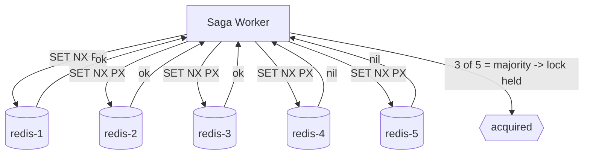

# 23: Distributed Locking

> **What this is.** The deep dive on how RRQ locks wallets during a saga: why a database row lock isn't enough, what Redlock buys, why it's not just `SET NX`, what fencing tokens are for, and the honest limits of the current single-node deployment.
>
> **Reading time.** ~12 minutes.
>
> **Prerequisites.** Read [`11-SAGA-WORKER.md`](../services/11-SAGA-WORKER.md) and [`22-ORDERING.md`](22-ORDERING.md). This doc is the detailed treatment that both of those point to.

---

## Why a lock at all

A transfer touches two wallets: it debits the source and credits the destination. Between reading the source's balance ("does it have enough?") and writing the debit, another saga must not be able to debit the same wallet. If it could, two concurrent transfers from a wallet with balance 100, each for 60, could both pass the balance check and both debit, leaving the wallet at -20. That violates **I2** (no negative balance on active wallets).

A database transaction does not solve this on its own. The saga crosses transaction boundaries: the balance check, the debit, the credit, and the state updates are separate committed steps, deliberately, so that a crash between them is recoverable. A row lock held inside one transaction is released the moment that transaction commits, long before the saga finishes. The saga needs a lock that outlives a single database transaction and spans the whole wallet-mutating section. That is a **distributed lock**.



The lock is held from the `AcquireLock` step through the last wallet-mutating step, then released when the saga reaches a terminal state. Any saga that wants one of the same wallets blocks until it's free.

---

## Why it's not just `SET NX`

`SET key value NX PX 5000` (set if not exists, with a 5-second expiry) on a single Redis node is the building block, but a single node has a failure mode that matters for money. If the Redis primary acquires a lock, then crashes before replicating the key to its replica, and the replica is promoted, the new primary has no record of the lock. A second saga acquires the "same" lock and two sagas mutate the wallet concurrently. The lock's safety property is lost exactly when you needed it.

Two properties make the single-token approach safe enough in practice, and they are why RRQ does not fall over today:

- **Every lock value is the saga's own id**, not a constant. A saga only ever `DEL`s a lock whose value it owns (a small Lua compare-and-delete), so it can't release someone else's lock after its own TTL lapsed.
- **The storage layer is the real backstop.** Even if two sagas briefly believed they held the same wallet lock, the `UNIQUE(saga_id, step_name)` constraint on `ledger_entries` means a given saga writes a given step's ledger entry at most once, and the balance check reads committed events directly. The lock prevents the race; the database constraint prevents the race from corrupting data if the lock ever fails.

---

## Redlock: the multi-node version

[Redlock](https://redis.io/docs/manual/patterns/distributed-locks/) generalizes `SET NX` across **N independent Redis nodes**. To acquire, the client tries to `SET NX PX` the same key on all N; it holds the lock only if a **majority (N/2 + 1)** grant it within a small time budget, and only if the time spent acquiring is well under the TTL. To release, it `DEL`s on all N. A single node failing (or being promoted from a stale replica) cannot hand the same lock to two clients, because no single node is authoritative; a majority is.



**The honest limit:** RRQ currently deploys a **single** Redis node, so it runs the degraded-safety version of this. The algorithm is implemented to acquire across a configurable node set, so moving to 3 or 5 nodes is a deployment change, not a code rewrite. This gap is documented in [`STATUS.md`](../../STATUS.md) and in [`22-ORDERING.md`](22-ORDERING.md).

---

## Deadlock prevention: sort the wallet ids

A transfer locks two wallets. If saga 1 wants `(wal_A, wal_B)` and saga 2 wants `(wal_B, wal_A)`, and each grabs its first lock, they deadlock. The fix is boring and total: **always acquire locks in a canonical order**, sorted by wallet id. Saga 1 and saga 2 both try `wal_A` first, so one of them wins `wal_A` and the other waits there before it can touch `wal_B`. No cycle can form.

```
locks := sort([from_wallet, to_wallet])   // e.g. ["wal_A", "wal_B"]
for id in locks: acquire(id)               // always A before B
```

---

## Lock TTL and the lease problem

The lock has a TTL (5 seconds by default) so a crashed worker can't hold a wallet hostage forever. But a TTL introduces its own risk: a saga that legitimately runs longer than the TTL has its lock expire mid-flight, and another saga can acquire it. RRQ handles this two ways:

- **TTL is set comfortably above the expected wallet-mutating section**, which is milliseconds in the common case.
- **A long-running saga renews its lease** (extends the TTL) while it is still making progress, so a slow-but-healthy saga keeps its lock, while a dead saga's lock still expires.

This is the standard "the lock can expire while you still think you hold it" hazard. It is why the storage-layer idempotency described above is not optional: it is what keeps a late lock expiry from turning into a double debit.

---

## Fencing tokens, and why RRQ uses something else

[Martin Kleppmann's critique](https://martin.kleppmann.com/2016/02/08/how-to-do-distributed-locking.html) of Redlock is worth taking seriously: with any TTL-based lock, a client can be paused (GC, scheduler) past its TTL, wake up believing it still holds the lock, and write stale data. His proposed fix is a **fencing token**: a monotonically increasing number issued at each acquisition. The protected resource (the database) records the highest token it has seen and rejects any write carrying an older token. A stale lock holder's write is fenced off because its token is behind.

RRQ does **not** implement fencing tokens. Instead it gets the equivalent protection from **storage-layer idempotency**: every ledger write is keyed by `(saga_id, step_name)` with a `UNIQUE` constraint. A paused, stale saga that wakes up and retries its debit attempts to insert a row that already exists (if it succeeded) or a row only it will ever write (if it didn't), so it cannot double-apply. For RRQ's specific operations, the unique constraint is a fencing mechanism that happens to also serve crash recovery. Fencing tokens are a known alternative if the operation set ever grows beyond what a per-step unique key covers; the trade-off is a per-write token check versus the simpler constraint RRQ already needs for idempotency.

---

## How this ties back to the invariants

- **I2 (no negative balance).** The `Validate` step computes the source balance and rejects an overdraft *while holding the wallet's lock*, so no concurrent saga can debit between the check and the `DebitApplied`.
- **I4 (per-wallet ordering).** Holding the lock through the mutating section means two sagas can't interleave writes to the same wallet, so the wallet's events stay in causal order.

The lock is the mechanism; the unique constraint is the backstop; together they make concurrency safe even when the lock layer is running in its degraded single-node mode.

---

## Where to read next

- The saga worker that acquires and releases these locks → [`../services/11-SAGA-WORKER.md`](../services/11-SAGA-WORKER.md)
- The ordering problems locking is one answer to → [`22-ORDERING.md`](22-ORDERING.md)
- Kleppmann, "How to do distributed locking": <https://martin.kleppmann.com/2016/02/08/how-to-do-distributed-locking.html>
- Antirez's Redlock writeup: <https://redis.io/docs/manual/patterns/distributed-locks/>

---

*Pass 3 of the architecture series. The locking treatment the saga and ordering docs point to.*
