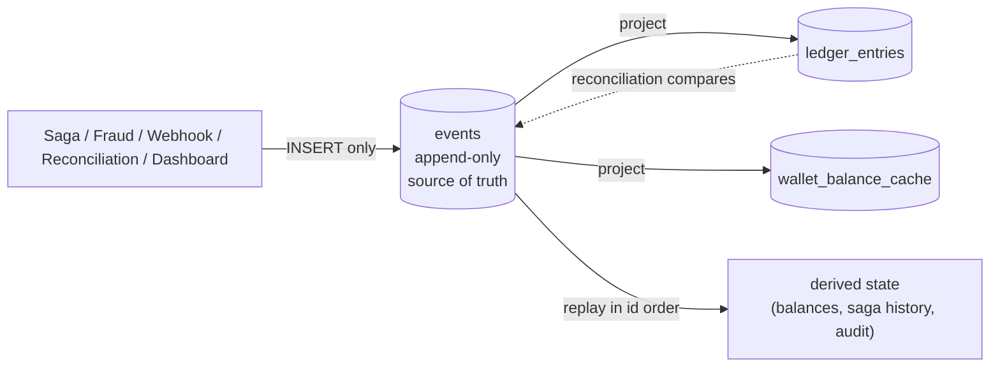

# 25: Event Store

> **What this is.** The deep dive on RRQ's event store: why it exists, what makes it append-only, how it serves as both source-of-truth and audit log, and how event sourcing differs from CRUD.
>
> **Reading time.** ~18 minutes.
>
> **Prerequisites.** [`../02-INVARIANTS.md`](../02-INVARIANTS.md) (specifically I1, I4, I6), [`21-SAGAS.md`](21-SAGAS.md).

---

## What the event store is

The event store is a single Postgres table: `events`. Every state change in RRQ that anyone might want to know about, retrospectively or for replay, produces a row in this table. Once a row exists, it is never updated and never deleted.



Writes only ever append to `events`. Everything a reader sees, a balance, a saga's history, an audit trail, is either a projection maintained from the event stream or a replay computed on demand. The table is the one source of truth; the rest is derived.

There are no other tables that "own" the source of truth. The `wallets` table stores wallet metadata (status, currency, merchant) but not balance, balance is derived from `ledger_entries`, which is itself derived from events. The `saga_state` table tracks where a saga is *right now* but the history is in events. The `webhook_deliveries` table tracks pending retries but the record of what was attempted is in events.

This is the **event sourcing** pattern: state is a *projection* over a stream of immutable events. To know the current state, you replay events. To know what happened, you read events. To know what *should have* happened, you look at the event types and their payloads.

A reviewer asking "where is the source of truth?" should hear: the `events` table. Everything else is a cache, projection, or derived view.

---

## Why event sourcing and not CRUD

The conventional alternative is **CRUD**: each entity is a row, and operations mutate the row directly. A transfer updates the source wallet's balance, updates the destination wallet's balance, and inserts a transaction record for audit. The current balance is just `SELECT balance FROM wallets WHERE id = ?`.

CRUD is simpler. It's what most application code looks like. Why would a system reach for event sourcing instead?

Three reasons specific to RRQ:

**1. Reconciliation requires a reproducible history.** The reconciliation job (`docs/services/14-RECONCILIATION.md`) verifies invariants by replaying the event log. With CRUD, there's no log to replay, the previous state is gone the moment it's overwritten. The transaction history table can be used, but it's a separate concern from the wallet balance; the two can diverge, and reconciliation has nothing to verify against.

With event sourcing, the events *are* the history. Replaying them produces the derived balance. If the derived balance disagrees with the materialized balance (in `ledger_entries`), there's a bug. The reconciliation has something concrete to verify.

**2. The audit story is built-in.** Payment systems are audited. Auditors want "show me everything that affected wallet X between dates D1 and D2." With CRUD, you query a transactions table that you hope wasn't tampered with. With event sourcing, you query the event log that *by design* cannot have been tampered with (it's append-only, with database-level permissions preventing UPDATE/DELETE).

The events table is the audit log. There's no separate audit system; the system's records *are* the audit.

**3. Debugging is forensic.** When something goes wrong, you can reconstruct what the system saw and did. An operator can replay a wallet's events to see how it arrived at its current state, step by step. With CRUD, you have current state plus a transaction table, but the transaction table may not record everything (e.g., a wallet freeze without a corresponding transaction).

For a payment system, these benefits are not optional. They're the reason event sourcing is the right pattern.

---

## The cost of event sourcing

Event sourcing isn't free. Two real costs:

**Computing current state is more expensive.** "What's the current balance of wallet W?" becomes "SUM all events affecting W." For a wallet with 100 lifetime events, this is fast. For a wallet with 1 million events, this is slow.

RRQ mitigates with a **projection**: `ledger_entries`. Every event that affects a balance produces a corresponding ledger entry. The current balance is `SUM(amount) FROM ledger_entries WHERE wallet_id = ?`, which is the same answer as replaying events but with one summed row per event rather than one event per replay. Indexed appropriately, this is fast even for hot wallets.

The projection is *not* the source of truth, it's derived from events. If it diverges from events, reconciliation surfaces the divergence. The projection is the read-side optimization; events are the write-side authority.

For even hotter wallets where ledger summation is also slow, a further projection (`wallet_balance_cache`) materializes the current balance as a single number. Updated asynchronously from ledger entries; refreshed on a few-second cadence. Used for dashboard reads where staleness is acceptable.

**Storage grows monotonically.** Events are never deleted. Storage usage increases linearly with system activity. At 1,000 events/sec sustained, that's ~86M events/day. At a few hundred bytes per event (Postgres row overhead included), that's ~50 GB/day. Per year, multiple terabytes.

At RRQ's scope, this is fine, storage is cheap. For long-running production, the strategies are: cold-storage archival of old events (move events older than N years to cheaper storage; keep recent events in hot Postgres), or partitioning by date (Postgres declarative partitioning, drop old partitions after archival).

RRQ doesn't implement either. The capacity headroom is huge; the system would run for years before storage became a concern. It is a known scaling path, not built.

---

## The schema

The `events` table:

```sql
CREATE TABLE events (
    id              BIGSERIAL PRIMARY KEY,
    event_id        TEXT NOT NULL UNIQUE,
    event_type      TEXT NOT NULL,
    aggregate_type  TEXT NOT NULL,
    aggregate_id    TEXT NOT NULL,
    correlation_id  TEXT,
    causation_id    TEXT,
    payload         JSONB NOT NULL,
    occurred_at     TIMESTAMPTZ NOT NULL,
    created_at      TIMESTAMPTZ NOT NULL DEFAULT NOW()
);
```

Every column has a specific job:

**`id`**, `BIGSERIAL`. Monotonically assigned by Postgres at INSERT. This is the *ordering* key. Events are ordered globally by `id`. Within an aggregate, the order of events is the order of their `id`s.

The `id` is not a timestamp. Wall-clock times can drift (NTP corrections, clock skew across machines); `id` is strictly monotonic by virtue of being database-generated. For any ordering that matters, RRQ uses `id`. (Reconciliation reads events ORDERED BY id, not by occurred_at.)

**`event_id`**, a ULID, application-generated. This is the *identity* key. Used as a foreign key from `ledger_entries`, used in webhook payloads, used by the merchant for deduplication. ULIDs are lexicographically sortable by time (the first few characters encode milliseconds) but globally unique without coordination.

The unique constraint on `event_id` is one of RRQ's idempotency anchors. The Saga Worker generates `event_id` before INSERT; if the worker retries and tries to insert the same event_id twice, the constraint rejects it. The retry recognizes this and treats the event as already written.

**`event_type`**, a string like `"transfer.completed"` or `"ledger.debit_applied"`. The naming convention is `<aggregate-or-domain>.<verb>`. Used for filtering, projections, replay logic.

Event types are stable. Adding a new type is backward compatible (existing readers ignore unknown types). Changing an existing type's schema is not, you bump the version (e.g., `transfer.completed.v2`) and migrate consumers. See "schema evolution" below.

**`aggregate_type`** and **`aggregate_id`**, the entity this event is about. `aggregate_type` is one of `"wallet"`, `"saga"`, `"merchant"`, `"webhook"`. `aggregate_id` is the entity's ID.

The (aggregate_type, aggregate_id) pair identifies the entity. Events for the same entity have the same pair. Replay-per-entity queries use this; reconciliation uses `WHERE aggregate_type = 'wallet'`.

**`correlation_id`**, the saga_id that triggered this event chain. Events from the same saga share a correlation_id. Useful for "show me everything that happened during this transfer."

**`causation_id`**, the immediate-predecessor event_id. The event that *caused* this one. Forms a chain through the saga's lifecycle.

The distinction: correlation groups events into a logical unit (a saga); causation describes the directed graph of events within that unit. Both are useful; both are recorded.

**`payload`**, the event-specific data. JSONB rather than a strict schema per type, because different events have different shapes. The application code knows what shape to expect based on `event_type`.

JSONB has indexing options (GIN indexes for arbitrary queries; expression indexes for specific extractions). RRQ doesn't use either; queries are by aggregate or correlation, not by payload contents.

**`occurred_at`**, when the event semantically happened. Set by the application at write time. May lag `created_at` if there's any computation between "I noticed this" and "I wrote to the database." Both are recorded so debugging is precise.

**`created_at`**, when the row was committed. Mostly for ops: latency analysis, finding events written in a specific window.

### Indexes

Three indexes serve the access patterns:

```sql
CREATE INDEX events_aggregate_idx
    ON events (aggregate_id, id);

CREATE INDEX events_type_time_idx
    ON events (event_type, occurred_at);

CREATE INDEX events_correlation_idx
    ON events (correlation_id) WHERE correlation_id IS NOT NULL;
```

Each is justified by a specific query:

- **`aggregate_idx`**: per-aggregate replay. "All events for wallet X in order." Used by reconciliation, balance derivation, audit queries.
- **`type_time_idx`**: time-window-by-type. "All `transfer.completed` events between 2026-05-01 and 2026-05-02." Used by reporting and reconciliation.
- **`correlation_idx`**: saga-scope queries. "All events for saga S." Used by the Admin Dashboard to show a saga's full event history.

Each index has a cost: writes are slightly slower (one index update per insert per index), storage is larger. The three above are the minimum for the queries we actually run; additional indexes would need justification by a specific query.

### Permissions

A separate migration grants the application's Postgres user `INSERT` and `SELECT` on `events`, but explicitly *not* `UPDATE` or `DELETE`:

```sql
GRANT SELECT, INSERT ON events TO rrq_app;
-- Notable absences: UPDATE, DELETE.
```

This is the database-level enforcement of invariant I6 (immutable history). A bug in application code that tries to update or delete an event fails with a permission error rather than silently corrupting history. The DBA role can still do anything (necessary for migrations), but application code cannot.

Today the single Postgres user does everything (operational simplicity); the role-based separation is documented as a hardening step. The principle is correct; the implementation is not yet in place.

---

## Event types in RRQ

The full event catalog lives in `docs/appendices/41-EVENT-CATALOG.md` (coming in Pass 4). A summary of the categories:

**Job lifecycle.** `job.requested`, `job.completed`, `job.failed`. The high-level "what did the merchant ask for, what happened."

**Ledger.** `ledger.debit_applied`, `ledger.credit_applied`, `ledger.debit_reversed`. The fine-grained "money moved here." Paired across wallets within a saga.

**Saga lifecycle.** `saga.validated`, `saga.locked`, `saga.completed`, `saga.failed`, `saga.compensating`, `saga.compensated`, `saga.dead_lettered`. The saga's progress through its state machine.

**Wallet.** `wallet.frozen`, `wallet.unfrozen`, `wallet.created`. The wallet-level state changes (separate from balance changes).

**Webhook.** `webhook.delivered`, `webhook.failed`. The delivery outcomes for merchant notifications.

**Fraud.** `fraud.suspected`. When a velocity threshold is exceeded.

**Reconciliation.** `reconciliation.completed`, `reconciliation.alert`. The nightly verification's results.

**Operator.** `operator.action`. Every audit-relevant action from the Admin Dashboard (DLQ replay, wallet freeze, saga abort).

Every event type has:
- A stable name.
- A stable schema (Protobuf message; see `proto/events/events.proto`).
- A documented set of emitters (which services produce it) and consumers (which services / projections read it).
- A documented invariant relationship (which invariants does it enforce or verify).

The catalog is a contract. Adding a new type is fine; changing an existing type's schema requires a migration plan.

---

## Schema evolution

Events are written today and replayed years later. The schema in between can change. The strategies for managing this:

**Backward-compatible changes only.** Adding new fields to an event payload is backward compatible (old readers ignore the new fields). Removing fields is not. Renaming fields is not. Changing field types is not.

**Versioned event types when breaking changes are unavoidable.** If `transfer.completed` needs a fundamentally different shape, emit `transfer.completed.v2` going forward. Keep `transfer.completed` readable for historical replay. Consumers handle both types until enough history has accumulated under v2 that v1 events can be aged out.

**Schema registries (not used).** A mature event-sourced system might use a schema registry (Confluent's Schema Registry is the canonical example) where every event's schema is recorded by version, and the consumer fetches the schema dynamically. RRQ doesn't need this, the Protobuf definitions in `proto/events/events.proto` are the de facto schema registry, version-controlled in Git.

**Payload serialization choices.** RRQ stores payloads as JSONB (Postgres native JSON, indexed and queryable). The application produces the JSONB from Protobuf messages, which serves as the canonical schema. Two serializations of the same event are equivalent if their Protobuf round-trips agree.

The trade-off: JSONB lets us read events with simple SQL (`SELECT payload->>'amount' FROM events`); Protobuf gives us strict schemas in code. Both. The two-format approach is well-trodden in event-sourced systems.

---

## Replay semantics

Replay is the operation: given a stream of events, compute a derived state.

For RRQ, the canonical replays are:

**Balance derivation for a wallet.**

```python
def derive_balance(wallet_id):
    balance = 0
    for event in events_for(wallet_id, order_by_id_ascending):
        if event.type == "ledger.debit_applied":
            balance -= event.payload.amount
        elif event.type == "ledger.credit_applied":
            balance += event.payload.amount
        elif event.type == "ledger.debit_reversed":
            balance += event.payload.amount
        # Other event types don't affect balance.
    return balance
```

The function is pure: same events produce same balance. Idempotent: running it twice produces the same answer. Order-dependent: the replay must be in `id` order.

This function is the core of reconciliation. It runs once per wallet per night. It must agree with the `ledger_entries` sum; if it doesn't, that's an alert.

**Saga history reconstruction.**

```python
def saga_history(saga_id):
    return events_for(correlation_id=saga_id, order_by_id_ascending)
```

Just a query, no computation. The result is a chronological list of everything that happened during the saga. Used by the Admin Dashboard's saga detail view.

**Wallet activity audit.**

```python
def wallet_activity(wallet_id, since, until):
    return events_for(wallet_id, between(since, until))
```

For auditors or operators investigating a wallet's recent state changes.

### Replay performance

Replay reads many rows. The performance depends on the access pattern:

- **Aggregate-scoped replay** (e.g., one wallet's events) uses `events_aggregate_idx` and is fast: index range scan, sequential row reads, no full table scan.
- **Time-window replay** (e.g., all events in the last 24 hours) uses `events_type_time_idx`. Cardinality matters, replaying *all* event types in a time window is slow; filtering to a specific type is fast.
- **Pure scans** (no filter, no order) are slow. We don't have a query pattern that requires this, by design.

Reconciliation's "scan all wallets" is implemented as "for each wallet, scan its events" rather than "scan everything and group by wallet." The first uses the index; the second is a full table scan.

---

## What goes in the event log and what doesn't

Not every state change is an event. The rule of thumb: **events are facts about the world that matter to someone later.**

What IS an event:
- A transfer completed.
- A wallet was frozen.
- A webhook was delivered.
- An operator took an action.

What is NOT an event:
- A worker started up.
- A request was rate-limited.
- A query took 500ms.

The first set are *business facts*; the second are *operational signals*. Operational signals belong in logs and metrics, not the event log. Mixing them dilutes the event log's value as a business-fact source.

The distinction sometimes feels arbitrary. A useful heuristic: "would I want this event in a year, when I'm trying to reconstruct a customer's history?" Yes → event. No → log line.

---

## What about CQRS?

CQRS, Command Query Responsibility Segregation, is a frequent companion to event sourcing. The idea: separate the write model (commands modify the event log) from the read model (queries hit projections).

RRQ implements a soft CQRS:

- **Writes** go through the event log. Commands (transfer, payout) produce events; events are the durable record.
- **Reads** for hot paths (current balance, saga state) hit projections, not events. The projections are denormalized for the access pattern.

This isn't textbook CQRS, we don't have completely separate command and query subsystems, and many reads do hit the event log (reconciliation, audit, replay). What we have is the *spirit* of CQRS: writes and reads are optimized differently, and the event log is the bridge.

A more strict CQRS would have:
- Commands defined as their own types (`TransferCommand`, `PayoutCommand`).
- Command handlers separate from saga step handlers.
- A formal "command bus" routing commands to handlers.

RRQ doesn't go that far. The complexity-benefit ratio isn't worth it at our scale. The simpler design (events are the only formal layer; commands are implicit in the API request) works fine.

---

## A few interesting properties

### Replayability and bug fixing

If a bug in saga logic produces incorrect derived state for a period, the bug fix doesn't immediately repair the affected data, it only prevents the bug from recurring. The historical data is still wrong.

With event sourcing, you have an option not available in CRUD: **replay the events with the fixed logic to recompute the derived state.** Drop the broken projection, re-run the projector, get correct state.

This is the event sourcing superpower. Hard to overstate how valuable it is when a bug has affected weeks of data.

RRQ doesn't implement bulk replay tooling (it's not needed yet), but the data structure supports it. The events are the source of truth; projections can be regenerated.

### Time-travel queries

"What was the balance of wallet W at 2026-04-01 14:00:00?"

In CRUD: probably unknowable. The wallet's balance has been overwritten dozens of times since then. The transaction log might let you reconstruct it, if you trust the log.

With event sourcing: trivial. Replay events for W where `id <= max(id WHERE occurred_at < '2026-04-01 14:00:00')`. The wallet's balance at that moment is the partial sum.

This isn't an academic curiosity. Auditors ask these questions. Customer support asks these questions. Disputes about "what did the wallet look like when I checked?" can be answered with precision.

### The "event store is the source of truth" discipline

This is the discipline that makes everything else work: **never mutate state outside of events.**

Concretely: if an operator manually fixes a discrepancy by running a direct `UPDATE` on `ledger_entries`, they have broken the discipline. The next reconciliation might still show the discrepancy (if events don't agree with the fixed ledger), or it might pass quietly (if the ledger fix happened to match the events) but the audit trail is incomplete.

The right way for an operator to fix a discrepancy: insert an `adjustment` event with the operator's identity and reasoning. The event makes the fix visible in the audit log. The ledger projection picks up the adjustment naturally.

The discipline is partly enforced by database permissions (the app role can't UPDATE/DELETE events) but mostly by convention and code review. Violations are bugs to be caught.

---

## A note on storage choice

RRQ stores events in Postgres. Some event-sourced systems use specialized event stores (EventStoreDB, Kafka with infinite retention, Pravega). Why Postgres?

For a system at RRQ's scale: Postgres is sufficient and operationally simple. Adding a specialized event store adds a deployment, a learning curve, a fault domain, and a query language. The benefit, write throughput beyond what Postgres can handle, doesn't apply at our scale.

For a system at much larger scale: a specialized event store might be necessary. The choice would be informed by specific bottlenecks (write throughput, retention, replication). For RRQ, Postgres is the right tool. The schema is portable; if we ever outgrow Postgres, the data model transfers to an event store.

Kafka deserves a specific mention. Kafka with log compaction is sometimes proposed as the event store. The downside: Kafka's strengths (high-throughput streaming, partitioned consumption) don't match an event store's needs (range queries, exact retrieval by ID, point-in-time replay). Kafka is excellent as a transport; less ideal as a long-term store. RRQ uses Redis Streams for transport and Postgres for storage, different tools for different jobs.

---

## Testing the event store

The tests that matter:

**Idempotency of writes.** Attempt to insert the same event_id twice; assert the constraint rejects. Used to verify saga step retries don't double-write.

**Ordering.** Insert events for a wallet across multiple connections concurrently; read them back; assert `id` order matches insertion order.

**Permissions.** Attempt `UPDATE` or `DELETE` on events from the app role; assert permission error (in production setup).

**Replay correctness.** Construct a known sequence of events for a wallet; replay; assert derived balance matches expected.

**Schema evolution.** Write events with a new optional field; read them back with code that doesn't know about the field; assert read succeeds.

These tests catch the regressions that would invalidate the event store's claims. Other claims, "events are useful for audit", are operational tests, validated by using the event store for audits in production.

---

## Where to read next

- The reconciliation that uses event replay → [`../services/14-RECONCILIATION.md`](../services/14-RECONCILIATION.md)
- The full event catalog → [`../appendices/41-EVENT-CATALOG.md`](../appendices/41-EVENT-CATALOG.md)
- Greg Young's introduction to event sourcing: <https://www.youtube.com/watch?v=8JKjvY4etTY>
- Martin Fowler's article: <https://martinfowler.com/eaaDev/EventSourcing.html>

---

*Pass 3 of the architecture series. Last updated pre-implementation.*
