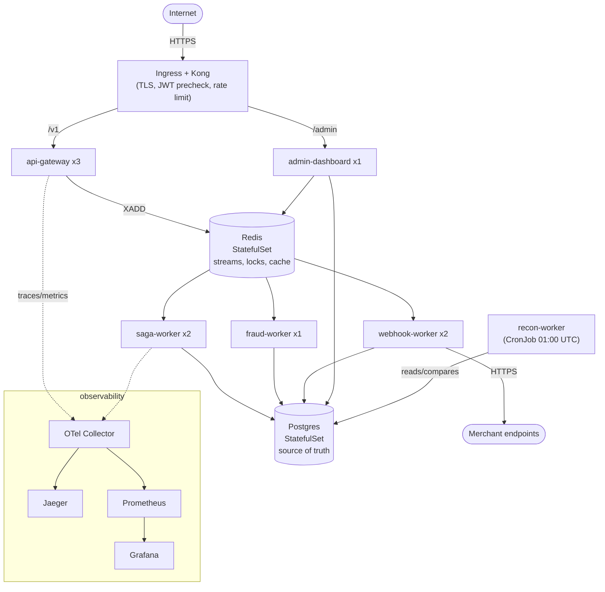

# 29: Kubernetes Deployment

> **What this is.** How RRQ deploys: the Kubernetes design, the reasoning behind each piece, and the manifests in `/k8s/`.
>
> **Reading time.** ~12 minutes.
>
> **Status.** Manifests designed; not yet applied to a cluster. See [`../../STATUS.md`](../../STATUS.md).

---

## Why Kubernetes

RRQ deploys to Kubernetes. The system's shape maps cleanly onto Kubernetes primitives: a set of independently scaled stateless workers (saga, webhook, fraud) in front of shared Postgres and Redis, a batch reconciliation job, and an edge that needs TLS, routing, and rate limiting. That becomes a `Deployment` per worker, a `CronJob` for reconciliation, an `HorizontalPodAutoscaler` keyed on Redis Stream lag, and an edge gateway for north-south traffic.

The edge is **Kong**, sitting in front of the custom API Gateway. Kong handles TLS termination, a coarse JWT signature check, and per-merchant rate limiting; it then routes to the API Gateway service, which keeps the idempotency claim and the durable hand-off to Redis Streams. Everything below is the topology the `/k8s/` manifests describe.

---

## The deployment shape

Each RRQ service runs as a Kubernetes `Deployment`:

```
Deployment           Replicas  Purpose
kong                  2        edge gateway; TLS, JWT pre-check, rate limiting
api-gateway           3        HTTP frontend; behind Kong
saga-worker           2        consumes job stream
webhook-worker        2        consumes notify streams (handles all 16 shards)
fraud-worker          1        consumes job stream as separate group
recon-worker          1        runs as CronJob, not Deployment (one-shot)
admin-dashboard       1        web UI; behind Service+Ingress (low-traffic)
```

Plus stateful dependencies:
- Postgres (StatefulSet, single replica in-cluster; a managed Postgres is the production-grade option)
- Redis (StatefulSet, single replica in-cluster; a managed Redis is the production-grade option)
- Jaeger, Prometheus, Grafana (separate deployments for observability)

The api-gateway has 3 replicas for redundancy and load. Workers have 2 replicas each (workers are stateless; replicas split consumer group load). Reconciliation runs as a CronJob at 01:00 UTC. The Admin Dashboard runs as its own single-replica Deployment behind a Service and Ingress, not as a binary you run ad hoc.



---

## Health probes, liveness and readiness

Every Deployment specifies two probes:

**Liveness probe**, "is the pod alive?" If it fails repeatedly, K8s kills and restarts the pod.

**Readiness probe**, "is the pod ready for traffic?" If it fails, K8s removes the pod from the load balancer pool but doesn't restart.

A common mistake: using the same probe for both. Bad because:
- If readiness is too aggressive, pods get removed from rotation unnecessarily (e.g., during a slow start-up).
- If liveness is too aggressive, pods get killed unnecessarily, aborting in-flight work.

RRQ's probe design:

**API Gateway:**
- Liveness: `GET /health`, returns 200 if the process is alive. Doesn't check downstream dependencies.
- Readiness: `GET /ready`, returns 200 only if Redis and Postgres connections are healthy. Returns 503 otherwise (so K8s drains the pod until it recovers).

**Saga Worker, Webhook Worker, Fraud Worker:**
- Liveness: an internal heartbeat. The consumer loop updates a timestamp every iteration; the probe checks the timestamp is recent (< 30s old). Stuck workers (e.g., deadlock) eventually fail liveness and are restarted.
- Readiness: Redis and Postgres connections plus consumer-lag check. If consumer lag is critically high (worker is overwhelmed), readiness fails to slow new message claims. (Actually, this is subtle, readiness doesn't directly affect Redis Streams consumer group membership. The pod stays in the group regardless of readiness. Use lag as a metric/alert, not a readiness signal. This is a real distinction.)

**Reconciliation:** CronJob; no probes. Runs once, exits.

```yaml
livenessProbe:
  httpGet:
    path: /health
    port: 8080
  periodSeconds: 10
  failureThreshold: 3
readinessProbe:
  httpGet:
    path: /ready
    port: 8080
  periodSeconds: 5
  failureThreshold: 2
```

---

## Graceful shutdown, preStop and terminationGracePeriod

When K8s wants to shut down a pod (rolling update, scale-down, eviction):

1. Pod receives SIGTERM.
2. The application has `terminationGracePeriodSeconds` (default 30s) to clean up.
3. If still running, SIGKILL.

For RRQ's saga worker, a clean shutdown means: finish the current saga step (so the saga is in a consistent state), exit. Don't claim new messages.

The challenge: the consumer is blocked on `XREADGROUP` with a 2-second timeout. SIGTERM doesn't interrupt blocking calls cleanly in all language runtimes.

The solution: a `preStop` hook that runs *before* SIGTERM. The hook signals the consumer to stop claiming new messages (e.g., by writing to a stop channel). The consumer drains in-flight work and exits.

```yaml
spec:
  containers:
  - name: saga-worker
    lifecycle:
      preStop:
        exec:
          command: ["/bin/sh", "-c", "kill -USR1 1"]
    # ...
  terminationGracePeriodSeconds: 60
```

The application catches SIGUSR1 (using it as "begin shutdown" signal), stops the main loop, finishes any in-flight saga step, exits. The 60-second grace period accommodates the longest expected single step plus margin.

Without this pattern, K8s would SIGKILL pods that are mid-saga, leaving messages unacked (eventually XAUTOCLAIM picks them up, correct, but more disruption than necessary).

---

## Horizontal Pod Autoscaler

The saga worker scales based on Redis Stream consumer lag:

```yaml
apiVersion: autoscaling/v2
kind: HorizontalPodAutoscaler
metadata:
  name: saga-worker
spec:
  scaleTargetRef:
    apiVersion: apps/v1
    kind: Deployment
    name: saga-worker
  minReplicas: 2
  maxReplicas: 10
  metrics:
  - type: External
    external:
      metric:
        name: redis_stream_lag
        selector:
          matchLabels:
            stream: stream:jobs
      target:
        type: AverageValue
        averageValue: "100"
```

When consumer lag exceeds 100 messages on average, scale up. When lag is low, scale down. The metric is exposed via Prometheus Adapter (which exposes Prometheus metrics as Kubernetes external metrics).

Tuning:
- **`averageValue: 100`** is a starting point. Too low: aggressive scaling, more pods than needed. Too high: lag builds before scaling triggers.
- **`maxReplicas: 10`** is a guard against runaway scaling. At some point the bottleneck becomes Postgres or Redis, not workers; adding more workers doesn't help.
- **`minReplicas: 2`** for redundancy. Even with low load, we run two pods to survive single-pod failure.

---

## Resource requests and limits

Every container specifies CPU and memory:

```yaml
resources:
  requests:
    cpu: 100m
    memory: 256Mi
  limits:
    cpu: 500m
    memory: 512Mi
```

**Requests** are what K8s reserves for scheduling. Pods are placed on nodes with enough requested capacity.
**Limits** are hard caps. Containers exceeding the CPU limit are throttled; containers exceeding memory are killed (OOM).

For RRQ:
- API Gateway: low CPU, low memory. Most work is I/O-bound.
- Saga Worker: moderate CPU (more during high-throughput), moderate memory (saga state is small).
- Webhook Worker: moderate; the per-merchant breaker state and the partial deliveries in memory.
- Fraud Worker: variable; depends on active wallet count (each active wallet has a task with channel buffer).
- Reconciliation: high CPU during run (the work is CPU-bound); high memory if streams aren't used carefully.

The numbers above are starting points. Benchmarks should inform actual production sizing.

Without resource specifications, benchmarks are meaningless, pods compete for resources unpredictably, and one node's pods affect another's throughput. The K8s deployment requires explicit sizing.

---

## ConfigMaps and Secrets

Configuration lives in ConfigMaps; secrets in Kubernetes Secrets.

```yaml
apiVersion: v1
kind: ConfigMap
metadata:
  name: rrq-config
data:
  postgres_host: "postgres.rrq.svc.cluster.local"
  redis_host: "redis.rrq.svc.cluster.local"
  log_level: "info"
  trace_sample_rate: "1.0"
---
apiVersion: v1
kind: Secret
metadata:
  name: rrq-secrets
type: Opaque
stringData:
  postgres_password: "${POSTGRES_PASSWORD}"  # injected at apply time
  jwt_secret: "${JWT_SECRET}"
```

Deployments reference these via environment variables. Pods get the config injected at startup.

The secrets are managed externally (via Vault, AWS Secrets Manager, Sealed Secrets, External Secrets Operator). The design uses `External Secrets Operator` so secrets in K8s are synced from a real secret store; raw secrets are never in the manifest YAML.

---

## Networking, Services and Ingress

**Internal services** are exposed via ClusterIP Services. Other pods address them by DNS name: `api-gateway.rrq.svc.cluster.local`.

**External traffic** (merchants reaching the API) hits **Kong** at the edge. Kong terminates TLS, does a coarse JWT signature check, applies per-merchant rate limiting, and routes `/v1` to the `api-gateway` Service. Kong is configured through the Kong Ingress Controller:

```yaml
apiVersion: networking.k8s.io/v1
kind: Ingress
metadata:
  name: rrq-api
  annotations:
    cert-manager.io/cluster-issuer: letsencrypt-prod
    konghq.com/plugins: rrq-rate-limit,rrq-jwt
spec:
  ingressClassName: kong
  rules:
  - host: api.rrq.example
    http:
      paths:
      - path: /v1
        pathType: Prefix
        backend:
          service:
            name: api-gateway
            port:
              number: 80
  tls:
  - hosts:
    - api.rrq.example
    secretName: rrq-tls-cert
```

TLS termination is at Kong, which obtains certificates via cert-manager + Let's Encrypt. The custom API Gateway still owns the parts Kong cannot: the idempotency claim (atomic `SETNX`) and the durable `XADD` to Redis Streams. Internal traffic stays within the cluster network.

---

## CronJob for Reconciliation

```yaml
apiVersion: batch/v1
kind: CronJob
metadata:
  name: recon-worker
spec:
  schedule: "0 1 * * *"            # 01:00 UTC daily
  concurrencyPolicy: Forbid        # don't start a new run if one is in progress
  successfulJobsHistoryLimit: 7    # keep records of last 7 successful runs
  failedJobsHistoryLimit: 30       # keep records of last 30 failed runs
  jobTemplate:
    spec:
      template:
        spec:
          containers:
          - name: recon-worker
            image: rrq/recon-worker:latest
            args: ["run", "--window", "24h"]
            resources:
              requests:
                cpu: "1"
                memory: 512Mi
              limits:
                cpu: "4"
                memory: 2Gi
          restartPolicy: OnFailure
```

`concurrencyPolicy: Forbid` is critical: it prevents overlapping reconciliation runs. If yesterday's run is somehow still going when today's would start, K8s defers today's. Without this, two concurrent reconciliation passes could compete for the advisory lock and one would simply fail loudly, wasted work.

`restartPolicy: OnFailure` retries a failed run. If the run keeps failing, the failed jobs accumulate (visible via `kubectl get jobs`) and operators investigate.

---

## StatefulSets for stateful dependencies

Postgres and Redis run as StatefulSets. The distinguishing feature: stable pod names (`postgres-0`, `redis-0`) and stable persistent volumes (don't get reshuffled between pods on restart).

For production, you'd typically *not* run Postgres in-cluster, you'd use a managed service (RDS, Cloud SQL, AlloyDB). The complexity of running databases in K8s is real; managed services handle it better.

For development/staging, in-cluster Postgres works. The StatefulSet spec includes:
- PVC template (each pod gets its own persistent volume).
- Init container for first-time setup (migrations).
- Connection pool sidecar (PgBouncer) for production-grade connection management.

The design assumes managed Postgres in production and in-cluster Postgres for dev/staging.

---

## A note on operational maturity

The design above describes a "do it right" deployment. The reality of an early-stage system is more pragmatic, you might run a single Postgres on a single VM, you might skip the HPA initially, you might not have cert-manager set up. That's fine; the manifests support starting small and growing into the full shape.

The design document exists to show:

1. The end-state shape of the deployment.
2. Each component justified by its role (probes for health, HPA for elasticity, CronJob for batch, etc.).
3. What you'd add as the system matures.

A reviewer asking "how does this scale?" gets a real answer pointing to the manifests and explaining the moving parts.

---

## Where to read next

- The operations playbook that runs on top of this → [`28-OPERATIONS.md`](28-OPERATIONS.md)
- The actual manifests → [`/k8s/`](../../k8s/) (in the repo)
- Kubernetes Patterns book by Roland Huss and Bilgin Ibryam for systemic background

---

*Pass 4 of the architecture series. The deployment target for RRQ.*
