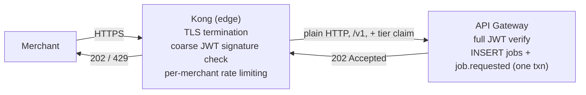

# 10: API Gateway

## What it does

The API Gateway is the _only_ synchronous component in the merchant's request path. Everything else in RRQ is asynchronous; the gateway exists to convert synchronous merchant requests into durable asynchronous work as quickly as possible.

It does five things (with TLS already terminated by Kong at the edge — see below):

1. **Receives** the forwarded request from Kong.
2. **Authenticates and authorizes**: full JWT verification (Kong did only a coarse signature check), plus a check that the merchant is `active` and **owns the `from_wallet`**. Ownership is immutable, so it's a cacheable `wallet → merchant_id` lookup; this is _authorization_, not a business rule, and it upholds **I9** by rejecting a cross-tenant request with `403 WALLET_NOT_OWNED` before any work is recorded. Mutable wallet state (frozen status, balance) is left to the Ledger Worker's posting transaction.
3. **Validates** the request structure (well-formed JSON, required fields, syntactically valid wallet IDs and positive amounts). It does _not_ validate business rules — that's the posting transaction's job.
4. **Claims idempotency and records the job** in **one Postgres transaction**: insert the `jobs` row (with `UNIQUE (merchant_id, idempotency_key)`) and the `job.requested` outbox event together. The commit is the durability boundary.
5. **Returns `202 Accepted`** with the `job_id`.

That's the entire job. The gateway never waits for the posting; it doesn't check balances or score fraud. Every operation it skips is one that cannot contribute latency or coupled-failure risk to the merchant's request.

The design tension is **speed vs. durability**. Speed: respond in under 50 ms p99. Durability: never lose an accepted request. The reconciliation: the only durable write in the request path is the single transaction at step 4, and after it commits the gateway considers its job done. Because that write is one atomic transaction, there is no half-accepted state — it either committed (and the job is owned by the system) or it didn't (and the merchant retries).

The gateway holds no per-request durable state of its own, so it runs as **≥2 stateless replicas (3 by default) behind Kong**, autoscaled by an HPA. Losing a gateway pod loses nothing — anything not committed to Postgres was never accepted. See [`../03-SCALING-AND-AVAILABILITY.md`](../03-SCALING-AND-AVAILABILITY.md).

---

## The edge: Kong in front

The gateway does not sit on the raw internet. **Kong** is the edge gateway in front of it, and the split is deliberate:



| Concern | Owner | Why |
| --- | --- | --- |
| TLS termination | Kong | Generic edge work; no reason to hand-roll it. |
| Rate limiting (per `merchant_id`/`tier`) | Kong | Token bucket at the edge returns `429` before a request reaches the gateway. |
| Coarse JWT signature check | Kong | Reject obviously-bad tokens early. |
| **Full JWT verification, claims extraction** | **API Gateway** | The trust boundary for business identity. |
| **Idempotency claim + job recording (one Postgres txn)** | **API Gateway** | The correctness-critical part. No off-the-shelf gateway does this with the required transactional semantics; it is the reason the custom gateway exists. |

Everything below describes the **API Gateway**, the piece behind Kong.

---

## Inputs, outputs, guarantees

**Inputs**
- HTTPS request to `POST /v1/transfers`, `POST /v1/payouts`, `GET /v1/jobs/:id`, `GET /health`, `GET /ready`, `GET /metrics`.
- JWT bearer token (HS256, shared platform secret).
- `Idempotency-Key` header (required for POST; UUIDv4 from the merchant).

**Outputs**
- Successful POST: `202 Accepted` with `{ "job_id", "status": "pending", "_links": { "self": "/v1/jobs/..." } }`.
- Duplicate (same key, same body): the **same response as the original** — same `job_id`, with the job's current status (idempotent replay).
- Duplicate (same key, different body): `422` with `IDEMPOTENCY_KEY_REUSED_WITH_DIFFERENT_BODY`.
- Validation failure: `422` with field-level errors.
- Auth failure: `401`; cross-tenant `from_wallet`: `403 WALLET_NOT_OWNED`; frozen merchant: `403 MERCHANT_FROZEN`.
- Postgres unavailable: `503` (the merchant retries).
- Side effect: one `jobs` row + one `job.requested` outbox event.

**Guarantees**
- If the transaction commits, the gateway returns 202 and the system owns the work.
- If it does not commit, the gateway returns 5xx and **no `jobs` row exists**. The merchant retries safely.
- For any `(merchant_id, idempotency_key)`, exactly one `jobs` row is ever created, regardless of how many requests arrive with that key. This is **I3**, enforced by the `UNIQUE` constraint — durably, with no cache that could lose the claim.

**Non-guarantees**
- The gateway does not guarantee the transfer will succeed — only that it will be attempted.
- The gateway does not guarantee webhook delivery.
- The gateway does not guarantee key uniqueness _across_ merchants. Keys are scoped per-merchant.

---

## The mechanism

### Request lifecycle, in one diagram

```mermaid
sequenceDiagram
    autonumber
    participant M as Merchant
    participant G as API Gateway
    participant DB as Postgres

    M->>G: POST /v1/transfers + Idempotency-Key K
    G->>G: Parse + validate shape
    G->>G: Verify JWT, extract merchant_id
    G->>G: Authorize from_wallet ownership (cached) — else 403
    G->>DB: BEGIN
    G->>DB: INSERT jobs (..., request_hash) ON CONFLICT (merchant_id, idempotency_key) DO NOTHING
    alt row inserted (new key)
        G->>DB: INSERT events (job.requested, publish_topic='jobs')
        G->>DB: COMMIT
        G-->>M: 202 Accepted (job_id)
    else conflict (duplicate key)
        G->>DB: ROLLBACK; SELECT existing job
        alt request_hash matches
            G-->>M: same response as original (job_id + status)
        else request_hash differs
            G-->>M: 422 key reused with different body
        end
    end
```

Walk through it once slowly:

**Steps 1–3.** Parse JSON; validate fields, types, positive amount, supported currency, ULID-shaped wallet IDs. _Does not_ check that wallets exist or are active — the posting transaction does that under the row lock, so there's one source of truth for business validation.

**Step 4 (authorize).** Verify the JWT, extract `merchant_id`, and check that `from_wallet` is owned by it. Ownership is immutable, so this is served from a short-TTL in-process cache that falls through to Postgres on a miss; merchant status (`active`/`frozen`) is checked the same way. Both are authorization, not business logic.

**Step 5 (the critical operation).** One transaction: `INSERT INTO jobs (id, merchant_id, idempotency_key, request_hash, type, status) VALUES (…, 'pending') ON CONFLICT (merchant_id, idempotency_key) DO NOTHING`, and, if a row was inserted, `INSERT INTO events (…, 'job.requested', publish_topic='jobs')`, then `COMMIT`. The `request_hash` is `SHA-256(canonical_json(body))`, stored so a later duplicate can be checked for "same key, different body."

**The duplicate path.** If the insert affects zero rows, the key already exists. The gateway reads the existing job and compares hashes: a match returns the original response (idempotent replay — the merchant sees the same `job_id` whether it's still `pending` or already `completed`); a mismatch returns `422`.

This is the whole idempotency story, and it lives entirely in Postgres. There is no Redis cache, no `SETNX`, no `"processing:"` sentinel value, and no window where a crash could leave the key claimed-but-uncommitted — the claim and the job are the same atomic write.

### Why the durable claim matters

A faster-looking design would claim the key in a cache (`SETNX` in Redis) and produce the job to Kafka separately. RRQ deliberately doesn't, for two reasons:

1. **A cache can lose a recently-written claim** on a node failure, and a retry in that window double-executes — unacceptable for money. The claim must be as durable as the money.
2. **"Claim in cache, then produce to Kafka" is two writes** — a dual-write, which can leave the claim set but the job never produced (or vice versa). The single Postgres transaction makes the claim and the work-record atomic, and the **transactional outbox** ([→ `../deep-dives/25-EVENT-STORE-AND-PROJECTIONS.md`](../deep-dives/25-EVENT-STORE-AND-PROJECTIONS.md)) carries the job to Kafka afterward with no second write to lose.

---

## Happy path walk-through

A transfer of 5,000 NGN from wallet A to wallet B, merchant M:

1. Merchant sends `POST /v1/transfers` with `Idempotency-Key: 8e3f...`.
2. Gateway validates the body: amount=500000 kobo, currency=NGN, from=wal_A, to=wal_B.
3. Gateway verifies the JWT, extracts `merchant_id=m_M`, and confirms `m_M` owns `wal_A` (cache hit) and is `active`.
4. Gateway computes `request_hash = SHA256(canonical_json(body))` and `job_id = ULID()`.
5. Gateway runs the transaction: `INSERT jobs (job_id, m_M, 8e3f..., request_hash, 'transfer', 'pending') ON CONFLICT DO NOTHING` (1 row), then `INSERT events (job.requested, publish_topic='jobs', correlation_id=job_id)`, then `COMMIT`.
6. Gateway returns `202 Accepted { job_id, status: "pending" }`.
7. (Async) the outbox relay publishes `job.requested` to the Kafka `jobs` topic; the Ledger Worker posts the transfer.

By step 6 the merchant has their response. Step 7 happens entirely outside the request path.

---

## Failure walk-throughs

### F1: Postgres is unavailable when the transaction runs
The most consequential case, and it's clean. The `INSERT … COMMIT` fails; the gateway returns `503` and **nothing was written** (a transaction that doesn't commit leaves no trace). The merchant retries with the same key; when Postgres is back, the retry is processed as a fresh request. There is no half-claimed state to clean up — that's the advantage of folding the claim and the job into one transaction.

### F2: Two simultaneous requests with the same idempotency key
Both reach the `INSERT … ON CONFLICT DO NOTHING` at effectively the same time. Postgres serializes them on the unique index: exactly one insert succeeds (returns 1 row → proceeds to 202), the other affects 0 rows (→ reads the existing job and returns the same `job_id`). The race is resolved atomically and durably by the database. This upholds **I3**.

### F3: Different body, same idempotency key
Request A: transfer 5,000 with key K → job created. Request B: transfer 10,000 with key K. B's insert conflicts; the gateway reads the existing job, finds `request_hash` differs, and returns `422 IDEMPOTENCY_KEY_REUSED_WITH_DIFFERENT_BODY`. A real merchant-side bug, and the clear error helps them debug.

### F4: Slow merchant, request body never finishes uploading
The gateway has HTTP read timeouts (5 s headers, 10 s body). An idle connection is closed; no row is written; the merchant retries. Too short fails legitimate slow uploads; too long invites slowloris — 10 s is a working middle ground.

### F5: JWT valid but merchant is frozen
Authentication succeeds (the signature is valid; a frozen merchant can hold a JWT issued before the freeze), but the merchant's status is `frozen`/`closed`. The gateway checks status from its short-TTL cache (falling through to Postgres), and returns `403 MERCHANT_FROZEN`. The cache TTL (60 s) bounds the time between a freeze and the gateway honoring it.

---

## Code skeleton (Go reference)

Skeletons are for comprehension, not copying.

```go
// Package gateway implements the merchant-facing HTTP API.
//
// Invariants upheld here:
//   I3 (at-most-once execution per idempotency key), via the UNIQUE constraint.
//   I9 (tenant isolation), via the from_wallet ownership check.
// Invariants NOT enforced here (deferred to the Ledger Worker):
//   I1 (conservation), I2 (no negative balance).
package gateway

type Server struct {
    db        *pgxpool.Pool
    jwtSecret []byte
    authz     OwnershipCache // wallet→merchant + merchant status, short-TTL, in-process
    metrics   *Metrics
}

func (s *Server) handleTransfer(w http.ResponseWriter, r *http.Request) {
    var req TransferRequest
    body, err := readBody(r)
    if err != nil || decodeAndValidate(body, &req) != nil {
        writeError(w, 422, "VALIDATION", "")
        return
    }
    merchantID := middleware.MerchantIDFrom(r.Context())

    // I9: ownership is immutable → cacheable authorization.
    if !s.authz.Owns(r.Context(), merchantID, req.FromWallet) {
        writeError(w, 403, "WALLET_NOT_OWNED", "")
        return
    }

    key := r.Header.Get("Idempotency-Key")
    if key == "" {
        writeError(w, 400, "MISSING_IDEMPOTENCY_KEY", "")
        return
    }
    hash := sha256Hex(canonicalJSON(body))
    jobID := ulid.New()

    // One transaction: claim the key AND record the job + outbox event.
    inserted, existing, err := s.claimAndRecord(r.Context(), jobID, merchantID, key, hash, &req)
    if err != nil {
        writeError(w, 503, "STORE_UNAVAILABLE", "could not record job")
        return
    }
    if !inserted {
        if existing.RequestHash != hash {
            writeError(w, 422, "IDEMPOTENCY_KEY_REUSED_WITH_DIFFERENT_BODY", "")
            return
        }
        writeJSON(w, 202, acceptedFrom(existing)) // idempotent replay
        return
    }
    writeJSON(w, 202, AcceptedResponse{JobID: jobID, Status: "pending",
        Links: Links{Self: "/v1/jobs/" + jobID}})
}

// claimAndRecord is the heart of I3: the idempotency claim and the job record
// are the same atomic write, so there is no claimed-but-unrecorded window.
func (s *Server) claimAndRecord(ctx context.Context, jobID, merchantID, key, hash string,
    req *TransferRequest) (inserted bool, existing Job, err error) {

    tx, err := s.db.Begin(ctx)
    if err != nil {
        return false, Job{}, err
    }
    defer tx.Rollback(ctx)

    ct, err := tx.Exec(ctx, `
        INSERT INTO jobs (id, merchant_id, idempotency_key, request_hash, type, status)
        VALUES ($1, $2, $3, $4, 'transfer', 'pending')
        ON CONFLICT (merchant_id, idempotency_key) DO NOTHING`,
        jobID, merchantID, key, hash)
    if err != nil {
        return false, Job{}, err
    }
    if ct.RowsAffected() == 0 {
        existing, err = loadJob(ctx, tx, merchantID, key)
        return false, existing, err
    }

    // Same transaction: write the outbox event the relay will publish to Kafka.
    if _, err = tx.Exec(ctx, `
        INSERT INTO events (event_id, event_type, aggregate_type, aggregate_id,
                            correlation_id, payload, occurred_at, publish_topic)
        VALUES ($1, 'job.requested', 'job', $2, $2, $3, NOW(), 'jobs')`,
        ulid.New(), jobID, jobPayload(req)); err != nil {
        return false, Job{}, err
    }
    return true, Job{}, tx.Commit(ctx)
}
```

Worth understanding:

- **Middleware order matters.** Auth runs first (to extract `merchant_id`), then the handler. The idempotency key is scoped by `merchant_id`, so auth must precede the claim.
- **The claim and the work-record are one write.** This is what removes the dual-write and the claimed-but-uncommitted window in one move.
- **The body is read once and hashed**, then handed to the validator.

---

## Test plan

### Validates I3 (at-most-once execution)
- **`TestIdempotency_FirstRequest`** — single request; assert 202, exactly one `jobs` row, one `job.requested` event.
- **`TestIdempotency_SequentialDuplicates`** — 10 sequential same-key requests; assert identical `job_id`, one `jobs` row.
- **`TestIdempotency_ConcurrentDuplicates`** — 100 concurrent same-key requests; assert exactly one `jobs` row and all responses share the `job_id`.
- **`TestIdempotency_DifferentBodySameKey`** — key K body X then K body Y; assert the second returns 422.
- **`TestIdempotency_SurvivesGatewayRestart`** — claim a key, restart the gateway, retry; assert the durable row makes the retry an idempotent replay (no double job).

### Validates I9 (tenant isolation)
- **`TestAuthz_ForeignWalletRejected`** — merchant A submits with B's `from_wallet`; assert `403 WALLET_NOT_OWNED` and no `jobs` row.

### Validates authentication
- **`TestAuth_MissingToken` / `InvalidSignature` / `ExpiredToken`** → 401.
- **`TestAuth_FrozenMerchant`** — valid token, status frozen → 403.

### Validates validation
- **`TestValidation_MissingFields` / `NegativeAmount` / `InvalidCurrency` / `AmountTooLarge`** → 422.

All tests use real Postgres in `testcontainers`. No mocks — the boundary between "unit" and "integration" is unprincipled and produces tests that don't catch real bugs.

---

## What this service depends on

- **Postgres** — the one transaction per accepted request (jobs + outbox event), and the auth lookups (ownership, merchant status) on cache miss. If Postgres is down, the gateway returns 503 and the merchant retries.
- **JWT signing key** — read at startup from environment; rotated via deploy.

It depends on **no Redis**: idempotency is a Postgres constraint, and the auth cache is in-process.

## What depends on this service

- **Outbox Relay** publishes the `job.requested` events this gateway writes.
- Indirectly, the **Ledger Worker** and **Fraud Worker** consume those events from Kafka.
