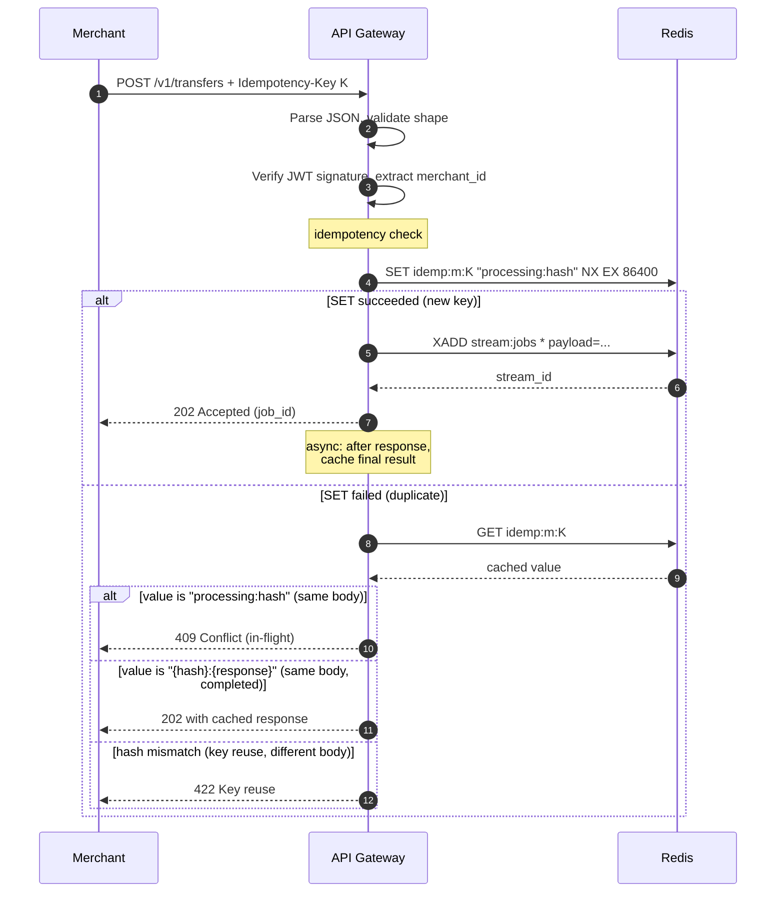

# 10 — API Gateway

> **What this is.** The service document for the API Gateway. Explains exactly what it does, exactly how it does it, and exactly what an interviewer is likely to ask you about it.
>
> **Reading time.** ~20 minutes.
>
> **Prerequisites.** Read [`../00-OVERVIEW.md`](../00-OVERVIEW.md) and [`../02-INVARIANTS.md`](../02-INVARIANTS.md) first.

---

## What it does

The API Gateway is the _only_ synchronous component in the merchant's request path. Everything else in RRQ is asynchronous, and the gateway exists specifically to convert synchronous merchant requests into durable asynchronous work as quickly as possible.

It does five things, and only five:

1. **Terminates HTTPS** from the merchant.
2. **Authenticates** the request via JWT.
3. **Validates** the request structure (well-formed JSON, required fields, syntactically valid wallet IDs and amounts). It does _not_ validate business rules — that's the saga's job.
4. **Enforces idempotency** by atomic SETNX on the merchant's `Idempotency-Key`. First request with a given key wins; subsequent retries either see "in progress" or get the cached response.
5. **Emits one event** (`JobRequested`) to the Redis job stream, then returns `202 Accepted` to the merchant.

That's the entire job. The gateway does not touch Postgres in the request path. It does not wait for the saga. It does not check wallet balances. It does not score fraud. Every operation it skips is an operation that _cannot_ contribute latency or coupled-failure risk to the merchant's request.

The design tension behind the whole service is **speed vs. durability**. Speed: respond in under 50ms p99 so the merchant's API call feels fast. Durability: never lose an accepted request. Reconciling these is the whole game. The answer: the only durable write in the request path is the `XADD` to Redis Streams (with AOF `appendfsync everysec`), and after that the gateway considers its job done.

---

## Inputs, outputs, guarantees

**Inputs**

- HTTPS request to `POST /v1/transfers`, `POST /v1/payouts`, `GET /v1/jobs/:id`, `GET /health`, `GET /ready`, `GET /metrics`.
- JWT bearer token in `Authorization` header (HS256 signed with a shared platform secret).
- `Idempotency-Key` header (required for POST endpoints; UUIDv4 from the merchant).

**Outputs**

- For a successful POST: `202 Accepted` with `{ "job_id": "...", "status": "pending", "_links": { "self": "/v1/jobs/..." } }`.
- For a duplicate (in-flight): `409 Conflict` with the in-flight job_id.
- For a duplicate (completed): the cached response from the first execution.
- For validation failure: `422 Unprocessable Entity` with field-level errors.
- For auth failure: `401 Unauthorized`.
- For Redis unavailability: `503 Service Unavailable` (the merchant retries).
- Side effect: one `JobRequested` event in the Redis job stream.

**Guarantees**

- If `XADD` succeeds, the gateway returns 202. The system owns the work from that moment.
- If `XADD` fails, the gateway returns 5xx and **no event has been emitted**. The merchant retries safely.
- For any `(merchant_id, idempotency_key)` pair, exactly one `JobRequested` event is ever written to the stream, regardless of how many requests arrive with that key. (This upholds **I3** in [`../02-INVARIANTS.md`](../02-INVARIANTS.md).)
- The gateway does not consult Postgres on the request path. Its availability is decoupled from the database.

**Non-guarantees**

- The gateway does not guarantee the saga will eventually succeed. It only guarantees that the saga will eventually run.
- The gateway does not guarantee a webhook will be delivered. That's the webhook worker's job.
- The gateway does not guarantee uniqueness of `Idempotency-Key` across merchants. Keys are scoped per-merchant; two merchants using the same UUID is fine.

---

## The mechanism

### Request lifecycle, in one diagram



Every step matters. Walk through it once slowly:

**Step 1.** Merchant posts a transfer. The `Idempotency-Key` header is required; missing it → 400.

**Step 2.** Parse JSON, validate fields exist, validate types, validate amount is positive, validate currency is one of the supported ISO 4217 codes, validate wallet IDs match the expected ULID format. _Does not_ check that the wallets exist in the database. The saga's `Validate` step does that — duplicating the check at the gateway creates two sources of truth.

**Step 3.** Verify the JWT. Extract `merchant_id` from claims. Now we know which merchant this is.

**Step 4.** Hash the request body (canonical JSON → SHA-256). The hash is part of the idempotency value so we can detect "same key, different body" abuse.

**Step 5.** The critical operation: `SET idemp:{merchant_id}:{Idempotency-Key} "processing:{body_hash}" NX EX 86400`. This is atomic at Redis. Exactly one request can win this race; all others see `nil` from `SET` and know the key exists.

**Step 6a (new key path).** `XADD stream:jobs * ` with the event payload. This is the **durability boundary** — once this succeeds, the system owns the work. If `XADD` fails (Redis unavailable), we return 503 immediately and do NOT cache the idempotency key as "processing." If we did, the next retry would see "in progress" forever. Instead, we explicitly `DEL idemp:m:K` before returning the error, so the merchant's retry can try again cleanly.

**Step 7a.** Return `202 Accepted` with the `job_id`. After the response is sent, asynchronously update the idempotency cache: `SET idemp:m:K "{hash}:{json_response}" EX 86400`. This is fire-and-forget — if it fails, the cache is missing for this key, and the next retry will be treated as new. That's acceptable. The duplicate-prevention guarantee still holds because the `JobRequested` event already has the merchant's idempotency key embedded; downstream workers can dedupe if they ever see two.

**Step 6b–6d (duplicate path).** `GET` returns the existing value. Three outcomes:

- `"processing:{hash}"` where the hash matches the current request → another instance is still working on it → 409 Conflict.
- `"{hash}:{response_json}"` where hash matches → return the cached response with appropriate status (probably 202 with the original job_id).
- Hash _doesn't_ match → the merchant reused a key for a different operation. Return 422 with a specific error code. (Some merchants don't do this intentionally; clear error messages help them.)

### The idempotency check in code

A simplified Redis exchange:

```
# New request, key K never seen
> SET idemp:m_abc:K "processing:sha256_xyz" NX EX 86400
OK
> XADD stream:jobs * type=transfer payload=...
"1700000000-0"
< 202 Accepted

# Async, after sending response:
> SET idemp:m_abc:K "sha256_xyz:{\"job_id\":...}" EX 86400
OK

# Duplicate request with same K
> SET idemp:m_abc:K "processing:sha256_xyz" NX EX 86400
(nil)
> GET idemp:m_abc:K
"sha256_xyz:{\"job_id\":\"job_42\",\"status\":\"pending\"}"
< 202 Accepted (cached response)
```

The combination of `NX` (set if not exists) and `EX` (TTL) is what makes this atomic. There is no check-then-set window where a concurrent request could slip in.

### Why these specific TTLs

- **24 hours (idempotency cache TTL).** Long enough to cover any realistic merchant retry window. Network blips that justify retrying typically resolve in minutes; even pathological retry policies don't extend past hours. After 24 hours, the same key is treated as new — documented in the merchant-facing API.
- **No TTL on the stream entry.** Streams have their own retention policy (managed separately). The job stream keeps messages for hours, plenty to survive worker pickup and ACK.

---

## Happy path walk-through

A transfer of 5,000 NGN from wallet A to wallet B, from merchant M:

1. Merchant sends `POST /v1/transfers` with `Idempotency-Key: 8e3f...`
2. Gateway parses the body, sees fields are valid, amount=500000 (in kobo, the smallest NGN unit), currency=NGN, from=wal_A, to=wal_B.
3. Gateway verifies the JWT, extracts merchant_id=m_M.
4. Gateway computes `body_hash = SHA256(canonical_json(body))`.
5. Gateway runs `SET idemp:m_M:8e3f... "processing:body_hash" NX EX 86400`. Returns OK (new key).
6. Gateway generates `job_id = ULID()`.
7. Gateway runs `XADD stream:jobs * job_id=<...> merchant_id=m_M idempotency_key=8e3f... type=transfer payload=<protobuf bytes>`. Returns stream ID.
8. Gateway sends `202 Accepted { job_id: <...>, status: "pending" }` to the merchant.
9. After the response: gateway updates the idempotency cache to `"body_hash:{json_response}"`.
10. (Async, in a different service:) the Saga Worker picks up the message from the stream, runs the transfer saga.

Note: by step 8, the merchant has their response. Steps 9 and 10 happen entirely outside the merchant's request path.

---

## Failure walk-throughs

### F1: Redis is down when `XADD` is attempted

The most catastrophic failure case. Sequence:

1. Steps 1–5 of the happy path complete. The idempotency key has been set to `"processing:body_hash"`.
2. `XADD` returns an error — Redis is unreachable, or the AOF write failed, or whatever.
3. **Critical:** before returning 5xx to the merchant, the gateway calls `DEL idemp:m_M:8e3f...` to undo the idempotency claim.
4. Gateway returns `503 Service Unavailable`.
5. Merchant retries (with the same key, since they got a 5xx).
6. Step 5 of happy path succeeds (key was deleted), so it's processed as a fresh request.

**Why the explicit DEL matters.** Without it, the idempotency key shows `"processing:hash"` forever (until TTL), and every retry sees the in-flight state and returns 409. The merchant gives up and contacts support, who is now in the position of explaining that a transfer they never accepted is "in progress." Bad.

**What if the DEL also fails?** If Redis is completely down, the DEL fails too. The key sits at "processing" for up to 24 hours. The merchant's retries return 409 during that window. This is the failure case we accept: it's better than the alternative (no idempotency protection at all), and a fully-down Redis is an operational incident that requires intervention regardless. Real-world: this almost never happens because Redis is generally up.

### F2: Two simultaneous requests with the same idempotency key

The race condition. Sequence:

1. Request A and request B both arrive at the gateway at effectively the same time, both with `Idempotency-Key: 8e3f...`.
2. Both reach step 5 (the SETNX) within microseconds of each other.
3. Redis serializes commands. Exactly one of them runs first.
4. Suppose A runs first: SETNX succeeds, returns OK.
5. B runs next: SETNX returns nil (key exists).
6. A proceeds to XADD, then 202.
7. B's path: GET the key, see `"processing:body_hash"`, the hash matches its own body, return 409 Conflict.

Both merchant request handlers can be entirely unaware of each other; Redis's atomic single-threaded execution makes the race safe. This is exactly what `NX` is for. (This upholds **I3**.)

### F3: Different body, same idempotency key

The "merchant bug" case — they reused a key but the payload differs.

1. Request A: transfer 5000 NGN with key K. SETNX succeeds, XADD, 202.
2. Request B: transfer 10000 NGN with key K (different body, same key).
3. SETNX fails (key exists).
4. GET returns `"{hash_A}:{response}"`.
5. Compute hash of B's body → different from `hash_A`.
6. Return 422 with error code `IDEMPOTENCY_KEY_REUSED_WITH_DIFFERENT_BODY` and a hint pointing to the merchant docs.

This is a real category of merchant-side bug and the 422 response with a clear error code is what helps them debug.

### F4: Slow merchant, request body never finishes uploading

Client sends headers, gateway waits for body. Connection idle for >10 seconds.

- Gateway has an HTTP read timeout (5 seconds for headers, 10 seconds for body). Connection is closed. No event written. No idempotency key set. Merchant retries.

The timeout choice matters. Too short: legitimate slow uploads fail. Too long: a slowloris-style attack pins gateway resources. 10 seconds for body is a working middle ground.

### F5: JWT is valid but for a frozen merchant

Authentication succeeds (signature is valid), but the merchant's account status is `frozen` or `closed`.

- The JWT carries the merchant_id but does NOT carry the merchant's current status (a frozen merchant can have a valid JWT issued before the freeze).
- The gateway looks up the merchant's status from a **short-TTL cache** (e.g., Redis `merchant:m_M:status` with 60s TTL). If the cache is missing, it queries Postgres.
- If status is not `active`, return `403 Forbidden` with code `MERCHANT_FROZEN`.

This is one place where the gateway _does_ touch Postgres-or-cache in the request path. It's necessary because we can't accept work from frozen merchants. The 60-second cache TTL bounds the time between a freeze and the gateway honoring it.

---

## Code skeleton (Go reference)

Skeletons are for comprehension, not for copying. The shape communicates the architecture; details will evolve.

```go
// Package gateway implements the merchant-facing HTTP API.
//
// Invariants upheld here:
//   I3 (at-most-once execution per idempotency key) — via idempotencyMiddleware.
//
// Invariants NOT enforced here (deferred to saga worker):
//   I1 (conservation of value), I2 (no negative balances).
package gateway

// Server is the HTTP server. One per replica.
type Server struct {
    redis      *redis.Client            // for idempotency cache and streams
    jwtSecret  []byte                   // HS256 secret, shared with merchants
    merchants  MerchantLookup           // status cache + DB fallback
    metrics    *Metrics                 // prometheus collectors
}

// MerchantLookup hides the cache+DB pattern from handlers.
type MerchantLookup interface {
    Status(ctx context.Context, id string) (MerchantStatus, error)
}

// Handler for POST /v1/transfers. Note this is the *handler*, not the
// full pipeline — the middleware chain (auth, idempotency) wraps it.
func (s *Server) handleTransfer(w http.ResponseWriter, r *http.Request) {
    var req TransferRequest
    if err := decodeAndValidate(r.Body, &req); err != nil {
        writeError(w, 422, "VALIDATION", err.Error())
        return
    }

    merchantID := middleware.MerchantIDFrom(r.Context())
    jobID := ulid.New()

    event := &events.JobRequested{
        JobId:           jobID,
        MerchantId:      merchantID,
        IdempotencyKey:  middleware.IdempotencyKeyFrom(r.Context()),
        Job: &events.JobRequested_Transfer{Transfer: &events.TransferRequest{
            FromWallet: req.FromWallet,
            ToWallet:   req.ToWallet,
            Amount:     req.Amount,
            Currency:   req.Currency,
            Reference:  req.Reference,
        }},
    }

    if err := s.publishJob(r.Context(), event); err != nil {
        // Critical: clear the idempotency claim before returning 5xx.
        middleware.ReleaseIdempotency(r.Context(), s.redis)
        writeError(w, 503, "STREAM_UNAVAILABLE", "could not enqueue job")
        return
    }

    writeJSON(w, 202, AcceptedResponse{
        JobID:  jobID,
        Status: "pending",
        Links:  Links{Self: "/v1/jobs/" + jobID},
    })
}

// idempotencyMiddleware is the heart of the duplicate-protection guarantee.
// It must run AFTER auth (so merchantID is known) but BEFORE the handler
// (so the handler doesn't run for duplicates).
func idempotencyMiddleware(rdb *redis.Client) func(http.Handler) http.Handler {
    return func(next http.Handler) http.Handler {
        return http.HandlerFunc(func(w http.ResponseWriter, r *http.Request) {
            if r.Method != http.MethodPost {
                next.ServeHTTP(w, r)
                return
            }

            key := r.Header.Get("Idempotency-Key")
            if key == "" {
                writeError(w, 400, "MISSING_IDEMPOTENCY_KEY", "")
                return
            }

            merchantID := MerchantIDFrom(r.Context())
            redisKey := "idemp:" + merchantID + ":" + key

            // Read body, compute hash, restore body for handler.
            body, err := io.ReadAll(r.Body)
            if err != nil {
                writeError(w, 400, "BODY_READ", "")
                return
            }
            r.Body = io.NopCloser(bytes.NewReader(body))
            hash := sha256Hex(body)
            value := "processing:" + hash

            // The atomic check.
            set, err := rdb.SetNX(r.Context(), redisKey, value, 24*time.Hour).Result()
            if err != nil {
                writeError(w, 503, "IDEMPOTENCY_CHECK_FAILED", "")
                return
            }
            if set {
                // New request. Stash the redisKey so the handler can
                // release it on failure.
                ctx := withIdempotencyContext(r.Context(), idempCtx{
                    redisKey: redisKey,
                    hash:     hash,
                })
                next.ServeHTTP(w, r.WithContext(ctx))
                // Success path: cache the response (handled by responseRecorder
                // wrapping, omitted for brevity).
                return
            }

            // Duplicate. Inspect existing value.
            existing, err := rdb.Get(r.Context(), redisKey).Result()
            if err != nil {
                writeError(w, 503, "IDEMPOTENCY_LOOKUP_FAILED", "")
                return
            }
            handleDuplicate(w, existing, hash)
        })
    }
}
```

The pieces of this that are worth understanding:

- **Middleware order matters.** Auth runs first (needs to extract merchant_id), then idempotency (needs merchant_id to scope the key), then the handler. Reversing auth and idempotency would cache unauthenticated requests, which is a bug.
- **Body must be read once and replayed.** The middleware needs the body to hash; the handler needs it to deserialize. Naive `r.Body` is single-use, so `bytes.NewReader` wraps the read bytes.
- **Errors during idempotency-claim must release the claim.** The `publishJob` failure path calls `ReleaseIdempotency`. Without that, F1 (Redis-down failure mode) doesn't recover correctly.
- **The "stash claim in context, release on handler failure" pattern.** This is how you avoid double-tracking which keys to clean up.

---

## Code skeleton (Rust reference)

The Rust version uses Tower middleware layers for the same pipeline:

```rust
//! API Gateway HTTP service.
//!
//! Invariants upheld here:
//!   I3 (at-most-once execution per idempotency key) — via IdempotencyLayer.
//!
//! The middleware stack, from outer to inner:
//!   TraceLayer -> AuthLayer -> IdempotencyLayer -> route handlers

pub fn router(state: AppState) -> Router {
    Router::new()
        .route("/v1/transfers", post(handle_transfer))
        .route("/v1/payouts",   post(handle_payout))
        .route("/v1/jobs/:id",  get(handle_job_status))
        .route("/health",       get(handle_health))
        .route("/ready",        get(handle_ready))
        .route("/metrics",      get(handle_metrics))
        .layer(IdempotencyLayer::new(state.redis.clone()))
        .layer(AuthLayer::new(state.jwt_secret.clone()))
        .layer(TraceLayer::new_for_http())
        .with_state(state)
}

/// IdempotencyLayer enforces at-most-once via Redis SET NX.
///
/// On a new key: claims it as "processing:<hash>", invokes inner service.
/// On a duplicate: returns 409 / cached response / 422 without invoking inner.
/// On inner failure: the handler is responsible for calling
/// `idempotency::release(&extensions)` before returning 5xx.
pub struct IdempotencyLayer { /* ... */ }

#[async_trait]
impl<S> Service<Request> for IdempotencyService<S>
where
    S: Service<Request, Response = Response> + Send + 'static,
    S::Future: Send + 'static,
{
    type Response = Response;
    type Error = S::Error;
    type Future = BoxFuture<'static, Result<Response, S::Error>>;

    fn call(&mut self, mut req: Request) -> Self::Future {
        let redis = self.redis.clone();
        let inner = self.inner.clone();

        Box::pin(async move {
            // ... extract key, hash body, SETNX, dispatch to inner or return duplicate response.
            // Implementation parallel to Go version, with the same release-on-error semantics.
        })
    }
}

/// The handler is small; the middleware does the heavy lifting.
async fn handle_transfer(
    State(state): State<AppState>,
    Extension(merchant_id): Extension<MerchantId>,
    Extension(idempotency): Extension<IdempotencyContext>,
    Json(req): Json<TransferRequest>,
) -> Result<(StatusCode, Json<AcceptedResponse>), ApiError> {
    req.validate()?;

    let job_id = Ulid::new().to_string();
    let event = events::JobRequested {
        job_id: job_id.clone(),
        merchant_id: merchant_id.0.clone(),
        idempotency_key: idempotency.key.clone(),
        job: Some(events::job_requested::Job::Transfer(req.into())),
    };

    if let Err(err) = state.publisher.publish_job(&event).await {
        idempotency.release(&state.redis).await.ok();
        return Err(ApiError::StreamUnavailable(err));
    }

    Ok((StatusCode::ACCEPTED, Json(AcceptedResponse { job_id, status: "pending" })))
}
```

The Rust version's interesting property: the `IdempotencyContext` extension is _only_ populated when SETNX succeeded. The handler can't accidentally release a claim it doesn't hold, because it doesn't have one in its extensions in the duplicate-response path. Compile-time guarantee, not a runtime check.

---

## Test plan

Tests are organized by which invariant they validate. Each must pass in both implementations before the service is considered done.

### Validates I3 (at-most-once execution)

- **`TestIdempotency_FirstRequest`** — single request, assert 202, assert exactly 1 message in stream, assert idempotency cache populated.
- **`TestIdempotency_SequentialDuplicates`** — fire 10 sequential requests with the same key; assert all 10 return identical `job_id`, exactly 1 message in stream.
- **`TestIdempotency_ConcurrentDuplicates`** — fire 100 concurrent requests with the same key; assert exactly 1 returns 202, others return 409 (some) and 202-with-cached-response (some). Exactly 1 message in stream.
- **`TestIdempotency_DifferentBodySameKey`** — first request with key K body X, second with K body Y; assert second returns 422.
- **`TestIdempotency_ReleaseOnPublishFailure`** — mock the publisher to return error after SETNX succeeds; assert idempotency key is deleted; assert retry with same key is processed as new.

### Validates I3 boundaries (TTL, scoping)

- **`TestIdempotency_TTLExpiry`** — fast-forward Redis time past 24h; assert same key is treated as new.
- **`TestIdempotency_PerMerchantScope`** — two merchants with the same key value; assert both succeed (different cache entries).

### Validates authentication

- **`TestAuth_MissingToken`** — no Authorization header; 401.
- **`TestAuth_InvalidSignature`** — token with bad signature; 401.
- **`TestAuth_ExpiredToken`** — expired exp claim; 401.
- **`TestAuth_FrozenMerchant`** — valid token, merchant status=frozen; 403.

### Validates validation

- **`TestValidation_MissingFields`** — body missing `from_wallet`; 422 with specific field error.
- **`TestValidation_NegativeAmount`** — `amount: -100`; 422.
- **`TestValidation_InvalidCurrency`** — `currency: "XYZ"`; 422.
- **`TestValidation_AmountTooLarge`** — `amount: 1e18`; 422 (overflow protection).

### Validates observability

- **`TestObservability_TraceHeaders`** — every request emits a span with `merchant_id`, `endpoint`, `idempotency_key` attributes.
- **`TestObservability_Metrics`** — `gateway_requests_total{status=...}` counter increments on every response.

All tests use real Postgres and real Redis in `testcontainers`. No mocks — the boundary between "unit test" and "integration test" is unprincipled and produces tests that don't catch real bugs.

---

## What this service depends on

- **Redis** — both the idempotency cache and the job stream. If Redis is fully down, the gateway returns 503. The merchant retries.
- **Postgres (rarely)** — only on merchant-status cache miss. Loss of Postgres means the cache eventually goes stale; we serve from cache for 60s past staleness as a degradation strategy. After that, return 503.
- **JWT signing key** — read at startup from environment. Rotated via deploy.

## What depends on this service

- **Saga Worker** consumes `JobRequested` from the job stream.
- **Fraud Worker** also consumes from the job stream (different consumer group).
- Nothing else reads from this service directly.

---

## Where to read next

- The service that consumes this service's output → [`11-SAGA-WORKER.md`](11-SAGA-WORKER.md)
- The deep mechanics of idempotency → [`../deep-dives/20-IDEMPOTENCY.md`](../deep-dives/20-IDEMPOTENCY.md)
- The merchant-facing API contract → [`../appendix/42-API-REFERENCE.md`](../appendix/42-API-REFERENCE.md)

---

_Pass 2 of the architecture series. Last updated pre-implementation._
