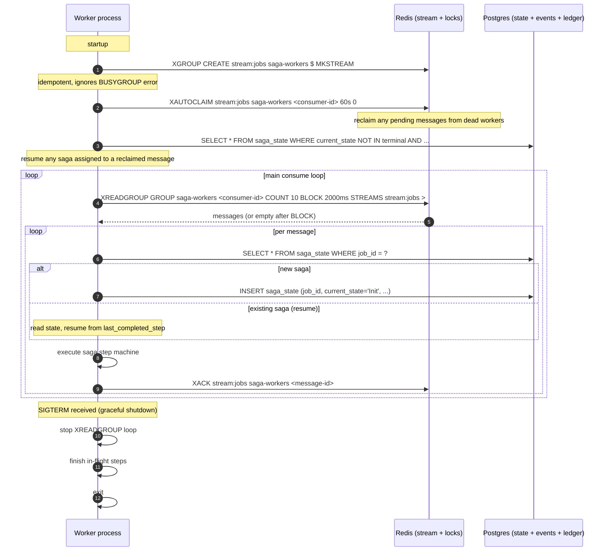
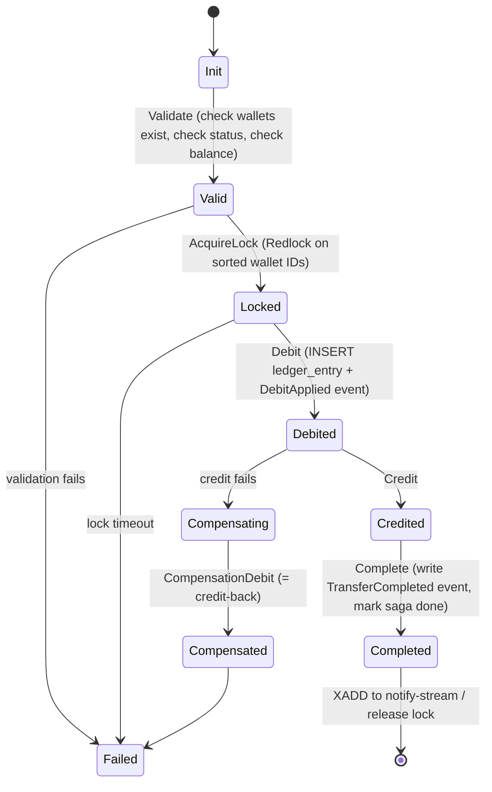

# 11: Saga Worker

> **What this is.** The service document for the Saga Worker. This is the most important service in RRQ, the spine of the system. Every other service either feeds it (API Gateway) or consumes its output (Webhook, Fraud, Reconciliation).
>
> **Reading time.** ~30 minutes. Worth all of them.
>
> **Prerequisites.** Read [`10-API-GATEWAY.md`](10-API-GATEWAY.md), [`../00-OVERVIEW.md`](../00-OVERVIEW.md), and [`../02-INVARIANTS.md`](../02-INVARIANTS.md) first.

---

## What it does

The Saga Worker is where transfers actually happen. The API Gateway accepts work and puts it on a stream; the Saga Worker takes that work and executes it. If the gateway is the front door, the saga worker is the kitchen, the place where the real cooking is done, and where the failures that matter occur.

A saga is a multi-step operation where each step has a corresponding compensation. The Transfer saga has six steps:

```
Validate → AcquireLock → Debit → Credit → Complete → Notify
```

Each step is durable: its outcome is persisted before the next step begins. If the worker crashes between step 3 and step 4, a replacement worker reads the persisted state, sees "the debit happened, the credit didn't," and resumes from step 4. If step 4 cannot succeed, the saga runs compensations in reverse, undoing the debit, releasing the lock, and reaches a `Failed` terminal state with the ledger net-zero.

This sounds straightforward and it almost is. The hard parts are not in the happy path; they're in the failure paths. Specifically: making sure crash recovery resumes from _exactly_ the right step, making sure compensations are _exactly_ idempotent so a crashed compensation re-runs safely, making sure two workers can never simultaneously process the same saga, and making sure a saga that genuinely cannot succeed reaches a terminal state rather than retrying forever.

The rest of this document is those hard parts.

---

## Inputs, outputs, guarantees

**Inputs**

- `JobRequested` events from the Redis job stream (`stream:jobs`), consumed by the `saga-workers` consumer group.
- Saga state from Postgres (read on startup for crash recovery, and per step transition).

**Outputs**

- Events written to the Postgres event store: `DebitApplied`, `CreditApplied`, `DebitReversed`, `TransferCompleted`, `TransferFailed`, `BulkPayoutCompleted`.
- Ledger entries written to `ledger_entries` (the materialized projection from which balances are derived).
- Saga state updates written to `saga_state` after every step transition.
- `WebhookEnqueued` messages written to the notify stream (`stream:notify-<shard>`) so the Webhook Worker can deliver merchant notifications.
- Redlock acquisitions and releases against Redis (during the mutating section of each saga).

**Guarantees**

- Every accepted `JobRequested` event either reaches a terminal saga state (`Completed`, `Failed`, `DeadLettered`) within bounded time, or is observable as stuck via operational tooling. (Upholds **I7**.)
- The event log reflects a consistent, causally-ordered record of what happened. For every successful Transfer saga, exactly one `DebitApplied` and one `CreditApplied` exist with the same `saga_id`. For every failed Transfer saga where the debit succeeded, a matching `DebitReversed` exists. (Upholds **I1**, **I4**.)
- At most one worker executes a given saga at a time. (Upholds the per-wallet ordering required by **I4**.)
- Compensation steps are idempotent. Running a compensation twice produces the same end state as running it once. (Necessary for crash-safety.)
- Active wallets never have a negative derived balance. The `Validate` step rejects transfers that would violate this, holding the wallet's Redlock during the check. (Upholds **I2**.)

**Non-guarantees**

- The worker does not guarantee throughput SLO. Under load, sagas may queue. Backpressure is via stream lag, not request rejection.
- The worker does not guarantee delivery of merchant webhooks. It only guarantees enqueueing them. The Webhook Worker handles the rest.
- The worker does not guarantee linearizability across sagas for different wallets. Two sagas affecting wallet A and wallet B respectively may complete in any order relative to wall-clock time.

---

## The mechanism

### Worker lifecycle, in one diagram



A few things to notice:

- **Startup runs `XAUTOCLAIM` before any new work.** This reclaims messages that were claimed by a previous worker instance but never ACKed (because the previous instance crashed). The 60-second idle threshold is the key tuning knob: too short and healthy slow workers get their messages stolen; too long and crashed-worker recovery is slow.
- **Saga state is loaded once per message**, when the message comes off the stream, before any step executes. The state row is the source of truth for "where is this saga now?"
- **Graceful shutdown doesn't ACK in-flight messages.** The worker finishes the step it's on (so the state is consistent), exits, and leaves the message unacked. A surviving worker will reclaim it via the next `XAUTOCLAIM` and resume from the last persisted state. This is correct; trying to ACK during shutdown introduces a race where the message is ACKed but the state hasn't been updated.

### The Transfer saga state machine



Each transition does three things, in order:

1. Execute the work (insert ledger row, acquire lock, etc.).
2. Update `saga_state` (`current_state`, `last_completed_step`, `state_data`, `updated_at`).
3. Within the same database transaction as (2), insert any associated event into `events`.

The transactional binding of (2) and (3) is what makes crash recovery safe: a saga state of `Debited` is never observable in the database without the corresponding `DebitApplied` event also being present, and vice versa. Either both are committed or neither is. This is **the single most important detail** in the saga's implementation; getting it wrong creates a class of bug where state and events disagree, which reconciliation will eventually surface but only after the damage is done.

### Why six steps and not fewer

The temptation when designing this is to collapse steps. "Why not have one `Execute` step that does Validate + Debit + Credit + Complete in a single database transaction?" Two reasons:

1. **The credit might not be in the same database.** In a real system, the destination wallet could be on a different shard, or the credit could involve an external bank API. The saga's step boundaries are chosen so that each step is a unit that can succeed or fail independently. Lumping them together would force assumptions about co-location that we don't want to bake in.

2. **The lock acquisition is a step.** Acquiring a distributed lock can fail (timeout, redis unavailable). It needs to be observable as a distinct step in the state machine because its compensation is different from the others (just release the lock; no ledger changes to undo).

That said, the granularity is a judgment call. The six steps chosen here are the minimum that gives us the failure-isolation we need. Adding more would just be noise.

### How a step transition works in code

Pseudocode for a single step transition. This is the shape, not the literal code:

```
fn execute_step(saga_id, step):
    state = SELECT * FROM saga_state WHERE saga_id = ? FOR UPDATE  // pessimistic lock
    if state.current_state != prerequisite_state_for(step):
        return Error("invalid state transition")

    BEGIN TRANSACTION
        work_result = do_the_work(step, state)  // may fail
        if work_result.is_retryable_error:
            ROLLBACK
            return RetryableError
        if work_result.is_terminal_error:
            // Don't transition to next step; transition to Compensating
            UPDATE saga_state SET current_state = 'Compensating', failure_reason = ...
            INSERT events (event_type = step.failure_event_type, ...)
            COMMIT
            return TerminalError
        // Success path
        if work_result.produces_ledger_entry:
            INSERT ledger_entries (...)  // unique constraint guards against duplicate execution
        INSERT events (event_type = step.success_event_type, payload = ...)
        UPDATE saga_state SET
            current_state = next_state_for(step),
            last_completed_step = step.name,
            state_data = state.state_data || work_result.data,
            updated_at = NOW()
    COMMIT

    return Ok
```

A few things worth noting:

- **`SELECT ... FOR UPDATE` is a row lock on the saga_state row.** This prevents two workers from simultaneously trying to advance the same saga, which would be a problem even with the Redlock on wallets (because the Redlock protects wallet state, not saga state). If a second worker tries to claim the same message from the stream, which can happen with `XAUTOCLAIM` if the timing is right, only one of them gets past the row lock.
- **The `BEGIN ... COMMIT` envelope holds both the work-result insert and the state update.** This is what makes (2) and (3) atomic.
- **Retryable vs terminal error classification matters.** A retryable error means "the work didn't happen; try again later." A terminal error means "the work definitively cannot succeed; transition to Compensating." Getting this wrong either causes spurious failures or wastes resources on doomed retries. The classifier lives in a small module, `errors.go` / `errors.rs`, that maps specific error types to one or the other.

---

## Happy path walk-through

A transfer of 5,000 NGN from `wal_A` to `wal_B`, originated by merchant `m_M`, job_id `job_42`, saga_id `sg_99`.

**Step 0: Message pickup.** Worker calls `XREADGROUP`, receives a message with the `JobRequested` event. The message ID is `1700000000-0`.

**Step 1: Validate.**

- `SELECT * FROM saga_state WHERE saga_id = 'sg_99'` returns nothing.
- `INSERT INTO saga_state` with `current_state='Init'`, `saga_type='transfer'`, etc.
- Lookup wallets: `SELECT id, merchant_id, currency, status FROM wallets WHERE id IN ('wal_A', 'wal_B')`. Both exist, both are `active`.
- Check that `wal_A` belongs to `m_M` (authorization). Yes.
- Check currencies match the transfer's currency. Both are NGN. Match.
- Compute current balance of `wal_A`: `SELECT COALESCE(SUM(amount), 0) FROM ledger_entries WHERE wallet_id = 'wal_A'`. Result: 50000 (500 NGN, wait, this is in kobo, so 500 NGN = 50000 kobo; the transfer is 5000 NGN = 500000 kobo). Insufficient balance!

Actually let's redo this example with sufficient balance. Suppose the balance is 1000000 kobo (10,000 NGN). The transfer is 500000 kobo. Check passes.

- Update `saga_state`: `current_state='Valid'`, `last_completed_step='validate'`, `state_data` includes wallet metadata.
- Insert event `SagaValidated` (this is a soft event; it doesn't represent ledger movement, just progress).

**Step 2: AcquireLock.**

- Sort the wallet IDs lexicographically: `('wal_A', 'wal_B')` is already sorted.
- For each wallet ID, run Redlock acquisition:
  - `SET lock:wallet:wal_A <unique-token> NX PX 5000` (5-second lease)
  - `SET lock:wallet:wal_B <unique-token> NX PX 5000`
- Both succeed.
- Update `saga_state`: `current_state='Locked'`, `last_completed_step='acquire_lock'`, `state_data` includes the lock token (needed for safe release).
- No event emitted; locking is internal.

**Step 3: Debit.**

- `BEGIN`
- `INSERT INTO ledger_entries (wallet_id='wal_A', amount=-500000, balance_after=500000, saga_id='sg_99', step_name='debit', event_id=<...>, ...)`. The `UNIQUE(saga_id, step_name)` constraint will reject this on retry.
- `INSERT INTO events (event_type='ledger.debit_applied', aggregate_id='wal_A', payload=<...>, correlation_id='sg_99', ...)`.
- `UPDATE saga_state SET current_state='Debited', last_completed_step='debit', ...`
- `COMMIT`

**Step 4: Credit.**

- `BEGIN`
- `INSERT INTO ledger_entries (wallet_id='wal_B', amount=+500000, balance_after=..., saga_id='sg_99', step_name='credit', ...)`.
- `INSERT INTO events (event_type='ledger.credit_applied', aggregate_id='wal_B', ...)`.
- `UPDATE saga_state SET current_state='Credited', last_completed_step='credit', ...`
- `COMMIT`

**Step 5: Complete.**

- `BEGIN`
- `INSERT INTO events (event_type='transfer.completed', aggregate_id='sg_99', payload=<from, to, amount>, correlation_id='sg_99', ...)`.
- `UPDATE saga_state SET current_state='Completed', terminated_at=NOW(), ...`
- `COMMIT`

**Step 6: Notify.**

- Release Redlocks (Lua script: GET the lock value, compare to our token, DEL if match). On each wallet.
- `XADD stream:notify-<shard> *` with the notify event. The shard is `hash('m_M') mod 16`.

**Step 7: ACK.**

- `XACK stream:jobs saga-workers 1700000000-0`. The message is now consumed.

Total time for a healthy run: typically 5–20 ms depending on Postgres latency. The Postgres writes dominate.

---

## Failure walk-throughs

The reason the saga design is what it is. Each scenario below is a real failure case the implementation must handle, and each one corresponds to at least one test.

### F1: Worker crashes between Debit and Credit

The classic. State at the moment of crash: `wal_A` has been debited; `wal_B` has not been credited; `saga_state` is `Debited`. The worker holds Redlocks on both wallets, which will expire in 5 seconds.

Recovery sequence:

1. The crashed worker's pod is gone. Its consumer ID has unacked messages in Redis's pending list.
2. After 60 seconds (the `XAUTOCLAIM` idle threshold), another worker's `XAUTOCLAIM` call reclaims the message.
3. The replacement worker reads `saga_state` for the message's job_id. Finds `current_state='Debited'`.
4. **Critical:** the replacement worker does NOT re-run the Debit step (that would double-debit). The state machine says "if current_state is Debited, the next step is Credit."
5. The Redlocks have expired by now (5 seconds vs the 60-second idle threshold). The replacement worker must re-acquire them. It runs `AcquireLock` again, with a different lock token.

Wait, there's a subtlety here. If the Redlock expired, another saga could have acquired the lock during the gap and made changes to `wal_A`. If that happened, our `wal_A`'s state is inconsistent with what our saga assumed during Validate.

The defense: the Validate step is re-run if more than X seconds have elapsed since the saga's last activity. Specifically, when resuming, the worker checks `updated_at` on the saga state. If it's older than the lock TTL, the worker:

- Re-runs Validate to confirm the wallets are still in a valid state for the transfer.
- If Validate now fails (balance changed, wallet got frozen, etc.), the saga transitions to Compensating to undo the Debit.
- If Validate still passes, proceed with Credit.

This is a real edge case and the code path needs explicit tests. The alternative (assume the saga can always resume safely) is wrong.

6. Replacement worker proceeds with `Credit`, `Complete`, `Notify`, `ACK`. The saga eventually reaches `Completed`.

The merchant sees no visible failure. The webhook may arrive 60+ seconds later than normal (because of the `XAUTOCLAIM` delay), but the transfer is correct.

### F2: Credit fails because wallet B got frozen

State: saga is `Debited`. Credit step starts. The `Validate`-recheck (above) catches that `wal_B` is now `frozen`. Compensation runs.

Sequence:

1. Replacement worker enters Credit step, runs the inline validation, finds `wal_B.status = 'frozen'`.
2. Transition: `current_state = 'Compensating'`, `failure_reason = 'destination_wallet_frozen'`.
3. Insert event: `transfer.compensation_started`.
4. Execute `CompensationDebit` step:
   - `BEGIN`
   - `INSERT INTO ledger_entries (wallet_id='wal_A', amount=+500000, balance_after=..., saga_id='sg_99', step_name='compensation_credit', ...)`. The `UNIQUE(saga_id, step_name)` constraint ensures this can only insert once. (The step name is "compensation_credit" because semantically we're crediting the source wallet back; the saga step is named for what it does to the ledger.)
   - `INSERT INTO events (event_type='ledger.debit_reversed', aggregate_id='wal_A', payload=<...>)`.
   - `UPDATE saga_state SET current_state='Compensated', ...`
   - `COMMIT`
5. Insert terminal event `transfer.failed` with reason `WALLET_FROZEN`.
6. Transition: `current_state = 'Failed'`, `terminated_at = NOW()`.
7. `XADD stream:notify-<shard>` with the failure notification.
8. Release locks. `XACK`.

After this, `wal_A`'s ledger has both `DebitApplied(-500000)` and `DebitReversed(+500000)`. Net change to wallet A: zero. Conservation of value (I1) holds.

### F3: Worker crashes during compensation

State at crash: saga is `Compensating`. The `CompensationDebit` ledger insert has either happened or not, we don't know.

Recovery:

1. Replacement worker reclaims the message.
2. Reads `saga_state`, sees `current_state='Compensating'`.
3. Replays the `CompensationDebit` step.
4. **The retry attempts to INSERT INTO `ledger_entries` with `(saga_id='sg_99', step_name='compensation_credit')`.** Two outcomes:
   - If the previous attempt succeeded: the `UNIQUE` constraint rejects the insert with a duplicate-key error. The worker catches this specifically and treats the step as already done. Moves to the next step (Compensated → Failed).
   - If the previous attempt didn't complete (crashed before INSERT): the insert succeeds. Worker proceeds.

The `UNIQUE(saga_id, step_name)` constraint is doing the heavy lifting here. It's the database-level idempotency guard. Without it, retrying a compensation that already ran would double-credit the source wallet, violating I1.

5. Eventually saga reaches `Failed`. Webhook is enqueued. Done.

### F4: AcquireLock fails because another saga holds the lock

Two sagas, both targeting `wal_A`. Saga 1 holds the lock. Saga 2 starts.

1. Saga 2's `AcquireLock` step runs. SETNX on `lock:wallet:wal_A` fails (key exists, held by saga 1).
2. The lock-acquisition logic retries with backoff: wait 100ms, retry; wait 200ms, retry; etc. Up to 10 seconds total.
3. If saga 1 finishes within 10 seconds and releases the lock, saga 2's retry succeeds.
4. If saga 1 takes longer than 10 seconds: saga 2's `AcquireLock` transitions to terminal failure with reason `LOCK_TIMEOUT`. The saga transitions to `Failed` directly (no compensation needed; nothing was done).
5. The merchant sees a `transfer.failed` webhook with reason `LOCK_TIMEOUT`. They can retry the transfer with a new idempotency key.

This is sometimes a real failure mode (very high contention on a single wallet) and sometimes a sign of a stuck saga holding a lock past its expected duration. Operations should alert on the rate of `LOCK_TIMEOUT` failures; a spike is diagnostic.

### F5: Postgres transaction commit fails mid-saga

Unusual but possible, network blip between worker and Postgres at the exact moment of commit.

The worker's database client returns an error. The saga step is incomplete: we don't know if the commit succeeded on the database side or not. (This is the _unknown outcome_ problem from `01-PROBLEM.md`, applied locally.)

The worker treats this as a retryable error and re-attempts the step. The retry hits the `UNIQUE(saga_id, step_name)` constraint:

- If the commit had succeeded, the second insert fails with duplicate-key. Worker reads the existing row, treats the step as already done, moves on.
- If the commit had failed, the second insert succeeds. Worker proceeds normally.

Both paths converge to "the step is now done, move to the next." The `UNIQUE` constraint converts an unknown outcome into a definite known outcome, which is exactly what we need.

### F6: Bulk payout, one sub-transfer fails

Bulk payouts are 1-to-N transfers. The Saga Worker handles them by fanning out: one `BulkPayoutSaga` orchestrator that spawns N sub-`TransferSaga` instances, each independent.

Sub-transfer fails (e.g., one recipient wallet is closed):

- The sub-saga transitions to `Failed` with a specific reason.
- The parent `BulkPayoutSaga` continues to track all sub-sagas.
- When all sub-sagas have reached terminal states, the parent emits `BulkPayoutCompleted` with success/failure counts.

Two important properties:

- **One bad sub-transfer does NOT roll back the others.** The merchant sent 5000 payouts; if 4999 succeed, those money movements are real and final. The failed 4998th sub-transfer's funds go back to the source wallet via its own compensation, but the others are independent.
- **Each sub-transfer has its own saga_id, lock, idempotency.** No shared state that could cause cascading failure.

This is one place where the framework matters: if sagas weren't first-class, building bulk payouts correctly would be much harder.

---

## Code skeleton (Go reference)

The Go implementation of the saga state machine. Steps are an interface implemented by a struct per step. The orchestrator iterates them.

```go
// Package saga implements the saga orchestrator and step machine.
//
// Invariants upheld here:
//   I1 (conservation of value), I2 (no negative balances),
//   I4 (per-wallet ordering), I7 (saga termination).

// Step is one unit of work in a saga.
type Step interface {
    // Name is used as the saga_state.last_completed_step value and as the
    // step_name in ledger_entries' (saga_id, step_name) unique constraint.
    Name() string

    // Forward executes the step. Returns the resulting StepOutcome.
    // The implementation must be tolerant of being called twice: if the
    // step's effect (ledger entry insert) is already done, return Done.
    Forward(ctx context.Context, sc *SagaContext) (StepOutcome, error)

    // Compensate undoes the step's effect. Must be idempotent.
    // Called only if a later step in the saga failed.
    Compensate(ctx context.Context, sc *SagaContext) error
}

// SagaContext holds the data threaded through a saga's steps.
// It is rehydrated from saga_state.state_data on resume.
type SagaContext struct {
    SagaID    string
    JobID     string
    Type      SagaType
    State     SagaState                 // current_state
    Data      map[string]any            // state_data (JSON-serialized)
    Now       func() time.Time          // injected for tests

    // Backends.
    DB        *pgxpool.Pool
    Locks     *redlock.Client
    Publisher *EventPublisher
}

type StepOutcome int
const (
    Continue StepOutcome = iota  // step succeeded; move to next
    Done                         // step already done; move to next (idempotent re-run)
    Retry                        // transient error; retry the step
    Terminate                    // unrecoverable; transition to Compensating
)

// Orchestrator runs a saga from its current state to a terminal state.
type Orchestrator struct {
    transferSteps   []Step           // []*ValidateStep, *AcquireLockStep, ...
    bulkPayoutSteps []Step
    classifier      ErrorClassifier  // retryable vs terminal
    metrics         *Metrics
}

// Run drives the saga forward. May span many step calls; may run
// compensation; ultimately returns when saga is terminal.
//
// Crash-safety: every step transition is durable. If Run is called twice
// for the same saga (because the worker crashed and resumed), it picks up
// from saga_state.current_state.
func (o *Orchestrator) Run(ctx context.Context, sc *SagaContext) error {
    steps := o.stepsFor(sc.Type)

    // Find resume point.
    resumeIdx, mode := o.resumePoint(sc, steps)

    if mode == ForwardMode {
        // Run forward from resume point.
        for i := resumeIdx; i < len(steps); i++ {
            outcome, err := steps[i].Forward(ctx, sc)
            switch {
            case err != nil && o.classifier.IsRetryable(err):
                return RetryableError{Step: steps[i].Name(), Wrapped: err}
            case err != nil:
                // Terminal error. Start compensation.
                if err := o.markFailing(ctx, sc, steps[i].Name(), err); err != nil {
                    return err
                }
                return o.compensate(ctx, sc, steps, i-1)  // compensate i-1, i-2, ...
            case outcome == Continue, outcome == Done:
                if err := o.markCompleted(ctx, sc, steps[i].Name()); err != nil {
                    return err
                }
            case outcome == Terminate:
                if err := o.markFailing(ctx, sc, steps[i].Name(), nil); err != nil {
                    return err
                }
                return o.compensate(ctx, sc, steps, i-1)
            }
        }
        return o.markTerminalSuccess(ctx, sc)
    }

    // CompensateMode: resuming in the middle of compensation.
    return o.compensate(ctx, sc, steps, resumeIdx)
}

func (o *Orchestrator) compensate(ctx context.Context, sc *SagaContext, steps []Step, fromIdx int) error {
    for i := fromIdx; i >= 0; i-- {
        if err := steps[i].Compensate(ctx, sc); err != nil {
            // Compensation failed. This is bad, the saga is now stuck
            // in an inconsistent state. Move to DeadLettered for operator attention.
            return o.markDeadLettered(ctx, sc, steps[i].Name(), err)
        }
        if err := o.markCompensated(ctx, sc, steps[i].Name()); err != nil {
            return err
        }
    }
    return o.markTerminalFailure(ctx, sc)
}
```

A few details worth understanding:

- **`StepOutcome` distinguishes `Continue` from `Done`.** Both move to the next step; the difference is observability, a `Done` outcome means "this step was already done when I got here," and we metric that separately. A high rate of `Done` outcomes indicates frequent retries, which is diagnostic.
- **`resumePoint` is where the state-machine intelligence lives.** Given `saga_state.current_state` and `saga_state.last_completed_step`, it returns the index of the next step to execute and whether to run forward or compensate. The logic is in one place; the rest of the orchestrator just iterates.
- **`Step.Forward` returning `nil, Done`** is the idempotent-replay path. When called on a step whose ledger insert already happened (caught by the UNIQUE constraint), the step returns `Done` without doing additional work.

### The Debit step in detail

The most subtle individual step is Debit, because it's where the ledger and event store first interact:

```go
type DebitStep struct{}

func (DebitStep) Name() string { return "debit" }

func (DebitStep) Forward(ctx context.Context, sc *SagaContext) (StepOutcome, error) {
    transfer := sc.Data["transfer"].(*TransferData)

    tx, err := sc.DB.Begin(ctx)
    if err != nil {
        return Retry, err
    }
    defer tx.Rollback(ctx)

    // Re-compute current balance under FOR UPDATE on the row.
    var currentBalance int64
    err = tx.QueryRow(ctx, `
        SELECT COALESCE(SUM(amount), 0)
        FROM ledger_entries
        WHERE wallet_id = $1
    `, transfer.FromWallet).Scan(&currentBalance)
    if err != nil {
        return Retry, err
    }

    if currentBalance < transfer.Amount {
        return Terminate, ErrInsufficientBalance
    }

    // Insert ledger entry. Will fail with unique violation if the step
    // already ran (idempotent retry).
    eventID := ulid.New()
    _, err = tx.Exec(ctx, `
        INSERT INTO ledger_entries (wallet_id, amount, balance_after, saga_id, step_name, event_id)
        VALUES ($1, $2, $3, $4, $5, $6)
    `, transfer.FromWallet, -transfer.Amount, currentBalance-transfer.Amount, sc.SagaID, "debit", eventID)

    if isUniqueViolation(err) {
        // We've already done this step. Return Done so caller doesn't double-count.
        return Done, nil
    }
    if err != nil {
        return Retry, err
    }

    // Insert the event in the same transaction.
    payload, _ := proto.Marshal(&events.DebitApplied{
        WalletId:     transfer.FromWallet,
        Amount:       transfer.Amount,
        SagaId:       sc.SagaID,
        StepName:     "debit",
        BalanceAfter: currentBalance - transfer.Amount,
    })
    _, err = tx.Exec(ctx, `
        INSERT INTO events (event_id, event_type, aggregate_type, aggregate_id, correlation_id, payload, occurred_at)
        VALUES ($1, $2, 'wallet', $3, $4, $5, $6)
    `, eventID, "ledger.debit_applied", transfer.FromWallet, sc.SagaID, payload, sc.Now())
    if err != nil {
        return Retry, err
    }

    return Continue, tx.Commit(ctx)
}

func (DebitStep) Compensate(ctx context.Context, sc *SagaContext) error {
    transfer := sc.Data["transfer"].(*TransferData)

    tx, err := sc.DB.Begin(ctx)
    if err != nil {
        return err
    }
    defer tx.Rollback(ctx)

    // Re-fetch current balance for balance_after.
    var currentBalance int64
    if err := tx.QueryRow(ctx, /* same SUM as above */).Scan(&currentBalance); err != nil {
        return err
    }

    eventID := ulid.New()
    _, err = tx.Exec(ctx, `
        INSERT INTO ledger_entries (wallet_id, amount, balance_after, saga_id, step_name, event_id)
        VALUES ($1, $2, $3, $4, $5, $6)
    `, transfer.FromWallet, +transfer.Amount, currentBalance+transfer.Amount, sc.SagaID, "compensation_credit", eventID)

    if isUniqueViolation(err) {
        // Already compensated.
        return tx.Commit(ctx)  // commit empty tx, no-op
    }
    if err != nil {
        return err
    }

    // ... emit DebitReversed event ...

    return tx.Commit(ctx)
}
```

The shape of every step is similar: open transaction, insert ledger entry (which idempotently no-ops via UNIQUE), insert event in same transaction, commit. The compensation mirrors with opposite sign.

---

## Code skeleton (Rust reference), the type-state encoding

This is where Rust's type system buys you something Go can't easily replicate. Saga states are encoded as types, not strings, and step methods are only callable on the appropriate state.

```rust
//! Saga orchestrator with type-state-encoded state machine.
//!
//! The key insight: `Saga<Debited>` is a distinct type from `Saga<Credited>`.
//! Calling `.credit()` on a `Saga<Init>` is a compile error, not a runtime panic.

// State markers. These are zero-sized types used only as type parameters.
pub struct Init;
pub struct Valid;
pub struct Locked;
pub struct Debited;
pub struct Credited;
pub struct Compensating;
pub struct Completed;
pub struct Failed;

// The saga struct, parameterized by current state.
pub struct Saga<S> {
    pub id: SagaId,
    pub job_id: JobId,
    pub data: SagaData,
    _state: PhantomData<S>,
}

// Step impls are organized by current state.

impl Saga<Init> {
    pub async fn validate(self, ctx: &SagaCtx) -> Result<Saga<Valid>, SagaFailure> {
        // ... do the work ...
        // On success, return Saga<Valid>. The Saga<Init> value is consumed
        // and no longer exists; the new Saga<Valid> takes its place.
        Ok(Saga {
            id: self.id,
            job_id: self.job_id,
            data: self.data,
            _state: PhantomData,
        })
    }
}

impl Saga<Valid> {
    pub async fn acquire_lock(self, ctx: &SagaCtx) -> Result<Saga<Locked>, SagaFailure> {
        // ...
    }
}

impl Saga<Locked> {
    pub async fn debit(self, ctx: &SagaCtx) -> Result<Saga<Debited>, SagaFailure> {
        // ...
    }
}

impl Saga<Debited> {
    pub async fn credit(self, ctx: &SagaCtx) -> Result<Saga<Credited>, SagaFailure> {
        // ...
    }

    // Compensation is only callable from Debited state (or later).
    pub async fn compensate(self, ctx: &SagaCtx) -> Result<Saga<Failed>, SagaFailure> {
        // Insert compensation_credit ledger entry, emit DebitReversed.
    }
}

impl Saga<Credited> {
    pub async fn complete(self, ctx: &SagaCtx) -> Result<Saga<Completed>, SagaFailure> {
        // ...
    }
}

// The orchestrator: a function that drives a saga from any state to a terminal.
// Note the return type, Result of an enum over terminal states.
pub async fn run_transfer(saga: Saga<Init>, ctx: &SagaCtx) -> TerminalState {
    let saga = match saga.validate(ctx).await {
        Ok(s) => s,
        Err(e) => return TerminalState::Failed(e),
    };
    let saga = match saga.acquire_lock(ctx).await {
        Ok(s) => s,
        Err(e) => return TerminalState::Failed(e),
    };
    let saga = match saga.debit(ctx).await {
        Ok(s) => s,
        Err(e) => return TerminalState::Failed(e),
    };
    let saga = match saga.credit(ctx).await {
        Ok(s) => s,
        Err(e) => {
            // Debit succeeded; must compensate.
            let _failed = saga.compensate(ctx).await;
            return TerminalState::Failed(e);
        }
    };
    match saga.complete(ctx).await {
        Ok(_) => TerminalState::Completed,
        Err(e) => TerminalState::Failed(e),
    }
}

pub enum TerminalState {
    Completed,
    Failed(SagaFailure),
}
```

**What does this buy you?**

The thing the type-state pattern prevents is: writing code that calls `credit()` on a saga that hasn't been debited yet. In Go, the only thing stopping you is convention and tests, you have to remember to check the state first, and if you forget, the bug exists at runtime and only manifests when the wrong path is exercised. In Rust, the function `credit` doesn't exist on `Saga<Init>`. Calling it is a compile error: "method not found." The bug never reaches runtime; it never reaches code review; it never reaches production.

In a saga with 6 steps and a compensation path, the number of invalid transitions is large enough that catching them all in tests is tedious. The type-state encoding makes the invalid transitions _unrepresentable_. That's the qualitative difference.

**What's the catch?**

Recovery from crashes. The type-state pattern's strength is at the point of code authorship, you write `saga.debit()` and it only compiles in the right context. But when a worker crashes mid-saga and a replacement reads `saga_state.current_state = 'Debited'` from the database, it has to _reconstruct_ a `Saga<Debited>` value to continue. The reconstruction is unavoidably stringly-typed: read the string `'Debited'`, match on it, build the right type.

```rust
pub fn resume_saga(state: SagaStateRow, ctx: &SagaCtx) -> ResumeResult {
    match state.current_state.as_str() {
        "Init"     => ResumeResult::FromInit(Saga::<Init>::from_row(state)),
        "Valid"    => ResumeResult::FromValid(Saga::<Valid>::from_row(state)),
        "Locked"   => ResumeResult::FromLocked(Saga::<Locked>::from_row(state)),
        "Debited"  => ResumeResult::FromDebited(Saga::<Debited>::from_row(state)),
        "Credited" => ResumeResult::FromCredited(Saga::<Credited>::from_row(state)),
        // ...
    }
}

pub enum ResumeResult {
    FromInit(Saga<Init>),
    FromValid(Saga<Valid>),
    FromLocked(Saga<Locked>),
    FromDebited(Saga<Debited>),
    FromCredited(Saga<Credited>),
}
```

After `resume_saga`, you match on `ResumeResult` and call the appropriate continuation. The type-state guarantee resumes from that point.

The honest answer is that the type-state pattern doesn't prevent _all_ state-machine bugs, the reconstruction boundary is fundamentally untyped. What it does is prevent the much larger class of bugs that originate inside the saga logic itself. The reconstruction is one place that needs careful testing; the rest is compiler-enforced.

---

## Test plan

Tests are organized by which invariant they validate. Each must pass in the Go implementation first, and in the Rust comparison implementation in the Rust comparison once it is built.

### Validates I1 (conservation of value)

- **`TestConservation_HappyPath`**, submit 1,000 transfers; assert sum of all amounts equals net zero across all wallets (every debit has a matching credit).
- **`TestConservation_FailedTransfers`**, submit transfers that intentionally fail at the Credit step (frozen destination); assert each has both a `DebitApplied` and a `DebitReversed` with matching saga_id, net zero impact on source wallet.

### Validates I2 (no negative balances)

- **`TestBalance_RejectsOverdraft`**, submit a transfer from a wallet with balance 100 for amount 150; assert `TransferFailed` with reason `INSUFFICIENT_BALANCE`, no `DebitApplied` event written.
- **`TestBalance_ConcurrentTransfersCannotOverdraft`**, wallet balance 100, submit two concurrent transfers of 60 each; assert exactly one succeeds, one fails, balance never goes negative. This is the core test for the Redlock guarantee.

### Validates I7 (saga termination)

- **`TestTermination_HappyPath`**, every saga reaches `Completed` or `Failed` within deadline.
- **`TestTermination_CrashRecovery`**, kill worker after `Debit`, before `Credit`; assert replacement worker resumes and reaches a terminal state.
- **`TestTermination_TerminalErrorTerminates`**, inject an error in `Credit` step (mock wallet to be frozen); assert saga reaches `Failed` via compensation, doesn't retry forever.
- **`TestTermination_StuckSagaDetected`**, inject a permanent error in compensation (compensation step itself fails); assert saga reaches `DeadLettered` and is queryable via the admin tooling.

### Validates idempotent step retry

- **`TestIdempotency_StepReplayDoesNotDouble`**, manually call `Debit.Forward` twice; assert exactly one ledger entry exists with that `(saga_id, step_name)`.
- **`TestIdempotency_CompensationReplayDoesNotDouble`**, same for compensation.
- **`TestIdempotency_CrashDuringCommit`**, simulate a commit-time error by intercepting the database call; assert recovery sees the partial state and resumes correctly.

### Validates concurrency / locking

- **`TestLocking_TwoSagasOneWallet`**, two sagas targeting the same wallet; one acquires the lock first, the other waits, completes serially.
- **`TestLocking_DeadlockPrevention`**, saga 1 wants `wal_A, wal_B`; saga 2 wants `wal_B, wal_A`; sorted ordering means both attempt locks in the same order, no deadlock.
- **`TestLocking_StaleLockReleased`**, kill a worker holding a lock; assert another saga can acquire that wallet's lock after the TTL expires.

### Chaos tests (Rust comparison, with turmoil)

- **`TurmoilTest_NetworkPartitionMidSaga`**, partition Redis from the worker for 5s during a saga; assert saga eventually completes correctly.
- **`TurmoilTest_RedisRestartMidSaga`**, restart Redis; assert worker reconnects and resumes.
- **`TurmoilTest_DroppedAck`**, drop one `XACK` packet; assert the message is redelivered and the second processing sees the saga in terminal state, just ACKs without re-running.

### Chaos tests (Go with testcontainers)

- **`ChaosTest_WorkerKillMidSaga`**, `SIGKILL` the worker process between `Debit` and `Credit`; spawn a replacement; assert saga completes correctly.
- **`ChaosTest_BulkPayoutWorkerCrash`**, kill worker mid-bulk-payout; assert remaining sub-transfers complete correctly under the replacement.

---

## What this service depends on

- **Redis**, for the job stream (consume), the notify stream (produce), and Redlock (acquire/release).
- **Postgres**, the source of truth for events, ledger, and saga state. The most write-intensive backend in the system.
- **API Gateway**, produces the `JobRequested` events this worker consumes.

## What depends on this service

- **Webhook Worker**, consumes notify-stream messages (`stream:notify-{shard}`) this worker produces.
- **Fraud Worker**, joins `stream:jobs` with its own `fraud-workers` consumer group; receives the same `JobRequested` events independently and filters for fraud-relevant types.
- **Reconciliation**, replays the `events` and `ledger_entries` this worker writes to Postgres.

---

## Where to read next

- The webhook worker that handles the saga's outbound notifications → [`12-WEBHOOK-WORKER.md`](12-WEBHOOK-WORKER.md)
- The deep mechanics of sagas and crash recovery → [`../deep-dives/21-SAGAS.md`](../deep-dives/21-SAGAS.md)
- The distributed locking algorithm → [`../deep-dives/23-LOCKING.md`](../deep-dives/23-LOCKING.md)

---

_Pass 2 of the architecture series. Last updated pre-implementation._
