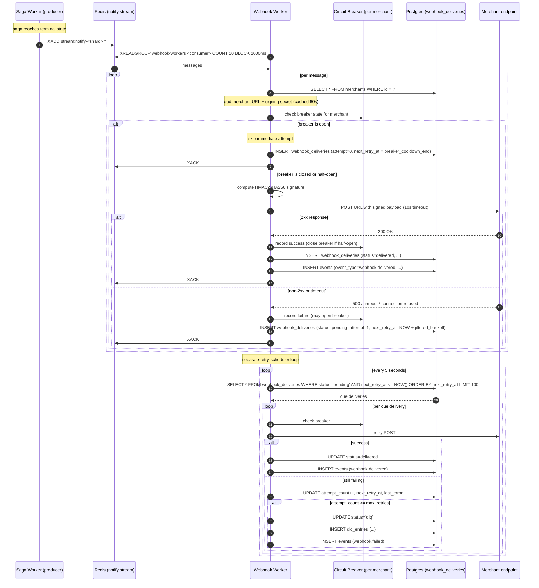

# 12: Webhook Worker

> **What this is.** The service document for the Webhook Worker. Explains how RRQ delivers signed notifications to merchants with per-merchant ordering, exponential backoff with full jitter, per-merchant circuit breakers, and DLQ routing for terminal failures.

## FAQ

The FAQ for this document has been moved to `docs/faq/12-WEBHOOK-WORKER-FAQ.md`.

> **Prerequisites.** Read [`11-SAGA-WORKER.md`](11-SAGA-WORKER.md), webhooks consume what sagas produce.

---

## What it does

The Webhook Worker delivers signed HTTPS notifications to merchant endpoints. When a transfer completes (or fails, or any other notable event), the merchant needs to know, RRQ tells them by POSTing a signed payload to a URL they configured. The Webhook Worker is the service that does the POSTing.

It does five things:

1. **Consumes** messages from the partitioned notify stream (`stream:notify-0` through `stream:notify-15`).
2. **Signs** the payload with HMAC-SHA256 using the merchant's per-merchant secret.
3. **Delivers** the signed payload via HTTPS POST to the merchant's configured URL.
4. **Retries** failures with exponential backoff and full jitter, gated by a per-merchant circuit breaker.
5. **Routes** terminally-failed deliveries to the DLQ for operator action.

The interesting design tensions are:

- **Per-merchant ordering** vs. **horizontal scalability**. A merchant expects their webhooks in order, they're building state machines on top of them. But naive parallelism (consumer group balances across N consumers) would deliver out of order. The answer is stream partitioning.
- **Retry persistence** vs. **operational simplicity**. Retries can span minutes (a 5xx that recovers quickly) to 45+ minutes (10 attempts with exponential backoff). The worker can't hold retries in memory; they have to survive process restarts. The answer is a Postgres-backed retry queue.
- **One bad merchant shouldn't break the system**. A merchant whose endpoint is permanently broken will exhaust retries forever if you let it. The circuit breaker per-merchant is what bounds the damage.

---

## Inputs, outputs, guarantees

**Inputs**

- Messages from `stream:notify-{shard}` for some `shard ∈ [0, 16)`. Each shard is consumed by exactly one consumer at a time within the `webhook-workers` consumer group.
- Webhook delivery records from `webhook_deliveries` (read by the retry scheduler).
- Merchant configuration (webhook URL, signing secret, status) from Postgres with short-TTL Redis cache.

**Outputs**

- HTTPS POST requests to merchant endpoints.
- `WebhookDelivered` or `WebhookFailed` events to the event store.
- Inserts/updates to `webhook_deliveries` tracking attempt history.
- Writes to `dlq_entries` for retry-exhausted deliveries.
- Circuit breaker state changes (held in Redis, keyed by merchant_id).
- Metrics: deliveries/sec, success rate, retry rate, breaker state per merchant.

**Guarantees**

- **Per-merchant ordering at the attempt level**: for merchant M, the worker attempts deliveries in the order their source events occurred. (Upholds **I5**.)
- **At-least-once delivery**: a merchant may see duplicate webhooks (network blip during ACK); each payload carries a unique `event_id` the merchant can dedupe on.
- **No silent drops**: every delivery that exhausts automatic retry lands in `dlq_entries` with full context. (Upholds **I8**.)
- **HMAC-SHA256 signature on every payload**: merchants can verify authenticity.

**Non-guarantees**

- **No global webhook ordering**. Merchant A's webhooks and merchant B's webhooks are unordered relative to each other.
- **No "successful delivery" guarantee per attempt**. A delivery may succeed at attempt 7 of 10; we promise per-merchant attempt order, not per-merchant success order.
- **No guarantee that the merchant's endpoint processed the payload correctly**. We only know they returned 2xx. Their idempotent processing is their responsibility, we provide the `event_id` to make it possible.

---

## The mechanism

### The partitioning insight

Per-merchant ordering with horizontal scalability is the core problem. Here's why the obvious approaches don't work:

**Approach 1: single consumer, one stream.** All notify events go to `stream:notify`. One consumer reads serially. Ordering is preserved trivially. Problem: throughput is bounded by one consumer's processing rate. A merchant with a slow endpoint blocks every other merchant. Unacceptable.

**Approach 2: consumer group, one stream.** All events go to `stream:notify`, but a consumer group with N consumers balances messages across them. Throughput scales. Problem: Redis Streams' consumer group balances messages without regard to content. Two consumers can simultaneously process two events for the _same_ merchant, delivered to the merchant out of order. Ordering broken.

**Approach 3: stream per merchant.** Create `stream:notify:m_A`, `stream:notify:m_B`, etc. Each stream has its own consumer. Ordering preserved per merchant; parallelism across merchants. Problem: number of streams grows with merchant count. Thousands of streams is operationally awkward, Redis handles it but tooling, monitoring, and consumer-process count become unwieldy.

**Approach 4 (chosen): N partitioned streams, hash by merchant.** Create `stream:notify-0` through `stream:notify-15` (16 shards). When emitting, write to `stream:notify-{hash(merchant_id) mod 16}`. Each shard is consumed by exactly one consumer at a time (within the consumer group, one of the N workers owns each shard). All of merchant M's events land on the same shard, same consumer, same serial processing. Different merchants land on (potentially) different shards and run in parallel.

This is the standard pattern for "per-key ordering with horizontal scaling." It's how Kafka works fundamentally (partitions). 16 shards is a tunable; the rule of thumb is 4x the number of worker replicas, so 4 workers handle 16 shards = 4 shards each.

### Delivery lifecycle, in one diagram



Two loops in one worker:

- **The stream-consumer loop** handles freshly-arriving notifications. First-attempt deliveries happen here.
- **The retry-scheduler loop** polls Postgres for due retries. Subsequent attempts happen here.

These two loops are separated because retries need to span minutes-to-hours, far longer than a stream message should sit unacked. ACKing the stream message immediately and tracking retries in Postgres is what makes long retry windows possible.

### Signing and what we put in the payload

Every webhook payload includes:

```json
{
  "event_id": "ev_01HQX...",
  "event_type": "transfer.completed",
  "occurred_at": "2026-05-11T14:23:45.123Z",
  "delivery_attempt": 1,
  "data": {
    "job_id": "job_01HQX...",
    "from_wallet": "wal_...",
    "to_wallet": "wal_...",
    "amount": 500000,
    "currency": "NGN"
  }
}
```

The signature is computed as:

```
signature = HMAC-SHA256(merchant.webhook_secret, canonical_json(payload))
```

And sent in a header:

```
X-RRQ-Signature: sha256=<hex>
X-RRQ-Event-Id: ev_01HQX...
X-RRQ-Delivery-Attempt: 1
```

The merchant's verification:

```python
expected = hmac.new(secret, canonical_json(body), 'sha256').hexdigest()
if not hmac.compare_digest(expected, request.headers['X-RRQ-Signature'].removeprefix('sha256=')):
    return 401  # invalid signature
```

A few details that matter:

- **`event_id` is the dedupe anchor for the merchant.** They store the set of `event_id`s they've already processed; receiving one twice is a no-op on their side. This is how we tolerate at-least-once delivery without burdening the merchant with reconciliation.
- **`delivery_attempt` is exposed so the merchant can detect retries.** Useful for diagnostics, not strictly necessary.
- **`canonical_json` is the JSON-encoded payload with sorted keys and no whitespace.** Both sides must agree on the canonical form, or signatures won't match. We use [JCS, RFC 8785](https://tools.ietf.org/html/rfc8785) or a documented equivalent.
- **Constant-time comparison (`compare_digest`) is essential** on the merchant side to prevent timing attacks. We can't enforce that, but we document it.

### Exponential backoff with full jitter

When a delivery fails, the next retry is scheduled at:

```
delay = random_between(0, min(cap, base * 2^attempt))
next_retry_at = NOW() + delay
```

With `base = 1s` and `cap = 5min`, and `max_attempts = 10`:

| Attempt         | Max delay window     | Typical delay |
| --------------- | -------------------- | ------------- |
| 1 (first retry) | 0–2s                 | ~1s           |
| 2               | 0–4s                 | ~2s           |
| 3               | 0–8s                 | ~4s           |
| 4               | 0–16s                | ~8s           |
| 5               | 0–32s                | ~16s          |
| 6               | 0–64s                | ~32s          |
| 7               | 0–128s               | ~64s          |
| 8               | 0–256s (capped 300s) | ~128s         |
| 9               | 0–300s (capped)      | ~150s         |
| 10              | 0–300s (capped)      | ~150s         |

Total worst-case retry window: roughly 45 minutes from first attempt to last. After attempt 10 fails, the delivery moves to DLQ.

**Why full jitter, not "exponential with fixed jitter"?**

Suppose 1,000 webhooks all fail at the same time (a brief outage at the merchant's load balancer). Without jitter, all 1,000 retry exactly 1s later, hitting the merchant simultaneously. Likely overwhelms them again. Then 2s later. Etc., the **thundering herd**.

Fixed-component jitter (`delay = base * 2^attempt + random(0, jitter)`) partially helps but leaves correlation: the fixed component clusters retries near the same time. The retry distribution looks like a series of bumps at `1s, 2s, 4s, ...` with noise.

Full jitter (`delay = random(0, base * 2^attempt)`) maximally decorrelates. The retry distribution is uniform from 0 to the max. The 1,000 webhooks retry roughly uniformly over the next 2 seconds, then over the next 4, etc. The merchant's endpoint sees smooth load, not bursts.

AWS's architecture blog has the canonical write-up. The formula is small; the reasoning is the part to internalize.

### Per-merchant circuit breaker

A merchant whose endpoint is permanently broken (DNS misconfiguration, TLS cert expired, infrastructure abandoned) shouldn't cause RRQ to waste resources on doomed retries forever. The circuit breaker bounds this damage.

State machine:

```
                  ┌──────────┐
                  │  Closed  │  Normal. Requests flow. Failures counted.
                  └────┬─────┘
                       │ N consecutive failures
                       ▼
                  ┌──────────┐
                  │   Open   │  All requests fail-fast. Cooldown timer running.
                  └────┬─────┘
                       │ cooldown expires (30s)
                       ▼
                  ┌──────────┐  Single trial request allowed.
                  │ Half-Open│
                  └─┬──────┬─┘
        success     │      │   failure
                    ▼      ▼
              ┌──────────┐ ┌──────────┐
              │  Closed  │ │   Open   │ (cooldown restarts)
              └──────────┘ └──────────┘
```

Tuning (defaults; all are configuration):

- **N (failure threshold)**: 5 consecutive failures.
- **Cooldown**: 30 seconds.
- **Half-Open trial count**: 1.
- **Reset window for failure counter**: 60 seconds. If we go 60 seconds without a failure, the counter resets to zero.

Key property: **breaker state is per-merchant**, keyed `breaker:webhook:{merchant_id}` in Redis. One merchant's failures don't affect another's. This is critical, a single misconfigured merchant must not degrade service for everyone.

**Interaction with the retry scheduler.** When the breaker is open, the scheduler still polls `webhook_deliveries` and finds due retries. Instead of attempting them, it updates `next_retry_at` to the breaker's cooldown end time and moves on. This naturally pauses retries for that merchant while keeping the scheduler responsive for others.

**The half-open state is the riskiest moment.** During cooldown, real events keep arriving and getting deferred. When the breaker transitions to half-open, exactly one trial attempt is allowed. If that succeeds, the breaker closes and the backlog drains. If it fails, the breaker opens again, and the _backlog also got bigger_ during cooldown. For very-long-broken merchants, the backlog can grow unbounded. The mitigation: deliveries that have been pending more than 24 hours go to DLQ directly, regardless of attempt count. The DLQ becomes the safety valve.

---

## Happy path walk-through

A `transfer.completed` event needs to be delivered to merchant `m_M`'s endpoint at `https://merchant.example/webhooks/rrq`.

1. **Saga Worker emits.** Saga reaches terminal `Completed` state, computes `shard = hash("m_M") mod 16 = 7`, runs `XADD stream:notify-7 * event_type=transfer.completed event_id=ev_42 merchant_id=m_M payload=<...>`.

2. **Webhook Worker picks up.** A worker assigned to shard 7 calls `XREADGROUP webhook-workers <consumer-id> COUNT 10 BLOCK 2000 STREAMS stream:notify-7 >`. Receives the message.

3. **Merchant lookup.** Worker checks Redis cache `merchant:m_M`. Cache miss. Queries Postgres: `SELECT webhook_url, webhook_secret, status FROM merchants WHERE id = 'm_M'`. Caches result with 60s TTL. Status is `active`. URL is `https://merchant.example/webhooks/rrq`. Secret is `<bytes>`.

4. **Breaker check.** `GET breaker:webhook:m_M` from Redis. Returns `closed` (or nil, which means closed). Proceed.

5. **Sign and POST.**

   ```
   payload = canonical_json({
     event_id: "ev_42",
     event_type: "transfer.completed",
     occurred_at: "2026-05-11T14:23:45.123Z",
     delivery_attempt: 1,
     data: { ... }
   })
   signature = HMAC-SHA256(secret, payload)

   HTTP POST https://merchant.example/webhooks/rrq
     Headers:
       Content-Type: application/json
       X-RRQ-Signature: sha256=<hex>
       X-RRQ-Event-Id: ev_42
       X-RRQ-Delivery-Attempt: 1
       User-Agent: rrq-webhook/1.0
     Body: payload
     Timeout: 10s
   ```

6. **Response handling.** Merchant returns `200 OK`.

7. **Record success.**

   ```
   INSERT INTO webhook_deliveries (
     id, merchant_id, source_event_id, url, payload, signature,
     attempt_count, last_attempt_at, status, last_status, delivered_at
   ) VALUES (
     'wd_01HQX...', 'm_M', 'ev_42', '<url>', <payload_json>, '<hex>',
     1, NOW(), 'delivered', 200, NOW()
   );

   INSERT INTO events (
     event_id, event_type, aggregate_type, aggregate_id, payload, occurred_at
   ) VALUES (
     'ev_<new>', 'webhook.delivered', 'webhook', 'wd_01HQX...', <payload>, NOW()
   );
   ```

8. **Update breaker.** `record_success(m_M)`, if breaker was half-open, transition to closed. Reset consecutive-failure counter to zero.

9. **ACK.** `XACK stream:notify-7 webhook-workers <message-id>`.

Total time on a healthy merchant: 50–200ms depending on their endpoint's latency.

---

## Failure walk-throughs

### F1: Merchant endpoint returns 500

The most common failure case. Sequence:

1. POST returns 500.
2. Worker classifies 5xx as retryable.
3. Compute next retry delay: `random(0, min(300, 1 * 2^0)) = random(0, 1)` ≈ 0.5s.
4. `INSERT INTO webhook_deliveries` with `attempt_count=1`, `next_retry_at = NOW() + 500ms`, `last_status=500`, `last_error='HTTP 500'`, `status='pending'`.
5. Update breaker: `record_failure(m_M)`. Consecutive failures = 1 (below threshold).
6. `XACK` the stream message. The delivery now lives in `webhook_deliveries`; the stream's job is done.

Later, the retry-scheduler loop:

7. `SELECT * FROM webhook_deliveries WHERE status='pending' AND next_retry_at <= NOW() LIMIT 100` returns this row.
8. Worker repeats steps 3-9 of the happy path (sign, POST, etc.).
9. If success this time: `UPDATE webhook_deliveries SET status='delivered', delivered_at=NOW(), last_status=200`. Done.
10. If failure: increment `attempt_count`, compute next delay (now `random(0, 2)` ≈ 1s), update `next_retry_at`. Loop continues.

After 10 failures: see F4.

### F2: Merchant endpoint times out

1. POST hits the 10-second timeout. Connection aborted, no response received.
2. Worker classifies timeout as retryable.
3. **Critical:** the timeout case is the unknown-outcome case. The merchant _might_ have processed the request and returned 200, we just never got the response. We have to retry, but we have to acknowledge that this might create a duplicate on the merchant's side.
4. Update `webhook_deliveries` with `last_error='timeout'`, increment attempt count, schedule retry.
5. The merchant, when they next receive the same `event_id`, recognizes the duplicate and no-ops it.

This is why every payload has an `event_id` and why we tell merchants in the documentation to dedupe on it. The system's at-least-once delivery is real, and the merchant must defend against it.

### F3: Merchant endpoint repeatedly fails, circuit breaker opens

1. Delivery attempt fails. `record_failure(m_M)`. Counter = 1.
2. Next attempt: fails. Counter = 2.
3. ... after 5 consecutive failures: counter reaches threshold.
4. Breaker transitions to `Open`. Cooldown timer set (30s).
5. Subsequent deliveries for `m_M` see `Open` state and don't attempt the POST. They update `webhook_deliveries.next_retry_at` to the cooldown end time and skip.
6. After 30s, breaker transitions to `Half-Open`.
7. Next due retry runs as a "trial." If it succeeds, breaker closes; backlog drains over the next cycles.
8. If trial fails, breaker re-opens; cooldown restarts.

The merchant's experience during this is: webhooks stop arriving for ~30s, then either resume or stay stopped (if the breaker keeps re-opening).

### F4: Delivery exceeds max retries, DLQ routing

1. Attempt 10 fails. `attempt_count` is now 10, equal to `max_retries`.
2. Worker updates `webhook_deliveries.status='dlq'`, sets `next_retry_at=NULL`, records final error.
3. `INSERT INTO dlq_entries (source='webhook', original_payload=<full webhook context>, error_message=<last error>, attempt_count=10, first_failed_at=<first attempt time>, last_failed_at=NOW(), status='open')`.
4. `INSERT INTO events (event_type='webhook.failed', ...)` so the failure is recorded in the event log.
5. Emit a Prometheus metric `webhook_deliveries_dlq_total{merchant_id}` so monitoring picks it up.

The operator, alerted by the metric or noticing the DLQ growing, can:

- Investigate why the merchant's endpoint is failing.
- After fixing the underlying issue, use the Admin Dashboard's DLQ replay action on `wd_<id>` to retry.
- Or mark the entry resolved in the dashboard with a note ("merchant decommissioned") to close it out without retrying.

### F5: Postgres unavailable during retry-scheduler loop

The retry scheduler depends on Postgres heavily, every poll queries the table. If Postgres is unreachable:

1. The `SELECT FROM webhook_deliveries` fails.
2. Worker logs the error, sleeps for the polling interval (5s), retries.
3. Retries continue until Postgres is back.
4. During the gap, no new retries are attempted, but no work is lost, the deliveries are still in `webhook_deliveries` with their `next_retry_at` set.
5. When Postgres recovers, the scheduler picks up where it left off. Some retries may be late (their `next_retry_at` is in the past), which is fine.

The stream-consumer loop is independent. If Postgres is down but Redis is up, fresh notifications arrive in the stream and... the worker can't process them, because it needs to write to `webhook_deliveries`. So the stream-consumer loop also stalls. Stream backs up; consumer lag grows; alerting fires; operator intervenes.

### F6: Worker pod restart in the middle of retry processing

1. Worker is mid-loop through a batch of 100 due retries. It has processed 30 of them (some succeeded, some still failing).
2. Pod gets SIGTERM (rolling deploy).
3. Worker finishes the current delivery attempt, then exits.
4. The remaining 70 deliveries are still in `webhook_deliveries.status='pending'` with `next_retry_at <= NOW()`.
5. Replacement worker starts, runs its scheduler loop, picks up those 70 (and any new ones).

No work is lost because every retry's state lives in Postgres, not in worker memory.

---

## Code skeleton (Go reference)

```go
// Package webhook implements the Webhook Worker.
//
// Invariants upheld here:
//   I5 (per-merchant webhook ordering), via stream partitioning + per-shard consumer.
//   I8 (DLQ entries are recoverable), via DLQ routing on retry exhaustion.

type Worker struct {
    redis       *redis.Client
    db          *pgxpool.Pool
    merchants   MerchantLookup
    breakers    *BreakerRegistry   // per-merchant gobreaker instances
    httpClient  *http.Client       // 10s timeout
    metrics     *Metrics

    shardAssignments []int          // which shards this replica owns
}

// Run launches the two main loops: stream consumer and retry scheduler.
func (w *Worker) Run(ctx context.Context) error {
    g, gctx := errgroup.WithContext(ctx)

    for _, shard := range w.shardAssignments {
        shard := shard  // capture
        g.Go(func() error {
            return w.consumeShard(gctx, shard)
        })
    }

    g.Go(func() error {
        return w.retryScheduler(gctx)
    })

    return g.Wait()
}

func (w *Worker) consumeShard(ctx context.Context, shard int) error {
    stream := fmt.Sprintf("stream:notify-%d", shard)
    consumerID := fmt.Sprintf("webhook-%s-%d", os.Hostname(), shard)

    // Ensure consumer group exists.
    _ = w.redis.XGroupCreateMkStream(ctx, stream, "webhook-workers", "$").Err()

    for {
        select {
        case <-ctx.Done():
            return ctx.Err()
        default:
        }

        msgs, err := w.redis.XReadGroup(ctx, &redis.XReadGroupArgs{
            Group:    "webhook-workers",
            Consumer: consumerID,
            Streams:  []string{stream, ">"},
            Count:    10,
            Block:    2 * time.Second,
        }).Result()
        if err != nil && err != redis.Nil {
            // Log, backoff, retry.
            continue
        }

        for _, stream := range msgs {
            for _, msg := range stream.Messages {
                w.handleMessage(ctx, stream.Stream, msg)
            }
        }
    }
}

func (w *Worker) handleMessage(ctx context.Context, stream string, msg redis.XMessage) {
    // Parse event from message values.
    merchantID := msg.Values["merchant_id"].(string)
    eventID := msg.Values["event_id"].(string)
    payload := []byte(msg.Values["payload"].(string))

    merchant, err := w.merchants.Get(ctx, merchantID)
    if err != nil {
        // Can't deliver without merchant config. Log and DLQ?
        // For a real production system, this is a serious bug, every event
        // has a merchant_id that should exist. Send to DLQ.
        w.routeToDLQ(ctx, msg, "merchant_lookup_failed: "+err.Error())
        w.ack(ctx, stream, msg.ID)
        return
    }

    breaker := w.breakers.For(merchantID)

    result, err := breaker.Execute(func() (interface{}, error) {
        return w.attemptDelivery(ctx, merchant, eventID, payload, /*attempt=*/1)
    })

    if err != nil {
        // Either delivery failed or breaker is open.
        w.scheduleRetry(ctx, merchant, eventID, payload, /*attempt=*/1, err)
    } else {
        statusCode := result.(int)
        w.recordSuccess(ctx, merchant.ID, eventID, statusCode, /*attempt=*/1)
    }

    w.ack(ctx, stream, msg.ID)
}

func (w *Worker) attemptDelivery(ctx context.Context, m *Merchant, eventID string, payload []byte, attempt int) (int, error) {
    sig := computeHMAC(m.WebhookSecret, payload)

    req, _ := http.NewRequestWithContext(ctx, "POST", m.WebhookURL, bytes.NewReader(payload))
    req.Header.Set("Content-Type", "application/json")
    req.Header.Set("X-RRQ-Signature", "sha256="+sig)
    req.Header.Set("X-RRQ-Event-Id", eventID)
    req.Header.Set("X-RRQ-Delivery-Attempt", strconv.Itoa(attempt))
    req.Header.Set("User-Agent", "rrq-webhook/1.0")

    resp, err := w.httpClient.Do(req)
    if err != nil {
        return 0, err  // network error or timeout
    }
    defer resp.Body.Close()

    if resp.StatusCode < 200 || resp.StatusCode >= 300 {
        return resp.StatusCode, fmt.Errorf("non-2xx: %d", resp.StatusCode)
    }

    return resp.StatusCode, nil
}

func (w *Worker) retryScheduler(ctx context.Context) error {
    ticker := time.NewTicker(5 * time.Second)
    defer ticker.Stop()

    for {
        select {
        case <-ctx.Done():
            return ctx.Err()
        case <-ticker.C:
            w.processDueRetries(ctx)
        }
    }
}

func (w *Worker) processDueRetries(ctx context.Context) {
    rows, err := w.db.Query(ctx, `
        SELECT id, merchant_id, source_event_id, payload, attempt_count
        FROM webhook_deliveries
        WHERE status = 'pending' AND next_retry_at <= NOW()
        ORDER BY next_retry_at
        LIMIT 100
        FOR UPDATE SKIP LOCKED
    `)
    // ... iterate rows, attempt each, update or DLQ as appropriate.
}

// scheduleRetry computes the next retry time using full jitter and updates the DB.
func (w *Worker) scheduleRetry(ctx context.Context, m *Merchant, eventID string, payload []byte, attempt int, err error) {
    if attempt >= maxAttempts {
        w.routeToDLQ(ctx, /* ... */)
        return
    }

    delaySeconds := rand.Float64() * math.Min(float64(capSeconds), math.Pow(2, float64(attempt-1)))
    nextRetry := time.Now().Add(time.Duration(delaySeconds * float64(time.Second)))

    _, _ = w.db.Exec(ctx, `
        INSERT INTO webhook_deliveries (id, merchant_id, source_event_id, url, payload, signature,
                                        attempt_count, last_attempt_at, last_error, next_retry_at, status)
        VALUES ($1, $2, $3, $4, $5, $6, $7, NOW(), $8, $9, 'pending')
        ON CONFLICT (id) DO UPDATE SET
            attempt_count = EXCLUDED.attempt_count,
            last_attempt_at = NOW(),
            last_error = EXCLUDED.last_error,
            next_retry_at = EXCLUDED.next_retry_at
    `, /* ... */)
}
```

Key implementation points:

- **`FOR UPDATE SKIP LOCKED`** on the retry-scheduler query is what lets multiple worker replicas safely run the same scheduler loop. Each replica grabs a different batch of 100; no two replicas attempt the same delivery.
- **The breaker library** (`sony/gobreaker`) handles the state machine; we just feed it success/failure and check whether it's open before calling.
- **The HTTP client has a hard 10-second timeout** at the request level, with no override. A merchant can't keep a connection open for 30 seconds and exhaust our connection pool.

---

## Code skeleton (Rust reference)

The Rust version uses Tower middleware for the breaker, hyper for HTTP, and tokio tasks per shard.

```rust
//! Webhook Worker.
//!
//! Invariants upheld here:
//!   I5 (per-merchant ordering), via shard-per-consumer-task.
//!   I8 (no silent drops), via DLQ routing.

pub struct Worker {
    redis: redis::Client,
    db: PgPool,
    merchants: MerchantLookup,
    breakers: BreakerRegistry,        // DashMap<MerchantId, CircuitBreaker>
    http_client: hyper::Client<HttpsConnector>,
    shard_assignments: Vec<u8>,
}

impl Worker {
    pub async fn run(self: Arc<Self>) -> Result<()> {
        let mut tasks = JoinSet::new();

        for shard in &self.shard_assignments {
            let me = self.clone();
            let shard = *shard;
            tasks.spawn(async move {
                me.consume_shard(shard).await
            });
        }

        let me = self.clone();
        tasks.spawn(async move {
            me.retry_scheduler().await
        });

        while let Some(result) = tasks.join_next().await {
            result??;
        }
        Ok(())
    }

    async fn consume_shard(&self, shard: u8) -> Result<()> {
        let stream = format!("stream:notify-{}", shard);
        let consumer_id = format!("webhook-{}-{}", hostname(), shard);

        // Ensure consumer group.
        let _ = self.redis.xgroup_create_mkstream(&stream, "webhook-workers", "$").await;

        loop {
            let msgs: Vec<StreamMessage> = self.redis.xreadgroup_block(
                "webhook-workers", &consumer_id, &[&stream], ">",
                /*count=*/10, /*block_ms=*/2000,
            ).await?;

            for msg in msgs {
                self.handle_message(&stream, msg).await;
            }
        }
    }

    async fn handle_message(&self, stream: &str, msg: StreamMessage) {
        let merchant_id = msg.field("merchant_id");
        let event_id = msg.field("event_id");
        let payload = msg.field_bytes("payload");

        let merchant = match self.merchants.get(merchant_id).await {
            Ok(m) => m,
            Err(e) => {
                self.route_to_dlq(&msg, &format!("merchant_lookup_failed: {e}")).await;
                self.ack(stream, &msg.id).await;
                return;
            }
        };

        let breaker = self.breakers.for_merchant(&merchant.id);

        match breaker.call(|| self.attempt_delivery(&merchant, &event_id, &payload, 1)).await {
            Ok(status_code) => {
                self.record_success(&merchant.id, event_id, status_code, 1).await;
            }
            Err(BreakerError::Open) => {
                self.schedule_retry(&merchant, event_id, &payload, 1, "circuit_open").await;
            }
            Err(BreakerError::Inner(err)) => {
                self.schedule_retry(&merchant, event_id, &payload, 1, &err.to_string()).await;
            }
        }

        self.ack(stream, &msg.id).await;
    }
}
```

The Rust version reads similarly to the Go version because the shape of the work is the same. The differences are in idioms (Tower middleware, `Arc<Self>`, `JoinSet`), not in architecture.

The circuit breaker in Rust is implemented as a Tower middleware layer. The HTTP client stack composes:

```rust
ServiceBuilder::new()
    .layer(TimeoutLayer::new(Duration::from_secs(10)))
    .layer(CircuitBreakerLayer::new(breaker_config))
    .service(hyper_client)
```

Each delivery attempt goes through the stack: timeout enforcement → breaker check → actual HTTP request. The breaker's state is owned by the layer; we don't have to call `record_success` / `record_failure` manually.

---

## Test plan

### Validates I5 (per-merchant webhook ordering)

- **`TestOrdering_PerMerchant`**, emit 100 events for merchant M in order; assert merchant's endpoint receives them in the same order (mock endpoint records arrival).
- **`TestOrdering_MultipleMerchants`**, emit interleaved events for M1, M2, M3; assert each merchant's sequence is preserved internally.
- **`TestOrdering_SlowMerchantDoesntBlockOthers`**, M1's endpoint sleeps 3s per request; M2's responds instantly; assert M2's webhooks aren't delayed by M1's.

### Validates I8 (DLQ recovery)

- **`TestDLQ_RoutedAfterMaxRetries`**, endpoint that always returns 500; assert delivery moves to DLQ after exactly `max_attempts` attempts with full context preserved.
- **`TestDLQ_ReplayWorks`**, DLQ entry replayed via the Admin Dashboard; assert it gets re-attempted and succeeds against a now-healthy endpoint.

### Validates signature correctness

- **`TestSignature_RoundTrip`**, emit, capture the body and signature, verify HMAC matches.
- **`TestSignature_DifferentSecretsForDifferentMerchants`**, assert M1's signature doesn't validate against M2's secret.
- **`TestSignature_CanonicalJSON`**, same payload with different key order should produce same canonical form and same signature.

### Validates retry behavior

- **`TestRetry_FullJitterDistribution`**, schedule 1000 retries at attempt=3; assert their `next_retry_at` values are uniformly distributed in [0, 8s].
- **`TestRetry_MaxRetriesEnforced`**, set max_attempts=3; assert delivery moves to DLQ on the 4th attempt.
- **`TestRetry_BackoffAcrossWorkerRestart`**, schedule a retry; restart the worker; assert the retry still fires at the correct time (state in DB, not memory).

### Validates circuit breaker

- **`TestBreaker_OpensAfterThresholdFailures`**, feed 5 consecutive failures; assert breaker is open; assert next attempt fast-fails without HTTP call.
- **`TestBreaker_CoolsDown`**, open breaker, wait for cooldown; assert state is half-open; one trial succeeds; assert state is closed.
- **`TestBreaker_PerMerchantIsolation`**, open M1's breaker; assert M2's deliveries still flow.

### Validates timeout handling

- **`TestTimeout_ClassifiedAsRetryable`**, endpoint that hangs forever; assert client times out at 10s and schedules retry (not DLQ).

### Chaos tests

- **`ChaosTest_WorkerKillMidBatch`**, kill worker while processing 100 due retries; assert all 100 are eventually delivered (or DLQ'd) by survivors.
- **`ChaosTest_RedisRestart`**, restart Redis mid-operation; assert worker reconnects and resumes.
- **`TurmoilTest_NetworkPartition`** (Rust comparison), partition merchant endpoints from worker for 30s; assert breaker opens, deliveries queue, breaker closes after partition heals, queue drains.

---

## What this service depends on

- **Saga Worker**, produces the notify-stream messages.
- **Redis**, partitioned notify streams; per-merchant circuit breaker state.
- **Postgres**, webhook_deliveries (retry state), merchants (lookup), events (delivery records), dlq_entries (terminal failures).
- **Merchant endpoints**, out of our control; the whole resilience story exists because of them.

## What depends on this service

- **Merchants** themselves, they receive the webhooks.
- **Admin Dashboard**, reads webhook_deliveries, DLQ entries, breaker state.

---

## Where to read next

- The fraud detection service consuming the same job stream → [`13-FRAUD-WORKER.md`](13-FRAUD-WORKER.md)

---

_Pass 2 of the architecture series. Last updated pre-implementation._
