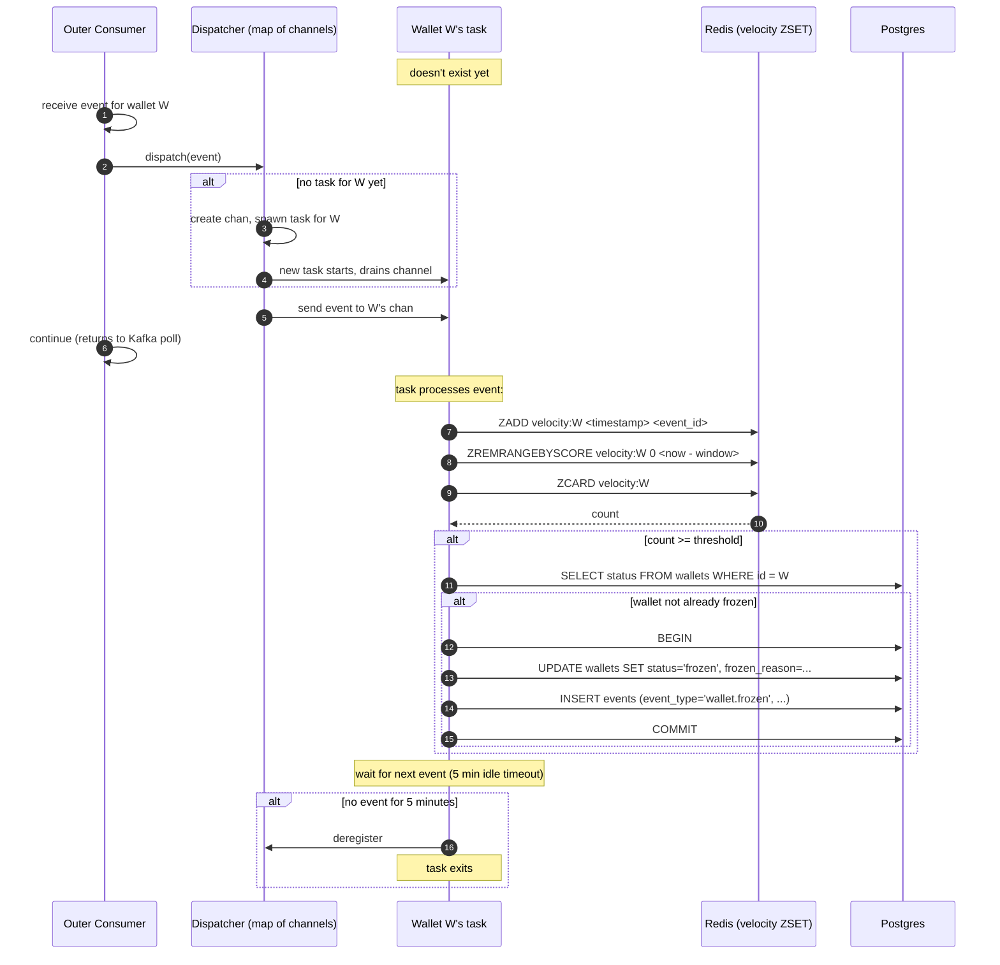

# 13: Fraud Worker

The Fraud Worker. The interesting twist: it *looks* like a per-wallet ordering problem, and the original design treated it as one — but the velocity computation is order-insensitive, so the real lesson is recognizing when a guarantee you assumed you needed isn't required at all. That recognition is what lets the worker scale to ≥2 replicas the easy way.

## What it does

The Fraud Worker is a **detective control**, not a preventative one. It watches the topic of transfer requests and looks for patterns that suggest abuse, primarily velocity, the pattern where one wallet originates many transfers in a short window. When a threshold is exceeded, it freezes the offending wallet automatically. An operator can then investigate, decide whether the activity is legitimate, and unfreeze.

The word "detective" matters. The fraud worker does not gate transfers, it reads the same `job.requested` events from the Kafka `jobs` topic as the Ledger Worker (via the independent `fraud-workers` consumer group) and scores requests without blocking them. A preventative fraud system would sit in the request path, scoring each transfer before allowing it to proceed; that's a much harder system (latency-critical, needs synchronous model evaluation) and is deliberately out of scope. Reading `JobRequested` rather than completed-transfer events means the velocity count includes all attempts, even those that later fail validation, which is actually a stronger fraud signal.

The technically interesting part is what the fraud worker *doesn't* need. Velocity looks like a per-wallet ordering problem: it's a stateful count over a stream of events for one wallet, and "stateful + per-key" usually screams "process them in order." But the velocity window lives in a **shared Redis sorted set mutated by an atomic Lua script**, so two events for the same wallet processed concurrently — even on two different worker replicas — produce the same final set and the same count, in any order. The count is order-insensitive. So the worker needs **no per-wallet ordering guarantee at all**, which means it scales the easy way: ≥2 replicas in an ordinary consumer group, load-balancing the Kafka `jobs` topic freely. Recognizing that the hard-looking guarantee isn't required is the actual design insight.

The Webhook Worker *does* need per-merchant ordering, and pays for it with Kafka partitions (where Kafka ensures exactly one live consumer per partition, see [`12-WEBHOOK-WORKER.md`](12-WEBHOOK-WORKER.md)). The Fraud Worker deliberately does *not* go there: wallet cardinality is far higher than merchant cardinality and load is far more skewed, so wallet-sharded ownership would be costly — and, since the count needs no ordering, pointless. Instead the worker keeps a **two-level dispatch with lazy per-wallet tasks** purely as a *throughput optimization*: batching a wallet's events onto one in-process task cuts Redis round-trips and contention on the hot keys. It is not a correctness mechanism, and nothing breaks if two replicas both touch the same wallet — they funnel into the same atomic Redis state.

---

## Inputs, outputs, guarantees

**Inputs**

- `job.requested` events from the Kafka `jobs` topic, consumed by the `fraud-workers` consumer group. The fraud worker joins the same job topic as the Ledger Worker but as a _different_ consumer group, so both groups receive every message independently. Non-transfer job types are filtered out by the dispatcher.
- Wallet status from Postgres (to check whether a wallet is already frozen).

**Outputs**

- `FraudSuspected` events to the event store when a threshold is exceeded but the system hasn't yet decided to act.
- `WalletFrozen` events when auto-freeze triggers.
- Updates to `wallets.status` and `wallets.frozen_reason` when freezing.
- Velocity counters in Redis sorted sets (rolling window state).
- Metrics: events processed/sec, fraud signals emitted, wallets frozen, per-wallet task count.

**Guarantees**

- **Correct velocity counts regardless of order**: because the window is a shared Redis sorted set updated by an atomic script (keyed by `event_id`), concurrent or out-of-order processing of a wallet's events — across any number of replicas — yields the same count. Per-wallet ordering is *not* required and *not* claimed.
- **At-least-once processing**: a crash before commit results in redelivery and reprocessing. Velocity state in Redis is keyed by event_id, so duplicate processing of the same event doesn't double-count.
- **No false negatives within the threshold**: if N transfers occur for wallet W within window T, the system observes all N (in any order) and trips the threshold exactly when the count reaches N.

**Non-guarantees**

- **No false positives prevention**. Legitimate high-velocity activity (a payment processor with many recipients) will trip the threshold and freeze the wallet. The system errs on the side of false positive (freeze + investigate) rather than false negative (let fraud through). Operators unfreeze legitimate wallets after review.
- **No event ordering of any kind**. Events for different wallets, and even events for the *same* wallet, may be processed in any order; the count is order-insensitive, so none of it matters.
- **No detection of preventative fraud signals**. Out of scope; this is a post-hoc detection only.

---

## The mechanism

### Why ordering isn't required here, and what the dispatch is actually for

Start from the thing that makes this service unusual: **the velocity count does not depend on order.** The window is a Redis sorted set updated by an atomic Lua script (`ZADD` keyed by `event_id`, trim, `ZCARD`); processing a wallet's events in any order, on any replica, yields the same membership and the same count. So unlike the webhook worker, the fraud worker has no ordering guarantee to protect. That frees it to scale the easy way, and it changes what the in-process dispatch is *for*.

Walking the options with that in mind:

**Single consumer.** Serial, simple. Problem: throughput bounded by one consumer. (Ordering is a non-issue, so this buys nothing the others don't.)

**Consumer group, N replicas, no partitioning.** Throughput scales; a wallet's events may be processed concurrently by different replicas. For a system that needed per-wallet order this would be fatal, but here it's *fine*, because the shared atomic Redis state is the single writer, not any process. **This is the baseline the fraud worker uses.**

**Stream partitioned by wallet, with exclusive ownership.** This is what you'd build if you *did* need per-wallet ordering. It's avoided here for two reasons: wallet cardinality and load skew are far worse than merchants (a hot funding wallet does 1000 events/sec while most do one a week), making per-wallet shard ownership costly, and, since the count needs no ordering, it would be cost for nothing. (If a *future* rule needs true per-wallet sequencing, this is the mechanism it would adopt.)

**Two-level dispatch (kept, as an optimization).** On top of the plain consumer group, each worker routes events to an in-process per-wallet task. This is *not* for ordering; it's a throughput optimization, batching a wallet's events onto one task to cut Redis round-trips and contention on hot keys.


Properties (note: these are *throughput* properties, not correctness ones):

- **Per-wallet work is batched onto one in-process task**, which reduces Redis round-trips and contention on a hot wallet's keys. Within one process the task happens to process that wallet serially, but that's a side effect of the batching, not a guarantee the system relies on, correctness comes from the atomic Redis script, and two replicas may both hold a task for the same wallet.
- **Parallelism across wallets** because different wallets have different tasks running concurrently.
- **No advance configuration of wallet→shard mapping**. Tasks are spawned lazily on a wallet's first event. No pre-allocation; no surprise when a new wallet appears.
- **Load follows demand**. A hot wallet's task is busy; a cold wallet's idles and exits after a timeout to reclaim memory.
- **Outer consumer applies backpressure per wallet**. The dispatch is a channel send; if a per-wallet channel is full, the outer consumer blocks briefly, throttling that wallet specifically.

The pattern resembles **"actor per key"** from actor systems, but with an important difference: here it's an in-process performance optimization layered over shared atomic state, *not* the single-writer-of-record. The real single writer for a wallet's velocity is the atomic Redis script, which is exactly why the optimization can safely run on every replica at once.

### The lifecycle of a per-wallet task



Three things to notice:

- **The task is spawned on first event for that wallet, not pre-allocated.** Avoids a static configuration of "max wallets" and lets the system scale to whatever cardinality the workload produces.
- **The task exits after idle.** A wallet that hasn't been active for 5 minutes has its task cleaned up. If a new event arrives later, a fresh task is spawned. This bounds memory at any point in time to "number of currently-active wallets."
- **The outer consumer's commit is independent of the task's processing.** When does the outer consumer commit? See the next subsection, this is the subtle part.

### The commit question

When the outer consumer receives an event and dispatches it to a per-wallet channel, _when_ should it commit the Kafka offset?

Three options:

**Option A: commit immediately after dispatch (before the per-wallet task processes).**

- Pro: simple, doesn't block the outer consumer.
- Con: if the worker crashes after commit but before the task processed, the event is lost. The next worker won't get a redelivery (it was commited). Reconciliation might catch missed fraud events on its nightly run, but in the meantime, fraud goes undetected.

**Option B: commit only after the per-wallet task confirms processing.**

- Pro: durability, events are only commited when processed.
- Con: the outer consumer has to wait. If the per-wallet task is slow, the outer consumer blocks. Throughput limited. Also complicates the code significantly, you need a back-channel from task to dispatcher.

**Option C: commit immediately, accept that a worker crash can lose in-flight events, document the limitation.**

- The choice RRQ makes.

The reasoning: fraud is a _detective_ control. Missing an event in the velocity window because of a worker crash is unlikely (workers crash rarely, and only events in flight at that exact moment are affected, typically zero or one events per crash). When it does happen, the worst case is a fraud signal that would have fired a few seconds later fires a few seconds later than it should, or, in the absolute worst case, the threshold is crossed but the freeze isn't applied. The nightly reconciliation surfaces wallets with anomalous activity; an operator can review and freeze manually if the auto-freeze missed.

The alternative, durably tracking per-wallet processing state, would be a Postgres write per event, which would dominate the worker's throughput. For a non-critical detective control, that's the wrong tradeoff.

This is one place where RRQ accepts a known limitation. It's documented in [`STATUS.md`](../../STATUS.md) and surfaced in the README. A deployment that needs stronger guarantees would switch to Option B.

### Velocity computation with Redis sorted sets

The actual velocity check uses Redis sorted sets, scored by timestamp:

```
ZADD   velocity:wallet:W  <timestamp_ms>  <event_id>
ZREMRANGEBYSCORE  velocity:wallet:W_ID  0  <timestamp_ms - window_ms>
ZCARD  velocity:wallet:W
```

The sorted set acts as a sliding window. Each event adds a member scored by timestamp. The `ZREMRANGEBYSCORE` removes members older than the window. `ZCARD` returns the count of remaining members, the velocity over the window.

Properties:

- **Idempotent.** `ZADD` with the same member (event_id) doesn't double-count. Redelivery of an event doesn't inflate the velocity.
- **Bounded size.** The sorted set size is bounded by the velocity threshold's window size × max rate, so even hot wallets don't blow up the data structure.
- **Memory cost.** ~30 bytes per member in Redis. A window of 1000 events × millions of wallets is bounded; only currently-active wallets have non-empty sets.
- **Atomic.** All three operations can be packaged into a single Lua script for a true atomic transaction, ensuring the check is consistent with the state.

Rules are simple and configuration-driven. The default rule:

```yaml
- name: velocity_high
  window_seconds: 60
  threshold: 50
  action: freeze
  reason: "50+ transfers from wallet in 60 seconds"
```

Additional rules could include "100 transfers in 10 minutes" or "sudden geographic dispersion of recipients", adding rules is an enhancement, not an architectural change.

---

## Happy path walk-through

A wallet `wal_X` has been very active recently. Its 50th transfer in 60 seconds completes.

1. **API Gateway emits.** A transfer request from `wal_X` arrives; the API Gateway produces a `JobRequested` event to the Kafka `jobs` topic. The event embeds `job_id`, `merchant_id`, and the transfer payload including `from_wallet: wal_X`.

2. **Outer consumer reads.** Fraud worker's outer consumer task polls the Kafka `jobs` topic. Receives the event.

3. **Dispatch.** Outer consumer inspects the event's wallet_id (`wal_X`). Looks up `wal_X` in its in-process dispatcher map.
   - If a channel exists for `wal_X`: send the event to it.
   - If not: create a new channel, spawn a goroutine/task to drain it, register it in the map, send the event.
4. **Commit.** Outer consumer commits the Kafka offset. Done with this event.

5. **Per-wallet task processes.** The task for `wal_X` receives the event. It computes:

   ```
   now = current time in ms
   ZADD velocity:wallet:wal_X now <event_id>
   ZREMRANGEBYSCORE velocity:wallet:wal_X 0 (now - 60000)
   count = ZCARD velocity:wallet:wal_X
   ```

   Suppose count is 50.

6. **Threshold check.** 50 >= 50 (the rule's threshold). Action triggered.

7. **Check wallet status.** `SELECT status FROM wallets WHERE id = 'wal_X'`. Status is `active`.

8. **Apply freeze.**

   ```
   BEGIN
   UPDATE wallets SET status='frozen', frozen_reason='50+ transfers in 60s'
      WHERE id='wal_X' AND status='active';
   INSERT INTO events (event_id, event_type, aggregate_id, payload)
      VALUES (<new id>, 'wallet.frozen', 'wal_X', <payload with rule details>);
   COMMIT
   ```

   The `AND status='active'` guard makes this idempotent, if another worker froze the wallet in between our SELECT and UPDATE, we no-op.

9. **Emit metric.** `wallet_frozen_total{reason='velocity'}` increments.

The next time anyone tries to submit a transfer from `wal_X`, the Ledger Worker's posting transaction reads `status=frozen` under the wallet's row lock and rejects the transfer with `WALLET_FROZEN`. The downstream cascade (transfer fails, merchant webhook fires) follows naturally.

10. **Task continues.** The per-wallet task returns to `select`/`recv` on its channel, waiting for the next event for `wal_X`.

---

## Failure walk-throughs

### F1: Worker crashes after commit but before per-wallet task processed

The known limitation. Sequence:

1. Outer consumer receives event for `wal_X`.
2. Outer consumer dispatches to channel, commits the Kafka offset.
3. Worker is killed before the per-wallet task could `ZADD`.

Result: the event was commited (not redelivered) but its effect on velocity state was not recorded. If this happens to be the 50th event in the window, the freeze doesn't fire. The wallet continues operating.

Mitigation: nightly reconciliation re-derives velocity from event log. If a wallet shows anomalous patterns that the live system missed, the reconciliation surfaces it and an operator reviews. The reconciliation isn't designed specifically for fraud signals, but it does provide a backstop.

This is documented as a known limitation. Real production would use Option B (durable processing tracking) or accept the looser guarantee on the grounds that fraud detection is best-effort anyway.

### F2: Per-wallet task panics on an event

A bug in the velocity rule or a malformed event causes the task to panic (Go).

Defensive handling:

- The dispatcher wraps task execution in `recover()` (Go).
- On panic, log the error with the event details, increment a `fraud_task_panic_total` metric, drop the event, continue.
- The next event for the same wallet spawns a fresh task (since the old one died).

This is "fail-open" behavior, a bug skips fraud detection for one event rather than crashing the worker. For a detective control, this is correct. A preventative control would need to fail-closed (block the transfer if fraud check fails), but that's not what we're building.

### F3: Redis sorted set corrupted (data structure inconsistency)

Hypothetical: somehow the sorted set has spurious entries (e.g., due to a Redis bug or operational issue). The count is inflated.

The recovery: per-wallet tasks rebuild the sorted set from the durable `events` log on first event after a configured rebuild interval. Every attempt is persisted as a `job.requested` event — the gateway writes it in the same transaction as the `jobs` row (see [`10-API-GATEWAY.md`](10-API-GATEWAY.md)) — so the rebuild reads from there. Specifically, the task on every Nth event (or every N seconds, configurable) does:

```
DEL velocity:wallet:W
SELECT event_id, occurred_at FROM events
  WHERE event_type = 'job.requested'
    AND payload->>'from_wallet' = W
    AND occurred_at > NOW() - INTERVAL '60 seconds'
For each row: ZADD velocity:wallet:W <occurred_at_ms> <event_id>
```

This is expensive (a Postgres query), so we don't do it on every event. But periodic rebuilds catch drift. The `job.requested` events are the durable source of truth for transfer requests; the Redis sorted set is a cache of that data.

### F4: Outer consumer overwhelmed by dispatch

If the outer consumer can't keep up with topic throughput, lag grows. The bottleneck is:

- Read from Redis: fast.
- Inspect event, look up wallet_id in map: fast (sync.RWMutex / DashMap operations).
- Send to channel: blocks if the per-wallet channel is full.

If many wallets have full channels (overall slow processing), the outer consumer experiences backpressure. The mitigation is more replicas (sharing the consumer group) or tuning the per-wallet channel buffer size.

### F5: A wallet's task gets stuck

If a per-wallet task is blocked indefinitely (e.g., a stuck Postgres query), its channel fills up, the outer consumer blocks on send, and overall throughput collapses. Mitigations:

- Per-task context with timeout: `SELECT ... timeout 5s`. Any Postgres operation has a bounded time budget.
- Task watchdog: a side goroutine that detects tasks not progressing and kills them.

RRQ implements the timeout; the watchdog is a known follow-up, not yet built.

### F6: Per-wallet task count grows without bound (memory pressure)

Each task consumes goroutine/task overhead (~2KB for goroutines, similar for tokio tasks). Millions of active wallets would mean gigabytes of task overhead.

Mitigation: idle timeout. Tasks exit after 5 minutes without an event. The active task count tracks the active-wallet count, which is much smaller than total-wallet count.

Metric: `fraud_active_tasks_gauge` exposes the count. If it exceeds a configured limit, the worker stops spawning new tasks and processes those events serially in the outer consumer's context, degraded mode but bounded resource use.

---

## Code skeleton (Go reference)

The Go version uses goroutines, channels, and a `sync.RWMutex`-guarded map.

```go
// Package fraud implements the Fraud Worker.
//
// The velocity computation is order-insensitive (atomic Redis sorted sets),
// so this worker needs no per-wallet ordering guarantee. The two-level
// dispatch is a throughput optimization, not a correctness mechanism.

type Worker struct {
    redis    *redis.Client
    db       *pgxpool.Pool
    kafka    *kafka.Reader   // jobs topic, group "fraud-workers"
    rules    []VelocityRule
    metrics  *Metrics

    // Per-wallet dispatch.
    mu       sync.RWMutex
    tasks    map[WalletID]*walletTask

    // Tuning.
    perWalletBufferSize int           // default 64
    idleTimeout         time.Duration // default 5 min
}

type walletTask struct {
    ch       chan Event
    cancel   context.CancelFunc
    lastSeen atomic.Int64    // unix nanos, updated on each event received
}

func (w *Worker) Run(ctx context.Context) error {
    // Start the idle-task reaper.
    go w.reapIdleTasks(ctx)

    // Main consume loop. A plain consumer group on the jobs topic — no
    // partitioning, because the velocity count is order-insensitive.
    for {
        msg, err := w.kafka.FetchMessage(ctx)
        if err != nil {
            if ctx.Err() != nil {
                w.shutdown()
                return ctx.Err()
            }
            continue // transient read error; retry
        }
        w.dispatch(ctx, msg)
        // Commit immediately after dispatch. See F1 for the tradeoff.
        _ = w.kafka.CommitMessages(ctx, msg)
    }
}

// dispatch routes an event to its wallet's task, spawning the task if needed.
func (w *Worker) dispatch(ctx context.Context, msg kafka.Message) {
    event, err := parseEvent(msg)
    if err != nil || !w.relevantEventType(event) {
        return
    }

    walletID := event.WalletID

    // Fast path: read lock, find existing task.
    w.mu.RLock()
    task, ok := w.tasks[walletID]
    w.mu.RUnlock()

    if !ok {
        // Slow path: write lock, double-check, create task.
        w.mu.Lock()
        if task, ok = w.tasks[walletID]; !ok {
            task = w.spawnTask(ctx, walletID)
            w.tasks[walletID] = task
        }
        w.mu.Unlock()
    }

    task.lastSeen.Store(time.Now().UnixNano())

    select {
    case task.ch <- event:
        // Sent.
    case <-ctx.Done():
        return
    }
    // No default, we want backpressure. If the channel is full,
    // we block until the task drains one. This is intentional.
}

func (w *Worker) spawnTask(parentCtx context.Context, walletID WalletID) *walletTask {
    ctx, cancel := context.WithCancel(parentCtx)
    task := &walletTask{
        ch:     make(chan Event, w.perWalletBufferSize),
        cancel: cancel,
    }

    go func() {
        defer func() {
            if r := recover(); r != nil {
                w.metrics.TaskPanic.WithLabelValues(string(walletID)).Inc()
                // Log details, do not re-panic.
            }
        }()

        for {
            select {
            case <-ctx.Done():
                return
            case event, ok := <-task.ch:
                if !ok {
                    return
                }
                w.processEvent(ctx, walletID, event)
            }
        }
    }()

    w.metrics.ActiveTasks.Inc()
    return task
}

func (w *Worker) processEvent(ctx context.Context, walletID WalletID, event Event) {
    nowMs := time.Now().UnixMilli()
    velocityKey := fmt.Sprintf("velocity:wallet:%s", walletID)

    for _, rule := range w.rules {
        windowMs := int64(rule.WindowSeconds * 1000)

        // Atomic: add + trim + count, via Lua script.
        count, err := w.redis.Eval(ctx, velocityLuaScript, []string{velocityKey},
            nowMs, event.EventID, windowMs).Int()
        if err != nil {
            // Log and continue. Don't block on Redis errors.
            return
        }

        if int64(count) >= int64(rule.Threshold) {
            w.maybeFreezeWallet(ctx, walletID, rule, int(count))
        }
    }
}

func (w *Worker) maybeFreezeWallet(ctx context.Context, walletID WalletID, rule VelocityRule, observedCount int) {
    tx, err := w.db.Begin(ctx)
    if err != nil {
        return
    }
    defer tx.Rollback(ctx)

    // Idempotent update: only succeed if currently active.
    result, err := tx.Exec(ctx, `
        UPDATE wallets
        SET status = 'frozen', frozen_reason = $2
        WHERE id = $1 AND status = 'active'
    `, walletID, rule.Reason)
    if err != nil {
        return
    }
    if result.RowsAffected() == 0 {
        // Already frozen or doesn't exist.
        return
    }

    // Emit event.
    eventID := ulid.New()
    payload, _ := proto.Marshal(&events.WalletFrozen{
        WalletId: string(walletID),
        Reason:   rule.Reason,
        FrozenBy: "system",
    })

    _, err = tx.Exec(ctx, `
        INSERT INTO events (event_id, event_type, aggregate_type, aggregate_id, payload, occurred_at)
        VALUES ($1, 'wallet.frozen', 'wallet', $2, $3, NOW())
    `, eventID, walletID, payload)
    if err != nil {
        return
    }

    if err := tx.Commit(ctx); err == nil {
        w.metrics.WalletsFrozen.WithLabelValues(rule.Name).Inc()
    }
}

// reapIdleTasks runs periodically to clean up tasks that have been idle.
func (w *Worker) reapIdleTasks(ctx context.Context) {
    ticker := time.NewTicker(30 * time.Second)
    defer ticker.Stop()

    for {
        select {
        case <-ctx.Done():
            return
        case <-ticker.C:
            now := time.Now().UnixNano()
            deadline := now - int64(w.idleTimeout)

            w.mu.Lock()
            for walletID, task := range w.tasks {
                if task.lastSeen.Load() < deadline {
                    task.cancel()
                    close(task.ch)
                    delete(w.tasks, walletID)
                    w.metrics.ActiveTasks.Dec()
                }
            }
            w.mu.Unlock()
        }
    }
}
```

The Lua script for atomic velocity computation:

```lua
-- KEYS[1] = velocity:wallet:<id>
-- ARGV[1] = now_ms
-- ARGV[2] = event_id
-- ARGV[3] = window_ms

redis.call('ZADD', KEYS[1], ARGV[1], ARGV[2])
redis.call('ZREMRANGEBYSCORE', KEYS[1], 0, ARGV[1] - ARGV[3])
redis.call('PEXPIRE', KEYS[1], ARGV[3] * 2)  -- TTL prevents long-idle sets from growing
return redis.call('ZCARD', KEYS[1])
```

Key implementation points:

- **`sync.RWMutex` with double-check on miss.** The fast path (read lock, look up task) handles 99% of dispatches. Only the first event for a given wallet takes the write lock. The double-check pattern (RLock → miss → Lock → check again) avoids a race where two outer-consumer goroutines could both decide to spawn a task for the same wallet.
- **Channel send has no default case.** That's intentional backpressure. If the channel is full (the per-wallet task is slow), the outer consumer blocks. This naturally slows the consumer group's consuming from the topic, allowing the slow wallet to catch up.
- **The reaper runs every 30s, not on every event.** Reaping on every event would require taking the write lock on every dispatch, defeating the read-lock optimization.

---


## Test plan

### Validates velocity-count correctness (the central property)

- **`TestVelocity_CountCorrectUnderConcurrency`**, emit N events for wallet W spread across *multiple fraud replicas* processing concurrently; assert the final `ZCARD` count is exactly N and the threshold trips at N, *regardless of processing order*. (Asserting a processing order here would test the optimization, not the guarantee.)
- **`TestVelocity_HighParallelism`**, emit 10000 events across 100 wallets; assert every wallet's count is correct while different wallets process in parallel (measure parallel task count as a throughput check, not an ordering check).
- **`TestVelocity_IdempotentRedelivery`**, redeliver the same `event_id`; assert the count doesn't double (set semantics on the member).

### Validates threshold detection

- **`TestThreshold_TripsAtN`**, emit N-1 events; assert no freeze. Emit one more; assert freeze.
- **`TestThreshold_RespectsWindow`**, emit N events spread over 2\*window; assert no freeze (events outside window don't count).
- **`TestThreshold_IdempotentRedelivery`**, emit same event twice; assert ZADD doesn't double-count (sorted set's set semantics on member).

### Validates auto-freeze

- **`TestFreeze_UpdatesWalletStatus`**, trip threshold; assert `wallets.status='frozen'`.
- **`TestFreeze_EmitsEvent`**, trip threshold; assert `events` table contains `wallet.frozen` with correct payload.
- **`TestFreeze_IdempotentOnRace`**, two threshold trips for same wallet simultaneously; assert only one `wallet.frozen` event written (the `AND status='active'` guard catches it).
- **`TestFreeze_RespectsAlreadyFrozen`**, wallet is already frozen for other reason; trip threshold; assert no second freeze event written.

### Validates task lifecycle

- **`TestTask_SpawnedLazily`**, fresh worker with no tasks; emit first event for W; assert task spawned, active count = 1.
- **`TestTask_IdleTimeoutCleansUp`**, emit event for W; advance time past idle timeout; trigger reaper; assert task gone, active count = 0.
- **`TestTask_NewEventAfterReapSpawnsFresh`**, task reaped; emit new event for W; assert new task spawned.

### Validates panic resilience

- **`TestPanic_OneEventDoesNotKillTask`**, inject a malformed event that causes panic; emit subsequent good events; assert worker continues processing, panic metric incremented.

### Chaos tests

- **`ChaosTest_WorkerKillDuringDispatch`**, kill worker mid-dispatch; verify next worker continues from Kafka poll cleanly (note: pre-commit events in dispatch are lost; this is documented).


---

## What this service depends on

- **Kafka** for the `jobs` topic (consume), and **Redis** sorted sets for velocity state.
- **Postgres**, wallet status reads, wallet status updates on freeze, event writes.
- **API Gateway / Outbox Relay**, produce the `job.requested` events this service consumes.

## What depends on this service

- **Ledger Worker**, reads `wallets.status` in its posting transaction. A frozen wallet causes transfers to fail.
- **Admin Dashboard**, operators can list frozen wallets, manually unfreeze.
- **Reconciliation**, reads `wallet.frozen` events as part of the full event audit.

---

## Where to read next

- How fraud fits the fleet model (≥2 replicas, plain consumer group) → [`../03-SCALING-AND-AVAILABILITY.md`](../03-SCALING-AND-AVAILABILITY.md)
- The reconciliation job that closes the loop on detection → [`14-RECONCILIATION.md`](14-RECONCILIATION.md)
