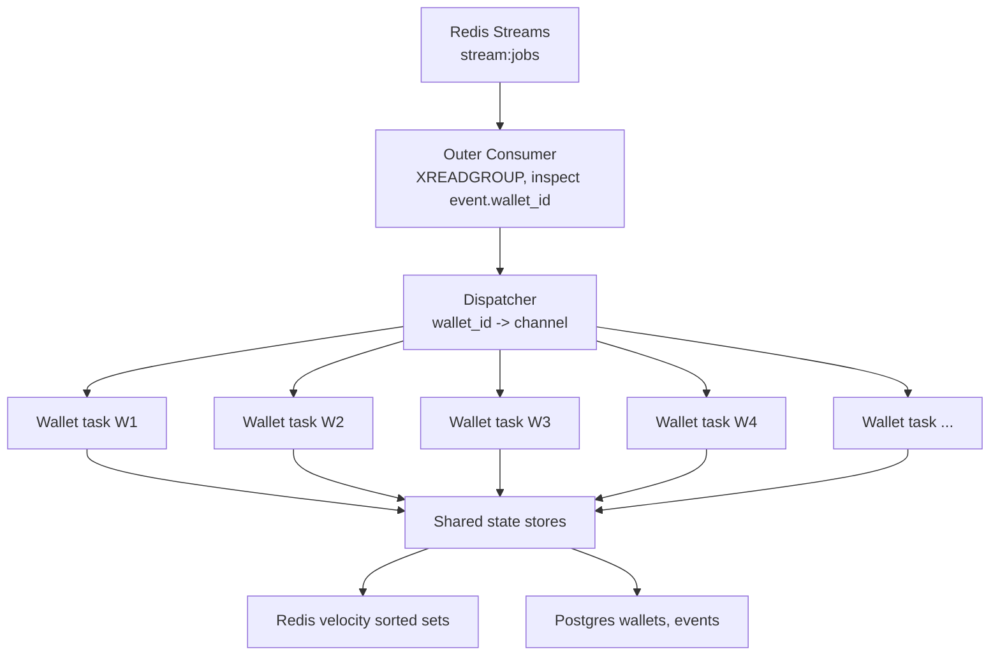
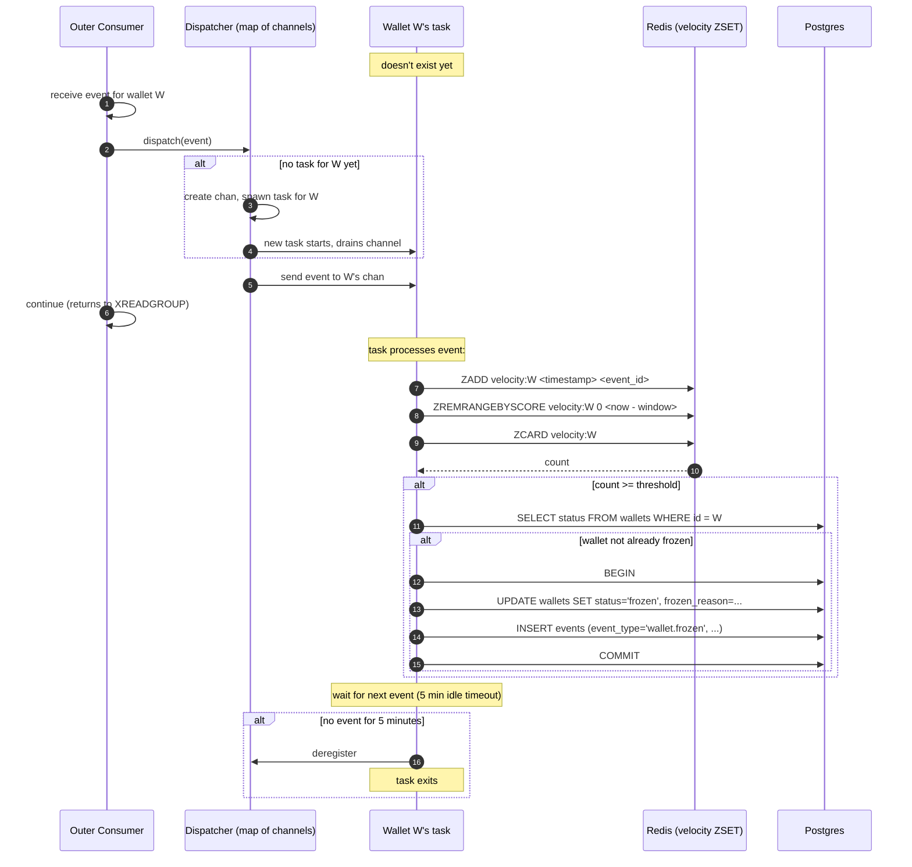

# 13 — Fraud Worker

> **What this is.** The service document for the Fraud Worker. The technically most interesting service in RRQ because of the per-key ordering problem at its center — solving it correctly is one of the project's signature talking points.
>
> **Reading time.** ~20 minutes.
>
> **Prerequisites.** Read [`11-SAGA-WORKER.md`](11-SAGA-WORKER.md). The fraud worker consumes events the saga worker produces.

---

## What it does

The Fraud Worker is a **detective control**, not a preventative one. It watches the stream of completed transfers and looks for patterns that suggest abuse — primarily velocity, the pattern where one wallet originates many transfers in a short window. When a threshold is exceeded, it freezes the offending wallet automatically. An operator can then investigate, decide whether the activity is legitimate, and unfreeze.

The word "detective" matters. The fraud worker runs _after_ transfers complete, not before — it doesn't gate transfers. A preventative fraud system would sit in the request path, scoring each transfer before allowing it to proceed; that's a much harder system (latency-critical, needs synchronous model evaluation) and is deliberately out of scope for v1.

What v1 _does_ solve is the technically interesting part: **per-wallet event ordering under horizontal scaling**. Velocity is a stateful computation over a stream of events for a specific wallet. The events must be processed in order — out-of-order processing produces incorrect counts and false signals. But the system has many wallets, and we want to process different wallets in parallel for throughput. The reconciliation between "per-wallet ordering" and "horizontal parallelism" is the design problem at the heart of this service.

The Webhook Worker solves a similar problem with stream partitioning (16 shards by merchant*id). The Fraud Worker could \_not* use the same approach because the cardinality of wallets is much higher than merchants (a merchant has many wallets), and even with high partition count, the load distribution across partitions would be highly uneven — a hot wallet would hash to a single partition and bottleneck its consumer. So the Fraud Worker uses a different mechanism: **two-level dispatch with lazy per-wallet tasks**.

---

## Inputs, outputs, guarantees

**Inputs**

- Events from `stream:jobs` consumed by the `fraud-workers` consumer group. The fraud worker joins the same job stream as the saga worker but as a _different_ consumer group — both groups receive every message independently.
- (Reading the same stream means we consume `JobRequested` events, but most fraud signals are computed from completed events; we filter for relevant types.)
- Wallet status from Postgres (to check whether a wallet is already frozen).

**Outputs**

- `FraudSuspected` events to the event store when a threshold is exceeded but the system hasn't yet decided to act.
- `WalletFrozen` events when auto-freeze triggers.
- Updates to `wallets.status` and `wallets.frozen_reason` when freezing.
- Velocity counters in Redis sorted sets (rolling window state).
- Metrics: events processed/sec, fraud signals emitted, wallets frozen, per-wallet task count.

**Guarantees**

- **Per-wallet event ordering**: events for wallet W are processed in their order of arrival on the stream. (Required for correctness of stateful detection.)
- **At-least-once processing**: a crash before ACK results in redelivery and reprocessing. Velocity state in Redis is keyed by event_id, so duplicate processing of the same event doesn't double-count.
- **No false negatives within the threshold**: if N transfers occur for wallet W within window T, the system observes them in order and trips the threshold exactly when N is reached.

**Non-guarantees**

- **No false positives prevention**. Legitimate high-velocity activity (a payment processor with many recipients) will trip the threshold and freeze the wallet. The system errs on the side of false positive (freeze + investigate) rather than false negative (let fraud through). Operators unfreeze legitimate wallets after review.
- **No global event ordering**. Events for wallet W1 and wallet W2 may be processed in either order; only per-wallet ordering matters.
- **No detection of preventative fraud signals**. Out of scope; this is a post-hoc detection only.

---

## The mechanism

### Why partitioning doesn't work here, and why lazy per-wallet tasks do

To understand the design, see why the simpler approaches break:

**Approach 1: single consumer.** One consumer, processes all events serially in order. Trivially correct for ordering. Problem: throughput bounded by one consumer. Doesn't scale.

**Approach 2: consumer group with N consumers, no partitioning.** Multiple consumers pull from the same stream and balance load. Throughput scales. Problem: ordering destroyed — two events for wallet W1 can be processed by two different consumers concurrently, and the second one might run first.

**Approach 3: stream partitioned by wallet_id (like webhooks).** Each shard owns a subset of wallets. Within a shard, events for the same wallet are serial. Problem: wallet cardinality is high (thousands or millions of wallets per merchant) and _load_ per wallet is highly skewed. A merchant's main funding wallet might generate 1000 events/sec while most wallets generate one event per day. Hashing wallets to shards distributes the _number_ of wallets evenly but distributes the _load_ unevenly — the shard with the hot wallet becomes the bottleneck. Adding more shards doesn't help because the hot wallet still hashes to one shard.

**Approach 4 (chosen): two-level dispatch.** Outer consumer reads any event from the stream. For each event, look at its `wallet_id` and route it to an in-process channel/queue dedicated to that wallet. A goroutine/task per wallet drains its channel serially.



Properties:

- **Per-wallet ordering preserved** because each wallet has exactly one task draining its channel. The task is single-threaded with respect to that wallet.
- **Parallelism across wallets** because different wallets have different tasks running concurrently.
- **No advance configuration of wallet→shard mapping**. Tasks are spawned lazily when a wallet's first event arrives. No pre-allocation; no surprise when a new wallet appears.
- **Load follows demand**. A hot wallet's task is constantly busy; a cold wallet's task spends most of its time idle. Idle tasks exit after a timeout to reclaim memory.
- **Outer consumer never blocks**. The dispatch is a non-blocking channel send. If a per-wallet channel is full (slow processing for that wallet), the outer consumer may block briefly — that's intentional backpressure on that wallet specifically.

The pattern has a name in the literature: **"actor per key"** or **"single-writer principle"**. It shows up in payment systems, financial engines, and game servers — anywhere per-entity state needs to be mutated by a single concurrent unit.

### The lifecycle of a per-wallet task



Three things to notice:

- **The task is spawned on first event for that wallet, not pre-allocated.** Avoids a static configuration of "max wallets" and lets the system scale to whatever cardinality the workload produces.
- **The task exits after idle.** A wallet that hasn't been active for 5 minutes has its task cleaned up. If a new event arrives later, a fresh task is spawned. This bounds memory at any point in time to "number of currently-active wallets."
- **The outer consumer's ACK is independent of the task's processing.** When does the outer consumer ACK? See the next subsection — this is the subtle part.

### The ACK question

When the outer consumer receives an event and dispatches it to a per-wallet channel, _when_ should it ACK the stream message?

Three options:

**Option A: ACK immediately after dispatch (before the per-wallet task processes).**

- Pro: simple, doesn't block the outer consumer.
- Con: if the worker crashes after ACK but before the task processed, the event is lost. The next worker won't get a redelivery (it was ACKed). Reconciliation might catch missed fraud events on its nightly run, but in the meantime, fraud goes undetected.

**Option B: ACK only after the per-wallet task confirms processing.**

- Pro: durability — events are only ACKed when processed.
- Con: the outer consumer has to wait. If the per-wallet task is slow, the outer consumer blocks. Throughput limited. Also complicates the code significantly — you need a back-channel from task to dispatcher.

**Option C: ACK immediately, accept that a worker crash can lose in-flight events, document the limitation.**

- The choice v1 makes.

The reasoning: fraud is a _detective_ control. Missing an event in the velocity window because of a worker crash is unlikely (workers crash rarely, and only events in flight at that exact moment are affected — typically zero or one events per crash). When it does happen, the worst case is a fraud signal that would have fired a few seconds later fires a few seconds later than it should — or, in the absolute worst case, the threshold is crossed but the freeze isn't applied. The nightly reconciliation surfaces wallets with anomalous activity; an operator can review and freeze manually if the auto-freeze missed.

The alternative — durably tracking per-wallet processing state — would be a Postgres write per event, which would dominate the worker's throughput. For a non-critical detective control, that's the wrong tradeoff.

This is one place where the v1 design accepts a known limitation. It's documented in [`STATUS.md`](../../STATUS.md) and surfaced in the README. A v2 deployment that needs stronger guarantees would switch to Option B.

### Velocity computation with Redis sorted sets

The actual velocity check uses Redis sorted sets, scored by timestamp:

```
ZADD   velocity:wallet:W  <timestamp_ms>  <event_id>
ZREMRANGEBYSCORE  velocity:wallet:W  0  <timestamp_ms - window_ms>
ZCARD  velocity:wallet:W
```

The sorted set acts as a sliding window. Each event adds a member scored by timestamp. The `ZREMRANGEBYSCORE` removes members older than the window. `ZCARD` returns the count of remaining members — the velocity over the window.

Properties:

- **Idempotent.** `ZADD` with the same member (event_id) doesn't double-count. Redelivery of an event doesn't inflate the velocity.
- **Bounded size.** The sorted set size is bounded by the velocity threshold's window size × max rate, so even hot wallets don't blow up the data structure.
- **Memory cost.** ~30 bytes per member in Redis. A window of 1000 events × millions of wallets is bounded; only currently-active wallets have non-empty sets.
- **Atomic.** All three operations can be packaged into a single Lua script for a true atomic transaction, ensuring the check is consistent with the state.

Rules in v1 are simple and configuration-driven. The default rule:

```yaml
- name: velocity_high
  window_seconds: 60
  threshold: 50
  action: freeze
  reason: "50+ transfers from wallet in 60 seconds"
```

Additional rules could include "100 transfers in 10 minutes" or "sudden geographic dispersion of recipients" — adding rules is an enhancement, not an architectural change.

---

## Happy path walk-through

A wallet `wal_X` has been very active recently. Its 50th transfer in 60 seconds completes.

1. **Saga Worker emits.** The completed transfer's saga writes `TransferCompleted` event. (Note: in v1, the fraud worker actually listens for `JobRequested` because it wants to count _all_ attempts including failed ones — pick one consistent strategy; this doc uses `TransferCompleted` for clarity.)

2. **Outer consumer reads.** Fraud worker's outer consumer task calls `XREADGROUP fraud-workers <consumer-id> COUNT 10 BLOCK 2000 STREAMS stream:jobs >`. Receives the event.

3. **Dispatch.** Outer consumer inspects the event's wallet_id (`wal_X`). Looks up `wal_X` in its in-process dispatcher map.
   - If a channel exists for `wal_X`: send the event to it.
   - If not: create a new channel, spawn a goroutine/task to drain it, register it in the map, send the event.
4. **ACK.** Outer consumer XACKs the message. Done with this event.

5. **Per-wallet task processes.** The task for `wal_X` receives the event. It computes:

   ```
   now = current time in ms
   ZADD velocity:wallet:wal_X now <event_id>
   ZREMRANGEBYSCORE velocity:wallet:wal_X 0 (now - 60000)
   count = ZCARD velocity:wallet:wal_X
   ```

   Suppose count is 50.

6. **Threshold check.** 50 >= 50 (the rule's threshold). Action triggered.

7. **Check wallet status.** `SELECT status FROM wallets WHERE id = 'wal_X'`. Status is `active`.

8. **Apply freeze.**

   ```
   BEGIN
   UPDATE wallets SET status='frozen', frozen_reason='50+ transfers in 60s'
      WHERE id='wal_X' AND status='active';
   INSERT INTO events (event_id, event_type, aggregate_id, payload)
      VALUES (<new id>, 'wallet.frozen', 'wal_X', <payload with rule details>);
   COMMIT
   ```

   The `AND status='active'` guard makes this idempotent — if another worker froze the wallet in between our SELECT and UPDATE, we no-op.

9. **Emit metric.** `wallet_frozen_total{reason='velocity'}` increments.

The next time anyone tries to submit a transfer from `wal_X`, the Saga Worker's `Validate` step sees `status=frozen` and rejects the transfer with `FAILURE_REASON_WALLET_FROZEN`. The downstream cascade (transfer fails, merchant webhook fires) follows naturally.

10. **Task continues.** The per-wallet task returns to `select`/`recv` on its channel, waiting for the next event for `wal_X`.

---

## Failure walk-throughs

### F1: Worker crashes after ACK but before per-wallet task processed

The known limitation. Sequence:

1. Outer consumer receives event for `wal_X`.
2. Outer consumer dispatches to channel, ACKs the stream message.
3. Worker is killed before the per-wallet task could `ZADD`.

Result: the event was ACKed (not redelivered) but its effect on velocity state was not recorded. If this happens to be the 50th event in the window, the freeze doesn't fire. The wallet continues operating.

Mitigation: nightly reconciliation re-derives velocity from event log. If a wallet shows anomalous patterns that the live system missed, the reconciliation surfaces it and an operator reviews. The reconciliation isn't designed specifically for fraud signals, but it does provide a backstop.

This is documented as a v1 limitation. Real production would use Option B (durable processing tracking) or accept the looser guarantee on the grounds that fraud detection is best-effort anyway.

### F2: Per-wallet task panics on an event

A bug in the velocity rule or a malformed event causes the task to panic (Go) or unwind (Rust).

Defensive handling:

- The dispatcher wraps task execution in `recover()` (Go) or a panic catch (Rust).
- On panic, log the error with the event details, increment a `fraud_task_panic_total` metric, drop the event, continue.
- The next event for the same wallet spawns a fresh task (since the old one died).

This is "fail-open" behavior — a bug skips fraud detection for one event rather than crashing the worker. For a detective control, this is correct. A preventative control would need to fail-closed (block the transfer if fraud check fails), but that's not what we're building.

### F3: Redis sorted set corrupted (data structure inconsistency)

Hypothetical: somehow the sorted set has spurious entries (e.g., due to a Redis bug or operational issue). The count is inflated.

The recovery: per-wallet tasks rebuild the sorted set from the event log on first event after a configured rebuild interval. Specifically, the task on every Nth event (or every N seconds, configurable) does:

```
DEL velocity:wallet:W
SELECT event_id, occurred_at FROM events
  WHERE aggregate_id = W
    AND event_type IN ('transfer.completed', 'transfer.requested')
    AND occurred_at > NOW() - INTERVAL '60 seconds'
For each row: ZADD velocity:wallet:W <ts_ms> <event_id>
```

This is expensive (a Postgres query), so we don't do it on every event. But periodic rebuilds catch drift. The event log is always the source of truth; the Redis structure is a cache.

### F4: Outer consumer overwhelmed by dispatch

If the outer consumer can't keep up with stream throughput, lag grows. The bottleneck is:

- Read from Redis: fast.
- Inspect event, look up wallet_id in map: fast (sync.RWMutex / DashMap operations).
- Send to channel: blocks if the per-wallet channel is full.

If many wallets have full channels (overall slow processing), the outer consumer experiences backpressure. The mitigation is more replicas (sharing the consumer group) or tuning the per-wallet channel buffer size.

### F5: A wallet's task gets stuck

If a per-wallet task is blocked indefinitely (e.g., a stuck Postgres query), its channel fills up, the outer consumer blocks on send, and overall throughput collapses. Mitigations:

- Per-task context with timeout: `SELECT ... timeout 5s`. Any Postgres operation has a bounded time budget.
- Task watchdog: a side goroutine that detects tasks not progressing and kills them.

v1 implements the timeout; the watchdog is v2.

### F6: Per-wallet task count grows without bound (memory pressure)

Each task consumes goroutine/task overhead (~2KB for goroutines, similar for tokio tasks). Millions of active wallets would mean gigabytes of task overhead.

Mitigation: idle timeout. Tasks exit after 5 minutes without an event. The active task count tracks the active-wallet count, which is much smaller than total-wallet count.

Metric: `fraud_active_tasks_gauge` exposes the count. If it exceeds a configured limit, the worker stops spawning new tasks and processes those events serially in the outer consumer's context — degraded mode but bounded resource use.

---

## Code skeleton (Go reference)

The Go version uses goroutines, channels, and a `sync.RWMutex`-guarded map.

```go
// Package fraud implements the Fraud Worker.
//
// The defining problem: per-wallet event ordering with horizontal parallelism.
// Solved by two-level dispatch (outer consumer + per-wallet goroutines).

type Worker struct {
    redis    *redis.Client
    db       *pgxpool.Pool
    rules    []VelocityRule
    metrics  *Metrics

    // Per-wallet dispatch.
    mu       sync.RWMutex
    tasks    map[WalletID]*walletTask

    // Tuning.
    perWalletBufferSize int           // default 64
    idleTimeout         time.Duration // default 5 min
}

type walletTask struct {
    ch       chan Event
    cancel   context.CancelFunc
    lastSeen atomic.Int64    // unix nanos, updated on each event received
}

func (w *Worker) Run(ctx context.Context) error {
    // Ensure consumer group exists.
    _ = w.redis.XGroupCreateMkStream(ctx, "stream:jobs", "fraud-workers", "$").Err()

    consumerID := fmt.Sprintf("fraud-%s", hostname())

    // Start the idle-task reaper.
    go w.reapIdleTasks(ctx)

    // Main consume loop.
    for {
        select {
        case <-ctx.Done():
            w.shutdown()
            return ctx.Err()
        default:
        }

        msgs, err := w.redis.XReadGroup(ctx, &redis.XReadGroupArgs{
            Group:    "fraud-workers",
            Consumer: consumerID,
            Streams:  []string{"stream:jobs", ">"},
            Count:    10,
            Block:    2 * time.Second,
        }).Result()
        if err != nil && err != redis.Nil {
            // Log, retry.
            continue
        }

        for _, stream := range msgs {
            for _, msg := range stream.Messages {
                w.dispatch(ctx, msg)
                // ACK immediately. See F1 in service doc for the tradeoff.
                w.redis.XAck(ctx, "stream:jobs", "fraud-workers", msg.ID)
            }
        }
    }
}

// dispatch routes an event to its wallet's task, spawning the task if needed.
func (w *Worker) dispatch(ctx context.Context, msg redis.XMessage) {
    event, err := parseEvent(msg)
    if err != nil || !w.relevantEventType(event) {
        return
    }

    walletID := event.WalletID

    // Fast path: read lock, find existing task.
    w.mu.RLock()
    task, ok := w.tasks[walletID]
    w.mu.RUnlock()

    if !ok {
        // Slow path: write lock, double-check, create task.
        w.mu.Lock()
        if task, ok = w.tasks[walletID]; !ok {
            task = w.spawnTask(ctx, walletID)
            w.tasks[walletID] = task
        }
        w.mu.Unlock()
    }

    task.lastSeen.Store(time.Now().UnixNano())

    select {
    case task.ch <- event:
        // Sent.
    case <-ctx.Done():
        return
    }
    // No default — we want backpressure. If the channel is full,
    // we block until the task drains one. This is intentional.
}

func (w *Worker) spawnTask(parentCtx context.Context, walletID WalletID) *walletTask {
    ctx, cancel := context.WithCancel(parentCtx)
    task := &walletTask{
        ch:     make(chan Event, w.perWalletBufferSize),
        cancel: cancel,
    }

    go func() {
        defer func() {
            if r := recover(); r != nil {
                w.metrics.TaskPanic.WithLabelValues(string(walletID)).Inc()
                // Log details, do not re-panic.
            }
        }()

        for {
            select {
            case <-ctx.Done():
                return
            case event, ok := <-task.ch:
                if !ok {
                    return
                }
                w.processEvent(ctx, walletID, event)
            }
        }
    }()

    w.metrics.ActiveTasks.Inc()
    return task
}

func (w *Worker) processEvent(ctx context.Context, walletID WalletID, event Event) {
    nowMs := time.Now().UnixMilli()
    velocityKey := fmt.Sprintf("velocity:wallet:%s", walletID)

    for _, rule := range w.rules {
        windowMs := int64(rule.WindowSeconds * 1000)

        // Atomic: add + trim + count, via Lua script.
        count, err := w.redis.Eval(ctx, velocityLuaScript, []string{velocityKey},
            nowMs, event.EventID, windowMs).Int()
        if err != nil {
            // Log and continue. Don't block on Redis errors.
            return
        }

        if int64(count) >= int64(rule.Threshold) {
            w.maybeFreezeWallet(ctx, walletID, rule, int(count))
        }
    }
}

func (w *Worker) maybeFreezeWallet(ctx context.Context, walletID WalletID, rule VelocityRule, observedCount int) {
    tx, err := w.db.Begin(ctx)
    if err != nil {
        return
    }
    defer tx.Rollback(ctx)

    // Idempotent update: only succeed if currently active.
    result, err := tx.Exec(ctx, `
        UPDATE wallets
        SET status = 'frozen', frozen_reason = $2
        WHERE id = $1 AND status = 'active'
    `, walletID, rule.Reason)
    if err != nil {
        return
    }
    if result.RowsAffected() == 0 {
        // Already frozen or doesn't exist.
        return
    }

    // Emit event.
    eventID := ulid.New()
    payload, _ := proto.Marshal(&events.WalletFrozen{
        WalletId: string(walletID),
        Reason:   rule.Reason,
        FrozenBy: "system",
    })

    _, err = tx.Exec(ctx, `
        INSERT INTO events (event_id, event_type, aggregate_type, aggregate_id, payload, occurred_at)
        VALUES ($1, 'wallet.frozen', 'wallet', $2, $3, NOW())
    `, eventID, walletID, payload)
    if err != nil {
        return
    }

    if err := tx.Commit(ctx); err == nil {
        w.metrics.WalletsFrozen.WithLabelValues(rule.Name).Inc()
    }
}

// reapIdleTasks runs periodically to clean up tasks that have been idle.
func (w *Worker) reapIdleTasks(ctx context.Context) {
    ticker := time.NewTicker(30 * time.Second)
    defer ticker.Stop()

    for {
        select {
        case <-ctx.Done():
            return
        case <-ticker.C:
            now := time.Now().UnixNano()
            deadline := now - int64(w.idleTimeout)

            w.mu.Lock()
            for walletID, task := range w.tasks {
                if task.lastSeen.Load() < deadline {
                    task.cancel()
                    close(task.ch)
                    delete(w.tasks, walletID)
                    w.metrics.ActiveTasks.Dec()
                }
            }
            w.mu.Unlock()
        }
    }
}
```

The Lua script for atomic velocity computation:

```lua
-- KEYS[1] = velocity:wallet:<id>
-- ARGV[1] = now_ms
-- ARGV[2] = event_id
-- ARGV[3] = window_ms

redis.call('ZADD', KEYS[1], ARGV[1], ARGV[2])
redis.call('ZREMRANGEBYSCORE', KEYS[1], 0, ARGV[1] - ARGV[3])
redis.call('PEXPIRE', KEYS[1], ARGV[3] * 2)  -- TTL prevents long-idle sets from growing
return redis.call('ZCARD', KEYS[1])
```

Key implementation points:

- **`sync.RWMutex` with double-check on miss.** The fast path (read lock, look up task) handles 99% of dispatches. Only the first event for a given wallet takes the write lock. The double-check pattern (RLock → miss → Lock → check again) avoids a race where two outer-consumer goroutines could both decide to spawn a task for the same wallet.
- **Channel send has no default case.** That's intentional backpressure. If the channel is full (the per-wallet task is slow), the outer consumer blocks. This naturally slows the consumer group's reading from the stream, allowing the slow wallet to catch up.
- **The reaper runs every 30s, not on every event.** Reaping on every event would require taking the write lock on every dispatch, defeating the read-lock optimization.

---

## Code skeleton (Rust reference)

The Rust version uses `DashMap` (lock-free concurrent map) and `tokio::spawn`:

```rust
//! Fraud Worker — two-level dispatch with lazy per-wallet tasks.
//!
//! The dispatcher uses DashMap to avoid lock contention on the hot path.
//! Per-wallet tasks are spawned via tokio::spawn and exit on idle timeout.

use dashmap::DashMap;
use tokio::sync::mpsc;

pub struct Worker {
    redis: redis::Client,
    db: PgPool,
    rules: Vec<VelocityRule>,

    tasks: Arc<DashMap<WalletId, WalletTask>>,
    per_wallet_buffer: usize,
    idle_timeout: Duration,
}

struct WalletTask {
    sender: mpsc::Sender<Event>,
    last_seen: Arc<AtomicU64>,  // unix nanos
}

impl Worker {
    pub async fn run(self: Arc<Self>) -> Result<()> {
        let me = self.clone();
        tokio::spawn(async move { me.reap_idle_tasks().await });

        self.clone().ensure_consumer_group().await?;
        let consumer_id = format!("fraud-{}", hostname());

        loop {
            let msgs = self.redis.xreadgroup_block(
                "fraud-workers", &consumer_id,
                &["stream:jobs"], ">",
                /*count=*/10, /*block_ms=*/2000,
            ).await?;

            for msg in msgs {
                self.dispatch(&msg).await;
                self.redis.xack("stream:jobs", "fraud-workers", &msg.id).await?;
            }
        }
    }

    async fn dispatch(&self, msg: &StreamMessage) {
        let event = match Event::from_message(msg) {
            Ok(e) if self.relevant(&e) => e,
            _ => return,
        };

        let wallet_id = event.wallet_id.clone();

        // DashMap entry API avoids the write-lock-on-miss pattern.
        // If absent, the closure runs while holding a shard lock;
        // other shards remain unblocked.
        let task = self.tasks.entry(wallet_id.clone()).or_insert_with(|| {
            self.spawn_task(wallet_id.clone())
        });

        task.last_seen.store(now_nanos(), Ordering::Relaxed);

        // Backpressure: blocks if the channel is full.
        if let Err(_) = task.sender.send(event).await {
            // Channel closed (task died). Will be re-spawned on next event.
            // Log a warning.
        }
    }

    fn spawn_task(&self, wallet_id: WalletId) -> WalletTask {
        let (tx, mut rx) = mpsc::channel::<Event>(self.per_wallet_buffer);
        let last_seen = Arc::new(AtomicU64::new(now_nanos()));
        let task = WalletTask { sender: tx, last_seen: last_seen.clone() };

        let redis = self.redis.clone();
        let db = self.db.clone();
        let rules = self.rules.clone();
        let metrics = self.metrics.clone();
        let wallet_id_for_task = wallet_id.clone();

        tokio::spawn(async move {
            // Catch panics so one bad event doesn't kill the task long-term.
            let result = AssertUnwindSafe(async {
                while let Some(event) = rx.recv().await {
                    process_event(&redis, &db, &rules, &wallet_id_for_task, event).await;
                }
            }).catch_unwind().await;

            if result.is_err() {
                metrics.task_panic.inc();
            }
        });

        self.metrics.active_tasks.inc();
        task
    }

    async fn reap_idle_tasks(self: Arc<Self>) {
        let mut ticker = tokio::time::interval(Duration::from_secs(30));
        loop {
            ticker.tick().await;
            let now = now_nanos();
            let deadline = now.saturating_sub(self.idle_timeout.as_nanos() as u64);

            self.tasks.retain(|_, task| {
                let last = task.last_seen.load(Ordering::Relaxed);
                if last < deadline {
                    // Dropping the WalletTask drops the sender, which closes
                    // the channel, which causes the task to exit naturally.
                    self.metrics.active_tasks.dec();
                    false
                } else {
                    true
                }
            });
        }
    }
}
```

The Rust version is structurally similar but uses different concurrency primitives. Note specifically:

- **`DashMap::entry().or_insert_with()`** is the equivalent of Go's double-check pattern, with shard-level locking rather than global locking. Different shards of the DashMap can be written concurrently. For a workload of many wallets, this matters.
- **`mpsc::channel`** with bounded buffer provides the same backpressure semantics as a Go buffered channel.
- **Dropping the `WalletTask` cascades to closing the sender, which causes the receive loop to exit when there are no more senders.** Idiomatic Rust async cleanup — no explicit cancel needed.
- **`catch_unwind`** catches panics in the task body so the task doesn't propagate the panic up to the runtime. Equivalent to Go's `recover()`.

The Go-vs-Rust comparison here is one of the most direct: same architecture, different concurrency idioms. The benchmarks should focus on this service for the headline "concurrency model" comparison.

---

## Test plan

### Validates per-wallet ordering (the central correctness property)

- **`TestOrdering_SameWallet`** — emit 1000 events for wallet W in known sequence; assert per-wallet task processes them in the same order (instrument the task with an in-test recorder).
- **`TestOrdering_HighParallelism`** — emit 10000 events distributed across 100 wallets, 100 events each; assert each wallet's sequence is preserved internally while different wallets process in parallel (measure parallel task count).

### Validates threshold detection

- **`TestThreshold_TripsAtN`** — emit N-1 events; assert no freeze. Emit one more; assert freeze.
- **`TestThreshold_RespectsWindow`** — emit N events spread over 2\*window; assert no freeze (events outside window don't count).
- **`TestThreshold_IdempotentRedelivery`** — emit same event twice; assert ZADD doesn't double-count (sorted set's set semantics on member).

### Validates auto-freeze

- **`TestFreeze_UpdatesWalletStatus`** — trip threshold; assert `wallets.status='frozen'`.
- **`TestFreeze_EmitsEvent`** — trip threshold; assert `events` table contains `wallet.frozen` with correct payload.
- **`TestFreeze_IdempotentOnRace`** — two threshold trips for same wallet simultaneously; assert only one `wallet.frozen` event written (the `AND status='active'` guard catches it).
- **`TestFreeze_RespectsAlreadyFrozen`** — wallet is already frozen for other reason; trip threshold; assert no second freeze event written.

### Validates task lifecycle

- **`TestTask_SpawnedLazily`** — fresh worker with no tasks; emit first event for W; assert task spawned, active count = 1.
- **`TestTask_IdleTimeoutCleansUp`** — emit event for W; advance time past idle timeout; trigger reaper; assert task gone, active count = 0.
- **`TestTask_NewEventAfterReapSpawnsFresh`** — task reaped; emit new event for W; assert new task spawned.

### Validates panic resilience

- **`TestPanic_OneEventDoesNotKillTask`** — inject a malformed event that causes panic; emit subsequent good events; assert worker continues processing, panic metric incremented.

### Chaos tests

- **`ChaosTest_WorkerKillDuringDispatch`** — kill worker mid-dispatch; verify next worker continues from XREADGROUP cleanly (note: pre-ACK events in dispatch are lost; this is documented).
- **`TurmoilTest_RedisPartition`** (Rust) — partition Redis; assert per-wallet tasks fail gracefully and resume after partition heals.

---

## What this service depends on

- **Redis** — the job stream (consume), sorted sets for velocity state.
- **Postgres** — wallet status reads, wallet status updates on freeze, event writes.
- **Saga Worker** — produces the events this service consumes.

## What depends on this service

- **Saga Worker** — reads `wallets.status` during `Validate`. A frozen wallet causes transfers to fail.
- **Admin CLI** — operators can list frozen wallets, manually unfreeze.
- **Reconciliation** — reads `wallet.frozen` events as part of the full event audit.

---

## Where to read next

- The reconciliation job that closes the loop on detection → [`14-RECONCILIATION.md`](14-RECONCILIATION.md)
- The ordering mechanisms across the system in depth → [`../deep-dives/22-ORDERING.md`](../deep-dives/22-ORDERING.md)

---

_Pass 2 of the architecture series. Last updated pre-implementation._
