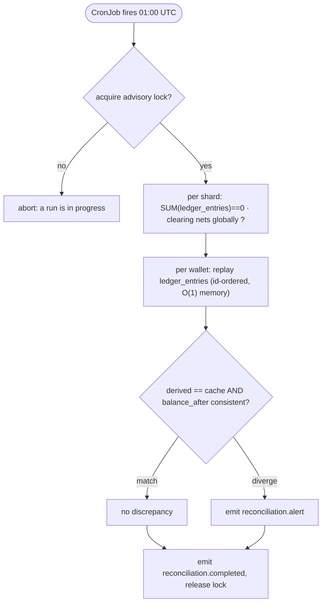

# 14: Reconciliation

The Reconciliation batch job. Smaller scope than the workers but architecturally crucial — it is the system's only out-of-band verification that the ledger is consistent with itself and with the projections derived from it.

## What it does

Reconciliation answers four questions that the live system should already guarantee but a bug could silently break:

1. **Does value conserve within a shard?** For each shard, `SUM(ledger_entries.amount)` over that shard's entries must be **exactly zero** (every intra-shard transfer writes equal-and-opposite legs), and within each transfer the debit and credit legs must be equal and opposite.
2. **Does money conserve across shards?** The shards' clearing accounts must net to zero — off only by transfers currently in flight — and no `cross_shard_transfer` may be stuck past its SLA ([→ `../deep-dives/29-LEDGER-SHARDING.md`](../deep-dives/29-LEDGER-SHARDING.md)).
3. **Are the projections honest?** Each wallet's `wallet_balance_cache` row must equal the balance *derived* from its `ledger_entries`.
4. **Was an active wallet ever negative?** Replaying a wallet's entries in `id` order, the running balance must never dip below zero while the wallet was active (I2), and each entry's stored `balance_after` must match the running sum.

The Ledger Worker writes both legs of an intra-shard transfer in one transaction (cross-shard transfers post each leg locally and are tied together through the clearing accounts), so by construction these properties hold. Reconciliation exists because "by construction" is a claim about code, and code has bugs. It runs nightly on a Kubernetes CronJob, replays the previous day's activity, and emits a `reconciliation.alert` event for any wallet or transfer that violates the above. **It never corrects** — divergence means a bug, and the failure mode of an incorrect auto-correction is worse than the failure mode of a discrepancy waiting for review.

A few things make this service interesting:

- **It's the only CPU-bound service.** Summing and replaying millions of `ledger_entries` is pure compute. This is where performance benchmarks say something meaningful.
- **It's the only service with no real-time pressure.** Once a day; whether it takes 30 s or 5 minutes barely matters operationally.
- **It's the safety net.** Without it, a transactional bug that, say, wrote a credit leg with the wrong sign would be invisible until someone noticed money was off.

The service is small — about 200 lines, no consumer loop, no concurrency primitives beyond a worker pool. The interest is in *what it computes* and *how it parallelizes*.

---

## Inputs, outputs, guarantees

**Inputs**
- Configuration: the time window to reconcile (default: previous 24 hours, with a safety margin).
- `ledger_entries`, `transfers`, `wallets`, and `wallet_balance_cache`.

**Outputs**
- A `reconciliation.completed` event recording the run.
- One `reconciliation.alert` event per wallet or transfer that diverges.
- A human-readable report to stdout (and a configured file path).
- Metrics: `reconciliation_run_duration_seconds`, `reconciliation_wallets_checked`, `reconciliation_discrepancies_total`.

**Guarantees**
- **Idempotent.** Re-running the same window produces the same alerts (de-duplicated by `(run_id, wallet_id)` at insert).
- **Read-only over operational data.** It only writes its own alert/completion events. The worst it can do is fail to run.
- **Complete over the window.** Every wallet with activity in the window is checked. No sampling.

**Non-guarantees**
- **Not real-time.** A discrepancy introduced today may not be detected until tomorrow's run.
- **Doesn't fix discrepancies.** It reports; an operator investigates and decides.

---

## The mechanism

### The checks, in plain English

For a window `[start, end - safety_margin]`:

**A. Per-shard conservation (one query per shard, the strongest check).**
```sql
SELECT COALESCE(SUM(amount), 0) FROM ledger_entries;   -- must be exactly 0, per shard
```
Each shard is internally balanced — every leg posted on it, including the clearing legs, has its equal-and-opposite pair on the same shard — so a shard's entries must sum to zero. A non-zero total means a leg was written without its pair: the single most important number in the system. Across shards, a separate small pass checks that the clearing accounts net to zero and no `cross_shard_transfer` is stuck ([→ `../deep-dives/29-LEDGER-SHARDING.md`](../deep-dives/29-LEDGER-SHARDING.md)).

**B. Per-transfer leg balance.** For every transfer that posted in the window, assert exactly one `debit` and one `credit` leg exist with equal magnitude. A missing or mismatched leg is a corruption alert.

**C. Projection honesty.** For each wallet with activity, compare the **derived balance** (`SUM(ledger_entries.amount)` for the wallet) against its `wallet_balance_cache.balance`. A mismatch means the projector drifted — not a money bug, but a read-path bug worth fixing.

**D. Per-wallet replay (ordering + non-negativity).** Replay the wallet's entries in `id` order, accumulating a running balance. Assert each entry's `balance_after` equals the running sum, and that an `active` wallet's running balance never went negative (I2/I4).

The interesting cases are where these fail:
- A leg written without its pair (check A/B) → a transactional bug in the Ledger Worker.
- A cache row that doesn't match the derived sum (check C) → a projector bug.
- A `balance_after` that doesn't match the replay (check D) → a write-path integrity bug.

### The algorithm in pseudocode

```
fn reconcile_window(start, end) -> Report:
    run_id = ULID()
    cutoff = end - safety_margin

    // A. per-shard conservation (this shard's ledger must net to zero)
    total = SELECT COALESCE(SUM(amount),0) FROM ledger_entries WHERE created_at < cutoff
    if total != 0: report.add_global_discrepancy(total)

    affected = SELECT DISTINCT wallet_id FROM ledger_entries
               WHERE created_at >= start AND created_at < cutoff

    parallel_for wallet_id in affected:
        entries = SELECT amount, balance_after FROM ledger_entries
                  WHERE wallet_id = wallet_id AND created_at < cutoff
                  ORDER BY id ASC                      // streaming cursor, O(1) memory

        derived = 0
        for e in entries:                              // checks D
            derived += e.amount
            if e.balance_after != derived: report.add_replay_discrepancy(wallet_id, ...)

        cached = SELECT balance FROM wallet_balance_cache WHERE wallet_id = wallet_id
        if derived != cached: report.add_projection_discrepancy(wallet_id, derived, cached)   // check C

    // B. per-transfer leg balance
    bad = SELECT transfer_id FROM ledger_entries WHERE created_at < cutoff
          GROUP BY transfer_id HAVING SUM(amount) != 0 OR COUNT(*) != 2
    for t in bad: report.add_leg_discrepancy(t)

    INSERT events (reconciliation.completed, summary(report))
    for d in report.discrepancies: INSERT events (reconciliation.alert, d)
    return report
```

A few details:

- **`parallel_for` is where the runtime comparison lives** — a worker pool sized to `runtime.NumCPU()`.
- **Entries are ordered by `id`, not `created_at`.** `id` is the monotonic `BIGSERIAL`; wall-clock can drift. (See `02-INVARIANTS.md` I4.)
- **`< cutoff`** applies the safety margin so a transaction that committed right at the boundary is fully visible to every query (see F1).
- **The whole thing is a read-only Postgres session.** It needs no transaction, just a long-lived connection.

### The shape of a discrepancy event

```json
{
  "event_id": "ev_01HQX...",
  "event_type": "reconciliation.alert",
  "occurred_at": "2026-05-12T01:00:00Z",
  "data": {
    "run_id": "rec_01HQX...",
    "kind": "projection_drift",
    "wallet_id": "wal_01HQX...",
    "derived_balance": 1500000,
    "cached_balance": 1500050,
    "delta": 50
  }
}
```

It lands in the `events` table like any other and is surfaced in the Admin Dashboard's reconciliation view.

---

## Availability and scale-out

Reconciliation is a batch job, but it still obeys the system-wide rule: **the function must not depend on a single pod or node.**

- **Idempotent, so a failed run is just re-run.** A crash mid-run writes no `reconciliation.completed`; the next run redoes the window from scratch and produces the same alerts. No partial state to recover.
- **≥2 candidates, leader-elected.** The run is guarded by a Postgres advisory lock (`pg_try_advisory_lock`): the CronJob, a manual trigger, and a standby may all be eligible, but exactly one wins and runs while others stand by. `concurrencyPolicy: Forbid` is the same guard at the scheduler level.
- **Fans out across CPU cores, per shard.** Each shard's run replays its window in parallel across cores (the `parallel_for`); within a shard, conservation is a local `SUM = 0`. The one cross-shard step is a small correlation pass — verify the clearing accounts net globally and no `cross_shard_transfer` is stuck past its SLA ([`../deep-dives/29-LEDGER-SHARDING.md`](../deep-dives/29-LEDGER-SHARDING.md)). See [`../03-SCALING-AND-AVAILABILITY.md`](../03-SCALING-AND-AVAILABILITY.md).

---

## Happy path walk-through



At 01:00 UTC the CronJob fires for window `[2026-05-11, 2026-05-12]`:

1. **Startup.** Connect to Postgres; read config; acquire the advisory lock.
2. **Per-shard conservation.** For each shard, `SELECT SUM(amount) FROM ledger_entries` → assert 0; then assert the shards' clearing accounts net globally.
3. **Find affected wallets.** `SELECT DISTINCT wallet_id FROM ledger_entries WHERE created_at ∈ window` → say 1,247.
4. **Fan out.** 8 worker tasks; distribute wallets.
5. **Per-wallet check.** Each worker derives the balance by replaying entries, checks each `balance_after`, and compares the total to `wallet_balance_cache`.
6. **Per-transfer legs.** One grouped query flags any transfer whose legs don't sum to zero or aren't a clean pair.
7. **Write events.** One `reconciliation.completed` with summary stats; one `reconciliation.alert` per discrepancy.
8. **Report to stdout, exit 0.**

```
Reconciliation run rec_01HQX...
  window: 2026-05-11T00:00:00Z .. 2026-05-12T00:00:00Z
  per-shard conservation:  OK (every shard sum = 0)
  wallets checked:      1247
  discrepancies:        0
  duration:             12.4s   (8 cores, 847,231 entries scanned)
```

---

## What a discrepancy looks like

```
Reconciliation run rec_01HQY...
  per-shard conservation:  OK (every shard sum = 0)
  wallets checked:      1283
  discrepancies:        1

  DISCREPANCY (projection_drift) in wallet wal_01HQZ...
    derived from ledger:  1,500,000 kobo (15,000.00 NGN)
    cached balance:       1,500,050 kobo (15,000.50 NGN)
    delta:                +50 kobo (cache is 50 higher than the ledger)

    Last 5 ledger entries:
      [id=8421] 2026-05-12T14:23:01Z  debit  -50,000  (tf_42)
      [id=8422] 2026-05-12T14:23:01Z  credit +50,000  (tf_43)
      ...
```

An operator would: inspect whether it's a *projection* drift (cache wrong, ledger right — re-run the projector for that wallet) or a *ledger* drift (the global `SUM` is non-zero — a far more serious write-path bug). The system does **not** auto-correct; the discrepancy persists until an operator addresses it (typically by fixing the bug and, if needed, posting an adjustment transfer that is itself a normal double-entry movement).

---

## Failure walk-throughs

### F1: Reconciliation runs while a transfer commits at the window boundary
The safety margin handles this. Reconciliation queries up to `end - 60 s`. A posting transaction is atomic, so it is either entirely before the cutoff (both legs visible) or entirely after (neither visible) — there is no torn read of "debit visible, credit not." The 60-second margin is belt-and-suspenders against clock skew between `created_at` values; with posting times in milliseconds it is ample.

### F2: Postgres reaches its connection limit
Reconciliation uses a separate Postgres role with a small pool (e.g., 4 connections) shared by the worker tasks, so its long reads can't starve operational queries.

### F3: A wallet has too many entries to fit in memory
Per-wallet iteration is a streaming cursor folded into a running sum, one row at a time — O(1) memory per wallet, regardless of history length.

### F4: Reconciliation crashes partway through
No `reconciliation.completed` is written; no alerts are written. Because the run is idempotent, the next run redoes the window from scratch. Restarting is cheap, so no incremental progress is tracked.

### F5: Two runs overlap
`concurrencyPolicy: Forbid` blocks the scheduler; manual runs check `pg_try_advisory_lock` and abort if it's held.

---

## Code skeleton (Go reference)

A worker pool sized to `runtime.NumCPU()`.

```go
// Package recon implements the Reconciliation batch.
//
// Invariants verified here:
//   I1 (conservation), I2 (no negative balance), I4 (per-wallet ordering),
//   I6 (immutable history: only reads are performed on the ledger).

type Runner struct {
    db              *pgxpool.Pool
    safetyMarginSec int    // default 60
    parallelism     int    // default runtime.NumCPU()
    runID           string
}

func (r *Runner) Run(ctx context.Context, windowStart, windowEnd time.Time) (*Report, error) {
    r.runID = ulid.New()
    cutoff := windowEnd.Add(-time.Duration(r.safetyMarginSec) * time.Second)

    if locked, err := r.acquireLock(ctx); err != nil || !locked {
        return nil, fmt.Errorf("could not acquire reconciliation lock")
    }
    defer r.releaseLock(ctx)

    report := &Report{RunID: r.runID, WindowStart: windowStart, WindowEnd: windowEnd}

    // A. per-shard conservation: this shard's ledger must net to zero.
    var total int64
    if err := r.db.QueryRow(ctx, `
        SELECT COALESCE(SUM(amount),0) FROM ledger_entries WHERE created_at < $1`,
        cutoff).Scan(&total); err != nil {
        return nil, err
    }
    if total != 0 {
        report.Global = &GlobalDiscrepancy{LedgerSum: total}
    }

    wallets, err := r.findAffectedWallets(ctx, windowStart, cutoff)
    if err != nil {
        return nil, err
    }
    report.WalletsChecked = len(wallets)

    // C+D. per-wallet replay and projection check, fanned out across cores.
    discrepancies := make(chan Discrepancy, len(wallets))
    sem := make(chan struct{}, r.parallelism)
    var wg sync.WaitGroup
    for _, id := range wallets {
        wg.Add(1)
        sem <- struct{}{}
        go func(id string) {
            defer wg.Done()
            defer func() { <-sem }()
            if d, _ := r.checkWallet(ctx, id, cutoff); d != nil {
                discrepancies <- *d
            }
        }(id)
    }
    go func() { wg.Wait(); close(discrepancies) }()
    for d := range discrepancies {
        report.Discrepancies = append(report.Discrepancies, d)
    }

    return report, r.persistReport(ctx, report)
}

// checkWallet replays the wallet's entries (streaming) and compares the
// derived balance to the cached projection and each stored balance_after.
func (r *Runner) checkWallet(ctx context.Context, walletID string, cutoff time.Time) (*Discrepancy, error) {
    rows, err := r.db.Query(ctx, `
        SELECT amount, balance_after FROM ledger_entries
        WHERE wallet_id = $1 AND created_at < $2 ORDER BY id ASC`, walletID, cutoff)
    if err != nil {
        return nil, err
    }
    defer rows.Close()

    var derived int64
    for rows.Next() {
        var amount, balanceAfter int64
        if err := rows.Scan(&amount, &balanceAfter); err != nil {
            return nil, err
        }
        derived += amount
        if balanceAfter != derived {
            return &Discrepancy{Kind: "balance_after", WalletID: walletID,
                Derived: derived, Stored: balanceAfter}, nil
        }
    }

    var cached int64
    if err := r.db.QueryRow(ctx,
        `SELECT balance FROM wallet_balance_cache WHERE wallet_id = $1`,
        walletID).Scan(&cached); err != nil {
        return nil, err
    }
    if derived != cached {
        return &Discrepancy{Kind: "projection_drift", WalletID: walletID,
            Derived: derived, Cached: cached, Delta: cached - derived}, nil
    }
    return nil, nil
}
```

Streaming via `rows.Next()` keeps memory O(1) even for a wallet with a million entries.

---

## Test plan

### Validates I1 (conservation)
- **`TestReconciliation_GlobalSumIsZero`** — seed 1,000 valid transfers; assert `SUM(ledger_entries.amount) = 0` and zero alerts.
- **`TestReconciliation_DetectsUnpairedLeg`** — inject a single credit leg with no debit; assert the per-shard sum alert fires.
- **`TestReconciliation_DetectsLegMismatch`** — inject a transfer whose legs have unequal magnitude; assert a per-transfer alert.

### Validates projection honesty (C) and replay (D)
- **`TestReconciliation_DetectsProjectionDrift`** — corrupt one `wallet_balance_cache` row; assert a `projection_drift` alert for that wallet.
- **`TestReconciliation_DetectsBadBalanceAfter`** — corrupt one `balance_after`; assert a `balance_after` alert.

### Validates idempotency / concurrency
- **`TestReconciliation_RerunSameWindow`** — run twice; assert identical alerts.
- **`TestReconciliation_ParallelRunsBlocked`** — start two runs; assert the second aborts on the advisory lock.

### Validates safety margin and scale
- **`TestReconciliation_BoundaryNoFalsePositive`** — a transfer committing right at the window end is fully in or out of the cutoff; assert no false positive.
- **Benchmark (scenario F):** seed 1,000,000 entries across 10,000 wallets; time the run; report duration, CPU utilization, peak memory, entries/sec. This is the published performance number.

---

## What this service depends on

- **Postgres** — heavy reads of `ledger_entries`, `transfers`, `wallets`, `wallet_balance_cache`.
- **Kubernetes CronJob** (or a cron container) — schedules the run.

## What depends on this service

- **Operators** — read the report, investigate alerts, decide actions.
- **Monitoring** — `reconciliation_discrepancies_total` is the most important business-level metric in the system.

---

## Where to read next

- How reconciliation stays HA → [`../03-SCALING-AND-AVAILABILITY.md`](../03-SCALING-AND-AVAILABILITY.md)
- The operator tooling that surfaces alerts → [`15-ADMIN-DASHBOARD.md`](15-ADMIN-DASHBOARD.md)
