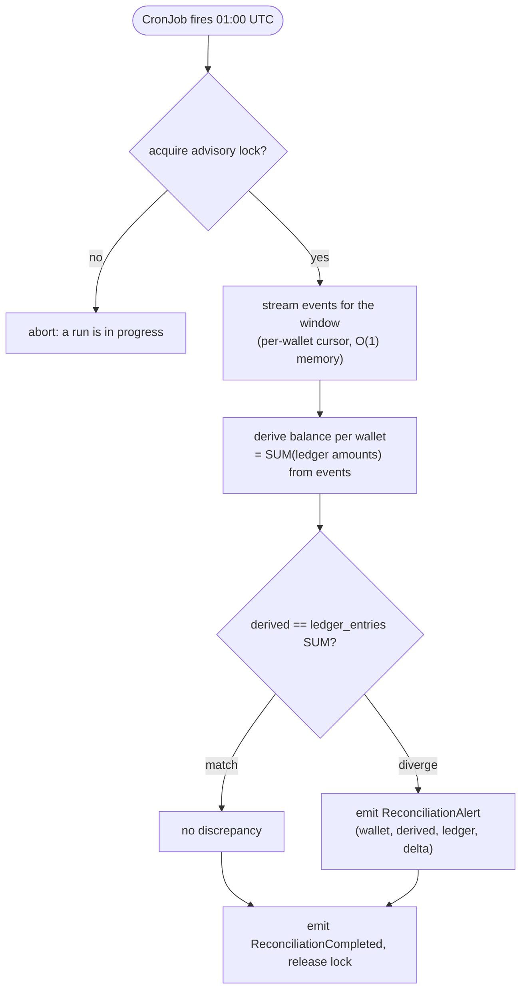

# 14: Reconciliation

> **What this is.** The service document for the Reconciliation batch job. Smaller scope than the consumers but architecturally crucial, it's the system's only out-of-band verification that the data is consistent with itself.
>
> **Reading time.** ~15 minutes.
>
> **Prerequisites.** [`../02-INVARIANTS.md`](../02-INVARIANTS.md), particularly **I1** (conservation of value) and **I6** (immutable history).

---

## What it does

Reconciliation answers one question: **do the ledger entries agree with the event log?**

Every saga, when it succeeds, writes two things in the same database transaction: an event to the event log (`DebitApplied`, `CreditApplied`, etc.) and a ledger entry. They should always agree. If they ever don't, the system has a bug, and the bug is the kind that silently loses or creates money. Reconciliation runs nightly on a Kubernetes CronJob (manifest documented in [`../deep-dives/29-KUBERNETES.md`](../deep-dives/29-KUBERNETES.md)), replays the event log for the previous 24 hours, computes derived balances, compares them to the ledger, and emits a `ReconciliationAlert` for any wallet where the two diverge.

A few things make this service interesting:

- **It's the only CPU-bound service in the system.** Replaying a million events involves iterating, decoding, accumulating, pure compute. This is where the Go-vs-Rust comparison says something meaningful, because HTTP throughput benchmarks tend to saturate the network before the runtime matters but reconciliation does not.
- **It's the only service with no real-time pressure.** It runs once a day; if it takes 30 seconds or 5 minutes, the choice doesn't materially affect operations. The runtime is interesting _as a benchmark_, not as an SLO.
- **It's the system's safety net.** Every other service has subtle ways it could write data inconsistently, a bug in the saga state machine, a transaction that committed events but lost ledger writes, a race during compensation. Reconciliation catches all of these out of band. Without it, those bugs would be invisible until somebody manually noticed.

The service is also small. About 200 lines of code in either language, no consumer loop, no concurrency primitives. The interest is entirely in _what it computes_ and _how it parallelizes the computation_.

---

## Inputs, outputs, guarantees

**Inputs**

- Configuration: time window to reconcile (default: previous 24 hours).
- Events from the `events` table within that window.
- Current ledger state from `ledger_entries`.
- Current wallet records from `wallets`.

**Outputs**

- A `ReconciliationCompleted` event recording the run.
- One `ReconciliationAlert` event per wallet that shows divergence.
- A human-readable report written to stdout (and to a configured file path).
- Metrics: `reconciliation_run_duration_seconds`, `reconciliation_wallets_checked`, `reconciliation_discrepancies_total`.

**Guarantees**

- **Idempotent.** Running reconciliation twice for the same window produces the same alerts. The events it writes (`ReconciliationCompleted`, `ReconciliationAlert`) are keyed by run_id, but rerunning the same window with a new run_id is safe, alerts are de-duplicated by `(run_id, wallet_id)` at insert.
- **Read-only over operational data.** Reconciliation does not modify wallets, ledger entries, or saga state. It only writes its own alert events. It cannot break the system; the worst it can do is fail to run.
- **Complete over the window.** Every wallet that had activity in the window is checked. No sampling, no shortcuts.

**Non-guarantees**

- **Not real-time.** Discrepancies introduced today may not be detected until tomorrow's run. Faster detection would mean running reconciliation more frequently, or adding inline integrity checks; that is a known tradeoff, not built.
- **Doesn't fix discrepancies.** If a discrepancy is found, reconciliation only reports it. An operator must investigate and decide what to do. Auto-correction is a deliberate non-feature, the failure mode of an incorrect auto-correction is worse than the failure mode of a discrepancy waiting for review.

---

## The mechanism

### The check, in plain English

For a given window `[start, end]`:

1. For each wallet that had activity in the window: load all events affecting that wallet in chronological order.
2. Replay the events to derive the wallet's balance at `end`. This is the **event-derived balance**.
3. Compute the wallet's balance directly from `ledger_entries` (sum of amounts up to `end`). This is the **ledger balance**.
4. The two numbers should be equal. If they're not, emit a `ReconciliationAlert` with both values and the delta.

The chronological replay matters: a wallet's balance at time T is the sum of all signed amounts in events up to T, applied in order. Out-of-order application would give the wrong answer for any check that depends on intermediate state (e.g., balance must remain ≥ 0 at all times).

In practice, for our event types and our ledger structure, the event-derived balance and the ledger balance are _both_ derived from "sum of signed amounts," so for most wallets the check is just two SUMs that should match. The interesting cases are where they don't, typically because:

- An event was written but the ledger entry wasn't (a transaction that committed events but the ledger insert was lost, would indicate a transactional bug).
- A ledger entry exists for a step that produced no event (impossible by design, but worth checking).
- An amount in an event doesn't match the corresponding ledger entry's amount (would indicate a data-integrity bug in writes).

### The algorithm in pseudocode

```
fn reconcile_window(start: Timestamp, end: Timestamp) -> Report:
    run_id = ULID()
    affected_wallets = SELECT DISTINCT aggregate_id
                       FROM events
                       WHERE aggregate_type = 'wallet'
                         AND occurred_at >= start AND occurred_at < end

    let report = Report::new(run_id, start, end)

    parallel_for wallet_id in affected_wallets:
        let events = SELECT * FROM events
                     WHERE aggregate_id = wallet_id
                       AND occurred_at < end
                     ORDER BY id ASC

        let derived = events.fold(0, |acc, event| acc + signed_amount(event))

        let ledger = SELECT COALESCE(SUM(amount), 0) FROM ledger_entries
                     WHERE wallet_id = wallet_id
                       AND created_at < end

        if derived != ledger:
            report.add_discrepancy(wallet_id, derived, ledger)

    INSERT events (event_type='reconciliation.completed', payload=summary(report))
    for discrepancy in report.discrepancies:
        INSERT events (event_type='reconciliation.alert', payload=discrepancy)

    return report
```

A few details:

- **The `parallel_for` is where the runtime comparison lives.** In Rust, `rayon::par_iter()` over the wallets. In Go, a fixed-size worker pool sized to `runtime.NumCPU()`. Both are conceptually doing the same thing, fan out the per-wallet computation across all CPU cores.
- **Events are ordered by `id`, not `occurred_at`.** The `id` column is a monotonic `BIGSERIAL`; `occurred_at` is a wall-clock timestamp that can drift slightly. For ordering events within a single wallet's history, `id` is authoritative. (See `02-INVARIANTS.md` I4.)
- **`< end`, not `<= end`.** Half-open intervals avoid double-counting events at the exact boundary if reconciliation runs are themselves chained.
- **The whole thing is in one read-only Postgres session.** Reconciliation reads a lot of data; it does not need a transaction, just a long-lived connection.

### The shape of a discrepancy event

```json
{
  "event_id": "ev_01HQX...",
  "event_type": "reconciliation.alert",
  "occurred_at": "2026-05-12T01:00:00Z",
  "data": {
    "run_id": "rec_01HQX...",
    "wallet_id": "wal_01HQX...",
    "window_start": "2026-05-11T00:00:00Z",
    "window_end": "2026-05-12T00:00:00Z",
    "derived_balance": 1500000,
    "ledger_balance": 1500050,
    "delta": 50,
    "delta_explanation": "ledger has 50 more than events explain"
  }
}
```

This event lands in the `events` table like any other, and it's also surfaced in the Admin Dashboard's reconciliation view (recent discrepancies, filterable by time window).

---

## Happy path walk-through



Suppose at 01:00 UTC, the CronJob fires for window `[2026-05-11T00:00:00Z, 2026-05-12T00:00:00Z]`.

1. **Startup.** Reconciliation container starts. Connects to Postgres. Reads configuration.

2. **Find affected wallets.**

   ```sql
   SELECT DISTINCT aggregate_id
   FROM events
   WHERE aggregate_type = 'wallet'
     AND occurred_at >= '2026-05-11T00:00:00Z'
     AND occurred_at <  '2026-05-12T00:00:00Z'
   ```

   Returns, say, 1,247 wallet IDs.

3. **Fan out.** Spawn 8 worker tasks (`runtime.NumCPU()`). Distribute the 1,247 wallets across workers as work items.

4. **Per-wallet check.** Each worker, for each wallet assigned to it:
   - Load all events for the wallet up to window end (`id`-ordered).
   - Compute derived balance: iterate events, sum signed amounts based on event type (`debit_applied` → negative, `credit_applied` → positive, `debit_reversed` → positive).
   - Query `SELECT SUM(amount) FROM ledger_entries WHERE wallet_id = $1 AND created_at < $2`.
   - Compare. If equal, log "OK" and move on. If not equal, append a `Discrepancy` to a thread-safe `Vec`/slice.

5. **Wait for all workers.** Join.

6. **Write reconciliation events.**
   - One `ReconciliationCompleted` event with summary stats (wallets_checked, discrepancies_found, duration).
   - One `ReconciliationAlert` event per discrepancy.

7. **Write the human-readable report** to stdout. Format:

   ```
   Reconciliation run rec_01HQX...
     window: 2026-05-11T00:00:00Z .. 2026-05-12T00:00:00Z
     wallets checked: 1247
     discrepancies:   0
     duration:        12.4s
     CPU:             8 cores
     events scanned:  847,231
   ```

8. **Exit 0.** CronJob marks the run successful.

For a healthy system, the report has zero discrepancies and the only events written are the `ReconciliationCompleted` record.

---

## What a discrepancy looks like

When a discrepancy is detected, the output looks like:

```
Reconciliation run rec_01HQY...
  window: 2026-05-12T00:00:00Z .. 2026-05-13T00:00:00Z
  wallets checked: 1283
  discrepancies:   1
  duration:        13.1s

  DISCREPANCY in wallet wal_01HQZ...
    derived from events:  1,500,000 kobo (15,000.00 NGN)
    ledger balance:       1,500,050 kobo (15,000.50 NGN)
    delta:                +50 kobo (ledger is 50 higher than events explain)

    Last 10 events for this wallet:
      [id=8421] 2026-05-12T14:23:01Z  debit_applied   -50,000  (saga_42)
      [id=8422] 2026-05-12T14:23:01Z  credit_applied  +50,000  (saga_42)
      ...
```

The output is for operators. The same data is also in the `ReconciliationAlert` event for programmatic consumption.

What would an operator do?

1. Investigate which saga produced the discrepancy. The ledger has an extra 50 kobo, either a credit happened without a corresponding event, or an event existed for a debit that no ledger entry matched.
2. Query `ledger_entries` directly: which entries exist for this wallet that don't have a corresponding event?
3. Find the bug. Most likely a recent code change.
4. Decide whether to manually correct (insert an adjustment event documenting the correction), or revert the bug and let the next reconciliation see whether the issue persists.

The system does _not_ auto-correct. The discrepancy stays in the data until an operator addresses it. Subsequent reconciliations will continue to surface it as long as it exists.

---

## Failure walk-throughs

### F1: Reconciliation runs while sagas are in progress at window boundary

The window is `[T1, T2]`. At exactly T2, a saga is in the middle of committing, it has written `DebitApplied` to events but the ledger row hasn't been inserted yet. Reconciliation reads events at T2: includes the DebitApplied. Reads ledger at T2: does not include the matching debit entry. Sees a discrepancy.

This is a false positive. Mitigation: reconciliation runs with a **safety margin**, querying events and ledger up to `T2 - 60 seconds`. Any saga that committed within the safety margin has had 60 seconds for the transaction to be visible to both queries. With our saga step times measured in milliseconds, 60 seconds is plenty.

The safety margin is a tunable. RRQ uses 60 seconds.

### F2: Postgres reaches connection limit during run

Reconciliation queries are long; if too many run concurrently with operational queries, we could exhaust the connection pool.

Mitigation: reconciliation uses a separate Postgres user with a small connection limit (e.g., 4 connections) for its parallel queries. Even with 8 worker tasks, they share these 4 connections via a small pool. The trade-off: slightly slower reconciliation, but operational queries are protected.

### F3: A wallet has too many events to fit in memory

Theoretical concern. Practical case: a hot wallet with millions of events.

Mitigation: per-wallet event iteration is a streaming cursor, not a `Vec<Event>`. The events are folded into a running sum, one at a time, without keeping the full event list in memory. Memory usage is O(1) per wallet processed.

### F4: Reconciliation crashes partway through

If the container crashes (OOM, network issue, whatever) mid-run, the report is incomplete. No `ReconciliationCompleted` event is written; no alerts are written. The next run starts from scratch.

Because reconciliation is idempotent (running it again for the same window produces the same answers), crash recovery is trivial. Just rerun. RRQ doesn't bother with incremental progress because the run is fast enough that restarting is cheap.

### F5: Two reconciliation runs overlap

Possible if a manual run is triggered while the nightly cron is in progress, or if a cron run takes longer than 24 hours.

For the Kubernetes CronJob, `concurrencyPolicy: Forbid` prevents this, the scheduler refuses to start a new run while one is in progress. The requirement is captured in the K8s manifest.

For manual runs triggered from the Admin Dashboard, the run checks an advisory lock in Postgres before starting: `SELECT pg_try_advisory_lock(...)`. If the lock is held, the new run aborts with an error message. Operator can wait or check what's running.

---

## Code skeleton (Go reference)

The Go version uses a worker pool sized to `runtime.NumCPU()`.

```go
// Package recon implements the Reconciliation batch.
//
// Invariants verified here:
//   I1 (conservation of value), I4 (per-wallet ordering),
//   I6 (immutable history, implicit: only reads are performed on events).

type Runner struct {
    db             *pgxpool.Pool
    safetyMarginSec int        // default 60
    parallelism    int         // default runtime.NumCPU()
    runID          string
}

type Discrepancy struct {
    WalletID       string
    Derived        int64
    Ledger         int64
    Delta          int64
    LastEvents     []EventSummary  // for the report
}

func (r *Runner) Run(ctx context.Context, windowStart, windowEnd time.Time) (*Report, error) {
    r.runID = ulid.New()

    // Apply safety margin to window end.
    cutoff := windowEnd.Add(-time.Duration(r.safetyMarginSec) * time.Second)

    // Acquire advisory lock, prevents concurrent runs.
    locked, err := r.acquireLock(ctx)
    if err != nil || !locked {
        return nil, fmt.Errorf("could not acquire reconciliation lock")
    }
    defer r.releaseLock(ctx)

    // Find affected wallets.
    wallets, err := r.findAffectedWallets(ctx, windowStart, windowEnd)
    if err != nil {
        return nil, err
    }

    report := &Report{
        RunID:           r.runID,
        WindowStart:     windowStart,
        WindowEnd:       windowEnd,
        WalletsChecked:  len(wallets),
    }

    // Parallel check.
    var (
        wg            sync.WaitGroup
        discrepancies = make(chan Discrepancy, len(wallets))
        sem           = make(chan struct{}, r.parallelism)
    )

    for _, walletID := range wallets {
        wg.Add(1)
        sem <- struct{}{}
        go func(walletID string) {
            defer wg.Done()
            defer func() { <-sem }()

            disc, err := r.checkWallet(ctx, walletID, cutoff)
            if err != nil {
                // Log and continue; one wallet failure doesn't fail the run.
                return
            }
            if disc != nil {
                discrepancies <- *disc
            }
        }(walletID)
    }

    go func() {
        wg.Wait()
        close(discrepancies)
    }()

    for d := range discrepancies {
        report.Discrepancies = append(report.Discrepancies, d)
    }

    // Write reconciliation events.
    if err := r.persistReport(ctx, report); err != nil {
        return nil, err
    }

    return report, nil
}

func (r *Runner) checkWallet(ctx context.Context, walletID string, cutoff time.Time) (*Discrepancy, error) {
    derived, err := r.deriveBalance(ctx, walletID, cutoff)
    if err != nil {
        return nil, err
    }

    var ledger int64
    err = r.db.QueryRow(ctx, `
        SELECT COALESCE(SUM(amount), 0)
        FROM ledger_entries
        WHERE wallet_id = $1 AND created_at < $2
    `, walletID, cutoff).Scan(&ledger)
    if err != nil {
        return nil, err
    }

    if derived == ledger {
        return nil, nil  // OK
    }

    // Diverged. Build discrepancy with context.
    lastEvents, _ := r.lastNEvents(ctx, walletID, cutoff, 10)

    return &Discrepancy{
        WalletID:   walletID,
        Derived:    derived,
        Ledger:     ledger,
        Delta:      ledger - derived,
        LastEvents: lastEvents,
    }, nil
}

func (r *Runner) deriveBalance(ctx context.Context, walletID string, cutoff time.Time) (int64, error) {
    rows, err := r.db.Query(ctx, `
        SELECT event_type, payload
        FROM events
        WHERE aggregate_type = 'wallet'
          AND aggregate_id = $1
          AND occurred_at < $2
        ORDER BY id ASC
    `, walletID, cutoff)
    if err != nil {
        return 0, err
    }
    defer rows.Close()

    var balance int64 = 0
    for rows.Next() {
        var eventType string
        var payload []byte
        if err := rows.Scan(&eventType, &payload); err != nil {
            return 0, err
        }

        amount := signedAmount(eventType, payload)
        balance += amount
    }

    return balance, rows.Err()
}

func signedAmount(eventType string, payload []byte) int64 {
    switch eventType {
    case "ledger.debit_applied":
        var e events.DebitApplied
        proto.Unmarshal(payload, &e)
        return -e.Amount
    case "ledger.credit_applied":
        var e events.CreditApplied
        proto.Unmarshal(payload, &e)
        return +e.Amount
    case "ledger.debit_reversed":
        var e events.DebitReversed
        proto.Unmarshal(payload, &e)
        return +e.Amount
    default:
        return 0  // Other event types don't affect balance.
    }
}
```

A note on streaming the events: the `rows.Next()` loop processes one event at a time. For a wallet with a million events, this never holds more than one event in memory. Critical for memory bounded-ness.

---

## Code skeleton (Rust reference)

The Rust version uses `rayon` for parallel iteration:

```rust
//! Reconciliation batch.
//!
//! Verifies invariants I1 and I4 are preserved across the database.

use rayon::prelude::*;
use sqlx::PgPool;

pub struct Runner {
    db: PgPool,
    safety_margin: Duration,
    parallelism: usize,
}

impl Runner {
    pub async fn run(&self, window_start: DateTime<Utc>, window_end: DateTime<Utc>) -> Result<Report> {
        let run_id = Ulid::new().to_string();
        let cutoff = window_end - chrono::Duration::from_std(self.safety_margin)?;

        // Advisory lock, prevents concurrent runs.
        let _lock = self.acquire_lock().await?;

        let wallets = self.find_affected_wallets(window_start, window_end).await?;

        // Convert wallets to a Vec; rayon needs that interface.
        // For each wallet, we'll spawn a blocking task to do the per-wallet check
        // because we want to use rayon's parallelism, which operates on a thread pool.
        // The async runtime handles dispatching the blocking work.

        let discrepancies: Vec<Discrepancy> = tokio::task::spawn_blocking({
            let db = self.db.clone();
            let wallets = wallets.clone();
            move || {
                rayon::ThreadPoolBuilder::new()
                    .num_threads(self.parallelism)
                    .build()
                    .unwrap()
                    .install(|| {
                        wallets
                            .par_iter()
                            .filter_map(|wallet_id| {
                                // Each thread blocks on its own queries.
                                // For Rust, we use a sync sqlx connection per thread,
                                // or push the async into a small runtime per thread.
                                // Implementation detail, abbreviated here.
                                check_wallet_sync(&db, wallet_id, cutoff).ok().flatten()
                            })
                            .collect()
                    })
            }
        }).await?;

        let report = Report {
            run_id,
            window_start,
            window_end,
            wallets_checked: wallets.len(),
            discrepancies,
        };

        self.persist_report(&report).await?;
        Ok(report)
    }
}

fn check_wallet_sync(db: &PgPool, wallet_id: &str, cutoff: DateTime<Utc>) -> Result<Option<Discrepancy>> {
    let derived = derive_balance(db, wallet_id, cutoff)?;
    let ledger = ledger_balance(db, wallet_id, cutoff)?;

    if derived == ledger {
        return Ok(None);
    }

    let last_events = last_n_events(db, wallet_id, cutoff, 10)?;

    Ok(Some(Discrepancy {
        wallet_id: wallet_id.to_string(),
        derived,
        ledger,
        delta: ledger - derived,
        last_events,
    }))
}

fn derive_balance(db: &PgPool, wallet_id: &str, cutoff: DateTime<Utc>) -> Result<i64> {
    // Streaming query equivalent. In sqlx, fetch_many() or a cursor pattern.
    // Iterate, accumulate, return total.
    let mut balance: i64 = 0;
    let mut cursor = db.fetch_events_streaming(wallet_id, cutoff)?;
    while let Some(event) = cursor.next()? {
        balance += signed_amount(&event)?;
    }
    Ok(balance)
}
```

**The Rust-Go runtime difference for this service.** Both spawn many parallel tasks; both make many database queries; the work is roughly the same. The interesting comparisons:

- **Allocation pattern.** Rust's `par_iter()` allocates the result Vec once; Go's goroutine-with-channels pattern allocates a closure per spawn. For a million wallets, the allocation cost adds up.
- **GC pressure.** Go's GC handles short-lived per-goroutine allocations well, but a high-throughput batch like this can push it into more frequent collections. The p99 latency of individual wallet checks may show GC pause spikes in Go but not Rust.
- **Parallelism efficiency.** Rayon's work-stealing scheduler tends to keep all cores at 100% utilization better than a fixed-size Go worker pool. For embarrassingly parallel work like this, Rayon wins by a measurable margin.

This is exactly the benchmark scenario where the comparison says something. Scenario F in `docs/appendices/43-BENCHMARK-METHODOLOGY.md` is specifically this run, measured.

---

## Test plan

### Validates I1 (conservation of value)

- **`TestReconciliation_FindsKnownDiscrepancy`**, manually insert a ledger entry without a matching event; run reconciliation; assert exactly one alert for that wallet.
- **`TestReconciliation_FindsKnownEventWithoutLedger`**, manually insert an event without a matching ledger entry; assert alert.
- **`TestReconciliation_HealthySystemHasNoAlerts`**, seed 1000 valid transfers; run reconciliation; assert zero alerts.

### Validates idempotency

- **`TestReconciliation_RerunSameWindow`**, run reconciliation; run again with same window (new run_id); assert second run produces the same alerts as the first.
- **`TestReconciliation_ParallelRunsBlocked`**, try to start two reconciliation runs concurrently; assert second one aborts on advisory lock.

### Validates safety margin

- **`TestReconciliation_SafetyMarginAvoidsBoundaryFalsePositive`**, start a saga right at window end; finish it inside the safety margin; assert no false positive (the saga's effects are entirely outside the cutoff).

### Validates correctness at scale

- **`TestReconciliation_LargeDataset`**, seed 100,000 events across 1,000 wallets; run reconciliation; assert correctness and measure duration. Used as a smoke test, not a benchmark.

### Benchmarks (scenario F)

Run as part of `make bench`:

- Seed 1,000,000 events across 10,000 wallets with known correctness.
- Time reconciliation for the Go implementation (and for the Rust comparison implementation once the Rust comparison is built).
- Report: total duration, CPU utilization, peak memory, events scanned per second.

The benchmark is the published comparison number for the reconciliation service.

---

## What this service depends on

- **Postgres**, heavy reads. Events, ledger_entries, wallets.
- **Kubernetes CronJob** (or simple cron container), schedules the run.

## What depends on this service

- **Operators**, read the report, investigate alerts, decide actions.
- **Monitoring**, `reconciliation_discrepancies_total` is the most important business-level metric in the system.

---

## Where to read next

- The operator tooling that surfaces alerts → [`15-ADMIN-DASHBOARD.md`](15-ADMIN-DASHBOARD.md)
- The event store design that makes this verification possible → [`../deep-dives/25-EVENT-STORE.md`](../deep-dives/25-EVENT-STORE.md)

---

_Pass 2 of the architecture series. Last updated pre-implementation._
