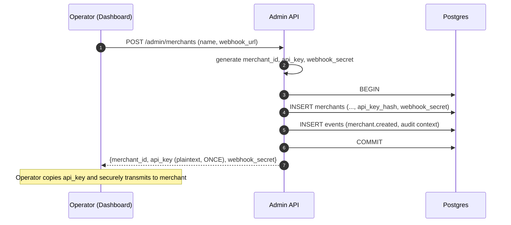

# 16 — Merchant & Wallet Lifecycle

> **What this is.** The service document covering the flows that *create* the entities the rest of the system operates on: merchants, wallets, API keys, JWTs, initial funding. Without these flows, RRQ is a transfer engine with nothing to transfer.
>
> **Reading time.** ~15 minutes.
>
> **Prerequisites.** Read [`10-API-GATEWAY.md`](10-API-GATEWAY.md). The flows here feed into the gateway's existing endpoints.

---

## What this service does

The other services (Gateway, Saga, Webhook, Reconciliation) assume merchants and wallets already exist. They don't address how those entities are created in the first place. This service does.

Three flows:

1. **Merchant onboarding.** Create a merchant record. Issue an API key. Configure the webhook URL and signing secret.
2. **Wallet provisioning.** Create wallets for a merchant. Mark wallet type (operational, customer, escrow). Optionally seed with initial funds (v1 only, for testing).
3. **JWT issuance.** Exchange an API key for a short-lived JWT used to call the merchant API.

These flows are all driven from the **Admin Dashboard** (the operator dashboard described in [`15-ADMIN-DASHBOARD.md`](15-ADMIN-DASHBOARD.md)). v1 does not expose self-service merchant registration via a public API; merchants are created by operators. v2 might add a merchant-facing signup flow with email verification, KYC checks, etc.

The service itself is small — it's mostly database writes wrapped in audit events. The interesting parts are the *funding model* (where money enters the system) and *wallet ownership semantics* (what does it mean for a merchant to "own" a wallet on behalf of an end-user).

---

## Wallet types

The original data model had a single `wallets` table with no type distinction. That's not sufficient for a real payment system. Wallets serve different purposes:

| Type | Purpose | Who can debit | Who can credit |
| --- | --- | --- | --- |
| `merchant_operational` | The merchant's own revenue / float | The merchant | The system (settlements, fees) |
| `customer` | A wallet the merchant manages on behalf of an end-user | The merchant (acting for the user) | Other wallets (deposits) |
| `escrow` | Held funds during a dispute (v2) | The system | The system |
| `platform` | Internal accounting wallets (fees, suspense) | Only operators | Only operators |

The `wallet_type` column on `wallets` carries this distinction. The Saga Worker's Validate step uses it for authorization: a customer wallet can only be debited by transfers initiated by its owning merchant; a platform wallet can only be touched by operator action.

For v1, you'll mostly use `merchant_operational` and `customer`. The other two are designed but unused.

---

## Merchant onboarding

The dashboard form collects:
- Display name (for ops UIs)
- Webhook URL (where notifications will be sent)
- Optional initial wallets to create

Operator submits. The system:

1. Generates a new `merchant_id` (`m_` + ULID).
2. Generates a strong random API key (32+ bytes, base64-encoded). Hashes with bcrypt; stores only the hash.
3. Generates a webhook signing secret (32+ bytes random). Stores it (encrypted at rest in production; plain in v1).
4. Inserts the merchant row with `status = 'active'`.
5. If initial wallets were specified, creates them (see "Wallet provisioning" below).
6. Returns the **raw API key once** to the dashboard. **This is the only time it appears.** The operator must capture and securely transmit it to the merchant.
7. Writes a `merchant.created` event with the operator's identity in the audit log.

The "raw key shown once" pattern is standard. It matches Stripe, AWS, GitHub. If the merchant loses it, they don't get it back — they ask the operator to rotate (generate a new one, invalidate the old).



The raw API key never appears in audit events (we'd be storing it permanently). The audit event records "an API key was issued for merchant m_X by operator ops_Y at time T" without the key itself.

---

## API key rotation and revocation

A merchant's API key gets leaked (committed to a public repo, exposed in logs, whatever). The operator needs to revoke and rotate.

The flow:

1. Operator clicks "Rotate API key" on the merchant's page in the dashboard.
2. Confirmation prompt (this is destructive — the merchant's current integration breaks).
3. System generates a new key, hashes it, replaces the stored hash, returns the new key once.
4. Writes an `merchant.api_key_rotated` event with operator identity.
5. The old key is now invalid. JWTs already issued from the old key remain valid until their natural expiry (typically one hour) — this is a window of risk we accept. A *true* revocation flow would require token revocation lists (TRL); v2 territory.

For v1, key rotation is a forced re-integration on the merchant's side. They get the new key, update their config, deploy, traffic resumes.

For comparison: Stripe lets you have multiple active keys with explicit names so you can rotate without downtime (create new key, deploy with new, revoke old). v2 would adopt this; v1 keeps it simpler.

---

## JWT issuance

API keys don't go on every request. Instead, the merchant exchanges their API key for a short-lived JWT, then uses the JWT on subsequent requests.

The flow:

1. Merchant calls `POST /v1/auth/token` with their API key in the Authorization header.
2. The Auth service (a small handler on the API Gateway) looks up the merchant by api_key_hash. Bcrypt-compares the provided key against the stored hash. On match, generates a JWT with claims `{sub: merchant_id, iat, exp = iat + 3600, tier}`.
3. Signs with the HS256 platform secret.
4. Returns the JWT.

The merchant uses this JWT on all subsequent requests. After an hour, they exchange the API key again for a fresh JWT. Most SDKs handle this transparently.

**Why JWTs and not just API keys?**

- Per-request lookup avoidance. With API keys, every request requires a database hit to verify the key. With JWTs, verification is signature-only (no DB hit). At scale this matters.
- Short-lived credentials. A leaked JWT expires in an hour; a leaked API key is forever (until rotated).
- Claims travel with the token. The merchant's tier, feature flags, etc. are in the JWT and available to every request handler without lookup.

For v1, HS256 with a shared secret is fine. v2 would use RS256 with rotating keys (better security; the platform signs with private key, validators have public key only).

---

## Wallet provisioning

Wallets are created by:
- The operator dashboard, on merchant onboarding or later.
- (v2) The merchant's own API, if we expose `POST /v1/wallets`.

v1 keeps it operator-only because wallets correspond to real-world value tracking; uncontrolled creation invites abuse and accounting confusion.

The flow:

1. Operator (or merchant, in v2) submits a wallet creation request:
    - `merchant_id` (the owning merchant)
    - `currency` (ISO 4217)
    - `wallet_type` (operational, customer, escrow, platform)
    - Optional: external reference (e.g., a customer ID from the merchant's system, for `customer` wallets)
2. System validates: the merchant exists and is active; the currency is supported; the wallet_type is valid for this context.
3. Generates `wallet_id` (`wal_` + ULID).
4. Inserts the wallet row with `status = 'active'` and balance derived from ledger (initially zero).
5. Writes `wallet.created` event.

The wallet has zero balance at this point. **It cannot send transfers until it has been funded** (see "Funding" below).

---

## Funding

This is the gap the original docs entirely missed.

Every wallet starts with zero balance. Transfers between wallets require positive balance on the source. So **how does the first money get into the system?**

In real production: it doesn't, from RRQ's perspective. RRQ moves value between wallets that represent claims on real funds held elsewhere (a bank account, a card network, etc.). External integrations credit wallets when money arrives at the bank; debit wallets when money leaves. RRQ is the ledger; the bank is the vault.

v1 doesn't have bank integration. So for development and demos, we need a way to seed wallets with starting balances. That's an explicit, deliberate operator action — not a transfer, not a transaction, just "this wallet now has X for testing purposes."

The mechanism: a special operator action `seed_wallet` that:

1. Takes a wallet_id and an amount.
2. Writes an `operator.seeded_wallet` event with explicit reasoning ("seeded for dev/test by operator_X").
3. Inserts a ledger entry attributed to the seed (not to any saga): `(wallet_id, amount, balance_after, saga_id='SEED_<run_id>', step_name='seed', event_id=...)`.
4. The `saga_id = 'SEED_*'` is recognizable; reconciliation knows it's not a normal saga.

This is *unambiguous* in audit logs. Anyone reviewing the wallet's history sees "seeded by operator X on date Y for reason Z" not "transfer from nowhere." The seed is its own thing.

**This action is disabled in production deployments.** A feature flag (`ALLOW_WALLET_SEEDING`) is `true` only in dev/staging environments. Production has the flag `false`; the dashboard hides the seed button; the API returns 403 if called. v2 with real bank integration removes the feature entirely.

For more on the funding model see [`../appendix/44-FUNDING-MODEL.md`](../appendix/44-FUNDING-MODEL.md).

---

## List-style queries (the gap in 42-API-REFERENCE)

The original API doc had `GET /v1/jobs/{id}` but nothing else for reading. A real merchant needs more.

These endpoints are added in v1:

| Method | Path | Returns |
| --- | --- | --- |
| GET | `/v1/wallets` | List wallets owned by this merchant, with current balance |
| GET | `/v1/wallets/{id}` | One wallet's details and balance |
| GET | `/v1/wallets/{id}/ledger?from=&to=` | Ledger entries in a time window |
| GET | `/v1/transfers?from=&to=&status=` | Transfers in a window, optionally filtered |
| GET | `/v1/webhooks?from=&to=` | Webhook delivery attempts to this merchant |

All scoped to the calling merchant (the JWT's `sub` claim). A merchant cannot query another merchant's data.

All paginated via `?cursor=` parameters. Cursor is base64-encoded `(last_seen_id, ordering)` so pagination is stable even as new rows are inserted.

These endpoints read from the projection tables (`wallet_balance_cache`, `ledger_entries`, `webhook_deliveries`). For point-in-time queries (audit), they fall through to the event log. The dashboard uses the same endpoints internally — the dashboard is a privileged consumer of the merchant API, not a separate access path.

---

## Wallet status changes

Wallets can be `active`, `frozen`, or `closed`. The transitions:

- **Operator freeze** (via dashboard): `active → frozen` with reason. Writes `wallet.frozen` event. Subsequent transfers from this wallet rejected by the saga's Validate step.
- **Operator unfreeze** (via dashboard): `frozen → active`. Writes `wallet.unfrozen` event with reason.
- **Fraud auto-freeze** (Fraud Worker): same as operator freeze but emitted by the system.
- **Closure** (via dashboard, rare): `active → closed`. A closed wallet cannot send or receive. The balance must be zero before closure (drain the wallet first). One-way transition; closed wallets cannot be reopened.

Closure exists for merchant-initiated shutdown of an end-user account. v1 supports the state but the closure flow is bare bones (manual operator action). v2 would automate the drain-and-close.

---

## Schema additions

The original `wallets` table needs:

```sql
ALTER TABLE wallets ADD COLUMN wallet_type TEXT NOT NULL DEFAULT 'merchant_operational'
    CHECK (wallet_type IN ('merchant_operational', 'customer', 'escrow', 'platform'));

ALTER TABLE wallets ADD COLUMN external_ref TEXT;
-- For customer wallets: the merchant's reference to the end-user this wallet represents.
-- Indexed for merchant lookups.

CREATE INDEX wallets_external_ref_idx ON wallets (merchant_id, external_ref)
    WHERE external_ref IS NOT NULL;
```

The `merchants` table needs:

```sql
ALTER TABLE merchants ADD COLUMN tier TEXT NOT NULL DEFAULT 'standard';
-- For future per-tier rate limiting, feature flags, etc.
```

No new tables. The audit events (`merchant.created`, `merchant.api_key_rotated`, `wallet.created`, `operator.seeded_wallet`) land in the existing `events` table.

---

## Test plan

All testable via the dashboard plus automated assertions.

- **`TestMerchant_OnboardingFlow`** — create merchant via API; assert row in `merchants`, audit event written, raw API key returned once.
- **`TestMerchant_ApiKeyHashing`** — verify api_key_hash stored as bcrypt hash, not plaintext.
- **`TestMerchant_DuplicateApiKey`** — extremely improbable; manually inject. Assert UNIQUE constraint catches it.
- **`TestMerchant_KeyRotation`** — rotate; assert old hash gone, new hash stored, audit event written.
- **`TestAuth_KeyToJWT`** — exchange API key for JWT; assert valid signature, correct claims, 1-hour expiry.
- **`TestAuth_InvalidKey`** — wrong key; 401.
- **`TestAuth_ExpiredKey`** — rotated key (now invalid); attempts to exchange; 401.
- **`TestWallet_CreationAndType`** — create wallets of each type; assert correct `wallet_type` stored; assert balance zero.
- **`TestWallet_SeedingDevOnly`** — in dev env, seed succeeds. In prod env (flag off), 403.
- **`TestWallet_SeedingAuditTrail`** — seed; assert `operator.seeded_wallet` event written with operator identity and reasoning.
- **`TestListEndpoints_Pagination`** — emit many wallets/transfers; assert pagination works; assert results scoped to merchant.
- **`TestListEndpoints_CrossMerchantIsolation`** — merchant A queries; assert merchant B's data not visible.
- **`TestWallet_Closure`** — close wallet with zero balance; succeeds. Try with nonzero; fails. Try to send from closed; fails.

---

## What this service depends on

- **Postgres** — writes merchant and wallet records, audit events.
- **Admin Dashboard** — the UI driving these flows.

## What depends on this service

- **API Gateway** — looks up merchants by api_key_hash; verifies JWTs against issued claims.
- **Saga Worker** — validates wallet ownership and status at saga start.
- Everything else, transitively (they all assume merchants/wallets exist).

---

## Where to read next

- The dashboard that drives these flows → [`15-ADMIN-DASHBOARD.md`](15-ADMIN-DASHBOARD.md)
- The funding model in depth → [`../appendix/44-FUNDING-MODEL.md`](../appendix/44-FUNDING-MODEL.md)
- The data model with type additions → [`../appendix/40-DATA-MODEL.md`](../appendix/40-DATA-MODEL.md)

---

*Pass 5 addition. Fills the lifecycle gap in the original design.*
