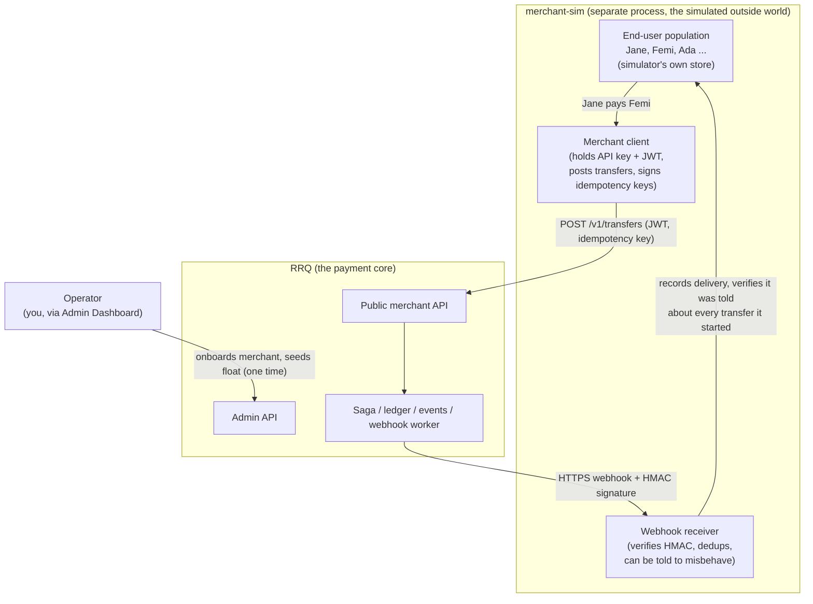
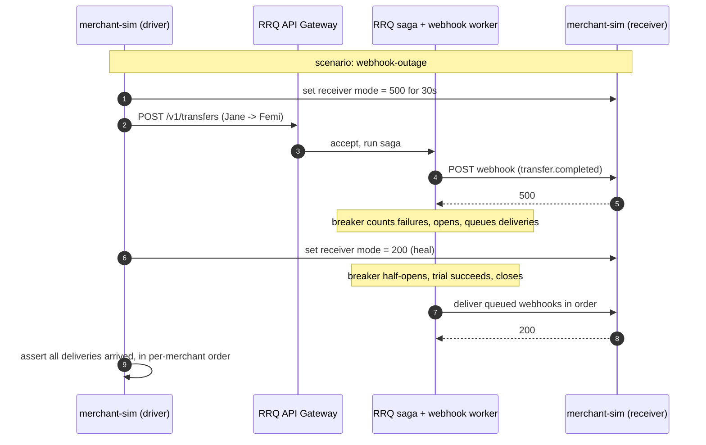

# 17: Simulation Harness & Merchant Simulator

> **What this is.** The design for the part of the project that stands in for the outside world. RRQ will never be integrated by a real payment company, so the real world that would send it traffic and receive its webhooks has to be built. This doc covers the actors, the boundary between what is real and what is simulated, and the `merchant-sim` component that closes the loop.
>
> **Reading time.** ~18 minutes.
>
> **Prerequisites.** Read [`10-API-GATEWAY.md`](10-API-GATEWAY.md), [`15-ADMIN-DASHBOARD.md`](15-ADMIN-DASHBOARD.md), and [`16-MERCHANT-WALLET-LIFECYCLE.md`](16-MERCHANT-WALLET-LIFECYCLE.md). This doc assumes you know how a merchant authenticates, submits a transfer, and receives a webhook.

---

## Why this doc exists

Every other doc in this set describes RRQ as if a real merchant were on the other end of the API: posting transfers, retrying on timeout, receiving webhooks, running its own customers. None of that exists. RRQ is a portfolio system. No real company will ever point production traffic at it.

This is not a small detail to wave away. A payment core with nothing sending it traffic is a set of services that have never run together. The interesting behavior of RRQ, the behavior that justifies the whole design, only appears under load and under failure: idempotency under retry storms, the circuit breaker tripping when a merchant endpoint dies, per-merchant webhook ordering holding while one merchant is slow, reconciliation catching a deliberately injected drift. You cannot see any of that from unit tests alone, and you cannot see it at all if there is no merchant.

So the outside world has to be built. The risk is building it wrong. The lazy version is to bolt fake-merchant logic and a customer table directly into RRQ, which corrupts the boundary that makes RRQ a payment core rather than a payment app. This doc builds the outside world as a separate process that talks to RRQ only through the same public API a real merchant would use. That keeps RRQ honest and gives us a system that actually runs.

---

## The three actors

There are exactly three kinds of actor in and around RRQ. Keeping them straight is most of the battle.

| Actor | Who they are | How they touch RRQ | Real or simulated |
| --- | --- | --- | --- |
| **Operator** | The person running the deployment. You, in this project. | Through the Admin Dashboard: onboards merchants, seeds funds, freezes wallets, replays DLQ entries, runs demo scenarios. | Real (it is you). |
| **Merchant** | A company that integrates RRQ to move value. Stripe's customer, not Stripe's customer's customer. | Through the public merchant API: exchanges an API key for a JWT, posts transfers and payouts, receives webhooks. | **Simulated** by `merchant-sim`. |
| **End-user** | A person whose money the merchant moves. Jane buying lunch, Femi getting paid out. | Never touches RRQ at all. The merchant acts on their behalf. | **Simulated inside `merchant-sim`**, never modeled in RRQ. |

The line that does the most work is the third row. The end-user does not have an account on RRQ. The merchant has a wallet on RRQ that it manages on the end-user's behalf, a `customer` wallet, tagged with an `external_ref` that means something to the merchant and nothing to RRQ.



The diagram is the whole idea. RRQ sits in the middle, unaware that the merchant on either side of it is fake. The end-users live entirely inside the simulator, which is the only place they exist.

---

## The boundary decision: where end-users live

This deserves its own section because it is the decision a reviewer will judge.

**RRQ stores nothing about end-users.** No `end_users` table, no customer identity, no names, no contact details. A `customer` wallet carries one optional column, `external_ref`, which is an opaque string the merchant chooses. RRQ never interprets it.

**`merchant-sim` owns the end-user model in full.** It has its own small datastore (a SQLite file or a separate Postgres schema, kept away from RRQ's database on purpose) holding synthetic users: an id, a display name, and the `external_ref` of the RRQ wallet that represents them. When the simulator decides "Jane pays Femi 5,000 NGN," it looks up Jane's wallet and Femi's wallet in its own store and posts a transfer between those two wallet ids. RRQ sees two wallet ids and an amount. It never learns that a person named Jane was involved.

The analogy, since it is the fastest way to see why: think of RRQ as the card network and `merchant-sim` as a food-delivery app. The food-delivery app knows Jane's name, her address, her order history. The card network knows a token and an account. If you opened up Visa's core ledger and found a column for "customer's favourite restaurant," you would correctly conclude something had gone wrong with the layering. The end-user is the app's concern, never the rail's. RRQ is the rail.

Why this is the stronger design and not just a tidiness preference:

- **It keeps RRQ's scope defensible.** The whole pitch of RRQ is "the correctness-critical core, with a clearly stated boundary." Owning end-user identity would blur that boundary and weaken the pitch.
- **It makes the simulation realistic.** A real merchant integration looks exactly like this: the merchant has its own users and its own database, and it talks to the processor over an API. By building `merchant-sim` the same way, the simulation is faithful to how the system would actually be used.
- **It avoids a class of confusion in the data model.** If both RRQ and the simulator tried to be the source of truth for a user, you would have two systems that can disagree about who someone is. With the boundary drawn here, there is exactly one owner of end-user identity, and it is the simulator.

If you ever did want end-users to interact directly (a consumer wallet app on top of RRQ), that is a new product on top of the API, not a change to the core. It would be its own `consumer-app` process, structured like `merchant-sim`. The core does not change.

---

## merchant-sim: the component

`merchant-sim` is a standalone Go service. It is not an RRQ service and does not share RRQ's database, Redis, or process. It only knows RRQ's public URLs and its own credentials. That separation is the point: if `merchant-sim` could reach into RRQ's database, it would stop being a faithful stand-in for an external integrator.

It has five parts.

### 1. Merchant identity and auth

On first run, `merchant-sim` needs to exist as a merchant inside RRQ. That is an operator action (RRQ has no public self-serve registration, per [`16-MERCHANT-WALLET-LIFECYCLE.md`](16-MERCHANT-WALLET-LIFECYCLE.md)), so the bootstrap step calls the **Admin API** to create the merchant, capture the API key once, and read back the webhook signing secret. After bootstrap, everything runs through the **public merchant API**: the simulator exchanges its API key for a JWT, refreshes the JWT before expiry, and signs every request with a fresh `Idempotency-Key`. This exercises the real auth path on every call rather than a shortcut.

The split is worth stating plainly:

- **Bootstrap (one time, operator path, Admin API):** create merchant, create wallets, seed operational float.
- **Runtime (continuous, merchant path, public API):** authenticate, post transfers and payouts, receive webhooks.

### 2. End-user population and wallet mapping

At bootstrap, `merchant-sim` decides how many end-users to simulate (configurable, say 50 for a demo, several thousand for a load test). For each, it:

1. Creates a `customer` wallet in RRQ via the Admin API, with `external_ref = sim_user_<id>`.
2. Stores the user record (`id`, `name`, `wallet_id`, `external_ref`) in its own datastore.
3. Optionally seeds the wallet with a starting balance, via the operator seed path, so there is money to move.

The mapping is one-directional and lives only in the simulator: given a user, find their wallet. RRQ cannot go the other way, and that is correct.

### 3. Webhook receiver

This is the part that does not exist anywhere else and is the reason the loop is currently open. RRQ's webhook worker needs a real HTTP endpoint to deliver to. `merchant-sim` provides it.

The receiver:

- Accepts `POST` from RRQ's webhook worker.
- Verifies the `X-RRQ-Signature` HMAC-SHA256 against the webhook secret it captured at bootstrap. A failed verification is logged and rejected, which lets you prove the signing path works (flip one byte of the secret and watch every delivery fail verification).
- Deduplicates on `X-RRQ-Event-Id`, because deliveries are at-least-once. This mirrors what a correct real merchant would do and demonstrates the merchant-side half of the idempotency story.
- Records every delivery so the simulator can later check a real property: **was I notified about the outcome of every transfer I started, in order, per merchant.** That check is the consumer-side mirror of invariant I5.

Crucially, the receiver has a control knob. It can be told, per scenario, to return `500`, to time out, or to go fully offline for a window. This is where the "mock merchant endpoint" toggle mentioned in [`15-ADMIN-DASHBOARD.md`](15-ADMIN-DASHBOARD.md) actually lives. Misbehaving on command is how you trip the circuit breaker and fill the DLQ on demand, in front of a viewer, in about twenty seconds.

### 4. Traffic driver

The driver generates activity so the system looks alive and so load tests have something to measure. Two modes:

- **Steady mode (demo).** A light, in-process loop that posts a few transfers per second between random end-user wallets, with the occasional payout (fan-out to many recipients). Enough that a visitor to the dashboard sees balances moving, sagas completing, and webhooks arriving in real time. This is what makes a deployed demo feel like a running system rather than a screenshot.
- **Load mode (benchmark).** Heavy load is driven by the existing **k6** scripts in `scripts/`, pointed at the same public API, ramping toward the 1,000 TPS single-machine design target. The simulator's job in this mode is to have provisioned enough wallets and float for k6 to hammer. The numbers go in `benchmarks/`.

Keeping demo traffic in-process and load traffic in k6 is deliberate. The in-process loop is simple and always on. k6 is the right tool for measured, repeatable load with latency percentiles, and it is already in the repo.

### 5. Scenario engine

The scenario engine is the highest-value part for interviews and the cleanest bridge between three things that would otherwise be separate: the dashboard demo buttons, the integration tests, and the failure-mode claims in the other docs.

A scenario is a named, scripted sequence that drives RRQ into a specific failure mode and asserts the documented recovery. The same scenario can be triggered three ways: from a dashboard button (manual demo), from `go test` (CI integration test), or from the command line (local check). One implementation, three surfaces.

| Scenario | What it drives | Invariant it proves | What a viewer sees |
| --- | --- | --- | --- |
| `retry-storm` | Fire the same idempotency key N times concurrently. | I3, at-most-once per key. | N requests in, one execution, one ledger movement. |
| `fraud-freeze` | Push one wallet past the velocity threshold. | Fraud auto-freeze, validate-step rejection. | Transfers complete up to the threshold, the wallet freezes, the next transfer is rejected. |
| `webhook-outage` | Flip the receiver to `500` for a window, then heal. | I5 ordering, breaker, DLQ, drain. | Breaker opens, deliveries queue, breaker closes, the queue drains in order. |
| `crash-recovery` | Kill a saga worker mid-saga. | I1 conservation, XAUTOCLAIM reclaim. | A surviving worker reclaims the in-flight saga, no money is lost or doubled. |
| `recon-drift` | Inject a deliberate divergence (dev only). | Reconciliation detection. | The nightly run flags the drift with full context. |

These scenarios are not new test logic invented here. They are the end-to-end realisation of the per-service test plans already written in `12-WEBHOOK-WORKER.md`, `13-FRAUD-WORKER.md`, and the rest. The difference is that here they run against the whole system through the real API, not against one service in isolation.



---

## What this gives you for "production-ready"

You set three bars for done: clone and `make dev` (a local `kind` cluster) shows a live system, a public demo URL anyone can click, and tests that prove the nine invariants. `merchant-sim` is what makes all three real.

- **Clone and run.** `make dev` brings up a local `kind` cluster running RRQ plus `merchant-sim` in steady mode, the same manifests that run in production. Within seconds, the dashboard shows merchants, wallets with moving balances, completing sagas, and arriving webhooks. The system is demonstrably running, not just compiling.
- **Public demo URL.** RRQ, the dashboard, and `merchant-sim` deploy together to the Kubernetes cluster. The simulator runs in steady mode in the background, so a visitor to the dashboard URL sees a live system without doing anything. The demo scenario buttons let them trigger failures and watch recovery.
- **Invariant proof.** The scenario engine runs in CI and asserts the documented recovery for each failure mode, end to end through the public API. That is the strongest possible evidence that the invariants hold, because it tests the assembled system, not mocked parts.

Without `merchant-sim`, all three bars are unreachable. With it, they are the natural output of running the project.

---

## What the simulator owns vs what RRQ owns

Restating the boundary as a data-ownership table, because this is the thing to get right.

| Concept | Owned by | Notes |
| --- | --- | --- |
| Merchant record, API key, webhook secret | RRQ | Created via Admin API at bootstrap. |
| Wallets (operational, customer), balances, ledger | RRQ | The core. `customer` wallets carry `external_ref` only. |
| Events, sagas, webhook delivery records, DLQ | RRQ | The source of truth. |
| End-user identity (name, id) | `merchant-sim` | RRQ never sees this. |
| End-user to wallet mapping | `merchant-sim` | One-directional, simulator-only. |
| "Which transfers I initiated" and "which webhooks I received" | `merchant-sim` | The consumer-side view, used to verify notification completeness and ordering. |
| Receiver misbehavior mode | `merchant-sim` | The knob that drives `webhook-outage` and breaker scenarios. |

If a column ever appears in RRQ that belongs in the right-hand rows, that is the signal the boundary has leaked.

---

## Test plan

The simulator is itself tested, separately from the scenarios it drives.

- **`TestSim_BootstrapCreatesMerchantAndWallets`**, run bootstrap against a test RRQ; assert the merchant exists, N customer wallets exist with correct `external_ref`, and the simulator's own store matches.
- **`TestSim_JWTRefresh`**, advance time past JWT expiry; assert the client refreshes and the next request still authenticates.
- **`TestSim_WebhookSignatureVerify`**, deliver a correctly signed webhook; assert accepted. Flip one byte of the secret; assert rejected.
- **`TestSim_WebhookDedup`**, deliver the same `X-RRQ-Event-Id` twice; assert the receiver records one logical delivery.
- **`TestSim_NotificationCompleteness`**, run steady mode for a window; assert every transfer the driver initiated produced exactly one terminal webhook, in per-merchant order.
- **`TestSim_ReceiverMisbehaviorModes`**, set mode to 500, timeout, offline in turn; assert the receiver behaves as configured.
- **`TestScenario_*`**, one per scenario in the table above, asserting the documented recovery end to end.

The scenario tests double as the system's integration suite. They are the reason CI can claim the invariants hold under failure and not just in isolation.

---

## Language: Go first, Rust as a comparison study

**The system is built in Go.** RRQ's services and `merchant-sim` are built in Go and driven to a deployed, tested, demonstrable state. The Rust implementation is a comparison study, built against the working Go reference, not a parallel effort. Building the system twice before it runs once is the surest way to never ship it. Once the Go system is deployed and the scenarios pass in CI, the Rust port becomes a focused, valuable exercise with a working reference to compare against.

This changes nothing about the architecture. `merchant-sim` talks to RRQ over HTTP, so it is indifferent to whether RRQ is implemented in Go or Rust. When the Rust port exists, the same simulator and the same scenarios run against it unchanged, which is itself part of the comparison.

---

## Where this lives in the repo

```
tools/
  merchant-sim/
    cmd/            entry point
    client/         merchant API client (auth, transfers, payouts)
    receiver/       webhook receiver (verify, dedup, misbehavior modes)
    users/          end-user population + own datastore
    driver/         steady-mode traffic loop
    scenarios/      named scenarios (shared by dashboard, CI, CLI)
    store/          simulator's own schema (SQLite or separate Postgres schema)
```

It sits under `tools/`, not under the service directories, because it is part of the project but not part of the product. That placement is itself a statement to a reviewer: the author knows the difference.

---

## Where to read next

- The dashboard that triggers scenarios and hosts the demo → [`15-ADMIN-DASHBOARD.md`](15-ADMIN-DASHBOARD.md)
- The merchant and wallet flows the simulator bootstraps → [`16-MERCHANT-WALLET-LIFECYCLE.md`](16-MERCHANT-WALLET-LIFECYCLE.md)
- The funding model the simulator uses to seed float → [`16-MERCHANT-WALLET-LIFECYCLE.md`](16-MERCHANT-WALLET-LIFECYCLE.md) (Funding)
- The webhook worker on the other end of the receiver → [`12-WEBHOOK-WORKER.md`](12-WEBHOOK-WORKER.md)

---

*Pass 6 addition. Builds the outside world that the rest of the docs assumed and that a portfolio system has to provide for itself. Go-first; Rust comparison deferred.*
