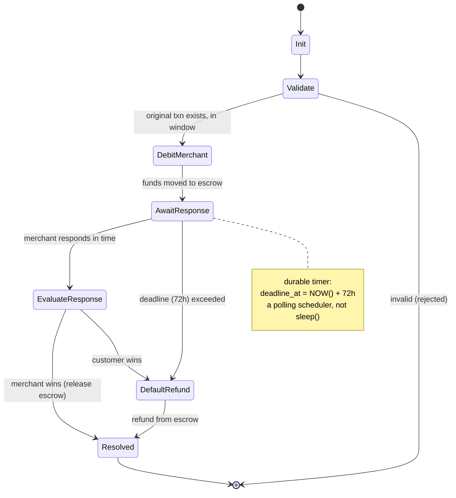

# 18: Chargebacks & Disputes

> **What this is.** The design for the Chargeback saga, designed in full but not yet built. Documents the approach so a reviewer can evaluate it without seeing running code.
>
> **Reading time.** ~12 minutes.
>
> **Status.** Designed, not built. See [`../../STATUS.md`](../../STATUS.md).

---

## The problem

In payment systems, a chargeback is when a customer (or their bank) disputes a transaction after it has settled. The merchant has the money; the customer wants it back. The system needs to:

1. Hold the disputed funds in escrow.
2. Notify the merchant and give them a deadline to respond.
3. If the merchant doesn't respond by the deadline, default in favor of the customer (refund).
4. If the merchant does respond, evaluate evidence and decide.
5. Notify all parties of the outcome.

The interesting characteristic for system design: **the deadline is on the order of days, not milliseconds.** A 72-hour merchant response window is typical. A saga that needs to *wait three days* between steps is structurally different from a Transfer saga that completes in milliseconds.

This is the hardest saga in RRQ to build well. The patterns required (durable timers spanning days) are genuinely different from the rest of the system, which is why it is designed in full here and built after the core money-movement system, rather than fitted in retroactively.

---

## The Chargeback saga, designed

States:



**Init.** A chargeback is initiated, typically by an API call from the customer's bank (or internally by a customer support action).

**Validate.** Check the original transaction exists. Check the merchant exists and isn't already deeply in debt. Check the dispute is within the allowed window (typically 60-120 days from original transaction).

**DebitMerchant.** Move the disputed amount from the merchant's wallet to an escrow wallet. The merchant temporarily loses access to the funds. If the merchant doesn't have sufficient funds, the system has options: deduct from a security deposit, attempt to withdraw from their linked bank, or flag the merchant for manual review.

**AwaitResponse.** Wait up to 72 hours for the merchant to respond. *This is the durable timer step.* During this period, the saga is in a paused state in `saga_state` with `deadline_at = NOW() + 72h`.

**EvaluateResponse.** Merchant submitted evidence (a delivery receipt, signed contract, whatever). System logic, initially manual review by ops, eventually automated rules, evaluates whether the evidence is sufficient. Outcome: customer wins (refund) or merchant wins (release escrow).

**DefaultRefund.** No response by deadline. System defaults in favor of customer: refund from escrow to customer's payment method.

**Resolved.** Terminal. Notifications dispatched. Saga complete.

The state machine is more complex than Transfer because of the wait state and the branching evaluation step. Compensations are also more nuanced, what does it mean to "compensate" a chargeback that's been resolved? In most cases, nothing; the resolution is final. In edge cases (the merchant successfully appeals after the deadline), a separate "appeal" saga reverses the prior resolution.

---

## The durable timer problem

The naive implementation: `sleep(72 * 3600)`. Don't do this.

A 72-hour sleep doesn't survive pod restarts. Kubernetes evicts pods on a regular cadence (rolling updates, scale-downs, node failures). Any sleep longer than the rolling-restart window is unreliable. For a 72-hour deadline, you need the timer to be **durable**: stored somewhere that survives process death.

The pattern: store the deadline in the database, poll for due deadlines, act when they arrive.

```
INSERT INTO saga_state (saga_id, current_state, deadline_at, ...)
VALUES (..., 'AwaitResponse', NOW() + INTERVAL '72 hours', ...);
```

A separate scheduler service runs every minute:

```
SELECT * FROM saga_state
WHERE current_state = 'AwaitResponse'
  AND deadline_at < NOW()
  AND terminated_at IS NULL;
```

For each row, emit a `DisputeEscalated` event to the job stream. The Saga Worker consumes the event, transitions the saga from `AwaitResponse` to `DefaultRefund`, and proceeds.

This pattern is **sleep-free at the process level**. The timer is the database row. Pods can restart, the scheduler can pause, the saga worker can be redeployed, the deadline keeps ticking because the database keeps existing. When something is ready to act, the next scheduler poll finds it.

---

## Why this is hard

A few non-obvious challenges:

**The scheduler is a new service.** Not a worker (no consumer group from a stream); just a small loop that polls Postgres every minute. This adds a deployment target. Operational cost is small (one binary, no state) but it's another thing to monitor.

**The poll interval is a tradeoff.** Poll every second: precise deadlines, but more Postgres load. Poll every minute: cheap but deadlines can fire up to a minute late. For a 72-hour deadline, the up-to-minute imprecision is irrelevant; we use a 60-second poll.

**Concurrent schedulers.** If multiple scheduler replicas run, they could both pick up the same overdue saga and both emit `DisputeEscalated`. The saga's idempotent state machine catches the duplicate (the saga is already past `AwaitResponse`, the second event is a no-op), but it's wasted work. Defense: a single scheduler instance with leader election, or Postgres advisory locks to coordinate. For simplicity, RRQ runs a single scheduler instance.

**Merchant response can arrive at any time.** Including during the gap between the deadline and the scheduler's next poll. Handling: when a response arrives, the saga's `Respond` step checks `deadline_at` against `NOW()`. If we're past the deadline, the response is rejected with `DEADLINE_EXCEEDED`. If we're within, the response is accepted and the saga transitions to `EvaluateResponse`. The check is in the saga step's transactional update, so the race is resolved at the database level.

**The merchant can respond multiple times.** Some merchants submit evidence in stages. The saga accepts the *first* response that arrives and locks out subsequent ones. (A more elaborate design could accumulate evidence until the deadline; the design starts simple: first response wins.)

---

## Data model additions

Chargebacks reuse the `escrow` wallet type already defined in [`../appendices/40-DATA-MODEL.md`](../appendices/40-DATA-MODEL.md) and [`16-MERCHANT-WALLET-LIFECYCLE.md`](16-MERCHANT-WALLET-LIFECYCLE.md); no change to the `wallets` table is needed. The only new structure is a `disputes` table:

```sql
-- New table for disputes. Escrow wallets are owned by the system, not merchants.
CREATE TABLE disputes (
    id              TEXT PRIMARY KEY,
    original_job_id TEXT NOT NULL,           -- the transfer being disputed
    initiator       TEXT NOT NULL,           -- 'customer', 'bank', 'platform'
    amount          BIGINT NOT NULL,
    currency        TEXT NOT NULL,
    reason_code     TEXT,                    -- "fraud", "product_not_received", etc.
    escrow_wallet   TEXT REFERENCES wallets(id),
    saga_id         TEXT,                    -- the DisputeSaga handling this
    created_at      TIMESTAMPTZ NOT NULL DEFAULT NOW(),
    resolved_at     TIMESTAMPTZ,
    resolution      TEXT                     -- 'refunded', 'merchant_wins', 'expired'
);

CREATE INDEX disputes_unresolved_idx
    ON disputes (created_at)
    WHERE resolved_at IS NULL;
```

The escrow wallet is created per dispute. Funds flow merchant → escrow → (customer or merchant) depending on outcome. The wallet structure handles this without any new ledger primitives: escrow wallets are wallets like any other; ledger entries record the movements; reconciliation verifies the math.

---

## Event types

```protobuf
message DisputeInitiated {
    string dispute_id = 1;
    string original_job_id = 2;
    string initiator = 3;
    int64 amount = 4;
}

message DisputeEscrowFunded {
    string dispute_id = 1;
    string escrow_wallet = 2;
    int64 amount = 3;
}

message DisputeEscalated {
    string dispute_id = 1;
    string reason = 2;        // 'deadline_exceeded' or 'merchant_responded'
}

message DisputeResponseReceived {
    string dispute_id = 1;
    string merchant_id = 2;
    bytes evidence_blob = 3;
}

message DisputeResolved {
    string dispute_id = 1;
    string resolution = 2;     // 'refunded' | 'merchant_wins'
    string reason = 3;
}
```

All written to the event log like any other events. The dispute's history is traceable through events.

---

## Why this is the hardest piece to build

The patterns above are well-understood; building them is straightforward. The reason it is built after the core:

**Testing durable timers is slow.** A test that verifies "deadline fires correctly after 72 hours" can't actually wait 72 hours. The right testing approach uses an injected clock, the saga's deadline check calls `clock.now()` instead of `time.Now()`, and tests advance the clock. But this requires plumbing the clock abstraction through every service that does time-based logic. It's a refactoring that touches a lot of code.

**Edge cases are subtle.** What happens if the merchant responds at the exact instant of the deadline? What if the response arrives but the scheduler also has already enqueued the escalation? What if the merchant updates their webhook URL after the dispute notification was sent? Each of these is a question worth answering before writing the code.

**Operations don't have escrow handling yet.** The Admin Dashboard doesn't know how to inspect or override a dispute. The operator playbook for "merchant successfully appeals after default refund" doesn't exist. These are not technical problems but they're necessary work.

These are well-scoped additions once the core money-movement system is built and the injected-clock testing infrastructure is in place.

---

## What an interviewer asks about this

If chargebacks come up in a call, the questions are predictable:

**"How do you handle the 72-hour wait?"** Answer: durable timer via deadline in saga_state and a polling scheduler service. Sleep doesn't survive pod restarts; the database does.

**"What if the merchant responds at the exact moment of the deadline?"** Answer: the database row's `deadline_at` check is in the saga step's transaction. Either the response writes first (acceptance) or the escalation writes first (deadline exceeded). The first writer wins atomically.

**"How does this saga differ from a Transfer saga?"** Answer: same orchestrator, same state-persistence pattern. The differences are the wait step (which uses a different mechanism than running steps), the branching evaluation, and the longer duration. Architecturally similar; tactically different.

**"Why isn't it built yet?"** Answer: the durable timer requires injected-clock testing infrastructure, which is a non-trivial refactor; the patterns are clear but the testing investment is real. It's designed in full and built after the core money-movement system.

---

## Where to read next

- The Saga Worker that executes this saga → [`11-SAGA-WORKER.md`](11-SAGA-WORKER.md)
- The data model the design adds to → [`../appendices/40-DATA-MODEL.md`](../appendices/40-DATA-MODEL.md)

---

*Pass 4 of the architecture series. Designed in full; not yet built.*
